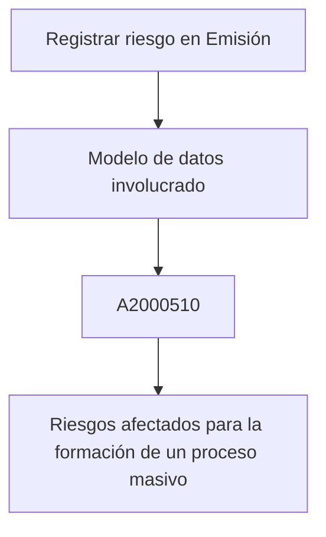

# Registro de Riesgo en Emisión — Modelo de Datos para Procesos Masivos

## 1. Metadados do Documento
- **Arquivo de Origem:** `Não identificado`
- **Tipo de Documento:** `Especificação Técnica`
- **Domínio / Sistema:** `Reef / Mapfre`
- **Público-Alvo:** `Desenvolvedores, Arquitetos, Operação`
- **Data/Versão Identificada:** `Não identificada`

---

## 2. Resumo Executivo & Contexto de Negócio

O documento descreve, em estado de construção, o registro de um **riesgo** no processo de **Emisión**. O conteúdo identifica o modelo de dados envolvido na formação de um processo massivo.

A tabela identificada para a operação é a `A2000510`, descrita como **RIESGOS AFECTADOS PARA LA FORMACION DE UN PROCESO MASIVO**. A estrutura registra informações de tratamento, identificação do processo massivo, companhia, apólice e risco.

Os campos apresentados são marcados como obrigatórios e possuem indicação de alteração (`CAMBIA = S`). Os valores padrão são informados como `N.A.` para todos os campos exibidos.

O material está associado à documentação **Reef**, com referência a **Mapfredocument** e proprietário identificado como `user:agonzalez_mapfre.com`. O ciclo de vida indicado é `Approved`.

> **Nota de Análise:** O documento não detalha métodos HTTP, contratos JSON, mecanismos de persistência, relacionamentos entre tabelas, regras de erro ou a sequência técnica de execução do processo massivo.

---

## 3. Arquitetura, Componentes & Tecnologias Envolvidas

Os componentes e referências explicitamente identificados são:

- **Reef:** domínio ou repositório de documentação mencionado.
- **Mapfredocument:** referência documental exibida no conteúdo.
- **Emisión:** contexto funcional no qual ocorre o registro do risco.
- **Processo masivo:** processo associado à formação de riscos afetados.
- **Tabela `A2000510`:** estrutura de dados envolvida na operação.
- **Owner:** `user:agonzalez_mapfre.com`.
- **Lifecycle:** `Approved`.



> **Nota de Análise:** O diagrama representa somente a relação funcional explícita no documento. Não há detalhamento de aplicações, serviços, bancos de dados, interfaces ou tecnologias de integração.

---

## 4. Regras de Negócio, Especificações Funcionais & Processos

### Operação identificada

A operação descrita é **REGISTRAR riesgo en Emisión**.

### Estrutura de dados envolvida

A tabela `A2000510` participa da formação de um processo massivo e armazena os riscos afetados por esse processo.

### Regras e características dos campos

1. Todos os campos apresentados possuem `CAMBIA = S`.
2. Todos os campos apresentados possuem `VALOR = N.A.`.
3. Todos os campos apresentados possuem indicação `OBLIGATORIA = SI`.
4. `FEC_TRATAMIENTO` representa a data em que o processo massivo é realizado.
5. `NUM_ORDEN` representa o número do processo massivo.
6. `TIP_MVTO_BATCH` representa o tipo do processo massivo.
7. `COD_CIA` representa a companhia.
8. `NUM_POLIZA` representa a apólice.
9. `NUM_RIESGO` representa o risco.
10. `FEC_EFEC_RIESGO` representa o efeito do risco.
11. `FEC_VCTO_RIESGO` representa o vencimento do risco.

> **Nota de Análise:** O documento não define formatos, tipos físicos de dados, domínios permitidos, chaves primárias, chaves estrangeiras, critérios de atualização ou validações adicionais para os campos da tabela `A2000510`.

---

## 5. Tabelas de Parâmetros, Ambientes e Estruturas de Dados

### Tabela envolvida

| Item / Parâmetro | Descrição / Função | Tipo / Valores / Formato | Ambiente / Observações |
| :--- | :--- | :--- | :--- |
| `A2000510` | RIESGOS AFECTADOS PARA LA FORMACION DE UN PROCESO MASIVO | Não detalhado | Tabela envolvida na operação de registro de risco em Emisión |

### Campos da tabela `A2000510`

| Item / Parâmetro | Descrição / Função | Tipo / Valores / Formato | Ambiente / Observações |
| :--- | :--- | :--- | :--- |
| `FEC_TRATAMIENTO` | Fecha en la que se realiza el proceso masivo | `CAMBIA: S`; `VALOR: N.A.` | Obrigatória: `SI` |
| `NUM_ORDEN` | Numero del proceso masivo | `CAMBIA: S`; `VALOR: N.A.` | Obrigatória: `SI` |
| `TIP_MVTO_BATCH` | Tipo del proceso masivo | `CAMBIA: S`; `VALOR: N.A.` | Obrigatória: `SI` |
| `COD_CIA` | Compania | `CAMBIA: S`; `VALOR: N.A.` | Obrigatória: `SI` |
| `NUM_POLIZA` | Poliza | `CAMBIA: S`; `VALOR: N.A.` | Obrigatória: `SI` |
| `NUM_RIESGO` | Riesgo | `CAMBIA: S`; `VALOR: N.A.` | Obrigatória: `SI` |
| `FEC_EFEC_RIESGO` | Efecto del riesgo | `CAMBIA: S`; `VALOR: N.A.` | Obrigatória: `SI` |
| `FEC_VCTO_RIESGO` | Vencimiento del riesgo | `CAMBIA: S`; `VALOR: N.A.` | Obrigatória: `SI` |

### Metadados documentais identificados

| Item / Parâmetro | Descrição / Função | Tipo / Valores / Formato | Ambiente / Observações |
| :--- | :--- | :--- | :--- |
| Documentação | Referência documental | `Documentation / DOCUMENTACIÓN Reef` | Associada a Reef |
| Referência | Nome exibido no documento | `Mapfredocument` | Sem detalhamento adicional |
| Owner | Proprietário da documentação | `user:agonzalez_mapfre.com` | Conforme conteúdo bruto |
| Lifecycle | Estado do ciclo de vida | `Approved` | Conforme conteúdo bruto |
| Idioma | Idioma exibido na interface | `ES` | Conforme conteúdo bruto |

---

## 6. Bateria de Perguntas & Respostas para RAG (FAQ Sintético)

### P1: Qual tabela está envolvida no registro de risco em Emisión?
**R:** A tabela envolvida é a `A2000510`, descrita como **RIESGOS AFECTADOS PARA LA FORMACION DE UN PROCESO MASIVO**.

### P2: Qual é o objetivo funcional associado à tabela A2000510?
**R:** A tabela `A2000510` está associada aos riscos afetados para a formação de um processo massivo, no contexto de registrar um risco em Emisión.

### P3: O campo FEC_TRATAMIENTO é obrigatório na tabela A2000510?
**R:** Sim. O documento indica que `FEC_TRATAMIENTO` é obrigatório (`SI`). Esse campo representa a data em que o processo massivo é realizado.

### P4: Qual campo registra o número do processo massivo?
**R:** O campo `NUM_ORDEN` registra o número do processo massivo. O documento o marca como obrigatório, com `CAMBIA = S` e `VALOR = N.A.`.

### P5: Qual campo identifica o tipo do processo massivo?
**R:** O campo `TIP_MVTO_BATCH` identifica o tipo do processo massivo. O documento o classifica como obrigatório, com `CAMBIA = S` e valor `N.A.`.

### P6: Quais campos identificam companhia, apólice e risco?
**R:** Os campos são `COD_CIA` para companhia, `NUM_POLIZA` para apólice e `NUM_RIESGO` para risco. Os três campos são obrigatórios segundo o documento.

### P7: Quais campos tratam das datas de efeito e vencimento do risco?
**R:** `FEC_EFEC_RIESGO` representa o efeito do risco, enquanto `FEC_VCTO_RIESGO` representa o vencimento do risco. Ambos são obrigatórios.

### P8: Todos os campos listados na tabela A2000510 podem ser alterados?
**R:** O documento apresenta `CAMBIA = S` para todos os campos listados: `FEC_TRATAMIENTO`, `NUM_ORDEN`, `TIP_MVTO_BATCH`, `COD_CIA`, `NUM_POLIZA`, `NUM_RIESGO`, `FEC_EFEC_RIESGO` e `FEC_VCTO_RIESGO`.

### P9: Quais valores padrão foram definidos para os campos da tabela A2000510?
**R:** O documento indica `VALOR = N.A.` para todos os campos apresentados. Não há detalhamento adicional sobre o significado operacional de `N.A.`.

### P10: Qual é o proprietário e o ciclo de vida da documentação?
**R:** O proprietário identificado é `user:agonzalez_mapfre.com` e o ciclo de vida indicado é `Approved`.

### P11: O documento especifica tipos físicos de dados para os campos da tabela A2000510?
**R:** Não. O documento apresenta nomes, descrições, obrigatoriedade, indicador de alteração e valor `N.A.`, mas não informa tipos físicos, tamanhos, formatos ou restrições técnicas de banco de dados.

### P12: O documento descreve APIs ou contratos de integração para registrar o risco?
**R:** Não. O documento menciona o registro de risco em Emisión e a tabela `A2000510`, mas não detalha APIs, métodos HTTP, contratos JSON, serviços ou protocolos de integração.

---

## 7. Glossário de Termos, Siglas & Conceitos-Chave

- **A2000510:** Tabela descrita como `RIESGOS AFECTADOS PARA LA FORMACION DE UN PROCESO MASIVO`.
- **CAMBIA:** Indicador exibido para os campos; possui valor `S` para todos os campos listados.
- **COD_CIA:** Campo que representa a companhia.
- **Emisión:** Contexto funcional mencionado para o registro de risco.
- **FEC_EFEC_RIESGO:** Campo que representa o efeito do risco.
- **FEC_TRATAMIENTO:** Campo que representa a data em que o processo massivo é realizado.
- **FEC_VCTO_RIESGO:** Campo que representa o vencimento do risco.
- **Lifecycle:** Metadado de ciclo de vida; o documento informa `Approved`.
- **Mapfredocument:** Referência exibida na documentação, sem definição adicional.
- **NUM_ORDEN:** Campo que representa o número do processo massivo.
- **NUM_POLIZA:** Campo que representa a apólice.
- **NUM_RIESGO:** Campo que representa o risco.
- **Reef:** Nome presente nas referências de documentação.
- **TIP_MVTO_BATCH:** Campo que representa o tipo do processo massivo.
- **VALOR:** Coluna de valor apresentada como `N.A.` para todos os campos listados.

---

## 8. Notas Críticas, Riscos & Limitações

- O documento está identificado com o estado **EN CONSTRUCCIÓN**.
- Não foi identificado nome de arquivo, data, versão ou autoria formal além do campo `Owner`.
- Não há definição de tipos de dados, tamanhos, máscaras de data ou valores de domínio para os campos.
- Não há descrição de chaves, índices, relacionamentos, integridade referencial ou regras de exclusão/atualização da tabela `A2000510`.
- Não há detalhamento dos sistemas técnicos responsáveis por gravar ou consumir os dados.
- Não há especificação de APIs, métodos HTTP, mensagens, contratos JSON, logs, monitoramento, tratamento de erro ou segurança.
- O significado formal dos indicadores `S` e `N.A.` não é explicitamente definido no material.
- A referência a `Mapfredocument` não contém detalhamento adicional.

---

## 9. Conteúdo Bruto Estruturado (Referência Fiel)

```text
--- [PÁGINA 1 DE 1] ---

EN CONSTRUCCIÓN
REGISTRAR riesgo en Emisión
Modelo de datos involucrado
Las tablas que intervienen en esta operación son:
A2000510
TABLA DESCRIPCIÓN
A2000510 RIESGOS AFECTADOS PARA LA FORMACION DE UN PROCESO MASIVO
COLUMNA CAMBIA
VALOR
MOTIVO/VALOR OBLIGATORIA COMENTARIO
FEC_TRATAMIENTO S N.A. SI FECHA EN LA QUE SE REALIZA EL PROCESO
MASIVO
NUM_ORDEN S N.A. SI NUMERO DEL PROCESO MASIVO
TIP_MVTO_BATCH S N.A. SI TIPO DEL PROCESO MASIVO
COD_CIA S N.A. SI COMPANIA
NUM_POLIZA S N.A. SI POLIZA
NUM_RIESGO S N.A. SI RIESGO
FEC_EFEC_RIESGO S N.A. SI EFECTO DEL RIESGO
FEC_VCTO_RIESGO S N.A. SI VENCIMIENTO DEL RIESGO
Documentation / DOCUMENTACIÓN Reef
DOCUMENTACIÓN Reef
Mapfredocument
DOCUMENTACIÓN Reef
Owner
user:agonzalez_mapfre.com
Lifecycle
Approved Source
 / 
 VL
Buscar Inicio Soluciones Arquitecturas APIs Componentes Cloud Documentación Zeus Reef Ayuda
ES
```
