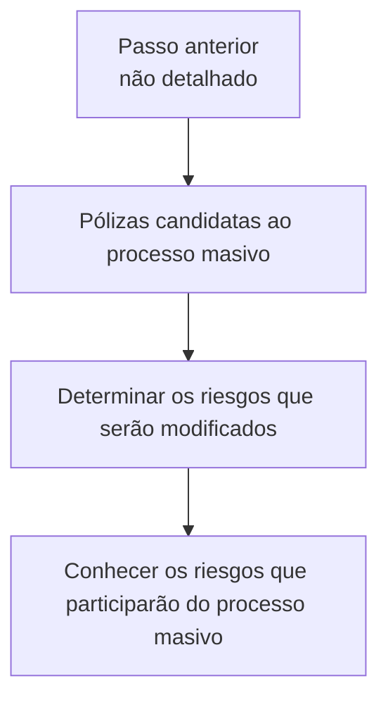

# Registro de Riesgo en Emisión — Enlace con Visión Técnica

## 1. Metadados do Documento
- **Arquivo de Origem:** `Não identificado`
- **Tipo de Documento:** `Procedimento`
- **Domínio / Sistema:** `Emisión / Reef / Mapfre`
- **Público-Alvo:** `Não identificado`
- **Data/Versão Identificada:** `Não identificada`

---

## 2. Resumo Executivo & Contexto de Negócio

O documento descreve o registro de risco no contexto de **Emisión**, com referência a uma visão técnica. O escopo apresentado é identificar, entre as apólices candidatas a um processo massivo, os riscos que sofrerão modificação.

O objetivo declarado é conhecer quais riscos participarão do processo massivo. A identificação dos riscos ocorre como consequência de uma etapa anterior, não detalhada no conteúdo fornecido.

O procedimento não exige uma ação manual específica nesta etapa. O documento afirma que não é necessário seguir nenhum passo, pois o resultado decorre do passo anterior.

A página também apresenta referências de documentação associadas a **Reef**, **Mapfredocument**, navegação para soluções, arquiteturas, APIs, componentes, cloud, documentação e Zeus, além do proprietário identificado como `user:agonzalez_mapfre.com`.

---

## 3. Arquitetura, Componentes & Tecnologias Envolvidas

| Componente / Referência | Papel descrito no documento |
| :--- | :--- |
| Emisión | Contexto no qual ocorre o registro de risco. |
| Processo masivo | Processo para o qual são identificados os riscos participantes. |
| Pólizas candidatas | Conjunto de apólices analisadas para determinar riscos modificados. |
| Riesgos | Elementos identificados entre as apólices candidatas. |
| Reef | Referência de documentação apresentada na página. |
| Mapfredocument | Referência documental citada. |
| Zeus | Item disponível na navegação da página. |



**Nota de Análise:** o documento não descreve integrações, APIs, métodos HTTP, contratos de dados, tecnologias de implementação, servidores ou ambientes técnicos.

---

## 4. Regras de Negócio, Especificações Funcionais & Processos

1. O universo de análise é formado por **pólizas candidatas al proceso masivo**.
2. Entre as apólices candidatas, devem ser determinados os **riesgos** que serão modificados.
3. O objetivo funcional é conhecer os riscos que participarão do processo massivo.
4. Não é necessário executar passos específicos para registrar ou identificar os riscos nesta etapa.
5. A identificação dos riscos é consequência de um **passo anterior**.
6. O documento não detalha qual é o passo anterior, seus critérios de entrada, seus responsáveis, nem o mecanismo pelo qual a modificação dos riscos é determinada.

---

## 5. Tabelas de Parâmetros, Ambientes e Estruturas de Dados

| Item / Parâmetro | Descrição / Função | Tipo / Valores / Formato | Ambiente / Observações |
| :--- | :--- | :--- | :--- |
| Pólizas candidatas | Apólices consideradas para o processo massivo. | Não detalhado | São a base para identificação dos riscos. |
| Riesgos modificados | Riscos que serão identificados como modificados. | Não detalhado | O texto extraído apresenta o termo como `modicados`. |
| Processo masivo | Processo que recebe a participação dos riscos identificados. | Não detalhado | Não há descrição operacional ou técnica adicional. |
| Passo anterior | Etapa cuja consequência produz a identificação dos riscos. | Não detalhado | Não documentado no conteúdo fornecido. |
| Owner | Proprietário indicado na página. | `user:agonzalez_mapfre.com` | Identificado no rodapé/metadados da página. |
| Lifecycle | Estado de ciclo de vida exibido. | `Approved Source` | Apresentado na página. |
| Idioma | Idioma indicado na navegação. | `ES` | Interface exibida em espanhol. |

---

## 6. Bateria de Perguntas & Respostas para RAG (FAQ Sintético)

### P1: Em que consiste o registro de risco em Emisión?
**R:** O registro de risco em Emisión consiste em determinar, entre as apólices candidatas ao processo massivo, quais riscos serão modificados.

### P2: Qual é o objetivo do processo descrito?
**R:** O objetivo é conhecer quais riscos participarão do processo massivo.

### P3: Quais elementos são analisados para identificar os riscos participantes?
**R:** São analisadas as apólices candidatas ao processo massivo, a fim de determinar os riscos que serão modificados.

### P4: É necessário executar um passo manual específico para registrar os riscos?
**R:** Não. O documento informa que não é necessário seguir nenhum passo nesta etapa, pois ela é consequência do passo anterior.

### P5: Qual é o passo anterior que gera a identificação dos riscos?
**R:** O documento apenas informa que a identificação é consequência do passo anterior; não descreve qual é essa etapa nem seu funcionamento.

### P6: O documento detalha critérios técnicos para decidir se um risco será modificado?
**R:** Não. O conteúdo declara que devem ser determinados os riscos modificados, mas não apresenta critérios, regras de cálculo, campos ou condições de validação.

### P7: Há APIs ou contratos de integração documentados para o processo massivo?
**R:** Não. O documento não especifica APIs, métodos HTTP, contratos JSON, filas, bancos de dados ou integrações técnicas.

### P8: Quais referências documentais aparecem na página?
**R:** A página apresenta referências a Documentation / DOCUMENTACIÓN Reef, DOCUMENTACIÓN Reef e Mapfredocument.

### P9: Quem é o proprietário identificado no conteúdo?
**R:** O proprietário identificado é `user:agonzalez_mapfre.com`.

### P10: Qual é o estado de lifecycle apresentado?
**R:** O campo Lifecycle está apresentado como `Approved Source`.

---

## 7. Glossário de Termos, Siglas & Conceitos-Chave

- **Emisión:** Contexto funcional citado no título do conteúdo; o documento não fornece definição adicional.
- **Pólizas:** Apólices candidatas ao processo massivo.
- **Riesgos:** Riscos associados às apólices candidatas e avaliados quanto à modificação.
- **Proceso masivo:** Processo massivo no qual participarão os riscos identificados.
- **Reef:** Referência de documentação apresentada na página.
- **Mapfredocument:** Referência documental citada.
- **Zeus:** Item presente na navegação da página.
- **Lifecycle:** Campo de ciclo de vida exibido como `Approved Source`.

---

## 8. Notas Críticas, Riscos & Limitações

- O documento não detalha o passo anterior do qual a identificação dos riscos é consequência.
- Não há critérios de elegibilidade, regras de decisão ou atributos que definam quando um risco será modificado.
- Não foram informados contratos de integração, endpoints, métodos HTTP, estruturas JSON, tecnologias, logs ou mecanismos de auditoria.
- Não há informações sobre responsáveis operacionais além do campo Owner.
- O texto extraído contém um caractere inválido no termo `modicados`; a intenção semântica parece relacionada a “modificados”, mas a transcrição literal foi preservada na seção de referência.
- Não há detalhamento adicional sobre Reef, Mapfredocument ou Zeus além de suas menções na página.

---

## 9. Conteúdo Bruto Estruturado (Referência Fiel)

```text
--- [PÁGINA 1 DE 1] ---

REGISTRAR riesgo en Emisión (enlace con visión técnica)
¿En que consiste?
De las pólizas candidatas al proceso masivo, determinar aquellos riesgos que se van a ver modicados.
Objetivo
Conocer aquellos riesgos que participarán en el proceso masivo.
Proceso a seguir
No es necesario seguir paso alguno, ya que es consecuencia del paso anterior.
Documentation / DOCUMENTACIÓN Reef
DOCUMENTACIÓN Reef
Mapfredocument
DOCUMENTACIÓN Reef
Owner
user:agonzalez_mapfre.com
Lifecycle
Approved Source
 / 
 VL
Buscar Inicio Soluciones Arquitecturas APIs Componentes Cloud Documentación Zeus Reef Ayuda
ES
```
