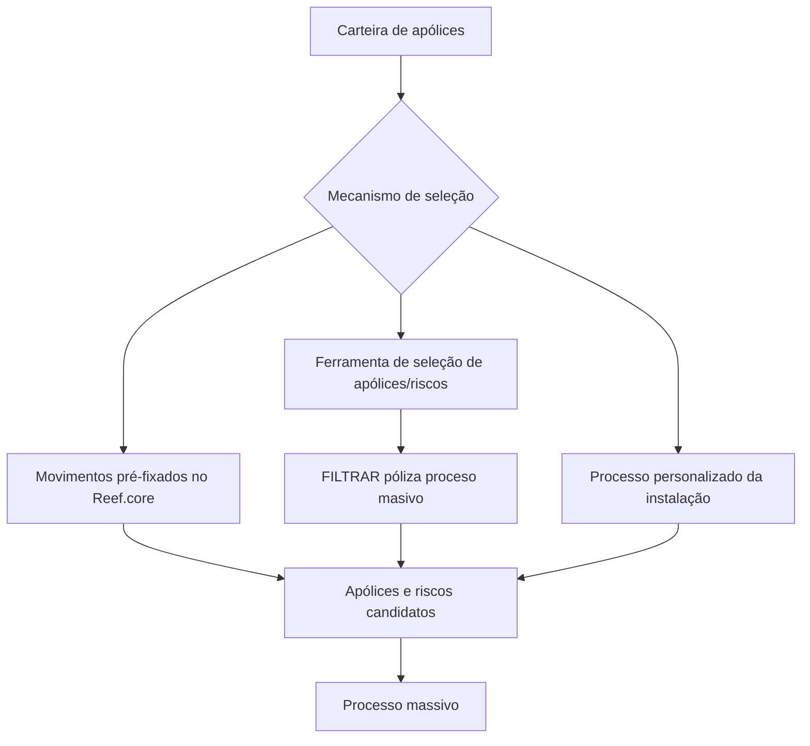
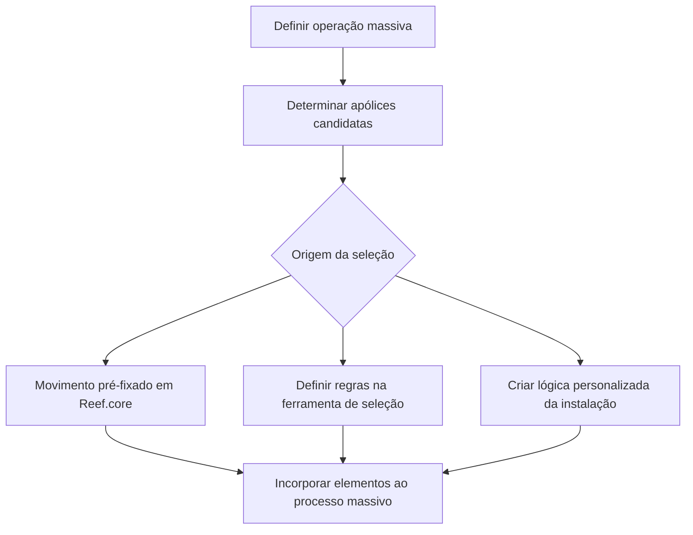

# Seleção de Apólices para Processos Massivos no Reef.core

## 1. Metadados do Documento
- **Arquivo de Origem:** Não identificado
- **Tipo de Documento:** Procedimento
- **Domínio / Sistema:** Reef.core / processos massivos de apólices e riscos
- **Público-Alvo:** Operação, Negócio, Desenvolvedores e Arquitetos
- **Data/Versão Identificada:** Não identificada

---

## 2. Resumo Executivo & Contexto de Negócio

O documento descreve a etapa de seleção de apólices em emissão para um processo massivo no sistema Reef.core. O propósito é determinar quais apólices serão candidatas a participar da operação massiva que está sendo definida.

A seleção busca extrair da carteira exclusivamente as apólices para as quais se pretende executar a operação em definição. O documento cita apólices e riscos como elementos passíveis de seleção para participação no processo massivo.

Existem três formas declaradas para incluir elementos candidatos no processo massivo: movimentos pré-fixados no Reef.core, a ferramenta de seleção de apólices/riscos do Reef.core e um processo personalizado criado pela instalação.

Os movimentos do Reef.core podem determinar inicialmente os elementos participantes. Alternativamente, a utilidade `FILTRAR póliza proceso masivo` permite definir regras de seleção. Quando as alternativas padrão não atenderem à necessidade da instalação, a instalação pode implementar suas próprias lógicas para selecionar apólices e riscos.

---

## 3. Arquitetura, Componentes & Tecnologias Envolvidas

| Componente / Elemento | Papel identificado no documento |
| :--- | :--- |
| **Reef.core** | Sistema que contém movimentos capazes de determinar elementos iniciais do processo massivo e uma utilidade para selecionar apólices e riscos. |
| **Processo massivo** | Processo para o qual apólices e riscos são incorporados como candidatos. |
| **Movimentos pré-fixados em Reef.core** | Mecanismo de inclusão inicial de elementos no processo massivo. |
| **Ferramenta de seleção de apólices/riscos** | Utilidade do Reef.core para definir regras de seleção de apólices e riscos. |
| **`FILTRAR póliza proceso masivo`** | Nome apresentado para a utilidade de filtragem de apólices no processo massivo. |
| **Processo personalizado da instalação** | Lógica própria que a instalação pode criar para selecionar apólices e riscos. |



**Nota de Análise:** O documento não detalha contratos de integração, interfaces técnicas, métodos HTTP, estruturas JSON, banco de dados, tecnologias de infraestrutura ou critérios internos de execução da utilidade `FILTRAR póliza proceso masivo`.

---

## 4. Regras de Negócio, Especificações Funcionais & Processos

### Objetivo da seleção

A seleção deve determinar quais apólices serão candidatas a participar no processo massivo que está sendo definido.

A extração da carteira deve incluir apenas as apólices com as quais se pretende realizar a operação em definição. O documento não apresenta critérios de elegibilidade adicionais, prioridades entre mecanismos ou regras de conflito caso uma mesma apólice seja selecionada por mais de uma origem.

### Formas de incorporação ao processo massivo

1. **Movimentos pré-fixados no Reef.core**
   - O Reef.core possui movimentos capazes de determinar os elementos que devem participar inicialmente do processo massivo.
   - Os movimentos listados no documento são:
     - Renovação.
     - Anulação por falta de pagamento.
     - Regularização de vida.
     - Suspensão de contribuição pactuada.
     - Recibos impagados.

2. **Ferramenta de seleção de apólices/riscos**
   - O Reef.core contém uma utilidade para estabelecer regras de seleção.
   - As regras definidas pela utilidade selecionam as apólices e os riscos que participarão do processo massivo.
   - A utilidade é identificada como `FILTRAR póliza proceso masivo`.

3. **Processo personalizado da instalação**
   - Como última opção, a instalação pode criar lógicas próprias.
   - Essas lógicas próprias selecionam as apólices e os riscos que deverão ser processados.

### Fluxo funcional extraído



---

## 5. Tabelas de Parâmetros, Ambientes e Estruturas de Dados

| Item / Parâmetro | Descrição / Função | Tipo / Valores / Formato | Ambiente / Observações |
| :--- | :--- | :--- | :--- |
| Apólice | Elemento da carteira que pode ser selecionado para uma operação massiva. | Não especificado | Deve ser candidata à operação em definição. |
| Risco | Elemento que pode ser selecionado pela ferramenta ou por lógica personalizada. | Não especificado | O documento não detalha a relação estrutural entre risco e apólice. |
| Processo massivo | Processo que recebe os elementos candidatos selecionados. | Não especificado | A operação executada pelo processo não é detalhada. |
| Movimentos pré-fixados | Mecanismo do Reef.core para determinar participantes iniciais. | Renovação; anulação por falta de pagamento; regularização de vida; suspensão de contribuição pactuada; recibos impagados | Aplicável no Reef.core. |
| `FILTRAR póliza proceso masivo` | Utilidade para estabelecer regras de seleção de apólices e riscos. | Nome funcional apresentado no documento | Aplicável no Reef.core. |
| Processo personalizado da instalação | Lógica própria criada pela instalação para selecionar elementos a processar. | Não especificado | Apresentado como última opção. |
| Renovação | Movimento listado como capaz de determinar elementos iniciais. | Movimento | Reef.core. |
| Anulação por falta de pagamento | Movimento listado como capaz de determinar elementos iniciais. | Movimento | Reef.core. |
| Regularização de vida | Movimento listado como capaz de determinar elementos iniciais. | Movimento | Reef.core. |
| Suspensão de contribuição pactuada | Movimento listado como capaz de determinar elementos iniciais. | Movimento | Reef.core. |
| Recibos impagados | Movimento listado como capaz de determinar elementos iniciais. | Movimento | Reef.core. |
| Owner | Proprietário informado na área de documentação. | `user:agonzalez_mapfre.com` | Valor apresentado literalmente no conteúdo bruto. |
| Lifecycle | Estado de ciclo de vida informado na área de documentação. | `Approved Source / VL` | O significado de `VL` não é detalhado. |

---

## 6. Bateria de Perguntas & Respostas para RAG (FAQ Sintético)

### P1: Qual é o objetivo da seleção de apólices em emissão?
**R:** O objetivo é determinar quais apólices serão candidatas a participar do processo massivo que está sendo definido. A seleção extrai da carteira somente as apólices com as quais se pretende realizar a operação em definição.

### P2: Quais são as formas de incorporar elementos a um processo massivo?
**R:** O documento apresenta três formas: movimentos pré-fixados no Reef.core, a ferramenta de seleção de apólices/riscos do Reef.core e um processo personalizado criado pela instalação.

### P3: Quais movimentos pré-fixados do Reef.core podem determinar participantes iniciais do processo massivo?
**R:** Os movimentos listados são renovação, anulação por falta de pagamento, regularização de vida, suspensão de contribuição pactuada e recibos impagados.

### P4: O que é a utilidade `FILTRAR póliza proceso masivo`?
**R:** `FILTRAR póliza proceso masivo` é a utilidade do Reef.core que permite estabelecer regras para selecionar as apólices e os riscos que participarão do processo massivo.

### P5: A ferramenta de seleção do Reef.core seleciona somente apólices?
**R:** Não. O documento informa que a ferramenta de seleção permite estabelecer regras para selecionar tanto apólices quanto riscos que participarão do processo massivo.

### P6: Quando uma instalação pode utilizar um processo personalizado?
**R:** O documento apresenta o processo personalizado como última opção. A instalação pode criar suas próprias lógicas para selecionar as apólices e os riscos a serem processados.

### P7: O documento informa os critérios concretos de filtragem usados pela ferramenta `FILTRAR póliza proceso masivo`?
**R:** Não. O documento informa que a utilidade permite estabelecer regras de seleção, mas não descreve campos, operadores, condições, telas, parâmetros ou exemplos dessas regras.

### P8: O documento define qual mecanismo de seleção possui prioridade quando uma apólice é encontrada por mais de uma origem?
**R:** Não. O conteúdo lista as três formas de seleção, mas não especifica prioridade, deduplicação, tratamento de conflitos ou ordem de processamento entre movimentos pré-fixados, regras da ferramenta e lógica personalizada.

### P9: Quais elementos podem ser incluídos como candidatos no processo massivo?
**R:** O documento menciona apólices e riscos. As apólices são extraídas da carteira para a operação em definição, e a ferramenta ou a lógica personalizada pode selecionar apólices e riscos participantes.

### P10: O documento descreve qual operação será realizada após a seleção das apólices?
**R:** Não. O documento descreve a etapa de seleção para uma operação massiva em definição, mas não especifica a operação posterior executada sobre as apólices ou riscos selecionados.

---

## 7. Glossário de Termos, Siglas & Conceitos-Chave

- **Reef.core:** Sistema citado como responsável por movimentos pré-fixados e pela ferramenta de seleção de apólices/riscos.
- **Apólice:** Elemento da carteira que pode ser selecionado como candidato para uma operação massiva.
- **Risco:** Elemento que pode ser selecionado para participação no processo massivo.
- **Processo massivo:** Processo que recebe apólices e riscos candidatos para a operação em definição.
- **Movimento pré-fixado:** Movimento existente no Reef.core capaz de determinar elementos que participarão inicialmente do processo massivo.
- **`FILTRAR póliza proceso masivo`:** Utilidade do Reef.core para estabelecer regras de seleção de apólices e riscos.
- **Instalação:** Entidade que pode criar lógica própria para selecionar apólices e riscos.
- **Lifecycle:** Campo de ciclo de vida apresentado como `Approved Source / VL`; o documento não define o significado de `VL`.

---

## 8. Notas Críticas, Riscos & Limitações

- O documento não fornece detalhes sobre campos, filtros, operadores ou condições configuráveis na ferramenta `FILTRAR póliza proceso masivo`.
- O documento não descreve os critérios de elegibilidade de cada movimento pré-fixado.
- Não há definição de prioridades, deduplicação ou resolução de conflitos entre as três origens de seleção.
- Não são especificados contratos técnicos, APIs, mensagens, persistência, logs, segurança, autorização ou tratamento de erro.
- Não há detalhamento da operação massiva executada depois da seleção dos candidatos.
- A expressão exibida no conteúdo bruto como `prejados` contém um caractere inválido de extração. Esta análise preserva o conteúdo bruto na seção de referência e emprega “pré-fixados” apenas como interpretação contextual do termo apresentado.
- A expressão exibida como `deniendo` contém um caractere inválido de extração. O documento não permite recuperar com certeza o texto original além do contexto apresentado.

---

## 9. Conteúdo Bruto Estruturado (Referência Fiel)

```text
--- [PÁGINA 1 DE 1] ---

SELECCIONAR póliza en emisión
¿En que consiste?
Determinar qué pólizas serán candidatas a participar en el proceso masivo que se está deniendo.
Objetivo
Extraer de la cartera solo aquellas pólizas con las que se pretende realizar la operación que se está deniendo
Proceso a seguir
Existen tres formas en las que los elementos pasen a ser candidatos y se incorporen al proceso masivo:
1. Movimientos prejados en Ref.core
2. Herramienta de selección de pólizas/riesgos
3. Proceso personalizado de la instalación
Movimientos prejados en Reef.core
Existen movimientos que son capaces de determinar los elementos que deben participar inicialmente en el proceso masivo. Estos
movimientos son:
Renovación
Anulación por falta de pago
Regularización vida
Suspensión aportación pactada
Recibos impagados
Herramienta de selección de pólizas/riesgos
Existe una utilidad en Reef.core que permite establecer las reglas que seleccionen las pólizas y riesgos que participarían en el proceso
masivo FILTRAR póliza proceso masivo.
Proceso personalizado de la instalación
Como última opción, la instalación puede crear sus propias lógicas que seleccionen las pólizas y riesgos a procesar.
Documentation / DOCUMENTACIÓN Reef
DOCUMENTACIÓN Reef
Mapfredocument
DOCUMENTACIÓN Reef
Owner
user:agonzalez_mapfre.com
Lifecycle
Approved Source
 / 
 VL
Buscar Inicio Soluciones Arquitecturas APIs Componentes Cloud Documentación Zeus Reef Ayuda
ES
```
