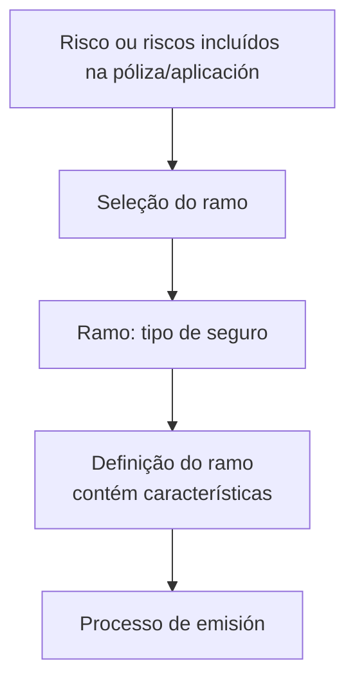

# Seleção do Ramo de Seguro — Processo de Emissão no Reef

## 1. Metadados do Documento
- **Arquivo de Origem:** Não identificado
- **Tipo de Documento:** Procedimento
- **Domínio / Sistema:** Reef; seleção de ramo de seguro
- **Público-Alvo:** Não identificado explicitamente
- **Data/Versão Identificada:** Não identificada

---

## 2. Resumo Executivo & Contexto de Negócio

O documento descreve a etapa de **seleção do ramo** no contexto de uma apólice ou aplicação de seguro. A finalidade declarada é escolher o tipo de seguro que cobrirá um ou mais riscos incluídos na apólice ou aplicação.

O processo apresentado identifica o campo **Ramo** como a informação requerida. O ramo identifica o tipo de seguro que será realizado sobre o risco ou riscos.

A definição do ramo contém todas as características que o processo de emissão deverá considerar. O conteúdo não detalha quais são essas características, quais ramos estão disponíveis, critérios de elegibilidade, regras de validação ou etapas posteriores à seleção.

O material está associado à documentação Reef e apresenta referências de navegação para soluções, arquiteturas, APIs, componentes, Cloud, documentação, Zeus, Reef e ajuda. Não há detalhamento adicional sobre a integração entre essas áreas.

---

## 3. Arquitetura, Componentes & Tecnologias Envolvidas

Os elementos identificados no conteúdo são:

| Componente / Termo | Papel identificado no documento |
| :--- | :--- |
| Reef | Contexto da documentação apresentada. |
| Selección del Ramo | Processo de escolha do tipo de seguro para cobertura de riscos. |
| Ramo | Informação requerida que identifica o tipo de seguro aplicável ao risco ou riscos. |
| Processo de emisión | Processo que considera as características contidas na definição do ramo. |
| Póliza / aplicación | Artefato no qual são incluídos os riscos a serem cobertos. |
| Mapfredocument | Item listado na navegação da documentação. |
| Zeus | Item listado na navegação da documentação. |
| Soluciones, Arquitecturas, APIs, Componentes, Cloud, Documentación, Ayuda | Categorias ou itens de navegação listados na origem. |



> **Nota de Análise:** O conteúdo não descreve arquitetura de software, integrações, APIs, microsserviços, métodos HTTP, contratos de dados, tecnologias, ambientes ou dependências técnicas entre Reef, Mapfredocument e Zeus.

---

## 4. Regras de Negócio, Especificações Funcionais & Processos

1. A seleção do ramo consiste em escolher o tipo de seguro que cobrirá o risco ou os riscos incluídos na apólice ou aplicação.
2. A informação requerida explicitamente apresentada no processo é o **Ramo**.
3. O ramo identifica o tipo de seguro que será realizado sobre o risco ou riscos.
4. A definição do ramo contém todas as características que o processo de emissão considerará.
5. O documento não especifica:
   - Catálogo de ramos de seguro.
   - Critérios para selecionar um ramo.
   - Validações obrigatórias do campo Ramo.
   - Valores permitidos, formato, código ou estrutura do ramo.
   - Fluxo de aprovação, rejeição ou alteração do ramo.
   - Dados adicionais além do ramo.
   - Regras de cálculo, precificação ou cobertura.

---

## 5. Tabelas de Parâmetros, Ambientes e Estruturas de Dados

| Item / Parâmetro | Descrição / Função | Tipo / Valores / Formato | Ambiente / Observações |
| :--- | :--- | :--- | :--- |
| Ramo | Identifica o tipo de seguro que será realizado sobre o risco ou riscos. | Não especificado. | A definição contém características consideradas pelo processo de emissão. |
| Risco(s) | Elementos que serão incluídos na póliza/aplicação e cobertos pelo tipo de seguro selecionado. | Não especificado. | Pode haver um ou mais riscos. |
| Póliza / aplicación | Artefato que inclui os riscos a serem cobertos. | Não especificado. | Termo apresentado no texto em espanhol. |
| Definição do ramo | Contém todas as características consideradas pelo processo de emissão. | Não especificado. | As características não são listadas. |
| Owner | `user:agonzalez_mapfre.com` | Identificador textual. | Exibido nos metadados da documentação. |
| Lifecycle | `Approved Source` | Status textual. | Significado operacional não detalhado. |
| Idioma | `ES` | Código textual. | Exibido na navegação. |
| VL | `VL` | Não especificado. | Exibido junto de “Approved Source”; sem definição no conteúdo. |

---

## 6. Bateria de Perguntas & Respostas para RAG (FAQ Sintético)

### P1: Em que consiste a seleção do ramo no processo descrito?
**R:** A seleção do ramo consiste em escolher o tipo de seguro que cobrirá o risco ou os riscos incluídos na póliza ou aplicação.

### P2: Qual informação é requerida no processo de seleção do ramo?
**R:** A informação explicitamente requerida é o **Ramo**, apresentado como o elemento que identifica o tipo de seguro a ser realizado sobre o risco ou riscos.

### P3: O que o campo Ramo identifica?
**R:** O campo Ramo identifica o tipo de seguro que será realizado sobre o risco ou riscos incluídos na póliza ou aplicação.

### P4: Como o ramo influencia o processo de emissão?
**R:** A definição do ramo contém todas as características que o processo de emissão terá em conta. O documento não detalha quais características são essas.

### P5: O processo permite incluir mais de um risco?
**R:** Sim. O conteúdo afirma que o tipo de seguro pode cobrir “al riesgo o riesgos”, indicando que a póliza ou aplicação pode incluir um ou mais riscos.

### P6: Quais são os valores permitidos para o parâmetro Ramo?
**R:** O documento não informa valores permitidos, códigos, catálogo de ramos, formato ou regras de preenchimento para o parâmetro Ramo.

### P7: Quais validações são aplicadas na seleção do ramo?
**R:** O conteúdo não descreve validações, critérios de elegibilidade, condições de erro, aprovações ou rejeições relacionadas à seleção do ramo.

### P8: O documento detalha APIs ou integrações do processo de seleção do ramo?
**R:** Não. Embora a navegação liste “APIs”, o conteúdo não apresenta endpoints, métodos HTTP, contratos JSON, integrações ou fluxos técnicos.

### P9: Qual sistema é citado como contexto da documentação?
**R:** O conteúdo cita a documentação Reef, incluindo as expressões “Documentation / DOCUMENTACIÓN Reef” e “DOCUMENTACIÓN Reef”.

### P10: Qual é o proprietário indicado na documentação?
**R:** O proprietário exibido é `user:agonzalez_mapfre.com`.

### P11: Qual status de ciclo de vida é apresentado?
**R:** O campo Lifecycle apresenta o valor `Approved Source`. O documento não explica o significado desse status.

### P12: O que significa a sigla VL exibida no documento?
**R:** O conteúdo apresenta `VL` junto de “Approved Source”, mas não fornece sua definição ou função.

---

## 7. Glossário de Termos, Siglas & Conceitos-Chave

- **Ramo:** Tipo de seguro que será realizado sobre o risco ou riscos.
- **Selección del Ramo:** Etapa de escolha do tipo de seguro que cobrirá os riscos incluídos na póliza/aplicación.
- **Riesgo / riesgos:** Risco ou riscos incluídos na póliza/aplicación que serão cobertos pelo seguro selecionado.
- **Póliza / aplicación:** Artefato citado como contendo o risco ou riscos a serem cobertos.
- **Proceso de emisión:** Processo que considera as características presentes na definição do ramo.
- **Reef:** Nome citado no contexto da documentação.
- **Mapfredocument:** Item listado na navegação do documento; sem definição adicional.
- **Zeus:** Item listado na navegação do documento; sem definição adicional.
- **VL:** Sigla ou identificador exibido no conteúdo, sem expansão ou significado informado.
- **Lifecycle:** Campo de metadados exibido com o valor `Approved Source`.
- **Approved Source:** Valor apresentado no campo Lifecycle; sem definição adicional.

---

## 8. Notas Críticas, Riscos & Limitações

- O documento apresenta somente uma visão resumida da seleção do ramo.
- Não existe detalhamento dos valores, códigos ou catálogo de ramos de seguro.
- Não são informadas validações, mensagens de erro, fluxos de exceção ou regras de aprovação.
- Não há especificação de APIs, telas, contratos, integrações, bancos de dados ou tecnologias.
- Reef, Mapfredocument e Zeus são citados, mas suas responsabilidades e relações técnicas não são explicadas.
- O campo `VL` não possui definição no texto.
- O status `Approved Source` é exibido, mas sem descrição de seu efeito no ciclo de vida documental.

---

## 9. Conteúdo Bruto Estruturado (Referência Fiel)

```text
--- [PÁGINA 1 DE 1] ---

SELECCIÓN DEL RAMO
¿En que consiste?
Elegir el tipo de seguro que va a cubrir al riesgo o riesgos que se incluyan en la póliza/aplicación.
Proceso a seguir
A continuación detalla las información requerida.
Ramo
Identica el tipo de seguro que se va a realizar sobre el riesgo (o riesgos). La denición contiene todas las características que el proceso de
emisión tendrá en cuenta.
Documentation / DOCUMENTACIÓN Reef
DOCUMENTACIÓN Reef
Mapfredocument
DOCUMENTACIÓN Reef
Owner
user:agonzalez_mapfre.com
Lifecycle
Approved Source
 / 
 VL
Buscar Inicio Soluciones Arquitecturas APIs Componentes Cloud Documentación Zeus Reef Ayuda
ES
```
