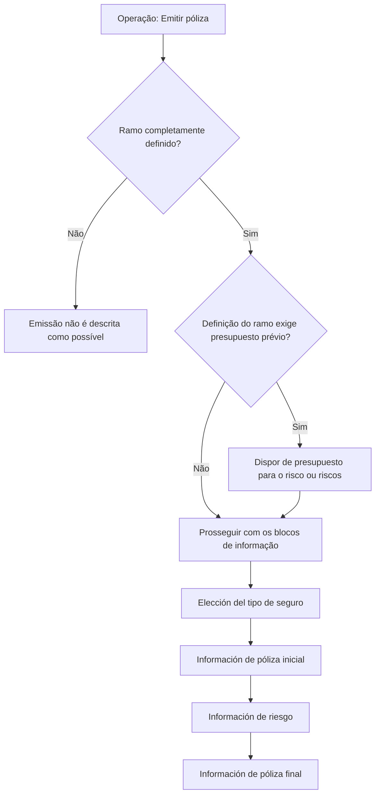

# Operação “Emitir póliza” — Documentação Reef / Mapfredocument

## 1. Metadados do Documento
- **Arquivo de Origem:** Não informado; texto extraído de “DOCUMENTACIÓN Reef” / “Mapfredocument”
- **Tipo de Documento:** Procedimento funcional
- **Domínio / Sistema:** Reef; operação de emissão de apólice (“Emitir póliza”)
- **Público-Alvo:** Negócio, analistas funcionais e usuários operacionais
- **Data/Versão Identificada:** Não identificada
- **Estado Identificado:** “EN CONSTRUCCIÓN”
- **Lifecycle Identificado:** Approved Source / VL
- **Owner Identificado:** `user:agonzalez_mapfre.com`

---

## 2. Resumo Executivo & Contexto de Negócio

O documento descreve a operação **“Emitir póliza”**, cujo propósito é criar uma nova apólice para fornecer cobertura a um ou mais riscos. A operação está registrada na documentação Reef, também identificada no conteúdo como Mapfredocument.

A emissão da apólice depende de uma premissa funcional: o **ramo** deve estar completamente definido. Conforme a definição do ramo, pode ser necessário que exista previamente um **presupuesto** realizado para o risco ou para os riscos que serão cobertos.

O processo é apresentado como uma sequência de blocos de informação. A ordem e a presença efetiva dos blocos dependem da definição do ramo. O fluxo inclui escolha do tipo de seguro, informações iniciais da apólice, informações de risco e informações finais da apólice.

O conteúdo disponível enumera os blocos funcionais e seus campos ou subseções, mas não detalha telas, regras de obrigatoriedade, contratos de integração, métodos HTTP, validações de campos, cálculo de prêmio, estados internos da apólice ou permissões de acesso.

---

## 3. Arquitetura, Componentes & Tecnologias Envolvidas

O texto não apresenta uma arquitetura técnica de software, integrações, microsserviços, bancos de dados, APIs, tecnologias de implementação ou ambientes de execução.

Os elementos identificados são funcionais e documentais:

- **Reef:** contexto documental mencionado em “DOCUMENTACIÓN Reef”.
- **Mapfredocument:** identificação textual exibida junto da documentação.
- **Emitir póliza:** operação para criar uma nova apólice.
- **Ramo:** elemento que deve estar completamente definido para permitir a operação.
- **Presupuesto:** possível pré-requisito, dependendo da definição do ramo.
- **Risco ou riscos:** objetos que receberão cobertura pela nova apólice.



> **Nota de Análise:** O documento não detalha os componentes técnicos que implementam a operação “Emitir póliza”, nem descreve interfaces, endpoints, bases de dados ou contratos JSON.

---

## 4. Regras de Negócio, Especificações Funcionais & Processos

### 4.1 Objetivo da operação

A operação **“Emitir póliza”** permite criar uma nova apólice. A nova apólice fornece cobertura a um ou vários riscos.

### 4.2 Premissas para emissão

1. O ramo deve estar completamente definido.
2. Dependendo da definição do ramo, pode ser necessário dispor de um presupuesto previamente realizado.
3. Quando necessário, o presupuesto prévio deve corresponder ao risco ou aos riscos que se pretende cobrir.

### 4.3 Processo funcional apresentado

O documento informa que os blocos de informação são enumerados em uma ordem de apresentação. A ordem e a composição dos blocos dependem sempre da definição do ramo.

1. **Elección del tipo de seguro**
   - Selección del ramo.

2. **Información de póliza (inicial)**
   - Información básica de la póliza.
   - Información general de la póliza.
   - Coaseguro.
   - Tomador.
   - Agentes.
   - Intervenciones de cliente.
   - Atributos.

3. **Información de riesgo**
   - Intervenciones de cliente.
   - Atributos.
   - Intervenciones de cliente.
   - Accesorios.
   - Coberturas.
   - Cláusulas.

4. **Información de póliza (final)**
   - Plan de pago.
   - Gestor de cobro.
   - Textos anexos.
   - Cláusulas.
   - Motivos.
   - Observaciones.

> **Nota de Análise:** “Intervenciones de cliente” aparece duas vezes na seção “Información de riesgo”. O texto extraído não explica se são dois blocos distintos, uma repetição intencional ou uma duplicidade de extração.

> **Nota de Análise:** Os itens marcados com `()` no conteúdo original não possuem significado explicado. O documento não esclarece se a marcação representa campo obrigatório, configuração, expansão de seção ou outro comportamento.

---

## 5. Tabelas de Parâmetros, Ambientes e Estruturas de Dados

| Item / Parâmetro | Descrição / Função | Tipo / Valores / Formato | Ambiente / Observações |
| :--- | :--- | :--- | :--- |
| Emitir póliza | Operação para criar uma nova apólice. | Operação funcional | A apólice criada fornece cobertura a um ou vários riscos. |
| Ramo | Elemento que deve estar completamente definido para realizar a operação. | Entidade funcional | A definição do ramo condiciona o processo e a necessidade de presupuesto prévio. |
| Presupuesto | Informação ou artefato prévio que pode ser necessário para emissão. | Pré-requisito condicional | Deve estar realizado previamente sobre o risco ou riscos a cobrir, quando exigido pela definição do ramo. |
| Riesgo / riesgos | Elementos que receberão cobertura pela nova apólice. | Entidade funcional | A apólice pode cobrir um ou vários riscos. |
| Selección del ramo | Seleção do ramo durante a escolha do tipo de seguro. | Etapa do processo | Localizada em “ELECCIÓN DEL TIPO DE SEGURO”. |
| Información básica de la póliza | Bloco de informação inicial da apólice. | Bloco funcional | Sem detalhamento de campos. |
| Información general de la póliza | Bloco de informação inicial da apólice. | Bloco funcional | Sem detalhamento de campos. |
| Coaseguro | Bloco de informações iniciais da apólice. | Bloco funcional | O documento não define o conceito ou seus campos. |
| Tomador | Bloco de informações iniciais da apólice. | Bloco funcional | O documento não detalha campos ou regras. |
| Agentes | Bloco de informações iniciais da apólice. | Bloco funcional | O documento não detalha campos ou regras. |
| Intervenciones de cliente | Bloco presente nas informações iniciais da apólice e repetido nas informações de risco. | Bloco funcional | A repetição no bloco de risco não é explicada. |
| Atributos | Bloco presente nas informações iniciais da apólice e nas informações de risco. | Bloco funcional | Sem detalhamento adicional. |
| Accesorios | Bloco das informações de risco. | Bloco funcional | Sem detalhamento adicional. |
| Coberturas | Bloco das informações de risco. | Bloco funcional | Relacionado ao escopo de cobertura, sem regras detalhadas. |
| Cláusulas | Bloco presente nas informações de risco e nas informações finais da apólice. | Bloco funcional | Sem detalhamento adicional. |
| Plan de pago | Bloco de informações finais da apólice. | Bloco funcional | Sem detalhamento adicional. |
| Gestor de cobro | Bloco de informações finais da apólice. | Bloco funcional | Sem detalhamento adicional. |
| Textos anexos | Bloco de informações finais da apólice. | Bloco funcional | Sem detalhamento adicional. |
| Motivos | Bloco de informações finais da apólice. | Bloco funcional | Sem detalhamento adicional. |
| Observaciones | Bloco de informações finais da apólice. | Bloco funcional | Sem detalhamento adicional. |
| Owner | Responsável identificado no conteúdo. | Identificador textual | `user:agonzalez_mapfre.com` |
| Lifecycle | Estado documental exibido no conteúdo. | Identificador textual | `Approved Source / VL` |
| Idioma exibido | Idioma indicado na navegação da documentação. | Código de idioma | `ES` |

---

## 6. Bateria de Perguntas & Respostas para RAG (FAQ Sintético)

### P1: O que a operação “Emitir póliza” permite realizar?
**R:** A operação “Emitir póliza” permite criar uma nova apólice que fornecerá cobertura a um ou vários riscos.

### P2: Qual é a premissa principal para emitir uma nova apólice?
**R:** Para realizar a operação “Emitir póliza”, é necessário que o ramo esteja completamente definido.

### P3: Quando é necessário ter um presupuesto previamente realizado?
**R:** Dependendo da definição do ramo, pode ser necessário dispor de um presupuesto realizado previamente sobre o risco ou os riscos que se pretende cobrir.

### P4: A apólice emitida pode cobrir mais de um risco?
**R:** Sim. O documento afirma que a nova apólice pode fornecer cobertura a um ou vários riscos.

### P5: Qual é a primeira etapa indicada no processo de emissão de apólice?
**R:** A primeira etapa é “ELECCIÓN DEL TIPO DE SEGURO”, contendo a “Selección del ramo”.

### P6: Quais blocos compõem as informações iniciais da apólice?
**R:** As informações iniciais incluem información básica de la póliza, información general de la póliza, coaseguro, tomador, agentes, intervenciones de cliente e atributos.

### P7: Quais informações de risco são listadas no processo?
**R:** O bloco “INFORMACIÓN DE RIESGO” lista intervenciones de cliente, atributos, novamente intervenciones de cliente, accesorios, coberturas e cláusulas.

### P8: Quais blocos são tratados nas informações finais da apólice?
**R:** As informações finais incluem plan de pago, gestor de cobro, textos anexos, cláusulas, motivos e observaciones.

### P9: O documento define os campos internos de “Coberturas” e “Cláusulas”?
**R:** Não. O documento apenas lista “Coberturas” e “Cláusulas” como blocos de informação, sem detalhar campos, regras, valores ou validações.

### P10: A ordem dos blocos de emissão é fixa para todos os ramos?
**R:** O documento informa que os blocos são enumerados em uma ordem de apresentação, mas ressalta que essa ordem ocorre sempre dependendo da definição do ramo.

### P11: O que significam os parênteses `()` apresentados ao lado de alguns blocos?
**R:** O documento não define o significado dos parênteses `()` ao lado de determinados blocos, como “Información básica de la póliza”, “Coaseguro” e “Cláusulas”.

### P12: O documento descreve APIs, métodos HTTP ou contratos de integração para a emissão?
**R:** Não. O conteúdo não apresenta APIs, métodos HTTP, contratos JSON, URLs, ambientes técnicos, microsserviços ou detalhes de integração.

---

## 7. Glossário de Termos, Siglas & Conceitos-Chave

- **Emitir póliza:** Operação que permite criar uma nova apólice para cobertura de um ou vários riscos.
- **Póliza:** Apólice criada pela operação descrita.
- **Ramo:** Elemento funcional que deve estar completamente definido para possibilitar a emissão.
- **Presupuesto:** Artefato ou informação que pode precisar ser previamente realizada sobre o risco ou riscos a cobrir, conforme a definição do ramo.
- **Riesgo / riesgos:** Risco ou riscos que receberão cobertura por meio da nova apólice.
- **Coaseguro:** Bloco listado nas informações iniciais da apólice; o documento não fornece definição adicional.
- **Tomador:** Bloco listado nas informações iniciais da apólice; o documento não fornece definição adicional.
- **Gestor de cobro:** Bloco listado nas informações finais da apólice; o documento não fornece definição adicional.
- **Reef:** Nome presente em “DOCUMENTACIÓN Reef”; o documento não define tecnicamente o termo.
- **Mapfredocument:** Nome exibido junto da documentação; o documento não fornece explicação adicional.
- **VL:** Sigla exibida como parte de “Approved Source / VL”; significado não definido no conteúdo.
- **ES:** Código exibido na navegação; o documento não explicita seu significado.

---

## 8. Notas Críticas, Riscos & Limitações

- O conteúdo está identificado como **“EN CONSTRUCCIÓN”**, indicando que o material pode estar incompleto.
- Não há detalhamento de campos, formatos, obrigatoriedade, valores permitidos ou regras de validação para os blocos funcionais listados.
- Não são descritos critérios de aprovação, cálculos, precificação, emissão definitiva, cancelamento ou alteração da apólice.
- Não há descrição de APIs, integrações, microsserviços, filas, bancos de dados, autenticação, autorização, logs ou monitoramento.
- Não existem URLs, nomes de servidores, ambientes, portas, rotas de logs ou configurações de deployment no conteúdo fornecido.
- A repetição de “Intervenciones de cliente” em “INFORMACIÓN DE RIESGO” não é explicada.
- O significado dos itens acompanhados por `()` não é documentado.
- O termo “Approved Source / VL” é exibido, mas não possui interpretação explicada no texto.

---

## 9. Conteúdo Bruto Estruturado (Referência Fiel)

```text
--- [PÁGINA 1 DE 2] ---

EN CONSTRUCCIÓN
EMITIR póliza
¿En que consiste?
Esta operación permite crear una nueva póliza con la que se dará cobertura a uno o varios riesgos.
Premisas
Para poder realizar esta operación es necesario que el ramo se encuentre completamente de�nido. Dependiendo de la de�nición, es posible
que sea necesario disponer de un presupuesto realizado previamente sobre el riesgo o riesgos que se pretende cubrir.
Proceso a seguir
En este apartado se enumeran los bloques de información y el orden en el que aparecerán (siempre dependiendo de la de�nición del ramo).
ELECCIÓN DEL TIPO DE SEGURO
 Selección del ramo
INFORMACIÓN DE PÓLIZA (INICIAL)
 Información básica de la póliza ( )
 Información general de la póliza ( )
 Coaseguro ( )
 Tomador ( )
 Agentes ( )
 Intervenciones de cliente ( )
 Atributos ( )
INFORMACIÓN DE RIESGO
 Intervenciones de cliente ( )
 Atributos ( )
 Intervenciones de cliente ( )
 Accesorios ( )
 Coberturas ( )
 Cláusulas ( )
INFORMACIÓN DE PÓLIZA (FINAL)
Documentation / DOCUMENTACIÓN Reef
DOCUMENTACIÓN Reef
Mapfredocument
DOCUMENTACIÓN Reef
Owner
user:agonzalez_mapfre.com
Lifecycle
Approved Source
 /
 VL
Buscar Inicio Soluciones Arquitecturas APIs Componentes Cloud Documentación Zeus Reef Ayuda
ES


--- [PÁGINA 2 DE 2] ---

Plan de pago
 Gestor de cobro
 Textos anexos
 Cláusulas ( )
 Motivos
 Observaciones
```
