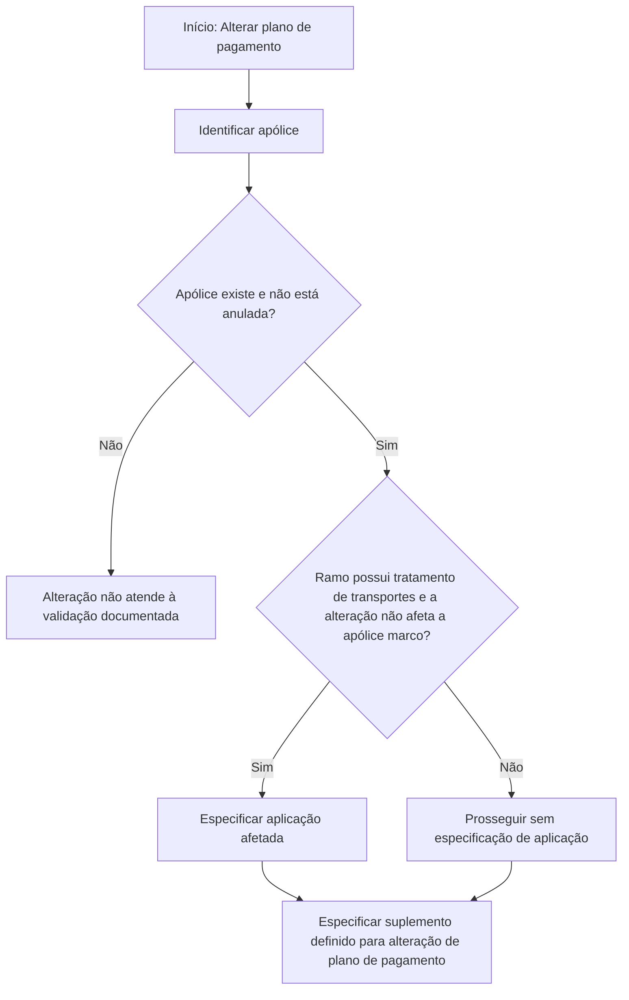

# Alterar Plano de Pagamento — Informação Prévia (Reef)

## 1. Metadados do Documento
- **Arquivo de Origem:** Não identificado no conteúdo fornecido
- **Tipo de Documento:** Procedimento
- **Domínio / Sistema:** Reef / Mapfre
- **Público-Alvo:** Operação, negócio e usuários responsáveis por alterações de plano de pagamento
- **Data/Versão Identificada:** Não identificada

---

## 2. Resumo Executivo & Contexto de Negócio

O documento descreve a etapa de **informação prévia** do processo “ALTERAR plan pago”, voltada à alteração do plano de pagamento de uma apólice e, quando aplicável, de uma aplicação associada.

A etapa identifica a apólice e/ou aplicação que receberá a alteração de plano de pagamento. O documento também determina o suplemento associado à modificação pretendida.

A validação da apólice exige que o número informado exista e que a apólice não esteja anulada. Para ramos declarados com tratamento de transportes, pode ser necessário especificar a aplicação afetada.

O conteúdo está associado à documentação Reef e apresenta status de ciclo de vida como **Approved Source**. Não há detalhamento de interfaces, métodos HTTP, contratos JSON, regras de cálculo, sistemas de integração ou procedimentos de execução posteriores.

---

## 3. Arquitetura, Componentes & Tecnologias Envolvidas

Os elementos explicitamente citados são:

- **Reef:** contexto documental e sistema ou domínio referido pelo conteúdo.
- **Mapfredocument:** elemento apresentado na área de documentação.
- **Apólice:** entidade principal cuja alteração de plano de pagamento será realizada.
- **Aplicação:** entidade que deve ser informada em determinadas condições de ramos com tratamento de transportes.
- **Suplemento:** modificação definida para alteração do plano de pagamento.



> **Nota de Análise:** O documento não detalha a arquitetura técnica do Reef, integrações, tecnologias de implementação, serviços, APIs ou persistência de dados.

---

## 4. Regras de Negócio, Especificações Funcionais & Processos

1. O processo refere-se à alteração de um plano de pagamento.
2. A etapa prévia deve identificar a apólice e/ou aplicação à qual será aplicado o novo plano de pagamento.
3. A modificação pretendida deve ser determinada por meio de um suplemento.
4. O número de apólice informado deve corresponder a uma apólice existente.
5. A apólice informada não pode estar anulada.
6. Quando o ramo estiver declarado com tratamento de transportes, deve-se avaliar se a alteração de plano de pagamento afeta a apólice marco.
7. Quando o ramo possuir tratamento de transportes **e** a alteração de plano de pagamento **não** afetar a apólice marco, deve ser especificada a aplicação afetada.
8. Deve ser informado o suplemento definido como suplemento de alteração de plano de pagamento.

---

## 5. Tabelas de Parâmetros, Ambientes e Estruturas de Dados

| Item / Parâmetro | Descrição / Função | Tipo / Valores / Formato | Ambiente / Observações |
| :--- | :--- | :--- | :--- |
| Apólice | Identifica a apólice cujo plano de pagamento será alterado. | Número de apólice existente. | A apólice não pode estar anulada. |
| Aplicação | Identifica a aplicação afetada pela alteração. | Não especificado. | Obrigatória quando o ramo possui tratamento de transportes e a mudança não afeta a apólice marco. |
| Suplemento | Identifica a modificação a ser realizada. | Suplemento definido para alteração de plano de pagamento. | Deve ser especificado. |
| Ramo | Condiciona a necessidade de informar aplicação. | Ramo declarado com tratamento de transportes. | Não há lista de ramos ou códigos no documento. |
| Apólice marco | Referência para determinar se a aplicação deve ser especificada. | Não especificado. | Relevante para ramos com tratamento de transportes. |
| Lifecycle | Estado do conteúdo documental. | `Approved Source` | Apresentado na área DOCUMENTACIÓN Reef. |
| Owner | Proprietário indicado no conteúdo. | `user:agonzalez_mapfre.com` | Associado ao conteúdo DOCUMENTACIÓN Reef. |

---

## 6. Bateria de Perguntas & Respostas para RAG (FAQ Sintético)

### P1: Qual é o objetivo da etapa “ALTERAR plan pago - Información previa”?
**R:** A etapa identifica a apólice e/ou aplicação à qual será alterado o plano de pagamento e determina a modificação, denominada suplemento, que será realizada.

### P2: Qual validação deve ser aplicada ao número de apólice?
**R:** O número informado deve corresponder a uma apólice existente e a apólice não pode estar anulada.

### P3: Quando a aplicação deve ser especificada na alteração de plano de pagamento?
**R:** A aplicação deve ser especificada quando o ramo estiver declarado com tratamento de transportes e a alteração do plano de pagamento não afetar a apólice marco.

### P4: O que é necessário informar sobre o suplemento?
**R:** Deve ser especificado o suplemento que tenha sido definido como suplemento de alteração de plano de pagamento.

### P5: A aplicação é obrigatória para toda alteração de plano de pagamento?
**R:** Não. O documento exige a especificação da aplicação somente na condição de ramo com tratamento de transportes em que a mudança não afeta a apólice marco.

### P6: O documento informa quais suplementos podem ser usados?
**R:** Não. O documento apenas determina que seja especificado o suplemento previamente definido para alteração de plano de pagamento.

### P7: O documento detalha como verificar se uma apólice está anulada?
**R:** Não. O conteúdo estabelece que a apólice não deve estar anulada, mas não descreve a consulta, tela, API ou procedimento de validação.

### P8: O que ocorre se a apólice não existir ou estiver anulada?
**R:** O documento não descreve um fluxo de tratamento de erro. Ele estabelece somente a regra de que a apólice deve existir e não estar anulada.

### P9: O documento informa os métodos HTTP ou contratos de integração do Reef?
**R:** Não. Não há descrição de APIs, métodos HTTP, contratos JSON, endpoints, autenticação ou integrações técnicas.

### P10: Quem é o owner indicado na documentação Reef?
**R:** O conteúdo apresenta `user:agonzalez_mapfre.com` como owner.

---

## 7. Glossário de Termos, Siglas & Conceitos-Chave

- **Reef:** nome apresentado na documentação e na navegação do conteúdo.
- **Apólice:** entidade que deve existir e não estar anulada para permitir a alteração descrita.
- **Aplicação:** entidade que pode precisar ser identificada para ramos com tratamento de transportes.
- **Apólice marco:** referência usada na condição que determina a necessidade de informar a aplicação.
- **Plano de pagamento:** plano cuja alteração é o objetivo do procedimento.
- **Ramo:** classificação mencionada na condição relacionada ao tratamento de transportes.
- **Suplemento:** modificação que deve ser definida para realizar a alteração de plano de pagamento.
- **Mapfredocument:** termo exibido na área de documentação.
- **Lifecycle:** campo apresentado com o valor `Approved Source`.
- **Owner:** campo de propriedade apresentado com o valor `user:agonzalez_mapfre.com`.

---

## 8. Notas Críticas, Riscos & Limitações

- O documento não identifica o arquivo original, data, versão ou autoria documental além do campo `Owner`.
- Não há detalhamento técnico sobre telas, APIs, integrações, persistência, autenticação, logs ou tratamento de erros.
- Não são informados os critérios para classificar um ramo como possuidor de tratamento de transportes.
- Não são apresentados códigos, formatos ou catálogo de suplementos válidos.
- Não há procedimento documentado para consultar existência, anulação ou status da apólice.
- O texto extraído contém aparentes artefatos de codificação em palavras como `identica`, `modicación` e `denido`; o conteúdo foi preservado na referência bruta.

---

## 9. Conteúdo Bruto Estruturado (Referência Fiel)

```text
--- [PÁGINA 1 DE 1] ---

ALTERAR plan pago - Información previa
¿En que consiste?
En este apartado se identica la póliza y/o aplicación a la que se le va a cambiar el plan de pago. Además, se determina la modicación
(suplemento) que se pretende realizar.
Proceso a seguir
A continuación detallan las información requerida.
Póliza
Debe coincidir con un número de póliza que exista y que no se encuentre anulada.
Aplicación
Si el ramo está declarado con el tratamiento de transportes, y el cambio de plan de pago NO afecta a la póliza marco, se debe especicar a
que aplicación afecta el cambio.
Suplemento
Se debe especicar el suplemento que se haya denido como de cambio de plan de pago.
Documentation / DOCUMENTACIÓN Reef
DOCUMENTACIÓN Reef
Mapfredocument
DOCUMENTACIÓN Reef
Owner
user:agonzalez_mapfre.com
Lifecycle
Approved Source
 / 
 VL
Buscar Inicio Soluciones Arquitecturas APIs Componentes Cloud Documentación Zeus Reef Ayuda
ES
```
