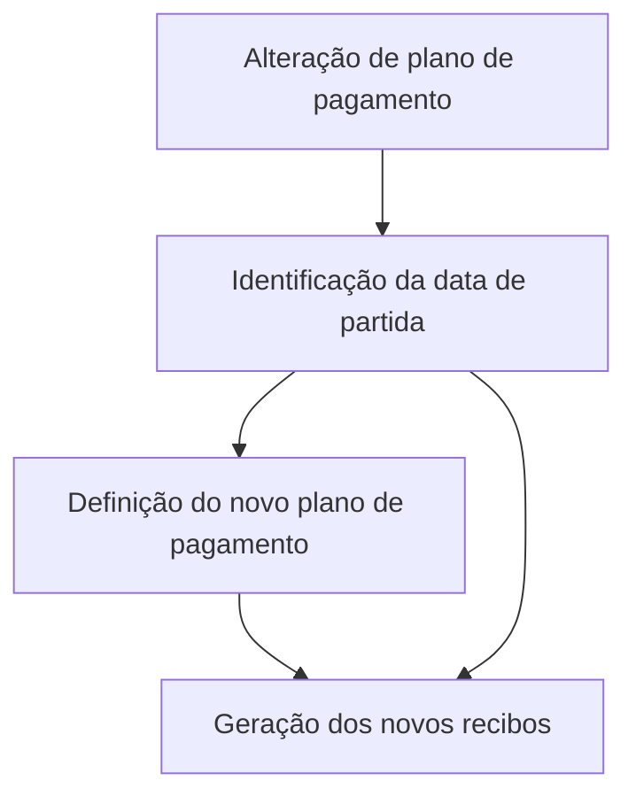

# Alterar Plano de Pagamento — Informação Básica no Reef

## 1. Metadados do Documento
- **Arquivo de Origem:** `Não identificado no conteúdo extraído`
- **Tipo de Documento:** `Procedimento`
- **Domínio / Sistema:** `Reef / Mapfre`
- **Público-Alvo:** `Não identificado`
- **Data/Versão Identificada:** `Não identificada`
- **Proprietário Identificado:** `user:agonzalez_mapfre.com`
- **Lifecycle Identificado:** `Approved Source / VL`

---

## 2. Resumo Executivo & Contexto de Negócio

O documento descreve a seção **“ALTERAR plan pago - Información básica”**, relacionada à alteração de um plano de pagamento no contexto da documentação Reef. O elemento central informado é a identificação da data que servirá como ponto de partida para a geração dos recibos associados ao novo plano de pagamento.

O processo sempre deve atender à definição do novo plano de pagamento. Dessa forma, a data definida na seção de informação básica é utilizada como base para a geração dos novos recibos, considerando posteriormente o plano de pagamento escolhido.

O conteúdo menciona que há informações requeridas no processo, mas não apresenta no trecho extraído quais são esses campos, valores permitidos, regras de validação ou responsáveis pelo preenchimento. Também não detalha interfaces, APIs, métodos HTTP, estruturas JSON, cálculos financeiros ou critérios de elegibilidade para a alteração do plano.

A documentação está identificada como parte da documentação Reef e contém referências visuais ou navegacionais a Mapfre, arquiteturas, APIs, componentes, cloud, documentação Zeus e ajuda. Essas referências não possuem detalhamento técnico adicional no conteúdo fornecido.

---

## 3. Arquitetura, Componentes & Tecnologias Envolvidas

Os componentes e contextos explicitamente citados são:

- **Reef:** sistema ou domínio documental mencionado como “DOCUMENTACIÓN Reef”.
- **Mapfre:** referência presente como “Mapfredocument”.
- **Novo plano de pagamento:** definição que orienta a geração dos novos recibos.
- **Recibos:** artefatos gerados a partir da data-base e da definição do plano de pagamento selecionado.
- **Owner:** `user:agonzalez_mapfre.com`.
- **Lifecycle:** `Approved Source / VL`.

O documento não descreve arquitetura de software, tecnologias de implementação, bancos de dados, serviços, APIs, ambientes ou contratos de integração.



**Nota de Análise:** O fluxo Mermaid representa exclusivamente a relação descrita no texto: a data identificada serve de base para gerar novos recibos conforme a definição do novo plano de pagamento. O documento não informa etapas sistêmicas intermediárias, integrações ou componentes técnicos.

---

## 4. Regras de Negócio, Especificações Funcionais & Processos

1. A seção de informação básica identifica a data que será utilizada como ponto de partida para a geração dos recibos do novo plano de pagamento.
2. O processo deve sempre atender à definição do novo plano de pagamento.
3. A data identificada é utilizada como base para a geração dos novos recibos.
4. A geração dos novos recibos considera a definição do plano de pagamento escolhido posteriormente.
5. O documento indica que há informações requeridas para o processo, porém não especifica quais informações são requeridas.
6. O documento não informa:
   - Formato da data.
   - Regras para datas passadas, presentes ou futuras.
   - Critérios de validação da data.
   - Regras para alteração, cancelamento ou reversão do plano.
   - Cálculo de valores, vencimentos, juros ou parcelas.
   - Responsáveis pela aprovação ou execução da alteração.
   - Integrações com outros sistemas.

---

## 5. Tabelas de Parâmetros, Ambientes e Estruturas de Dados

| Item / Parâmetro | Descrição / Função | Tipo / Valores / Formato | Ambiente / Observações |
| :--- | :--- | :--- | :--- |
| Data de partida | Data identificada como base para a geração dos recibos do novo plano de pagamento. | Data; formato não informado. | Deve atender à definição do novo plano de pagamento. |
| Novo plano de pagamento | Plano cuja definição orienta a geração dos novos recibos. | Não informado. | Escolhido posteriormente, conforme o texto. |
| Novos recibos | Recibos gerados com base na data identificada e na definição do novo plano de pagamento. | Não informado. | O documento não especifica estrutura, valores ou canais de emissão. |
| Informações requeridas | Informações necessárias para o processo, mencionadas sem detalhamento. | Não informado. | O trecho indica que seriam detalhadas a seguir, mas os dados não estão presentes na extração. |
| Owner | Proprietário identificado na documentação. | `user:agonzalez_mapfre.com` | Associado ao conteúdo documental. |
| Lifecycle | Estado de ciclo de vida identificado. | `Approved Source / VL` | Significado de `VL` não detalhado. |
| Domínio documental | Referência à documentação Reef. | `DOCUMENTACIÓN Reef` | Há também referência a Mapfre. |

---

## 6. Bateria de Perguntas & Respostas para RAG (FAQ Sintético)

### P1: Qual é a finalidade da seção “ALTERAR plan pago - Información básica”?
**R:** A seção identifica a data que será utilizada como ponto de partida para gerar os recibos correspondentes ao novo plano de pagamento.

### P2: Qual data é usada para gerar os recibos do novo plano de pagamento?
**R:** É utilizada a data identificada na seção de informação básica. O documento afirma que essa data será tomada como base para a geração dos novos recibos.

### P3: A geração de recibos considera somente a data de partida?
**R:** Não. A data de partida é a base para geração, mas o processo deve atender à definição do novo plano de pagamento escolhido posteriormente.

### P4: O documento define o formato obrigatório da data de partida?
**R:** Não. O conteúdo apenas informa que uma data é identificada como ponto de partida; não há definição de formato, timezone, validações ou restrições de preenchimento.

### P5: Quais informações são requeridas para alterar o plano de pagamento?
**R:** O documento informa que existem informações requeridas e que seriam detalhadas, mas o trecho extraído não lista os campos, parâmetros ou valores necessários.

### P6: O documento descreve como calcular valores dos novos recibos?
**R:** Não. Não há regras sobre valores, número de parcelas, vencimentos, juros, impostos, descontos ou critérios de cálculo dos recibos.

### P7: O que determina a geração dos novos recibos após a alteração?
**R:** A geração dos novos recibos é determinada pela data tomada como base e pela definição do novo plano de pagamento.

### P8: O documento informa APIs ou integrações usadas na alteração do plano de pagamento?
**R:** Não. Apesar de a navegação mencionar APIs, arquiteturas e componentes, o conteúdo extraído não apresenta endpoints, métodos HTTP, contratos, serviços ou integrações técnicas.

### P9: Qual sistema ou domínio é citado na documentação?
**R:** O conteúdo cita a “DOCUMENTACIÓN Reef” e contém uma referência a “Mapfredocument”. Não há detalhamento adicional sobre os limites funcionais ou técnicos desses domínios.

### P10: Quem é o proprietário identificado do documento?
**R:** O proprietário identificado no conteúdo é `user:agonzalez_mapfre.com`.

### P11: Qual é o ciclo de vida identificado para o documento?
**R:** O conteúdo apresenta o lifecycle como `Approved Source / VL`. O significado operacional de `VL` não é explicado.

---

## 7. Glossário de Termos, Siglas & Conceitos-Chave

- **Reef:** Nome citado na documentação como “DOCUMENTACIÓN Reef”. O conteúdo não apresenta uma definição funcional ou técnica adicional.
- **Mapfre:** Referência presente como “Mapfredocument”. O contexto específico não é detalhado.
- **Plano de pagamento:** Definição utilizada para orientar a geração dos novos recibos após a alteração.
- **Recibos:** Registros ou documentos cuja geração utiliza a data identificada como base e considera a definição do novo plano de pagamento.
- **Data de partida:** Data identificada na informação básica para servir de base à geração de recibos.
- **Lifecycle:** Campo de ciclo de vida documental apresentado como `Approved Source / VL`.
- **VL:** Sigla presente no campo de lifecycle, sem significado definido no conteúdo extraído.

---

## 8. Notas Críticas, Riscos & Limitações

- O conteúdo extraído possui somente uma página e não detalha as “informações requeridas” mencionadas para o processo.
- Não há definição do formato, obrigatoriedade, origem ou validação da data de partida.
- Não há detalhamento sobre regras financeiras, cálculo de parcelas, valores de recibos, datas de vencimento, juros ou impostos.
- Não há informações sobre permissões, aprovação, auditoria, reversão ou tratamento de erro para a alteração do plano de pagamento.
- Não há arquitetura técnica, contratos de API, endpoints, componentes de integração, ambientes ou rotas de logs.
- **Nota de Análise:** O documento menciona a seleção posterior de um novo plano de pagamento, mas não detalha como essa seleção ocorre nem quais definições do plano influenciam a geração dos recibos.
- **Nota de Análise:** A referência `Approved Source / VL` está presente, porém o documento não define o significado de `VL`.

---

## 9. Conteúdo Bruto Estruturado (Referência Fiel)

```text
--- [PÁGINA 1 DE 1] ---

ALTERAR plan pago - Información básica
¿En que consiste?
En este apartado se identica la fecha que será la de partida para la generación de los recibos del nuevo plan de pago. Siempre el proceso
atenderá la denición del nuevo plan de pago.
Proceso a seguir
A continuación detalla las información requerida.
Efecto
Esta fecha se tomará como base para la generación de los nuevos recibos atendiendo a la denición del plan de pago elegido
posteriormente.
Documentation / DOCUMENTACIÓN Reef
DOCUMENTACIÓN Reef
Mapfredocument
DOCUMENTACIÓN Reef
Owner
user:agonzalez_mapfre.com
Lifecycle
Approved Source
 / 
 VL
Buscar Inicio Soluciones Arquitecturas APIs Componentes Cloud Documentación Zeus Reef Ayuda
ES
```
