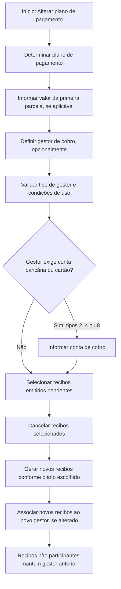

# Alterar Plano de Pagamento — Opção Econômica e Gestor de Cobro de Recibos MAPFRE

## 1. Metadados do Documento
- **Arquivo de Origem:** `Não identificado no conteúdo extraído`
- **Tipo de Documento:** Procedimento
- **Domínio / Sistema:** Documentação Reef / MAPFRE — gestão de recibos e planos de pagamento de apólices
- **Público-Alvo:** Negócio, Operação e equipes responsáveis pela gestão de recibos
- **Data/Versão Identificada:** Não identificada

---

## 2. Resumo Executivo & Contexto de Negócio

O documento descreve a operação **“Alterar plan pago - opción económica”**, destinada a determinar o plano de pagamento que será associado a uma apólice e a selecionar quais recibos pendentes participarão da alteração. A operação permite aplicar um plano de pagamento diferente ou manter o plano atualmente associado à apólice.

A manutenção do mesmo plano de pagamento é explicitamente permitida para viabilizar o refinanciamento de um, vários ou todos os recibos pendentes de cobrança. Os recibos selecionados para a operação são cancelados e substituídos por novos recibos, gerados conforme a definição do plano de pagamento escolhido.

Além da alteração do plano, a operação permite modificar o **gestor de cobro**, isto é, o terceiro responsável por receber o valor do recibo e entregá-lo à MAPFRE por meio da operação **COBRAR recibo**. O documento estabelece regras específicas para cada tipo de gestor, inclusive requisitos relacionados à existência de conta bancária, cartão de crédito, cobrador cadastrado ou apólice de cosseguro aceito.

A alteração do gestor de cobro tem efeito somente sobre os novos recibos gerados pela operação. Recibos selecionados e cancelados permanecem associados ao gestor anterior; recibos já existentes que não participam da operação também conservam o gestor de cobro anterior.

---

## 3. Arquitetura, Componentes & Tecnologias Envolvidas

Os elementos funcionais identificados são:

- **Apólice:** entidade à qual será associado o plano de pagamento.
- **Plano de pagamento:** definição utilizada para gerar novos recibos.
- **Recibos emitidos pendentes:** recibos disponíveis para seleção na operação.
- **Gestor de cobro:** terceiro responsável por receber valores de recibos e entregá-los à MAPFRE.
- **Operação COBRAR recibo:** operação pela qual o gestor de cobro entrega à MAPFRE o valor recebido.
- **Pagador:** parte que deve possuir conta bancária ou cartão de crédito quando exigido pelo tipo de gestor.
- **MAPFRE:** organização destinatária dos valores recebidos pelo gestor de cobro.
- **Documentação Reef:** contexto documental em que o conteúdo foi publicado.



**Nota de Análise:** o documento não descreve sistemas técnicos, APIs, métodos HTTP, contratos JSON, bancos de dados, URLs, ambientes, portas ou tecnologias de implementação.

---

## 4. Regras de Negócio, Especificações Funcionais & Processos

### 4.1 Processo descrito

1. Determinar o plano de pagamento.
2. Selecionar os recibos que participarão da operação.
3. Definir, quando aplicável, o valor da primeira parcela.
4. Alterar o gestor de cobro, caso necessário.
5. Informar a conta de cobro quando o tipo de gestor exigir conta bancária ou cartão de crédito.
6. Cancelar os recibos selecionados.
7. Gerar novos recibos conforme a definição do plano de pagamento selecionado.

### 4.2 Determinação do plano de pagamento

- Deve ser especificado o plano de pagamento que será associado à apólice.
- O plano de pagamento selecionado pode ser:
  - Diferente do plano de pagamento atualmente existente na apólice.
  - Igual ao plano de pagamento atualmente existente na apólice.
- A manutenção do mesmo plano permite realizar refinanciamento de:
  - Um recibo pendente.
  - Vários recibos pendentes.
  - Todos os recibos pendentes de cobrança.

### 4.3 Valor da primeira parcela

- O uso do campo de valor da primeira parcela depende exclusivamente de o plano de pagamento permitir essa funcionalidade.
- Quando o plano de pagamento suportar o campo:
  - Um valor informado gera a primeira parcela pelo valor indicado.
  - Um percentual informado, identificado pelo sinal `%`, gera a primeira parcela pelo valor correspondente ao percentual fornecido.
- Quando o plano de pagamento não suportar a funcionalidade:
  - A geração dos recibos não é afetada pelo conteúdo informado no campo de valor da primeira parcela.

### 4.4 Alteração do gestor de cobro

- A operação permite alterar o gestor de cobro.
- O gestor de cobro é um terceiro responsável por:
  1. Receber o valor do recibo.
  2. Entregar o valor à MAPFRE mediante a operação **COBRAR recibo**.
- Se houver alteração do gestor de cobro:
  - Os novos recibos gerados pela operação são atribuídos ao novo gestor.
  - Os recibos selecionados para cancelamento permanecem com o gestor anterior à operação.
  - Os recibos já existentes que não participam da operação conservam o gestor de cobro anterior.

### 4.5 Regras de uso por tipo de gestor

- **Tipo 1 — AGENTE:** pode ser utilizado sempre.
- **Tipo 2 — BANCO:** pode ser utilizado quando o pagador possuir conta bancária.
- **Tipo 3 — COBRADOR:** pode ser utilizado quando existir essa figura definida na companhia.
- **Tipo 4 — DÉBITO AUTOMÁTICO EM CONTA:** pode ser utilizado quando o pagador possuir conta bancária.
- **Tipo 5 — GESTOR DIRETO:** pode ser utilizado sempre.
- **Tipo 6 — GESTOR PILOTO COASEGURO:** pode ser utilizado quando a apólice for de cosseguro aceito.
- **Tipo 7 — OFICINA COMERCIAL:** pode ser utilizado sempre.
- **Tipo 8 — DÉBITO COM CARTÃO DE CRÉDITO:** pode ser utilizado quando o pagador possuir cartão de crédito.
- **Tipo 10 — GESTOR DE IMPAGOS:** não pode ser utilizado; é exclusivo do processo de inadimplência.

### 4.6 Seleção de recibos

- Devem ser selecionados os recibos exibidos cuja situação seja **emitido pendente**.
- Os recibos selecionados:
  - Participam da operação.
  - São cancelados.
  - São substituídos por novos recibos gerados segundo a definição do plano de pagamento escolhido.
- Recibos não selecionados não participam da operação.

---

## 5. Tabelas de Parâmetros, Ambientes e Estruturas de Dados

| Item / Parâmetro | Descrição / Função | Tipo / Valores / Formato | Ambiente / Observações |
| :--- | :--- | :--- | :--- |
| Plano de pagamento | Plano associado à apólice para a operação | Pode ser igual ou diferente do plano já existente | Manter o mesmo plano permite refinanciar recibos pendentes |
| Valor da primeira parcela | Define o valor ou percentual da primeira parcela do movimento | Valor ou percentual com sinal `%` | Produz efeito somente se o plano de pagamento suportar a funcionalidade |
| Gestor de cobro | Terceiro responsável por receber o valor do recibo e entregá-lo à MAPFRE | Chave de terceiro conforme o tipo de gestor | Afeta os novos recibos gerados quando houver mudança |
| Tipo de gestor | Identifica a atividade de terceiro responsável pela gestão de cobrança | Tipos 1, 2, 3, 4, 5, 6, 7, 8 ou 10 | Determina as características exigidas da apólice e do pagador |
| Conta de cobro | Conta bancária ou cartão de crédito do pagador a ser utilizado no débito | Conta bancária ou cartão de crédito | Obrigatória para os tipos 2, 4 e 8 |
| Recibo | Recibo que poderá participar da alteração | Situação: emitido pendente | Recibos selecionados são cancelados e regenerados |

| Tipo | Descrição | Quando pode ser utilizado | Chave associada ao gestor |
| :--- | :--- | :--- | :--- |
| 1 | AGENTE | Sempre | Chave do agente principal da apólice |
| 2 | BANCO | Quando o pagador possuir conta bancária | Entidade e agência bancária do terceiro que cobra os recibos para a MAPFRE |
| 3 | COBRADOR | Quando essa figura estiver definida na companhia | Chave do cobrador responsável por recolher os valores dos recibos |
| 4 | DÉBITO AUTOMÁTICO EM CONTA | Quando o pagador possuir conta bancária | Entidade e agência bancária do terceiro que cobra os recibos para a MAPFRE |
| 5 | GESTOR DIRETO | Sempre | Oficina, nível 3 |
| 6 | GESTOR PILOTO COASEGURO | Quando a apólice for de cosseguro aceito | Entidade seguradora líder da apólice |
| 7 | OFICINA COMERCIAL | Sempre | Oficina, nível 3 |
| 8 | DÉBITO COM CARTÃO DE CRÉDITO | Quando o pagador possuir cartão de crédito | Entidade e agência bancária do terceiro que cobra os recibos para a MAPFRE |
| 10 | GESTOR DE IMPAGOS | Nunca; exclusivo do processo de inadimplência | Não se aplica |

| Tipo de gestor que exige conta de cobro | Descrição |
| :--- | :--- |
| 2 | BANCO |
| 4 | DÉBITO AUTOMÁTICO EM CONTA |
| 8 | DÉBITO COM CARTÃO DE CRÉDITO |

---

## 6. Bateria de Perguntas & Respostas para RAG (FAQ Sintético)

### P1: Qual é o objetivo da operação “Alterar plan pago - opción económica”?
**R:** A operação permite determinar o plano de pagamento que será associado a uma apólice, selecionar os recibos pendentes que participarão da alteração e gerar novos recibos de acordo com a definição do plano escolhido.

### P2: É possível selecionar o mesmo plano de pagamento já associado à apólice?
**R:** Sim. O plano de pagamento pode ser diferente ou igual ao plano já existente na apólice. A utilização do mesmo plano permite refinanciar um, vários ou todos os recibos pendentes de cobrança.

### P3: O que acontece com os recibos selecionados na alteração do plano de pagamento?
**R:** Os recibos selecionados, desde que estejam na situação “emitido pendente”, são cancelados. Em seguida, novos recibos são gerados conforme a definição do plano de pagamento escolhido.

### P4: Quando o campo de valor da primeira parcela influencia a geração de recibos?
**R:** O campo só influencia a geração de recibos quando o plano de pagamento suporta essa funcionalidade. Nesse caso, um valor define a primeira parcela pelo valor informado e um percentual, indicado com o sinal `%`, define a primeira parcela pelo percentual informado.

### P5: O que ocorre se o valor da primeira parcela for informado para um plano que não suporta essa funcionalidade?
**R:** A geração dos recibos não é afetada pelo conteúdo do campo de valor da primeira parcela quando o plano de pagamento não suporta essa funcionalidade.

### P6: O que é o gestor de cobro no processo de alteração do plano de pagamento?
**R:** O gestor de cobro é um terceiro encarregado de receber o valor do recibo e entregá-lo à MAPFRE por meio da operação COBRAR recibo.

### P7: A mudança de gestor de cobro altera os recibos já existentes?
**R:** Não integralmente. Os novos recibos gerados pela operação são atribuídos ao novo gestor. Os recibos selecionados para cancelamento permanecem com o gestor anterior, e os recibos já existentes que não participam da operação também mantêm o gestor anterior.

### P8: Em quais situações o tipo de gestor BANCO pode ser utilizado?
**R:** O tipo 2, BANCO, pode ser utilizado quando o pagador dispõe de conta bancária. Para esse tipo, a conta de cobro é obrigatória.

### P9: Quais tipos de gestor exigem o preenchimento da conta de cobro?
**R:** A conta de cobro é obrigatória quando o gestor de cobro for do tipo 2 — BANCO, tipo 4 — DÉBITO AUTOMÁTICO EM CONTA, ou tipo 8 — DÉBITO COM CARTÃO DE CRÉDITO.

### P10: O tipo GESTOR DE IMPAGOS pode ser escolhido na operação?
**R:** Não. O tipo 10, GESTOR DE IMPAGOS, nunca pode ser utilizado nessa operação, pois é exclusivo do processo de inadimplência.

### P11: Qual chave deve ser informada para o gestor do tipo AGENTE?
**R:** Para o tipo 1, AGENTE, deve ser associada a chave do agente principal da apólice.

### P12: Quando o tipo GESTOR PILOTO COASEGURO pode ser utilizado?
**R:** O tipo 6, GESTOR PILOTO COASEGURO, pode ser utilizado quando a apólice for de cosseguro aceito. A chave associada é a entidade seguradora que atua como líder na apólice.

---

## 7. Glossário de Termos, Siglas & Conceitos-Chave

- **Apólice:** entidade à qual o plano de pagamento será associado.
- **COBRAR recibo:** operação citada como o meio pelo qual o gestor de cobro entrega à MAPFRE o valor recebido.
- **Conta de cobro:** conta bancária ou cartão de crédito do pagador que será utilizado para o débito dos recibos.
- **Cosseguro aceito:** condição exigida para utilização do tipo de gestor GESTOR PILOTO COASEGURO.
- **Gestor de cobro:** terceiro responsável por receber o valor do recibo e entregá-lo à MAPFRE.
- **MAPFRE:** organização mencionada como destinatária dos valores recebidos pelo gestor de cobro.
- **Pagador:** parte que deve possuir conta bancária ou cartão de crédito nos casos previstos pelos tipos de gestor.
- **Plano de pagamento:** definição que orienta a geração dos novos recibos.
- **Recibo emitido pendente:** recibo exibido para seleção e elegível para participação na operação.
- **Reef:** nome presente no contexto da documentação. O documento não detalha seu significado ou funcionamento.
- **VL:** sigla exibida no conteúdo bruto sem definição adicional.

---

## 8. Notas Críticas, Riscos & Limitações

- O documento não especifica métodos HTTP, contratos JSON, APIs, eventos, integrações técnicas, bases de dados, URLs, credenciais, ambientes ou procedimentos de execução.
- O documento não descreve como validar tecnicamente a elegibilidade de uma apólice para cada tipo de gestor; informa apenas as condições de negócio aplicáveis.
- O tipo **GESTOR DE IMPAGOS** não pode ser utilizado, pois é exclusivo do processo de inadimplência.
- A conta de cobro é obrigatória para os tipos BANCO, DÉBITO AUTOMÁTICO EM CONTA e DÉBITO COM CARTÃO DE CRÉDITO.
- A alteração do gestor de cobro não migra retroativamente os recibos existentes nem os recibos selecionados para cancelamento.
- **Nota de Análise:** o documento lista a operação COBRAR recibo, mas não detalha seu fluxo, regras adicionais, interface ou contrato de integração.
- **Nota de Análise:** os exemplos anunciados no documento não possuem conteúdo adicional na extração fornecida.

---

## 9. Conteúdo Bruto Estruturado (Referência Fiel)

```text
--- [PÁGINA 1 DE 3] ---

ALTERAR plan pago - opción económica
¿En que consiste?
En este punto se identica el plan de pago de pago que se utilizará, así como que recibos (de los existentes pendientes) intervienen en el
cambio.
Proceso a seguir
Determinar
plan de pago
Seleccionar los
recibos que intervienen
en la operación
Determinar plan de pago
Plan de pago
Se debe especicar el plan de pago que se asociará a la póliza. Este plan de pago puede ser distinto o el mismo que el que la póliza ya
dispone. El sentido de que el plan de pago no varíe, es que se puede realizar una renanciación de uno, varios o la totalidad de recibos
pendientes de cobro.
Importe de primera cuota
El uso de este campo depende exclusivamente de si el plan de pago permite esta posibilidad, que no es más que si se incluye un importe o un
porcentaje (debe llevar el signo %), la primera cuota del movimiento se generará por ese importe o el importe correspondiente al porcentaje
(%) dado. Si el plan de pago no soporta esta funcionalidad, la generación de recibos no se verá afectada por el contenido de este campo.
Ejemplo:
Documentation / DOCUMENTACIÓN Reef
DOCUMENTACIÓN Reef
Mapfredocument
DOCUMENTACIÓN Reef
Owner
user:agonzalez_mapfre.com
Lifecycle
Approved Source
 / 
 VL
Buscar Inicio Soluciones Arquitecturas APIs Componentes Cloud Documentación Zeus Reef Ayuda
ES


--- [PÁGINA 2 DE 3] ---

Gestor de cobro de recibo
Adicionalmente, esta operación permite el cambio del gestor de cobro, que es un tercero que se encargará de recibir el importe del recibo y
entregarlo a MAPFRE mediante la operación COBRAR recibo.
Si el gestor de cobro cambia, los recibos nuevos que genera esta operación serán asignados a este nuevo gestor. En el caso de la
cancelación de los recibos seleccionados seguirán con el gestor previo a la operación. Los recibos que ya existían y no participan en la
operación conservan el gestor de cobro previo al cambio.
Tipo de gestor
Este campo identica que actividad de tercero se encarga de gestionar el cobro de los recibos. Un tipo de gestor tiene asociado un tipo de
clase de gestor. Este tipo determina que características debe tener la póliza para poder utilizarlo como gestor de cobro
TIPO DESCRIPCIÓN EN QUE CASO PUEDE UTILIZARSE
1 AGENTE Siempre
2 BANCO Siempre que el pagador disponga de cuenta bancaria
3 COBRADOR Siempre que exista esta gura denida en la compañía
4 DÉBITO AUTOMÁTICO EN CUENTA Siempre que el pagador disponga de cuenta bancaria
5 GESTOR DIRECTO Siempre
6 GESTOR PILOTO COASEGURO Siempre que la póliza sea de coaseguro aceptado
7 OFICINA COMERCIAL Siempre
8 DÉBITO CON TARJETA DE CRÉDITO Siempre que el pagador disponga de una tarjeta de crédito
10 GESTOR DE IMPAGOS Nunca. Este tipo de exclusivo del proceso de impagos
Gestor
En este campo se indica la clave del tercero que actuará como gestor atendiendo al tipo de clase de gestor. Es decir:
TIPO DESCRIPCIÓN CLAVE QUE SE ASOCIA
1 AGENTE Será la clave del agente principal de la póliza
2 BANCO Entidad junto a la ocina bancaria del tercero que se encarga de cobrar los recibos
para MAPFRE
3 COBRADOR Corresponde a la del cobrador que se encargará de recolectar los importes de los
recibos
4 DÉBITO AUTOMÁTICO EN
CUENTA
Entidad junto a la ocina bancaria del tercero que se encarga de cobrar los recibos
para MAPFRE
5 GESTOR DIRECTO Ocina (nivel 3)
6 GESTOR PILOTO COASEGURO Entidad aseguradora que actúa como líder en la póliza
Ejemplo:


--- [PÁGINA 3 DE 3] ---

TIPO DESCRIPCIÓN CLAVE QUE SE ASOCIA
7 OFICINA COMERCIAL Ocina (nivel 3)
8 DÉBITO CON TARJETA DE
CRÉDITO
Entidad junto a la ocina bancaria del tercero que se encarga de cobrar los recibos
para MAPFRE
10 GESTOR DE IMPAGOS No aplica
Cuenta de cobro
Se debe especicar la cuenta bancario o la tarjeta de crédito del pagador al que se le realizará el cargo correspondiente de los recibos cuando
estos entren en efecto. Este campo es obligatorio cuando el gestor de cobro es:
TIPO DESCRIPCIÓN
2 BANCO
4 DÉBITO AUTOMÁTICO EN CUENTA
8 DÉBITO CON TARJETA DE CRÉDITO
Seleccionar recibos
Recibo
En este apartado se debe decidir cuales de los recibos que se muestran (aquellos que su situación es emitido pendiente) participarán en la
operación. Aquellos seleccionados se cancelarán y se generarán nuevos atendiendo a la denición del plan de pago elegido.
```
