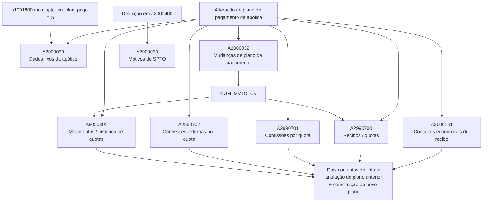

# Alteração de Plano de Pagamento de Apólice — Visão Técnica e Impacto em Tabelas REEF

## 1. Metadados do Documento
- **Arquivo de Origem:** Não identificado no conteúdo extraído
- **Tipo de Documento:** Especificação Técnica
- **Domínio / Sistema:** REEF / Mapfre — Apólices, suplementos e planos de pagamento
- **Público-Alvo:** Desenvolvedores, Arquitetos, Operação e Analistas Funcionais
- **Data/Versão Identificada:** Não identificada
- **Owner identificado:** `user:agonzalez_mapfre.com`
- **Ciclo de vida identificado:** Approved

---

## 2. Resumo Executivo & Contexto de Negócio

O documento descreve a visão técnica do processo de alteração de plano de pagamento de uma apólice. O processo produz movimentos de linhas e, em determinados casos, movimentos de colunas em tabelas relacionadas aos dados fixos da apólice, motivos de suplemento, mudanças de plano de pagamento, conceitos econômicos de recibos, recibos ou quotas, comissões e histórico de quotas.

A alteração do plano de pagamento registra o novo plano em `A2000030.COD_FRACC_PAGO` e grava `TIP_SPTO` como suplemento nominativo com valor `SM`. A tabela `A2000033` é movimentada somente quando existe definição em `a2000400`, registrando os motivos pelos quais o movimento foi realizado.

A tabela `A2000032` centraliza a identificação da alteração de plano de pagamento. O campo `NUM_MVTO_CV` identifica as linhas geradas pela mudança e é referenciado pelas tabelas que possuem a coluna homônima. A nova linha passa a ser vigente (`MCA_VIGENTE = 'S'`), enquanto a linha anterior que estava vigente muda para não vigente (`MCA_VIGENTE = 'N'`).

Para os conceitos econômicos, recibos ou quotas, comissões por quota, comissões externas por quota e histórico de quotas, o documento determina a geração de dois conjuntos de linhas: um conjunto para anular as quotas do plano anterior e outro para constituir as quotas do novo plano. O campo `MCA_CV` diferencia a anulação da quota anterior (`'S'`) das linhas associadas ao novo plano de pagamento (`'N'`).

---

## 3. Arquitetura, Componentes & Tecnologias Envolvidas

O conteúdo não descreve tecnologias, serviços, APIs, contratos HTTP, ambientes, servidores ou ferramentas de integração. A especificação concentra-se no impacto lógico e persistente da alteração de plano de pagamento sobre tabelas do domínio de apólices.

### Componentes e tabelas identificados

| Componente / Tabela | Papel no processo de alteração de plano de pagamento |
| :--- | :--- |
| `A2000030` — Datos Fijos de la Póliza | Registra o novo plano de pagamento e o tipo de suplemento nominativo. |
| `A2000033` — Motivos de SPTO de la Póliza | Registra motivos do movimento quando existir definição em `a2000400`. |
| `A2000032` — Cambios de Plan de Pago de la Póliza | Registra a alteração do plano, o plano anterior, o novo plano e a vigência das linhas. |
| `A2000161` — Conceptos Económicos de Recibo de la Póliza | Gera linhas de anulação das quotas anteriores e de constituição das quotas do novo plano. |
| `A2990700` — Recibos/Cuotas de la Póliza | Gera linhas de anulação e constituição de quotas; referencia o movimento de `A2000032`. |
| `A2990701` — Comisiones por Cuota de la Póliza | Gera linhas de anulação e constituição de comissões por quota. |
| `A2990702` — Comisiones Externas por Cuota de la Póliza | Gera linhas de anulação e constituição de comissões externas por quota. |
| `A5020301` — Movimientos o Histórico de Cuotas | Gera linhas de anulação e constituição no histórico de quotas; referencia o movimento de `A2000032`. |
| `a1001800.mca_spto_en_plan_pago` | Condição para movimento da tabela `A2000030`: valor `'S'`. |
| `a2000400` | Fonte de definição cuja existência condiciona o movimento de `A2000033`. |



> **Nota de Análise:** O documento não detalha os mecanismos técnicos que iniciam a alteração, nem métodos HTTP, APIs, serviços, contratos JSON, transações, chaves primárias, ambientes ou tecnologias de persistência.

---

## 4. Regras de Negócio, Especificações Funcionais & Processos

### 4.1 Regra de movimento da tabela `A2000030`

A tabela `A2000030 — Datos Fijos de la Póliza` é movimentada quando a condição abaixo for atendida:

```text
a1001800.mca_spto_en_plan_pago = 'S'
```

Na alteração de plano de pagamento:

- `COD_FRACC_PAGO` recebe o novo plano de pagamento.
- `TIP_SPTO` é gravado como suplemento nominativo, com valor `SM`.

### 4.2 Regra de movimento da tabela `A2000033`

A tabela `A2000033 — Motivos de SPTO de la Póliza` é movimentada quando houver definição em `a2000400`.

Na movimentação:

- `COD_TIP_SPTO` representa os motivos pelos quais o movimento foi realizado.

> **Nota de Análise:** O documento não informa quais definições podem existir em `a2000400`, nem descreve os valores aceitos para `COD_TIP_SPTO`.

### 4.3 Regras da tabela `A2000032`

A tabela `A2000032 — Cambios de Plan de Pago de la Póliza` é movimentada sempre durante a alteração de plano de pagamento.

As regras identificadas são:

1. `NUM_MVTO_CV` identifica as linhas geradas pela alteração do plano de pagamento.
2. O valor de `NUM_MVTO_CV` é usado nas tabelas que possuem coluna com o mesmo nome.
3. `COD_FRACC_PAGO` representa o novo plano de pagamento.
4. `COD_FRACC_PAGO_ANT` representa o plano de pagamento anterior.
5. A nova linha recebe `MCA_VIGENTE = 'S'`.
6. A linha anterior que possuía `MCA_VIGENTE = 'S'` passa a receber `MCA_VIGENTE = 'N'`.

### 4.4 Regra de geração de dois conjuntos de linhas

As tabelas abaixo são sempre movimentadas e geram dois conjuntos de linhas:

- `A2000161 — Conceptos Económicos de Recibo de la Póliza`
- `A2990700 — Recibos/Cuotas de la Póliza`
- `A2990701 — Comisiones por Cuota de la Póliza`
- `A2990702 — Comisiones Externas por Cuota de la Póliza`
- `A5020301 — Movimientos o Histórico de Cuotas`

Os dois conjuntos de linhas possuem as seguintes finalidades:

| Conjunto de linhas | Finalidade | Valor de `MCA_CV` |
| :--- | :--- | :--- |
| Linhas de anulação | Anular quotas pertencentes ao plano de pagamento anterior. | `'S'` |
| Linhas do novo plano | Constituir quotas pertencentes ao novo plano de pagamento. | `'N'` |

### 4.5 Referência de movimento entre tabelas

Nas tabelas `A2990700` e `A5020301`:

- `NUM_MVTO_CV` identifica as linhas geradas pela alteração de plano de pagamento.
- O valor de `NUM_MVTO_CV` corresponde a `a2000032.num_mvto_cv`.

> **Nota de Análise:** O documento não declara explicitamente se `NUM_MVTO_CV` também é preenchido em `A2000161`, `A2990701` ou `A2990702`; apenas informa que o valor identifica linhas nas tabelas que possuam uma coluna com esse nome.

---

## 5. Tabelas de Parâmetros, Ambientes e Estruturas de Dados

### 5.1 Tabelas impactadas

| Item / Parâmetro | Descrição / Função | Tipo / Valores / Formato | Ambiente / Observações |
| :--- | :--- | :--- | :--- |
| `A2000030` | Dados fixos da apólice. | Tabela de apólice. | Movimentada quando `a1001800.mca_spto_en_plan_pago = 'S'`. |
| `A2000033` | Motivos de suplemento da apólice. | Tabela de motivos. | Movimentada quando há definição em `a2000400`. |
| `A2000032` | Alterações de plano de pagamento da apólice. | Tabela de alterações. | Sempre movimentada. |
| `A2000161` | Conceitos econômicos de recibo da apólice. | Tabela de conceitos econômicos. | Sempre movimentada; gera dois conjuntos de linhas. |
| `A2990700` | Recibos e quotas da apólice. | Tabela de recibos/quotas. | Sempre movimentada; gera dois conjuntos de linhas. |
| `A2990701` | Comissões por quota da apólice. | Tabela de comissões. | Sempre movimentada; gera dois conjuntos de linhas. |
| `A2990702` | Comissões externas por quota da apólice. | Tabela de comissões externas. | Sempre movimentada; gera dois conjuntos de linhas. |
| `A5020301` | Movimentos ou histórico de quotas. | Tabela de histórico. | Sempre movimentada; gera dois conjuntos de linhas. |
| `a1001800` | Origem da condição `mca_spto_en_plan_pago`. | Referência de tabela/estrutura. | O documento não detalha a tabela ou estrutura. |
| `a2000400` | Fonte da definição necessária para movimentar `A2000033`. | Referência de tabela/estrutura. | O documento não detalha o conteúdo da definição. |

### 5.2 Colunas significativas

| Item / Parâmetro | Descrição / Função | Tipo / Valores / Formato | Ambiente / Observações |
| :--- | :--- | :--- | :--- |
| `a1001800.mca_spto_en_plan_pago` | Controla o movimento de `A2000030` no processo. | `'S'` | Quando igual a `'S'`, `A2000030` é movimentada. |
| `A2000030.COD_FRACC_PAGO` | Registra o novo plano de pagamento. | Novo plano de pagamento. | Associado à alteração de plano. |
| `A2000030.TIP_SPTO` | Registra o tipo de suplemento. | `SM` | Gravado como suplemento nominativo. |
| `A2000033.COD_TIP_SPTO` | Registra os motivos do movimento. | Não detalhado. | Movimentação condicionada à definição em `a2000400`. |
| `A2000032.NUM_MVTO_CV` | Identifica linhas geradas pela alteração de plano de pagamento. | Identificador de movimento. | Referenciado por tabelas que possuam coluna de mesmo nome. |
| `A2000032.COD_FRACC_PAGO` | Registra o novo plano de pagamento. | Novo plano de pagamento. | Associado à linha da nova configuração. |
| `A2000032.COD_FRACC_PAGO_ANT` | Registra o plano de pagamento anterior. | Plano de pagamento anterior. | Associado à configuração anterior. |
| `A2000032.MCA_VIGENTE` | Indica vigência da linha de mudança de plano. | `'S'` ou `'N'` | Nova linha: `'S'`; linha anterior vigente: `'N'`. |
| `A2000161.MCA_CV` | Distingue anulação do plano anterior e linha do novo plano. | `'S'` ou `'N'` | `'S'` para anulação; `'N'` para novo plano. |
| `A2990700.MCA_CV` | Distingue anulação do plano anterior e linha do novo plano. | `'S'` ou `'N'` | `'S'` para anulação; `'N'` para novo plano. |
| `A2990700.NUM_MVTO_CV` | Identifica linhas da alteração de plano. | Corresponde a `a2000032.num_mvto_cv`. | Aplicável à tabela de recibos/quotas. |
| `A2990701.MCA_CV` | Distingue anulação do plano anterior e linha do novo plano. | `'S'` ou `'N'` | `'S'` para anulação; `'N'` para novo plano. |
| `A2990702.MCA_CV` | Distingue anulação do plano anterior e linha do novo plano. | `'S'` ou `'N'` | `'S'` para anulação; `'N'` para novo plano. |
| `A5020301.MCA_CV` | Distingue anulação do plano anterior e linha do novo plano. | `'S'` ou `'N'` | `'S'` para anulação; `'N'` para novo plano. |
| `A5020301.NUM_MVTO_CV` | Identifica linhas da alteração de plano. | Corresponde a `a2000032.num_mvto_cv`. | Aplicável ao histórico de quotas. |

### 5.3 Ambientes, URLs e infraestrutura

| Item / Parâmetro | Descrição / Função | Tipo / Valores / Formato | Ambiente / Observações |
| :--- | :--- | :--- | :--- |
| Ambientes | Não identificados. | Não aplicável. | O documento não contém URLs, hosts, portas ou mapeamento de ambientes. |
| APIs / Serviços | Não identificados. | Não aplicável. | O documento não descreve endpoints, métodos HTTP ou contratos de integração. |
| Logs | Não identificados. | Não aplicável. | O documento não informa rotas, níveis ou variáveis de log. |

---

## 6. Bateria de Perguntas & Respostas para RAG (FAQ Sintético)

### P1: Qual é o objetivo técnico da alteração de plano de pagamento de uma apólice?
**R:** A alteração de plano de pagamento movimenta tabelas de apólices, suplementos, mudanças de plano, conceitos econômicos de recibos, recibos ou quotas, comissões e histórico de quotas. O processo registra o novo plano, preserva a referência ao plano anterior, altera a vigência da configuração anterior e gera linhas para anulação das quotas anteriores e constituição das quotas do novo plano.

### P2: Em qual condição a tabela `A2000030` é movimentada?
**R:** A tabela `A2000030 — Datos Fijos de la Póliza` é movimentada quando `a1001800.mca_spto_en_plan_pago = 'S'`.

### P3: Quais valores são gravados em `A2000030` durante a alteração do plano de pagamento?
**R:** Em `A2000030`, a coluna `COD_FRACC_PAGO` registra o novo plano de pagamento. A coluna `TIP_SPTO` é gravada como suplemento nominativo com o valor `SM`.

### P4: Quando a tabela `A2000033 — Motivos de SPTO de la Póliza` é movimentada?
**R:** A tabela `A2000033` é movimentada quando existe definição em `a2000400`. A coluna significativa identificada é `COD_TIP_SPTO`, que contém os motivos pelos quais o movimento foi realizado.

### P5: Como a tabela `A2000032` controla a vigência da mudança de plano de pagamento?
**R:** A nova linha criada em `A2000032` recebe `MCA_VIGENTE = 'S'`. A linha anterior que possuía `MCA_VIGENTE = 'S'` passa a ter `MCA_VIGENTE = 'N'`. Dessa forma, a nova configuração de plano de pagamento passa a ser vigente e a configuração anterior deixa de ser vigente.

### P6: O que representa `NUM_MVTO_CV` em `A2000032`?
**R:** `A2000032.NUM_MVTO_CV` identifica as linhas geradas pela alteração de plano de pagamento. O valor é utilizado para identificar linhas em tabelas que possuem uma coluna com o mesmo nome, incluindo `A2990700` e `A5020301`.

### P7: Quais tabelas sempre geram dois conjuntos de linhas na alteração do plano de pagamento?
**R:** As tabelas `A2000161`, `A2990700`, `A2990701`, `A2990702` e `A5020301` são sempre movimentadas e geram dois conjuntos de linhas: um para anular as quotas do plano de pagamento anterior e outro para constituir as quotas do novo plano de pagamento.

### P8: O que significa `MCA_CV = 'S'` nas tabelas de recibos, quotas, comissões e histórico?
**R:** `MCA_CV = 'S'` indica que a linha está anulando uma quota associada ao plano de pagamento anterior. Esse comportamento é documentado para `A2000161`, `A2990700`, `A2990701`, `A2990702` e `A5020301`.

### P9: O que significa `MCA_CV = 'N'` nas tabelas impactadas?
**R:** `MCA_CV = 'N'` indica que a linha pertence ao novo plano de pagamento. Esse significado é documentado para as linhas geradas em `A2000161`, `A2990700`, `A2990701`, `A2990702` e `A5020301`.

### P10: Como `A2990700.NUM_MVTO_CV` se relaciona com `A2000032.NUM_MVTO_CV`?
**R:** Em `A2990700 — Recibos/Cuotas de la Póliza`, `NUM_MVTO_CV` identifica as linhas geradas pela alteração de plano de pagamento e corresponde ao valor de `a2000032.num_mvto_cv`.

### P11: Como `A5020301.NUM_MVTO_CV` se relaciona com `A2000032.NUM_MVTO_CV`?
**R:** Em `A5020301 — Movimientos o Histórico de Cuotas`, `NUM_MVTO_CV` identifica as linhas geradas na alteração de plano de pagamento e corresponde ao valor de `a2000032.num_mvto_cv`.

### P12: O documento especifica APIs, serviços ou métodos HTTP para alterar o plano de pagamento?
**R:** Não. O conteúdo extraído descreve apenas o impacto lógico e os movimentos em tabelas. Não há especificação de APIs, microsserviços, endpoints, métodos HTTP, contratos JSON, URLs, portas ou tecnologias de integração.

---

## 7. Glossário de Termos, Siglas & Conceitos-Chave

- **Apólice / Póliza:** Entidade de seguro cujos dados, plano de pagamento, recibos, quotas e comissões são movimentados no processo.
- **Plano de pagamento / Plan de pago:** Configuração de pagamento da apólice, registrada em `COD_FRACC_PAGO`.
- **Plano de pagamento anterior:** Configuração anterior, registrada em `COD_FRACC_PAGO_ANT`.
- **SPTO:** Termo presente nos nomes das tabelas e colunas relacionadas a suplemento; o documento não expande a sigla.
- **Suplemento nominativo:** Classificação gravada em `TIP_SPTO` com valor `SM`.
- **`COD_FRACC_PAGO`:** Coluna que registra o novo plano de pagamento.
- **`COD_FRACC_PAGO_ANT`:** Coluna que registra o plano de pagamento anterior.
- **`COD_TIP_SPTO`:** Coluna que registra os motivos pelos quais o movimento foi realizado.
- **`MCA_VIGENTE`:** Indicador de vigência da linha em `A2000032`; a nova linha usa `'S'` e a linha anterior vigente passa a usar `'N'`.
- **`MCA_CV`:** Indicador que distingue linha de anulação do plano anterior (`'S'`) de linha do novo plano (`'N'`).
- **`NUM_MVTO_CV`:** Identificador das linhas geradas na alteração de plano de pagamento.
- **Quota / Cuota:** Unidade de recibo ou parcela da apólice mencionada nas tabelas de recibos, comissões e histórico.
- **REEF:** Nome da área de documentação identificada no conteúdo; o documento não expande a sigla.

---

## 8. Notas Críticas, Riscos & Limitações

- O documento não identifica o nome do arquivo de origem, data, versão, autor formal ou histórico de alterações.
- O documento não detalha o gatilho funcional ou técnico que inicia a alteração de plano de pagamento.
- Não há descrição de APIs, endpoints, métodos HTTP, contratos JSON, microsserviços, filas, integrações ou mecanismos transacionais.
- Não são informados tipos físicos de dados, chaves primárias, chaves estrangeiras, índices, cardinalidades ou regras de integridade das tabelas.
- O conteúdo menciona movimentos de linhas e de colunas, mas não apresenta as situações anterior e posterior que parecem fazer parte da documentação original.
- `A2000033` depende de uma definição em `a2000400`, porém o documento não descreve a estrutura, os critérios ou os valores dessa definição.
- O documento não detalha quais tabelas, além de `A2990700` e `A5020301`, recebem `NUM_MVTO_CV`.
- Não há informações sobre tratamento de erro, reversão, reprocessamento, concorrência, auditoria, logs, monitoramento ou reconciliação das linhas anuladas e constituídas.
- Não há mapeamento de ambientes, URLs, servidores, credenciais, rotas de log ou procedimentos operacionais.

---

## 9. Conteúdo Bruto Estruturado (Referência Fiel)

```text
--- [PÁGINA 1 DE 5] ---

ALTERAR plan pago (visión técnica)
Tablas que intervienen
PÓLIZA
 A2000030: DATOS FIJOS DE LA
PÓLIZA
 CUANDO
a1001800.mca_spto_en_plan_pago = 'S'
 Movimiento de las
 Movimiento de columnas
 A2000033: MOTIVOS DE SPTO DE LA
POLIZA
 CUANDO hay denición en a2000400
 Movimiento de las
 Movimiento de columnas
 A2000032: CAMBIOS DE PLAN DE
PAGO DE LA PÓLIZA
 SIEMPRE
 Movimiento de las
 Movimiento de columnas
 A2000161: CONCEPTOS
ECONÓMICOS DE RECIBO DE LA PÓLIZA
 SIEMPRE. Genera dos juegos de las,
uno con la anulación de las cuotas del
plan de pago anterior y otro con la
constitución de las cuotas del nuevo plan
de pago
 Movimiento de las
 Movimiento de columnas
 A2990700: RECIBOS/CUOTAS DE LA
PÓLIZA
 SIEMPRE. Genera dos juegos de las,
uno con la anulación de las cuotas del
plan de pago anterior y otro con la
constitución de las cuotas del nuevo plan
de pago
 Movimiento de las
 Movimiento de columnas
 A2990701: COMISIONES POR CUOTA
DE LA PÓLIZA
 SIEMPRE. Genera dos juegos de las,
uno con la anulación de las cuotas del
plan de pago anterior y otro con la
constitución de las cuotas del nuevo plan
de pago
 Movimiento de las
 Movimiento de columnas
 A2990702: COMISIONES EXTERNAS
POR CUOTA DE LA PÓLIZA
 SIEMPRE. Genera dos juegos de las,
uno con la anulación de las cuotas del
plan de pago anterior y otro con la
constitución de las cuotas del nuevo plan
de pago
 A5020301: MOVIMIENTOS O
HISTÓRICO DE CUOTAS
 SIEMPRE. Genera dos juegos de las,
uno con la anulación de las cuotas del
plan de pago anterior y otro con la
constitución de las cuotas del nuevo plan
de pago
Documentation / DOCUMENTACIÓN Reef
DOCUMENTACIÓN Reef
Mapfredocument
DOCUMENTACIÓN Reef
Owner
user:agonzalez_mapfre.com
Lifecycle
Approved Source
 / 
 VL
Buscar Inicio Soluciones Arquitecturas APIs Componentes Cloud Documentación Zeus Reef Ayuda
ES


--- [PÁGINA 2 DE 5] ---

Movimiento de las
 Movimiento de columnas
 Movimiento de las
 Movimiento de columnas
A2000030 - DATOS FIJOS DE LA PÓLIZA
A2000030 - Movimiento de las
Situación anterior al movimiento
Situación posterior al movimiento
A2000030 - Columnas signicativas en el movimiento
COLUMNA COMENTARIO
COD_FRACC_PAGO Nuevo plan de pago
TIP_SPTO Se graba como suplemento nominativo (SM)
Volver al comienzo
A2000033 - MOTIVOS DE SPTO DE LA POLIZA
A2000033 - Movimiento de las
Situación anterior al movimiento
Situación posterior al movimiento
A2000033 - Columnas signicativas en el movimiento
COLUMNA COMENTARIO
COD_TIP_SPTO Motivos por los que se realizó el movimiento
Volver al comienzo
A2000032 - CAMBIOS DE PLAN DE PAGO DE LA PÓLIZA
A2000032 - Movimiento de las
Situación anterior al movimiento
Situación posterior al movimiento
A2000032 - Columnas signicativas en el movimiento


--- [PÁGINA 3 DE 5] ---

COLUMNA COMENTARIO
NUM_MVTO_CV El valor identica las las generadas por el cambio de plan de pago en las tablas con la comumna del
mismo nombre
COD_FRACC_PAGO Nuevo plan de pago
COD_FRACC_PAGO_ANT Anterior plan de pago
MCA_VIGENTE La nueva la toma el valor 'S', la anterior con valor 'S' pasa a valor 'N'
Volver al comienzo
A2000161 - CONCEPTOS ECONÓMICOS DE RECIBO DE LA PÓLIZA
A2000161 - Movimiento de las
Situación anterior al movimiento
Situación posterior al movimiento
A2000161 - Columnas signicativas en el movimiento
COLUMNA COMENTARIO
MCA_CV Contiene el valor 'S' cuando la la está anulando a una cuota del plan de pago anterior. Si la la pertenece al nuevo plan
de pago, el valor es 'N'
Volver al comienzo
A2990700 - RECIBOS/CUOTAS DE LA PÓLIZA
A2990700 - Movimiento de las
Situación anterior al movimiento
Situación posterior al movimiento
A2990700 - Columnas signicativas en el movimiento


--- [PÁGINA 4 DE 5] ---

COLUMNA COMENTARIO
MCA_CV Contiene el valor 'S' cuando la la está anulando a una cuota del plan de pago anterior. Si la la pertenece al
nuevo plan de pago, el valor es 'N'
NUM_MVTO_CV Identica la las generadas en el cambio de plan de pago y corresponde al valor de a2000032.num_mvto_cv
Volver al comienzo
A2990701 - COMISIONES POR CUOTA DE LA PÓLIZA
A2990701 - Movimiento de las
Situación anterior al movimiento
Situación posterior al movimiento
A2990701 - Columnas signicativas en el movimiento
COLUMNA COMENTARIO
MCA_CV Contiene el valor 'S' cuando la la está anulando a una cuota del plan de pago anterior. Si la la pertenece al nuevo plan
de pago, el valor es 'N'
Volver al comienzo
A2990702 - COMISIONES EXTERNAS POR CUOTA DE LA PÓLIZA
A2990702 - Movimiento de las
Situación anterior al movimiento
Situación posterior al movimiento
A2990702 - Columnas signicativas en el movimiento
COLUMNA COMENTARIO
MCA_CV Contiene el valor 'S' cuando la la está anulando a una cuota del plan de pago anterior. Si la la pertenece al nuevo plan
de pago, el valor es 'N'
Volver al comienzo
A5020301 - MOVIMIENTOS O HISTÓRICO DE CUOTAS
A5020301 - Movimiento de las
Situación anterior al movimiento


--- [PÁGINA 5 DE 5] ---

Situación posterior al movimiento
A5020301 - Columnas signicativas en el movimiento
COLUMNA COMENTARIO
MCA_CV Contiene el valor 'S' cuando la la está anulando a una cuota del plan de pago anterior. Si la la pertenece al
nuevo plan de pago, el valor es 'N'
NUM_MVTO_CV Identica la las generadas en el cambio de plan de pago y corresponde al valor de a2000032.num_mvto_cv
Volver al comienzo
```
