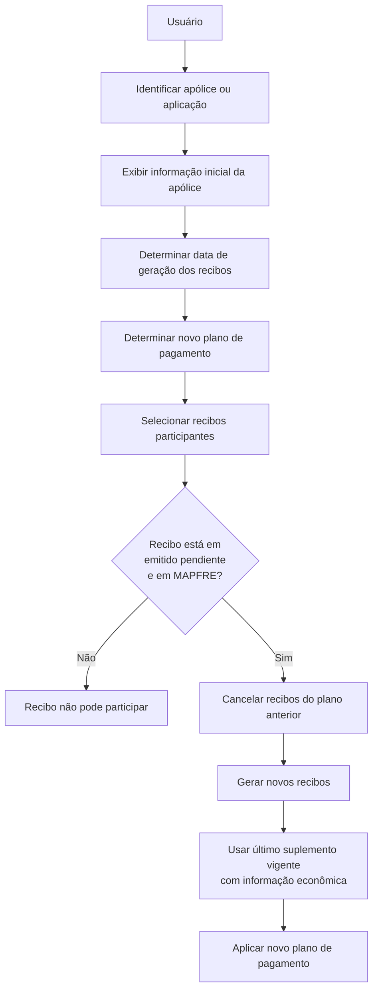

# Alterar Póliza: Plano de Pagamento — Visão Técnica

## 1. Metadados do Documento
- **Arquivo de Origem:** Não identificado; conteúdo fornecido com o título “ALTERAR Póliza plan pago (enlace con visión técnica)”
- **Tipo de Documento:** Procedimento / Especificação Funcional
- **Domínio / Sistema:** MAPFRE; gestão de apólices/aplicações, recibos e planos de pagamento
- **Público-Alvo:** Negócio, operação, analistas funcionais e desenvolvedores
- **Data/Versão Identificada:** Não identificada

---

## 2. Resumo Executivo & Contexto de Negócio

O documento descreve a operação de alteração do plano de pagamento de uma apólice ou aplicação. A operação permite refinanciar uma dívida e/ou modificar o plano de pagamento aplicável, preservando restrições explícitas sobre quais informações da apólice podem ser modificadas.

A alteração do plano de pagamento não permite modificar outros dados da apólice, exceto o gestor de cobrança. O processo inclui o cancelamento dos recibos pertencentes ao plano anterior e a geração de novos recibos de acordo com a definição do novo plano de pagamento.

Os novos recibos são gerados no último suplemento vigente que tenha gerado informação econômica. O usuário pode selecionar livremente quais recibos participarão da operação; portanto, a refinanciação pode abranger parte ou a totalidade da dívida existente.

A condição operacional essencial é que cada recibo selecionado esteja na situação **emitido pendiente** e se encontre em **MAPFRE**. Recibos em situação diferente não podem participar da alteração do plano de pagamento.

---

## 3. Arquitetura, Componentes & Tecnologias Envolvidas

O conteúdo menciona os componentes funcionais abaixo, sem apresentar detalhes sobre tecnologias, APIs, contratos HTTP, persistência de dados, microsserviços ou ambientes técnicos.

- **Apólice / Aplicação:** entidade sobre a qual a operação é realizada.
- **Plano de pagamento atual:** plano associado aos recibos existentes antes da alteração.
- **Novo plano de pagamento:** definição usada para gerar os novos recibos.
- **Recibos:** documentos financeiros selecionáveis pelo usuário para composição da dívida refinanciada.
- **Último suplemento vigente com informação econômica:** contexto em que os novos recibos são gerados.
- **MAPFRE:** sistema ou contexto no qual o recibo deve estar presente para participar.
- **Gestor de cobrança:** única informação da apólice que pode ser alterada além da mudança do plano de pagamento.



> **Nota de Análise:** O documento não detalha métodos HTTP, APIs, contratos JSON, banco de dados, tecnologias de implementação, responsáveis pelo cancelamento, regras de cálculo financeiro ou tratamento de falhas.

---

## 4. Regras de Negócio, Especificações Funcionais & Processos

### Operação permitida

A operação permite:

1. Refinanciar uma dívida associada a uma apólice ou aplicação.
2. Alterar o plano de pagamento de uma apólice ou aplicação.
3. Selecionar livremente os recibos que participarão do novo plano de pagamento.
4. Financiar parte ou a totalidade da dívida.
5. Cancelar os recibos pertencentes ao plano de pagamento anterior.
6. Gerar novos recibos conforme a definição do novo plano de pagamento.
7. Alterar o gestor de cobrança, indicado como exceção à restrição de alteração de dados da apólice.

### Restrições de alteração

- Não é possível modificar outro tipo de informação da apólice além do plano de pagamento.
- A única exceção explicitamente indicada é o **gestor de cobrança**.
- A operação não exige que todos os recibos do plano atual participem do novo plano.
- Recibos do plano de pagamento atual podem permanecer fora da operação.

### Critério de elegibilidade de recibos

Para que um recibo possa participar:

1. O recibo deve estar na situação **emitido pendiente**.
2. O recibo deve estar em **MAPFRE**.
3. Se a situação for diferente, o recibo não poderá participar da operação.

### Geração de novos recibos

- Os recibos do plano anterior são cancelados quando pertencem à operação.
- Os novos recibos seguem a definição do novo plano de pagamento.
- Os novos recibos são gerados no último suplemento vigente que tenha produzido informação econômica.

### Sequência funcional apresentada

1. Identificar a apólice ou aplicação.
2. Apresentar a informação inicial da apólice.
3. Determinar a data de geração dos recibos.
4. Determinar o novo plano de pagamento.
5. Selecionar os recibos que participarão do novo plano de pagamento.
6. Apresentar a informação final da apólice, identificada como opção econômica.

---

## 5. Tabelas de Parâmetros, Ambientes e Estruturas de Dados

| Item / Parâmetro | Descrição / Função | Tipo / Valores / Formato | Ambiente / Observações |
| :--- | :--- | :--- | :--- |
| Apólice / Aplicação | Entidade identificada para alteração do plano de pagamento. | Não detalhado | A operação inicia pela identificação da apólice ou aplicação. |
| Plano de pagamento atual | Plano associado aos recibos existentes antes da operação. | Não detalhado | Recibos participantes pertencentes ao plano anterior são cancelados. |
| Novo plano de pagamento | Definição usada para gerar os novos recibos. | Não detalhado | Deve ser determinado durante o processo. |
| Recibos selecionados | Recibos cujos valores passarão ao novo plano de pagamento. | Seleção livre pelo usuário, sujeita à elegibilidade | Podem representar parte ou toda a dívida. |
| Situação do recibo | Estado obrigatório para participação na operação. | `emitido pendiente` | Qualquer situação diferente impede a participação. |
| Presença em MAPFRE | Condição adicional para participação do recibo. | Recibo deve encontrar-se em MAPFRE | Não detalha como essa presença é validada. |
| Data de geração de recibos | Data definida no fluxo antes da seleção dos recibos. | Não detalhado | Não há regra de cálculo ou validação apresentada. |
| Último suplemento vigente | Suplemento utilizado para criação dos novos recibos. | Deve ter gerado informação econômica | Não há critério adicional para determinar o suplemento. |
| Gestor de cobrança | Informação excepcionalmente modificável na apólice. | Não detalhado | Única alteração adicional explicitamente permitida. |
| Informação de apólice inicial | Informação básica da apólice antes da operação. | Não detalhado | Bloco funcional do fluxo. |
| Informação de apólice final | Informação associada à opção econômica após a operação. | Opção econômica | Detalhamento não fornecido. |

---

## 6. Bateria de Perguntas & Respostas para RAG (FAQ Sintético)

### P1: Em que consiste a operação de alterar o plano de pagamento de uma apólice?
**R:** A operação permite refinanciar e/ou alterar o plano de pagamento de uma apólice ou aplicação. Ela cancela os recibos participantes do plano anterior e gera novos recibos conforme a definição do novo plano de pagamento.

### P2: É possível modificar qualquer informação da apólice durante a alteração do plano de pagamento?
**R:** Não. O documento informa que não é possível modificar outro tipo de informação da apólice, exceto o gestor de cobrança.

### P3: Todos os recibos do plano de pagamento atual devem participar da operação?
**R:** Não. O usuário possui liberdade para selecionar os recibos que participarão. A operação pode refinanciar parte ou a totalidade da dívida, permitindo que alguns recibos do plano atual permaneçam fora do novo plano.

### P4: Qual situação um recibo deve ter para participar do novo plano de pagamento?
**R:** O recibo deve estar na situação `emitido pendiente`. Além disso, o recibo deve encontrar-se em MAPFRE. Se a situação for diferente, o recibo não pode participar da operação.

### P5: O que acontece com os recibos pertencentes ao plano de pagamento anterior?
**R:** Os recibos pertencentes ao plano anterior que participam da operação são cancelados. Em seguida, novos recibos são gerados de acordo com a definição do novo plano de pagamento.

### P6: Em qual suplemento são gerados os novos recibos?
**R:** Os novos recibos são gerados no último suplemento vigente que tenha gerado informação econômica.

### P7: Qual é a sequência funcional apresentada para alterar o plano de pagamento?
**R:** A sequência apresentada é: identificar a apólice ou aplicação; consultar a informação inicial da apólice; determinar a data de geração dos recibos; determinar o novo plano de pagamento; selecionar os recibos participantes; e consultar a informação final da apólice, indicada como opção econômica.

### P8: A operação pode ser usada para financiar somente uma parcela da dívida?
**R:** Sim. O documento indica que há liberdade para selecionar os recibos cujos valores passarão ao novo plano de pagamento. Portanto, a operação pode financiar parte ou a totalidade da dívida.

### P9: O documento especifica APIs, métodos HTTP ou contratos técnicos para a operação?
**R:** Não. O documento apresenta a visão funcional do processo, mas não detalha métodos HTTP, endpoints, contratos JSON, APIs, tecnologias de implementação ou modelo de dados.

### P10: O que ocorre se um recibo estiver em uma situação diferente de `emitido pendiente`?
**R:** O recibo não pode participar da operação de alteração do plano de pagamento.

---

## 7. Glossário de Termos, Siglas & Conceitos-Chave

- **Apólice:** entidade de seguro ou aplicação identificada para alteração do plano de pagamento.
- **Plano de pagamento:** definição que estabelece a geração dos recibos associados à apólice ou aplicação.
- **Recibo:** documento financeiro selecionável para composição da dívida submetida ao novo plano de pagamento.
- **Emitido pendiente:** situação obrigatória para um recibo poder participar da operação.
- **MAPFRE:** contexto ou sistema no qual o recibo deve encontrar-se para ser elegível.
- **Suplemento vigente:** suplemento ativo utilizado como base para geração dos novos recibos, desde que tenha gerado informação econômica.
- **Informação econômica:** informação cuja geração no suplemento vigente é exigida para criar novos recibos.
- **Gestor de cobrança:** informação da apólice explicitamente indicada como exceção à restrição de alteração.

---

## 8. Notas Críticas, Riscos & Limitações

- O documento não especifica como validar tecnicamente que um recibo está em MAPFRE.
- O documento não define o significado operacional detalhado da situação `emitido pendiente`.
- Não há detalhamento sobre cálculo de valores, juros, parcelamento, datas de vencimento ou regras financeiras do novo plano de pagamento.
- Não são apresentados mecanismos de reversão, auditoria, autorização, concorrência ou tratamento de falhas no cancelamento e na geração de recibos.
- Não há especificação de APIs, integrações, modelos de dados, ambientes, URLs, logs ou contratos técnicos.
- A expressão “opção econômica”, associada à informação final da apólice, não possui detalhamento adicional no conteúdo fornecido.

---

## 9. Conteúdo Bruto Estruturado (Referência Fiel)

```text
--- [PÁGINA 1 DE 1] ---

ALTERAR Póliza plan pago (enlace con visión técnica)

¿En qué consiste?
Esta operación permite la refinanciación y/o cambio en el plan de pago de una póliza o aplicación. No es posible modificar otro tipo de
información de la póliza (salvo el gestor de cobro). Además, realiza la cancelación de los recibos pertenecientes al anterior plan de pago y la
generación de los recibos atendiendo a la definición del plan de pago nuevo. Los nuevos recibos los genera en el último suplemento vigente
que generó información económica. Esta operación se realiza sobre los recibos que el usuario seleccione. Es decir, hay libertad en la elección
de recibos, cuyos importes pasarán al nuevo plan de pago. Puede que haya recibos del actual plan de pago que no intervengan en la
operación, ya que la idea es que exista la posibilidad de financiar parte o la totalidad de la deuda.

Premisas
Para que un recibo pueda intervenir, debe encontrarse en situación emitido pendiente. Es decir, el recibo debe encontrarse en MAPFRE. Si la
situación es distinta, ese recibo no podrá participar en la operación.

Proceso a seguir
En este apartado se enumeran los bloques de información y el orden en el que aparecerán.

Identificar póliza/aplicación
Determinar fecha de generación de recibos
Determinar nuevo plan de pago
Seleccionar los recibos que intervienen en el nuevo plan de pago

ELECCIÓN DE PÓLIZA
Selección de la póliza a modificar

INFORMACIÓN DE PÓLIZA (INICIAL)
Información básica de la póliza

INFORMACIÓN DE PÓLIZA (FINAL)
Opción económica

Ejemplo:

Documentation / DOCUMENTACIÓN Reef
DOCUMENTACIÓN Reef
Mapfredocument
DOCUMENTACIÓN Reef

Owner
user:agonzalez_mapfre.com

Lifecycle
Approved Source / VL

Buscar Inicio Soluciones Arquitecturas APIs Componentes Cloud Documentación Zeus Reef Ayuda
ES
```
