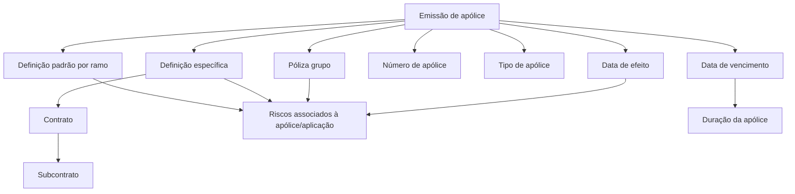

# Documentação REEF — Informações Básicas para Emissão de Apólice

## 1. Metadados do Documento
- **Arquivo de Origem:** Não identificado no conteúdo fornecido
- **Tipo de Documento:** Manual Operacional
- **Domínio / Sistema:** REEF / Mapfre — emissão de apólices
- **Público-Alvo:** Negócio, Operação, Analistas Funcionais e Desenvolvedores
- **Data/Versão Identificada:** Não identificada

---

## 2. Resumo Executivo & Contexto de Negócio

O documento descreve a seção de **informações básicas** utilizada durante a emissão de uma apólice no contexto do sistema REEF. Essa seção concentra definições que determinam se a apólice utilizará uma definição padrão por ramo ou uma definição específica associada a contrato ou subcontrato.

As informações básicas influenciam todos os riscos que podem ser associados à apólice ou aplicação. Entre as definições apresentadas estão a associação da apólice a um grupo, a identificação de condições especiais por contrato, condições específicas por subcontrato e o identificador da apólice emitida.

O processo também estabelece atributos temporais de cobertura: a data de efeito representa o início da cobertura ao risco ou aos riscos, enquanto a data de vencimento representa o término da vigência e influencia a duração da apólice.

O campo **tipo de apólice** é apresentado como um atributo específico de transportes. Para ramos que possuem tratamento distinto, o valor informado para o tipo de apólice é **“FIJO”**. O conteúdo fornecido não detalha regras adicionais de validação, métodos de integração, contratos técnicos ou valores permitidos para os demais campos.

---

## 3. Arquitetura, Componentes & Tecnologias Envolvidas

### Sistemas, domínios e elementos identificados

| Componente / Termo | Papel identificado no documento |
| :--- | :--- |
| REEF | Sistema ou domínio documental mencionado como “DOCUMENTACIÓN Reef”. |
| Mapfre | Contexto corporativo indicado pela referência `Mapfredocument` e pelo proprietário com domínio `mapfre.com`. |
| Apólice | Entidade em emissão cujas informações básicas são definidas. |
| Ramo | Origem possível da definição padrão aplicada à apólice. |
| Contrato | Elemento que identifica condições especiais para a apólice. |
| Subcontrato | Elemento que estabelece condições específicas para um contrato selecionado. |
| Risco | Elemento associado à apólice/aplicação e afetado pelas informações básicas. |
| Póliza grupo | Indicador de adesão da apólice a um grupo. |
| Tipo de apólice | Atributo específico de transportes; para ramos com tratamento distinto, recebe o valor `FIJO`. |



**Nota de Análise:** O conteúdo descreve relações funcionais entre emissão de apólice, ramo, contrato, subcontrato, riscos e datas de vigência. O documento não apresenta arquitetura de infraestrutura, APIs, microsserviços, protocolos, bancos de dados, URLs de ambiente ou tecnologias de implementação.

---

## 4. Regras de Negócio, Especificações Funcionais & Processos

### Processo descrito

1. Durante a emissão da apólice, deve-se definir se será utilizada uma definição padrão associada ao ramo ou uma definição específica associada a contrato ou subcontrato.
2. A informação definida nessa etapa afeta todos os possíveis riscos associados à apólice ou à aplicação.
3. Deve-se indicar se a apólice em emissão adere a um grupo por meio do campo **Póliza grupo**.
4. Deve-se identificar se a apólice possui condições especiais por meio do campo **Contrato**.
5. Se houver contrato selecionado, o campo **Subcontrato** pode estabelecer condições específicas para esse contrato.
6. O campo **Nº de póliza** contém o identificador da apólice em emissão. Esse número pode ser obtido automaticamente ou ter sido reservado previamente.
7. O campo **Tipo de póliza** é específico de transportes. Para ramos com tratamento distinto, o valor do tipo de apólice é `FIJO`.
8. A **Fecha de efecto** indica a data de início da cobertura para o risco ou os riscos. A data de efeito pode ser limitada mediante definição.
9. A **Fecha de vencimiento** indica a data de término da apólice e também influencia a duração da apólice.

### Restrições e condições explícitas

| Regra / Condição | Descrição |
| :--- | :--- |
| Definição de apólice | A apólice pode utilizar uma definição padrão por ramo ou uma definição específica por contrato ou subcontrato. |
| Impacto sobre riscos | As informações básicas afetam todos os possíveis riscos associados à apólice/aplicação. |
| Subcontrato condicionado ao contrato | A definição de condições específicas por subcontrato é possível quando um contrato foi selecionado. |
| Origem do número de apólice | O número de apólice pode ser atribuído automaticamente ou ter sido reservado previamente. |
| Tipo de apólice para transportes | O tipo de apólice é um atributo específico de transportes. |
| Tipo de apólice para ramos distintos | Para ramos com tratamento distinto, o valor é `FIJO`. |
| Limitação da data de efeito | A data de efeito pode ser limitada mediante definição. |
| Influência da data de vencimento | A data de vencimento influencia a duração da apólice. |

**Nota de Análise:** O documento não especifica quais definições podem limitar a data de efeito, nem apresenta critérios de cálculo da duração da apólice, regras de obrigatoriedade dos campos, formatos de datas ou valores possíveis para Póliza grupo, Contrato e Subcontrato.

---

## 5. Tabelas de Parâmetros, Ambientes e Estruturas de Dados

| Item / Parâmetro | Descrição / Função | Tipo / Valores / Formato | Ambiente / Observações |
| :--- | :--- | :--- | :--- |
| Póliza grupo | Especifica se a apólice a ser emitida adere a um grupo ou não. | Não detalhado. | Relacionado à emissão da apólice. |
| Contrato | Identifica se a apólice possui condições especiais. | Não detalhado. | Pode habilitar a utilização de Subcontrato. |
| Subcontrato | Estabelece condições específicas para o contrato informado. | Não detalhado. | Possível quando um contrato foi selecionado. |
| Nº de póliza | Contém o identificador da apólice em emissão. | Número atribuído automaticamente ou reservado previamente. | Não há formato, comprimento ou regra de unicidade descritos. |
| Tipo de póliza | Atributo específico de transportes. | Para ramos com tratamento distinto: `FIJO`. | Outros valores não são detalhados. |
| Fecha de efecto | Define a data de início da cobertura ao risco ou riscos. | Data; formato não detalhado. | Pode ser limitada mediante definição. |
| Fecha de vencimiento | Define a data de vencimento da apólice. | Data; formato não detalhado. | Influi na duração da apólice. |
| Owner | Proprietário indicado no conteúdo documental. | `user:agonzalez_mapfre.com` | Metadado exibido na fonte. |
| Lifecycle | Estado do ciclo de vida exibido na fonte. | `Approved` | Não há detalhamento do fluxo de aprovação. |

---

## 6. Bateria de Perguntas & Respostas para RAG (FAQ Sintético)

### P1: Qual é o objetivo das informações básicas durante a emissão de uma apólice?
**R:** As informações básicas definem se a apólice utilizará uma definição padrão associada ao ramo ou uma definição específica associada a contrato ou subcontrato. Essas informações afetam todos os possíveis riscos vinculados à apólice ou à aplicação.

### P2: O que o campo Póliza grupo informa?
**R:** O campo **Póliza grupo** especifica se a apólice que será emitida adere a um grupo ou não. O documento não detalha os valores permitidos, o formato do campo ou efeitos adicionais da adesão ao grupo.

### P3: Para que serve o campo Contrato na emissão de uma apólice?
**R:** O campo **Contrato** identifica se a apólice possui condições especiais. O conteúdo fornecido não especifica quais condições especiais podem ser aplicadas nem como elas são configuradas.

### P4: Quando o Subcontrato pode ser utilizado?
**R:** O **Subcontrato** pode estabelecer condições específicas para um determinado contrato. Segundo o documento, essa possibilidade existe quando um contrato foi selecionado.

### P5: Como o número da apólice pode ser obtido?
**R:** O campo **Nº de póliza** contém o identificador da apólice que está sendo emitida. Esse número pode ser tomado de forma automática ou pode ter sido reservado previamente.

### P6: Qual é a regra para o Tipo de póliza em ramos com tratamento distinto?
**R:** O documento informa que o tipo de apólice é um atributo específico de transportes. Para ramos com tratamento distinto, o valor do campo é `FIJO`.

### P7: O que representa a Fecha de efecto da apólice?
**R:** A **Fecha de efecto** especifica a data em que começa a cobertura para o risco ou os riscos. A data de efeito pode ser limitada mediante definição, mas o documento não detalha quais definições ou critérios realizam essa limitação.

### P8: Qual é a função da Fecha de vencimiento?
**R:** A **Fecha de vencimiento** contém a data em que a apólice vence. Além de indicar o fim da vigência, essa data influencia a duração da apólice.

### P9: Quais informações podem afetar os riscos associados a uma apólice?
**R:** As informações básicas definidas no processo de emissão afetam todos os possíveis riscos associados à apólice ou à aplicação. O documento relaciona essa etapa à escolha entre definições por ramo, contrato ou subcontrato.

### P10: O documento descreve APIs ou contratos JSON para emissão de apólices?
**R:** Não. O documento fornecido descreve campos e regras funcionais de informações básicas para emissão de apólice, mas não detalha métodos HTTP, endpoints, contratos JSON, integrações ou microsserviços.

### P11: O documento informa o formato das datas de efeito e vencimento?
**R:** Não. O texto descreve o significado funcional das datas de efeito e vencimento, mas não informa formato de entrada, fuso horário, calendário aplicável ou validações entre as datas.

### P12: Quem é o proprietário indicado na fonte documental?
**R:** A fonte exibida no conteúdo apresenta o metadado `Owner` com o valor `user:agonzalez_mapfre.com`.

---

## 7. Glossário de Termos, Siglas & Conceitos-Chave

- **REEF:** Sistema ou domínio mencionado nas referências “DOCUMENTACIÓN Reef” e “Documentation / DOCUMENTACIÓN Reef”. O documento não expande a sigla.
- **Apólice / Póliza:** Entidade que está sendo emitida e para a qual são definidos grupo, contrato, subcontrato, número, tipo e vigência.
- **Ramo:** Referência utilizada para a definição padrão aplicável à apólice.
- **Contrato:** Elemento que identifica condições especiais para a apólice.
- **Subcontrato:** Elemento que pode estabelecer condições específicas para um contrato selecionado.
- **Póliza grupo:** Campo que informa se a apólice emitida adere a um grupo.
- **Nº de póliza:** Identificador da apólice em emissão.
- **Tipo de póliza:** Atributo específico de transportes; para ramos com tratamento distinto, recebe o valor `FIJO`.
- **Fecha de efecto:** Data de início da cobertura ao risco ou aos riscos.
- **Fecha de vencimiento:** Data de vencimento da apólice, que também influencia sua duração.
- **FIJO:** Valor indicado para o tipo de apólice em ramos com tratamento distinto. O documento não fornece tradução ou semântica adicional para o termo.

---

## 8. Notas Críticas, Riscos & Limitações

- O conteúdo fornecido é limitado a duas páginas e não identifica o nome do arquivo original, data, versão ou autoria documental além do metadado `Owner`.
- Não são apresentados valores permitidos, tipos de dados, obrigatoriedade, máscaras de preenchimento ou validações para Póliza grupo, Contrato, Subcontrato e Nº de póliza.
- O documento não detalha a regra que limita a data de efeito.
- O documento informa que a data de vencimento influencia a duração da apólice, mas não explica a fórmula ou os critérios para determinar essa duração.
- Não há detalhamento de arquitetura técnica, APIs, persistência, segurança, tratamento de erros, integrações, servidores, ambientes ou rotas de logs.
- O termo `FIJO` é apresentado como valor para ramos com tratamento distinto, sem explicação adicional de seu significado operacional.
- O texto extraído contém caracteres possivelmente corrompidos, como `denición`, `identica` e `inuye`; a interpretação funcional foi preservada sem alterar os trechos brutos de referência.

---

## 9. Conteúdo Bruto Estruturado (Referência Fiel)

```text
--- [PÁGINA 1 DE 2] ---

INFORMACIÓN BÁSICA
¿En que consiste?
Lugar donde se decide utilizar la denición estándar (ramo) o especíca (contrato o sub-contrato), además de determinar el efecto y el
vencimiento de la póliza. Esta información afecta a todos los posibles riesgos que se asocien a la póliza/aplicación.
Proceso a seguir
A continuación detalla las información requerida.
Póliza grupo (   )
Especica si la póliza que se va a emitir se adhiere a un grupo o no.
Contrato (   )
Identica si la póliza tiene condiciones especiales.
Subcontrato (   )
Establece si la póliza tiene condiciones especícas para el contrato dado. Esto es posible si se ha seleccionado un contrato.
Nº de póliza (   )
Contiene el identicador de la póliza que se está emitiendo. Este número puede ser tomado de forma automática o puede haber sido
reservado previamente.
Tipo de póliza (   )
Documentation / DOCUMENTACIÓN Reef
DOCUMENTACIÓN Reef
Mapfredocument
DOCUMENTACIÓN Reef
Owner
user:agonzalez_mapfre.com
Lifecycle
Approved Source
 / 
 VL
Buscar Inicio Soluciones Arquitecturas APIs Componentes Cloud Documentación Zeus Reef Ayuda
ES


--- [PÁGINA 2 DE 2] ---

Este tipo es un atributo especíco de trasportes. Para los ramos con un tratamiento distinto, el valor es "FIJO".
Fecha de efecto (  )
Especica la fecha en la que comienza la cobertura al riesgo (o riesgos). Esta fecha puede limitarse mediante denición.
Fecha de vencimiento (  )
Contiene la fecha en la que la póliza vence. Adicionalmente, testa fecha inuye en la duración de la póliza.
```
