# Documentação Reef — Informações Gerais, Renovação, Revalorização e Resseguro de Apólices

## 1. Metadados do Documento
- **Arquivo de Origem:** Não identificado no conteúdo extraído
- **Tipo de Documento:** Manual Operacional
- **Domínio / Sistema:** Reef / Reef.core / Mapfre
- **Público-Alvo:** Negócio, Operação, Analistas Funcionais e Desenvolvedores
- **Data/Versão Identificada:** Não identificada

---

## 2. Resumo Executivo & Contexto de Negócio

O documento descreve campos de configuração e informação geral aplicáveis à emissão de apólices no contexto do sistema Reef, incluindo referências explícitas ao Reef.core e à documentação corporativa Mapfre. Os campos apresentados influenciam características econômicas, vigência, renovação, revalorização, cálculo de prêmio e resseguro.

A moeda selecionada para a apólice estabelece a divisa usada por elementos econômicos relevantes, incluindo capitais de cobertura, franquias elegíveis, conceitos de detalhamento, comissões, conceitos econômicos e recibos. O tipo de câmbio representa a conversão entre a moeda da apólice e a moeda do país, afetando toda a informação econômica da apólice.

A configuração de renovação define se a duração da apólice é anual prorrogável ou temporária renovável, segundo critérios relacionados à duração entre a data de efeito e a data de vencimento. Também é possível definir o número máximo de renovações; o valor padrão zero permite renovação indefinida até o cancelamento da apólice.

O documento também apresenta controles para revalorização, cálculo manual de prêmio e cálculo proporcional ao período de vigência. Por fim, descreve campos informativos gerais e controles de resseguro, incluindo modalidade de participação da MAPFRE, distribuição manual de resseguro e distribuição baseada em uma apólice marco para aplicações.

---

## 3. Arquitetura, Componentes & Tecnologias Envolvidas

### Sistemas e componentes identificados

| Componente / Termo | Descrição fundamentada no documento |
| :--- | :--- |
| Reef | Sistema/documentação corporativa no qual são apresentados os campos de informação geral da apólice. |
| Reef.core | Componente citado como não realizando exploração dos campos “Tipo de negócio” e “Tipo de envio”. |
| Mapfre | Contexto corporativo referenciado pela documentação e pelo identificador de MAPFRE Global Risks. |
| MAPFRE Global Risks | Entidade mencionada como destinatária do identificador associado ao campo “Tipo de negócio”. |
| Documentação Reef | Área de documentação corporativa mostrada no conteúdo bruto. |
| Apólice | Entidade principal configurada pelos campos de moeda, renovação, revalorização, prêmio, dados gerais e resseguro. |
| Cobertura | Elemento da apólice cujo capital, franquia e revalorização podem ser afetados pelos parâmetros descritos. |
| Aplicação | Entidade para a qual o campo “Resseguro marco” é exclusivo. |
| Apólice marco | Apólice de referência cuja distribuição de resseguro pode ser usada na emissão de uma aplicação. |

### Fluxo funcional identificado

```mermaid
graph TD
  A[Emissão ou configuração de apólice] --> B[Definir moeda da apólice]
  B --> B1[Capitais de cobertura]
  B --> B2[Franquias elegíveis]
  B --> B3[Conceitos de detalhamento]
  B --> B4[Comissões]
  B --> B5[Conceitos econômicos]
  B --> B6[Recibos]

  A --> C[Definir tipo de câmbio]
  C --> C1[Afeta informação econômica da apólice]

  A --> D[Configurar renovação]
  D --> D1[Anual prorrogável]
  D --> D2[Temporal renovável por temporalidade]
  D --> D3[Temporal renovável por periodicidade]
  D --> D4[Definir número máximo de renovações]

  A --> E[Configurar revalorização e prêmio]
  E --> E1[Ativar ou não revalorização]
  E --> E2[Selecionar tipo de revalorização]
  E --> E3[Definir porcentagem ou índice]
  E --> E4[Definir cálculo manual ou automático]
  E --> E5[Definir cálculo a prorrata ou escala]

  A --> F[Configurar resseguro]
  F --> F1[Tipo de resseguro]
  F --> F2[Distribuição manual]
  F --> F3[Distribuição conforme apólice marco]
```



> **Nota de Análise:** O conteúdo não descreve arquitetura técnica de infraestrutura, APIs, contratos JSON, métodos HTTP, bancos de dados, servidores, URLs de ambiente, mecanismos de autenticação ou integrações entre sistemas.

---

## 4. Regras de Negócio, Especificações Funcionais & Processos

### 4.1 Moeda da apólice

A moeda estabelece a divisa da apólice e influencia diversos conceitos:

1. Os capitais das coberturas contratadas são expressos na moeda selecionada quando não estiverem fixados em outra moeda.
2. As franquias de cobertura são expressas na moeda da apólice quando tiverem sido definidas com essa característica.
3. Os conceitos de detalhamento são apurados na moeda declarada.
4. As comissões são apuradas na moeda declarada.
5. Os conceitos econômicos são calculados de acordo com o valor da moeda.
6. Os recibos são gerados na moeda da apólice.

### 4.2 Tipo de câmbio

O tipo de câmbio mostra o valor de conversão entre a moeda escolhida para a apólice e a moeda do país.

Regras identificadas:

1. O tipo de câmbio influencia toda a informação econômica da apólice.
2. A possibilidade de modificação do campo depende de sua definição.

### 4.3 Renovação

#### Renovável

O campo determina se a duração da apólice será anual prorrogável.

#### Renovável por temporalidade

O campo determina se a duração da apólice será temporal renovável pela temporalidade. A condição ocorre quando a quantidade de dias entre a data de efeito e a data de vencimento da apólice é inferior a um ano.

#### Renovável por periodicidade

O campo determina se a duração da apólice será temporal renovável pela periodicidade. A condição declarada também é que a quantidade de dias entre a data de efeito e a data de vencimento da apólice seja inferior a um ano.

> **Nota de Análise:** O documento apresenta a mesma condição temporal para “Renovável temporalidade” e “Renovável periodicidade”, mas não detalha a diferença funcional entre temporalidade e periodicidade.

#### Número de renovações

É possível definir o número máximo de renovações da apólice quando ela for renovada.

- Quando o campo recebe o valor padrão **zero**, a apólice é renovada indefinidamente.
- A renovação indefinida ocorre até que a apólice seja anulada.

### 4.4 Revalorização e tipo de prêmio

#### Revaloriza

O campo é ativado quando a definição do ramo estabelece que a forma de revalorização de alguma cobertura deve ser decidida no momento da emissão da apólice.

Regras identificadas:

1. O tipo de revalorização escolhido afeta todas as coberturas contratadas que tenham essa definição.
2. A ativação da opção determina que haverá revalorização.
3. A não ativação da opção determina que não haverá revalorização.

#### Tipo de revalorização do risco

O campo determina como as coberturas cuja revalorização é escolhida no momento da emissão serão revalorizadas.

O documento indica que existem formas de revalorização consultáveis por meio de um enlace não fornecido no conteúdo extraído. Também informa que, entre os valores expostos nesse enlace, não se aplica o valor de “lógica de negócio”.

> **Nota de Análise:** O conteúdo não apresenta a lista de tipos de revalorização disponíveis, nem o enlace mencionado.

#### Porcentagem de revalorização do risco

Caso o tipo de revalorização afete o capital atual ou o capital inicial, este campo define a porcentagem aplicada para executar a revalorização.

#### Índice de revalorização do risco

Caso o tipo de revalorização seja “por outro índice”, este campo define qual dos índices configurados é aplicável à emissão.

> **Nota de Análise:** O documento não lista os índices disponíveis nem informa regras de seleção, fórmula ou periodicidade de atualização desses índices.

#### Prêmio manual

O campo determina se o cálculo das coberturas e dos conceitos de detalhamento ocorre de forma automática ou manual.

A possibilidade de modificação do campo depende de sua definição.

#### Cálculo a prorrata

O campo determina o método aplicável aos cálculos de valores de cobertura e conceitos de detalhamento:

- **Prorrata:** aplica proporcionalidade ao tempo de vigência da apólice.
- **Escala:** não aplica proporcionalidade ao tempo de vigência da apólice.

A possibilidade de modificação do campo depende de sua definição.

### 4.5 Dados gerais

#### Número de apólice do cliente

O campo é usado para agrupar diversas apólices de um cliente e/ou de uma unidade familiar sob uma chave previamente definida. A chave permite identificar e explorar posteriormente as informações agrupadas.

#### Tipo de negócio

O campo é de informação livre, sem validação e sem exploração pelo Reef.core. O campo foi criado para identificar ou associar um identificador de MAPFRE Global Risks.

#### Tipo de envio

O campo é informativo e especifica a forma pela qual os documentos chegam ao tomador.

O Reef.core não explora essa informação. A funcionalidade correspondente está embutida nos documentos de saída.

### 4.6 Resseguro

#### Tipo de resseguro

O campo contém a forma de participação da MAPFRE na apólice em emissão.

Os valores possíveis são determinados na definição do ramo. O documento menciona um enlace para consultar a definição do ramo, mas esse enlace não está presente no conteúdo extraído.

#### Resseguro manual

O campo especifica que, para a apólice ou aplicação em emissão, a distribuição do resseguro ocorrerá manualmente e não obedecerá ao contrato vigente naquele momento.

#### Resseguro marco

O campo é exclusivo para aplicações. Ele indica que a distribuição de resseguro será realizada da mesma forma que foi realizada na apólice marco que serve de base para a emissão da aplicação.

---

## 5. Tabelas de Parâmetros, Ambientes e Estruturas de Dados

| Item / Parâmetro | Descrição / Função | Tipo / Valores / Formato | Ambiente / Observações |
| :--- | :--- | :--- | :--- |
| Moeda | Estabelece a divisa da apólice. | Não detalhado. | Afeta capitais, franquias elegíveis, detalhamentos, comissões, conceitos econômicos e recibos. |
| Tipo de câmbio | Mostra a conversão entre a moeda da apólice e a moeda do país. | Não detalhado. | Afeta toda a informação econômica; pode ser modificável ou não, conforme definição. |
| Renovável | Define se a apólice possui duração anual prorrogável. | Não detalhado. | Seção de renovação. |
| Renovável temporalidade | Define duração temporal renovável por temporalidade. | Aplicável quando os dias entre efeito e vencimento são menores que um ano. | O documento não diferencia detalhadamente este campo de “Renovável periodicidade”. |
| Renovável periodicidade | Define duração temporal renovável por periodicidade. | Aplicável quando os dias entre efeito e vencimento são menores que um ano. | O documento não diferencia detalhadamente este campo de “Renovável temporalidade”. |
| Número de renovações | Define o máximo de renovações da apólice. | Zero como valor padrão. | Zero implica renovação indefinida até anulação. |
| Revaloriza | Define se haverá revalorização para coberturas configuradas dessa forma no ramo. | Ativado ou não ativado. | A escolha afeta todas as coberturas contratadas com essa definição. |
| Tipo de revalorização do risco | Define como as coberturas serão revalorizadas. | Valores não fornecidos. | O documento referencia um enlace não incluído na extração. |
| Porcentagem de revalorização do risco | Define a porcentagem aplicada à revalorização. | Porcentagem não detalhada. | Usado quando a revalorização afeta capital atual ou inicial. |
| Índice de revalorização do risco | Define o índice utilizado na emissão. | Índices não detalhados. | Usado quando o tipo de revalorização é por outro índice. |
| Prêmio manual | Define se cálculos de coberturas e detalhamentos serão automáticos ou manuais. | Automático ou manual. | Pode ser modificável ou não, conforme definição. |
| Cálculo a prorrata | Define se há proporcionalidade pelo período de vigência. | Prorrata ou escala. | Pode ser modificável ou não, conforme definição. |
| Número de apólice do cliente | Agrupa apólices de um cliente e/ou unidade familiar. | Chave previamente definida. | Permite identificação e exploração futura de informações agrupadas. |
| Tipo de negócio | Campo informativo livre. | Sem validação. | Não explorado pelo Reef.core; criado para associar identificador de MAPFRE Global Risks. |
| Tipo de envio | Informa como documentos chegam ao tomador. | Não detalhado. | Não explorado pelo Reef.core; funcionalidade embutida nos documentos de saída. |
| Tipo de resseguro | Define a forma de participação da MAPFRE na apólice. | Valores definidos por ramo. | Lista de valores não fornecida na extração. |
| Resseguro manual | Determina distribuição manual do resseguro. | Não detalhado. | Não segue o contrato vigente no momento. |
| Resseguro marco | Determina distribuição igual à da apólice marco. | Aplicável a aplicações. | Campo exclusivo para aplicações. |

> **Nota de Análise:** O conteúdo não apresenta servidores, URLs de ambiente, caminhos de log, variáveis de configuração, portas, credenciais, estruturas JSON, modelos de dados ou contratos de integração.

---

## 6. Bateria de Perguntas & Respostas para RAG (FAQ Sintético)

### P1: Qual é o impacto da moeda selecionada na emissão de uma apólice no Reef?
**R:** A moeda selecionada estabelece a divisa da apólice. Ela afeta os capitais das coberturas que não estejam fixados em outra moeda, as franquias definidas com essa característica, os conceitos de detalhamento, as comissões, os conceitos econômicos e os recibos gerados para a apólice.

### P2: O que representa o tipo de câmbio de uma apólice?
**R:** O tipo de câmbio mostra o valor de conversão entre a moeda escolhida para a apólice e a moeda do país. Esse valor influencia toda a informação econômica da apólice. O documento informa que o campo pode ou não ser modificável de acordo com sua definição.

### P3: Quando uma apólice é considerada temporal renovável segundo o documento?
**R:** O documento indica que a apólice pode ser temporal renovável por temporalidade ou por periodicidade quando os dias entre a data de efeito e a data de vencimento são inferiores a um ano. A extração não detalha a diferença funcional entre os dois tipos de renovação temporal.

### P4: O que ocorre quando o número de renovações é mantido no valor padrão zero?
**R:** Quando o campo “Número de renovações” fica com o valor padrão zero, a apólice será renovada indefinidamente até que seja anulada.

### P5: Em que situação o campo “Revaloriza” deve ser ativado?
**R:** O campo “Revaloriza” deve ser ativado quando a definição do ramo estabelece que a forma de revalorização de alguma cobertura é decidida no momento da emissão da apólice. A ativação determina que haverá revalorização; a não ativação determina que não haverá revalorização.

### P6: Como a porcentagem de revalorização do risco é utilizada?
**R:** A porcentagem de revalorização do risco é utilizada quando o tipo de revalorização afeta o capital atual ou o capital inicial. O campo determina a porcentagem que será aplicada para realizar a revalorização.

### P7: Qual é a diferença entre prêmio manual e cálculo a prorrata?
**R:** O prêmio manual determina se os cálculos de coberturas e conceitos de detalhamento serão realizados automática ou manualmente. O cálculo a prorrata determina se os valores de cobertura e conceitos de detalhamento considerarão a proporcionalidade do tempo de vigência da apólice, usando prorrata, ou se não considerarão essa proporcionalidade, usando escala.

### P8: Para que serve o número de apólice do cliente?
**R:** O número de apólice do cliente serve para agrupar, sob uma chave previamente definida, várias apólices associadas a um cliente e/ou unidade familiar. Esse agrupamento permite identificar e explorar posteriormente as informações relacionadas.

### P9: O Reef.core valida ou explora o campo “Tipo de negócio”?
**R:** Não. O documento informa que “Tipo de negócio” é um campo de informação livre, sem validação e sem qualquer tipo de exploração pelo Reef.core. O campo foi criado para identificar ou associar um identificador de MAPFRE Global Risks.

### P10: O que informa o campo “Tipo de envio”?
**R:** O campo “Tipo de envio” é informativo e especifica como os documentos chegam ao tomador. O Reef.core não explora essa informação, pois a funcionalidade está embutida nos documentos de saída.

### P11: Como funciona o resseguro manual?
**R:** O resseguro manual especifica que a distribuição de resseguro da apólice ou aplicação em emissão será realizada manualmente e não estará de acordo com o contrato vigente naquele momento.

### P12: Quando o campo “Resseguro marco” pode ser utilizado?
**R:** O campo “Resseguro marco” é exclusivo para aplicações. Ele indica que a distribuição do resseguro será feita da mesma maneira que foi feita na apólice marco que servirá de base para a emissão da aplicação.

---

## 7. Glossário de Termos, Siglas & Conceitos-Chave

- **Apólice:** Entidade de seguro configurada pelos campos de moeda, renovação, revalorização, prêmio, dados gerais e resseguro.
- **Apólice marco:** Apólice de referência usada como base para emissão de uma aplicação e, no contexto do resseguro marco, para replicar a distribuição de resseguro.
- **Capital da cobertura:** Soma segurada de uma cobertura contratada.
- **Cobertura:** Elemento contratado na apólice que pode possuir capital, franquia e configuração de revalorização.
- **Conceitos de detalhamento:** Conceitos econômicos mencionados como sujeitos à moeda da apólice e aos métodos de cálculo.
- **Escala:** Alternativa ao cálculo a prorrata; não aplica proporcionalidade ao tempo de vigência da apólice.
- **Franquia:** Valor relacionado à cobertura que pode ser expresso na moeda da apólice quando definido com essa característica.
- **MAPFRE Global Risks:** Entidade mencionada como referência para o identificador associado ao campo “Tipo de negócio”.
- **Prorrata:** Método que aplica proporcionalidade ao período de vigência da apólice nos cálculos de valores de cobertura e conceitos de detalhamento.
- **Reef:** Sistema ou contexto documental corporativo em que os campos descritos são apresentados.
- **Reef.core:** Componente citado como não explorando os campos “Tipo de negócio” e “Tipo de envio”.
- **Renovação:** Processo de continuidade da apólice, que pode ser anual prorrogável ou temporal renovável.
- **Resseguro:** Configuração que define a forma de participação da MAPFRE e a distribuição de resseguro da apólice ou aplicação.
- **Tomador:** Parte que recebe os documentos de saída mencionados no campo “Tipo de envio”.
- **Tipo de câmbio:** Valor de conversão entre a moeda da apólice e a moeda do país.

---

## 8. Notas Críticas, Riscos & Limitações

- O conteúdo não identifica o arquivo de origem, data, versão, autor ou histórico de revisões.
- O documento menciona enlaces para consultar tipos de revalorização e definições de ramo, porém os enlaces e seus conteúdos não foram incluídos na extração.
- Não há detalhamento dos valores aceitos por moeda, tipo de câmbio, tipo de revalorização, índice de revalorização, tipo de resseguro ou tipo de envio.
- Não há fórmulas para cálculo de prêmio, prorrata, escala, câmbio, capitais, franquias ou revalorização.
- O documento não descreve diferenças funcionais entre “Renovável temporalidade” e “Renovável periodicidade”, embora ambos apresentem a condição de vigência inferior a um ano.
- Os campos “Tipo de negócio” e “Tipo de envio” não são explorados pelo Reef.core, o que limita seu uso operacional dentro desse componente.
- O resseguro manual pode divergir do contrato de resseguro vigente no momento da emissão, constituindo uma dependência operacional relevante.
- Não foram identificadas informações sobre permissões, auditoria, trilhas de aprovação, integrações, APIs, logs, infraestrutura ou ambientes técnicos.

---

## 9. Conteúdo Bruto Estruturado (Referência Fiel)

```text
--- [PÁGINA 1 DE 3] ---

EN CONSTRUCCIÓN
INFORMACIÓN GENERAL
¿En que consiste?
Información requerida y que afecta a todos los riesgos que pueda contener la póliza.
Proceso a seguir
A continuación detalla las información requerida.
MONEDA
Moneda (  )
Establece la divisa de la póliza. Este atributo afecta a varios conceptos:
Capital de la cobertura: Las sumas aseguradas de las coberturas contratadas (y que dispongan de capital no fijado en otra moneda), se
expresarán en la moneda elegida en este punto
Franquicia de la cobertura: Se expresarán en esta moneda si han sido definidas cn esta característica
Conceptos de desglose: Se hallarán en la moneda declarada aquí
Documentation / DOCUMENTACIÓN Reef
DOCUMENTACIÓN Reef
Mapfredocument
DOCUMENTACIÓN Reef
Owner
user:agonzalez_mapfre.com
Lifecycle
Approved Source
 / 
 VL
Buscar Inicio Soluciones Arquitecturas APIs Componentes Cloud Documentación Zeus Reef Ayuda
ES


--- [PÁGINA 2 DE 3] ---

Comisiones: Se hallaran en esta moneda
Conceptos económicos: Se calcularán en de acuerdo a este valor
Recibos: Serán generados en esta moneda
Tipo de cambio (   )
Muestra el valor de la conversión entre la moneda elegida de la póliza respecto a la moneda del país. Este valor influye en toda la información
económica de la póliza. El campo puede ser modificable o no por definición.
RENOVACIÓN
Renovable ( )
Determina si la duración de la póliza será anual prorrogable.
Renovable temporalidad ( )
Determina si la duración de la póliza será Temporal renovable por su temporalidad. Esto ocurre cuando los días entre el efecto y el
vencimiento de la póliza es menor a un año.
Renovable periodicidad ( )
Determina si la duración de la póliza será Temporal renovable por su periodicidad. Esto ocurre cuando los días entre el efecto y el vencimiento
de la póliza es menor a un año.
Nº de renovaciones (  )
Se puede fijar el número máximo de renovaciones que la póliza tendrá si se renueva. Si se deja con el valor por defecto (cero), la póliza se
renovará indefinidamente hasta que se anule.
REVALORIZACIÓN Y TIPO DE PRIMA
Revaloriza (  )
Se activa en el caso que la definición del ramo determine que alguna cobertura, la forma en la que revaloriza, se decida en el momento de la
emisión de la póliza. El tipo de revalorización elegido afectará a todas las coberturas contratadas que tengan esta definición. En este punto
se decide si se va a revalorizar (se activa la casilla) o si no va a revalorizar (no se activa la casilla).
Tipo de revalorización del riesgo (   )
Se determina de que forma las coberturas definidas como que la revalorización se elige en este momento lo harán. Para ello, existen distintas
formas que se pueden consultar en el siguiente enlace. De los valores expuestos en el enlace no aplica el de la lógica de negocio
Porcentaje de revalorización del riesgo (  )
Si el tipo de revalorización afecta al capital actual o inicial, en este campo se determina el porcentaje que se aplicará para realizar la
revalorización.
Índice de revalorización del riesgo (   )
Si se indicó que el tipo de revalorización es por otro índice, en este punto se determina cual de los distintos índices definidos es el que aplica
a esta emisión.
Prima manual (  )
Determina si el cálculo (coberturas y conceptos de desglose) se realiza de forma automática o manual. El campo puede ser modificable o no
por definición.
Cálculo a prorrata (  )
Determina si para los cálculos de importe de cobertura y conceptos de desglose se aplicará la proporcionalidad del tiempo de vigencia de la
póliza (prorrata) o no (escala).
El campo puede ser modificable o no por definición.
Ejemplo:
Info


--- [PÁGINA 3 DE 3] ---

DATOS GENERALES
Nº de póliza cliente (  )
Este campo se utiliza para agrupar bajo una clave (previamente definida) varias pólizas de un cliente y/o unidad familiar por la que luego se
pueda identificar y explotar información.
Tipo de negocio (  )
Este campo es de información libre que no dispone de validación y que no recibe ningún tipo de explotación por parte de Reef.core. Se creó
para identificar asociar un identificador de MAPFRE Global Risks.
Tipo de envío (   )
Campo de índole informativa que especifica de qué forma le llega al Tomador los documentos. Reef.core no explota esta información. Esta
funcionalidad se encuentra embebida dentro de los documentos de salida.
REASEGURO
Tipo de reaseguro (  )
Este campo contiene de qué forma MAPFRE participa en la póliza que se está emitiendo. Los valores posibles se determinan en la definición
del ramo, definición que se puede ver accediendo al siguiente enlace.
Reaseguro manual (  )
Especifica si el reaseguro de la póliza/aplicación que se está emitiendo, la distribución del reaseguro se realizará de forma manual y no será
acorde al contrato que esté vigente en ese momento.
Reaseguro marco (  )
Este campo es exclusivo para aplicaciones y lo que indica es si la distribución del reaseguro se realizará como se realizó en la póliza marco
en la que se basará la emisión de la aplicación.
```
