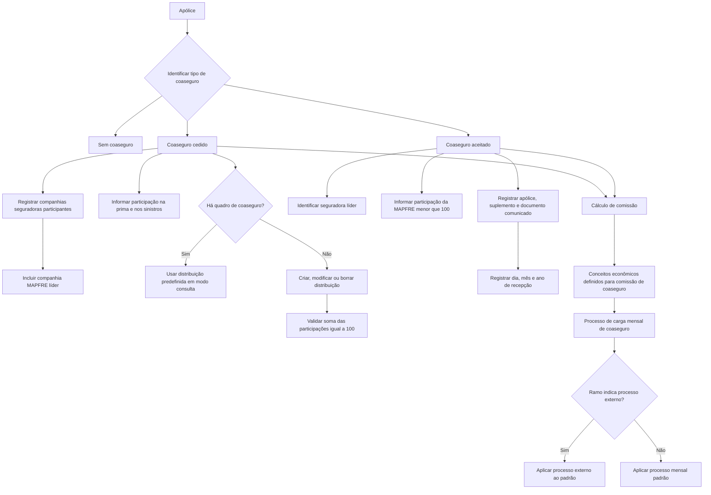

# Documentação Reef — Construção de Coaseguro

## 1. Metadados do Documento
- **Arquivo de Origem:** `Não identificado no conteúdo fornecido`
- **Tipo de Documento:** `Especificação Funcional`
- **Domínio / Sistema:** `Reef / Coaseguro / MAPFRE`
- **Público-Alvo:** `Negócio, operação e equipes responsáveis pela parametrização de ramos e apólices`
- **Data/Versão Identificada:** `Não identificada`
- **Owner identificado:** `user:agonzalez_mapfre.com`
- **Lifecycle identificado:** `Approved`

---

## 2. Resumo Executivo & Contexto de Negócio

O documento descreve a construção e o tratamento de **coaseguro** no contexto de apólices MAPFRE. Coaseguro ocorre quando parte do risco assumido pela companhia líder é cedida a outras companhias designadas pelo tomador do seguro, ou quando MAPFRE foi designada pelo tomador, mas não atua como companhia líder.

A definição do ramo determina qual tipo de coaseguro é permitido. O processo apresentado exige inicialmente identificar se a apólice possui **coaseguro cedido**, **coaseguro aceitado** ou se está **sem coaseguro**.

No coaseguro cedido, a MAPFRE atua como líder e devem ser registradas todas as companhias seguradoras participantes, incluindo a própria companhia MAPFRE líder. A distribuição de participação pode ser informada manualmente ou recuperada de um quadro de coaseguro previamente definido, caso em que a distribuição é apresentada somente para consulta.

No coaseguro aceitado, outra seguradora atua como líder da apólice e a MAPFRE registra a sua participação. O documento também especifica dados da apólice e do documento recebido da seguradora líder que comunica os movimentos.

As comissões de coaseguro são calculadas a partir dos conceitos econômicos definidos para esse cálculo. O cálculo ocorre no processo mensal de carga de coaseguro, salvo quando o ramo indicar outro processo externo ao padrão.

---

## 3. Arquitetura, Componentes & Tecnologias Envolvidas

Os elementos identificados no conteúdo são:

- **Reef:** ambiente de documentação onde o conteúdo está publicado.
- **MAPFRE:** companhia participante do processo de coaseguro; pode atuar como líder no coaseguro cedido ou como participante no coaseguro aceitado.
- **Tomador do seguro:** responsável por designar as companhias participantes.
- **Ramo:** definição que determina o tipo de coaseguro permitido e, quando aplicável, indica processo externo ao padrão.
- **Quadro de coaseguro:** chave de uma distribuição de coaseguro previamente definida.
- **Processo de carga mensal de coaseguro:** processo no qual é efetuado o cálculo das comissões.
- **Documento da seguradora líder:** documento por meio do qual a seguradora líder comunica os movimentos da apólice no coaseguro aceitado.



> **Nota de Análise:** O conteúdo não apresenta APIs, métodos HTTP, contratos JSON, bancos de dados, URLs de ambiente, tecnologias de implementação ou detalhes técnicos de integração entre Reef e os processos de coaseguro.

---

## 4. Regras de Negócio, Especificações Funcionais & Processos

### 4.1. Conceito de coaseguro

O coaseguro é utilizado nas seguintes situações:

1. Parte do risco assumido pela companhia líder é cedida a outras companhias designadas pelo tomador do seguro.
2. MAPFRE é uma das companhias designadas pelo tomador, mas não é a companhia líder.

O tipo de coaseguro permitido é determinado pela definição do ramo.

### 4.2. Identificação do tipo de coaseguro

A apólice deve ser classificada em uma das possibilidades abaixo:

- **Coaseguro cedido**
- **Coaseguro aceitado**
- **Sem coaseguro**

O campo **Tipo de coaseguro** indica o coaseguro da apólice conforme a forma de participação da MAPFRE.

### 4.3. Regras do quadro de coaseguro

O campo **Quadro de coaseguro** permite registrar a chave que identifica uma distribuição de coaseguro previamente definida.

Quando um quadro de coaseguro é informado:

- A informação de distribuição deve ser obtida do quadro indicado.
- A distribuição não pode ser modificada.
- A distribuição deve ser exibida somente em modo consulta.

### 4.4. Coaseguro cedido

No coaseguro cedido, o documento prevê as ações:

- **CREAR**
- **MODIFICAR**
- **BORRAR**

Para cada seguradora participante, devem ser observadas as seguintes regras:

1. Todas as companhias seguradoras participantes do coaseguro da apólice devem ser declaradas.
2. A companhia MAPFRE que atua como líder também deve ser declarada.
3. Todas as companhias participantes, inclusive a própria MAPFRE, devem existir previamente como seguradoras.
4. O percentual de participação estabelece a participação da seguradora tanto na prima quanto nos sinistros.
5. A soma dos percentuais de participação de todas as seguradoras, incluindo a companhia MAPFRE líder, deve ser sempre igual a **100**.
6. Podem existir até quatro percentuais de comissão distintos.
7. Os percentuais de comissão servem para repercutir às seguradoras a parcela correspondente à comissão do agente, gastos, recargos ou qualquer outro importe.
8. A comissão é calculada com base nos conceitos econômicos definidos como aplicáveis ao cálculo da comissão de coaseguro.
9. O cálculo das comissões ocorre no processo mensal de carga de coaseguro, exceto quando o ramo indicar outro processo externo ao padrão.

### 4.5. Coaseguro aceitado

No coaseguro aceitado, devem ser registrados dados da seguradora líder, da participação MAPFRE, da apólice na líder e do documento que comunica os movimentos.

Regras aplicáveis:

1. A companhia seguradora informada identifica a seguradora líder da apólice.
2. A seguradora líder deve estar previamente definida como companhia seguradora.
3. O percentual de participação representa a participação da MAPFRE na prima e nos sinistros da apólice.
4. O valor do percentual de participação da MAPFRE deve ser menor que **100**, pois contém exclusivamente a participação MAPFRE.
5. O número de apólice corresponde à chave que identifica a apólice na companhia líder.
6. O número de suplemento representa o número do movimento da apólice na companhia líder.
7. O identificador corresponde ao documento pelo qual a seguradora líder comunica os movimentos da apólice.
8. Dia, mês e ano identificam a data de recepção do documento que comunica o movimento.
9. O percentual de comissão contém a parcela que a MAPFRE deve assumir referente à comissão do agente, gastos, recargos ou qualquer outro importe acordado.
10. A comissão é calculada com base nos conceitos econômicos definidos para o cálculo da comissão de coaseguro.
11. O cálculo ocorre durante o processo mensal de carga de coaseguro, salvo se o ramo indicar processo externo ao padrão.

---

## 5. Tabelas de Parâmetros, Ambientes e Estruturas de Dados

| Item / Parâmetro | Descrição / Função | Tipo / Valores / Formato | Ambiente / Observações |
| :--- | :--- | :--- | :--- |
| Tipo de coaseguro | Indica o coaseguro da apólice segundo a forma de participação da MAPFRE. | Coaseguro cedido; Coaseguro aceitado; Sem coaseguro. | O ramo determina o tipo de coaseguro permitido. |
| Quadro de coaseguro | Registra a chave de uma distribuição de coaseguro previamente definida. | Chave de distribuição. | Quando informado, a distribuição é recuperada do quadro e exibida somente em consulta. |
| Ação no coaseguro cedido | Define operações disponíveis para a informação de coaseguro cedido. | CREAR; MODIFICAR; BORRAR. | Aplicável ao coaseguro cedido. |
| Companhia asseguradora — cedido | Identifica cada companhia participante no coaseguro da apólice. | Chave de companhia seguradora. | Todas devem existir previamente; inclui a companhia MAPFRE líder. |
| Porcentagem de participação — cedido | Define a participação de cada seguradora na prima e nos sinistros. | Percentual. | A soma das participações, incluindo MAPFRE líder, deve ser igual a 100. |
| Porcentagens de comissão — cedido | Repercute às seguradoras a parcela da comissão do agente, gastos, recargos ou outro importe. | Até quatro percentuais distintos. | Baseada em conceitos econômicos definidos para comissão de coaseguro. |
| Companhia asseguradora — aceitado | Identifica a companhia líder da apólice. | Companhia seguradora previamente definida. | Aplicável ao coaseguro aceitado. |
| Porcentagem de participação — aceitado | Define a participação MAPFRE na prima e nos sinistros. | Percentual menor que 100. | Contém somente a participação MAPFRE. |
| Número de póliza | Identifica a apólice na companhia líder. | Chave de apólice. | Aplicável ao coaseguro aceitado. |
| Número de suplemento | Indica o número do movimento da apólice na companhia líder. | Número de movimento. | Aplicável ao coaseguro aceitado. |
| Identificador | Registra o identificador do documento no qual a seguradora líder comunica movimentos da apólice. | Identificador de documento. | Aplicável ao coaseguro aceitado. |
| Dia | Identifica o dia de recepção do documento que comunica o movimento. | Dia. | Aplicável ao coaseguro aceitado. |
| Mês | Identifica o mês de recepção do documento que comunica o movimento. | Mês. | Aplicável ao coaseguro aceitado. |
| Ano | Identifica o ano de recepção do documento que comunica o movimento. | Ano. | Aplicável ao coaseguro aceitado. |
| Porcentagens de comissão — aceitado | Define o percentual que a MAPFRE deve assumir referente à comissão do agente, gastos, recargos ou outro importe acordado. | Percentual. | Aplicável ao coaseguro aceitado. |
| Cálculo de comissão | Calcula a comissão de coaseguro. | Baseado em conceitos econômicos definidos. | Executado na carga mensal de coaseguro ou em processo externo indicado no ramo. |
| Processo de carga mensal de coaseguro | Processo padrão para cálculo das comissões. | Processo mensal. | Pode ser substituído por processo externo ao padrão quando indicado no ramo. |

---

## 6. Bateria de Perguntas & Respostas para RAG (FAQ Sintético)

### P1: Em quais situações o coaseguro deve ser utilizado?
**R:** O coaseguro é utilizado quando parte do risco assumido pela companhia líder é cedida a outras companhias designadas pelo tomador do seguro, ou quando a MAPFRE é uma das companhias designadas pelo tomador, mas não atua como companhia líder.

### P2: Quais tipos de coaseguro podem ser identificados em uma apólice?
**R:** A apólice pode ser identificada como coaseguro cedido, coaseguro aceitado ou sem coaseguro. O tipo permitido é determinado pela definição do ramo.

### P3: Qual é a finalidade do campo Tipo de coaseguro?
**R:** O campo Tipo de coaseguro indica o coaseguro da apólice de acordo com a forma como a MAPFRE participa da apólice.

### P4: O que ocorre quando um quadro de coaseguro é informado?
**R:** Quando um quadro de coaseguro é informado, a distribuição de coaseguro é obtida desse quadro previamente definido. A distribuição não pode ser modificada e é exibida somente em modo consulta.

### P5: Quais companhias devem ser declaradas no coaseguro cedido?
**R:** Devem ser declaradas todas as companhias seguradoras que participam do coaseguro da apólice, incluindo a companhia MAPFRE que atua como líder. Todas essas companhias devem existir previamente como seguradoras.

### P6: Qual validação deve ser aplicada aos percentuais de participação no coaseguro cedido?
**R:** A soma dos percentuais de participação de todas as companhias seguradoras, incluindo a companhia MAPFRE líder, deve ser sempre igual a 100.

### P7: Quantos percentuais de comissão podem ser considerados no coaseguro cedido?
**R:** O coaseguro cedido contempla até quatro percentuais de comissão distintos. Esses percentuais são usados para repercutir às seguradoras a parcela referente à comissão do agente, gastos, recargos ou qualquer outro importe.

### P8: Como funciona o percentual de participação no coaseguro aceitado?
**R:** No coaseguro aceitado, o percentual de participação representa a participação da MAPFRE tanto na prima quanto nos sinistros da apólice. Esse percentual deve ser menor que 100 porque registra somente a participação MAPFRE.

### P9: Quais dados da apólice líder são registrados no coaseguro aceitado?
**R:** No coaseguro aceitado, são registrados a companhia seguradora líder, o número de apólice na companhia líder, o número de suplemento ou movimento, o identificador do documento que comunica o movimento e a data de recepção desse documento, composta por dia, mês e ano.

### P10: O que representa o identificador no coaseguro aceitado?
**R:** O identificador registra o documento pelo qual a seguradora líder comunica os movimentos da apólice. O documento possui também informações de dia, mês e ano de recepção.

### P11: Como é calculada a comissão de coaseguro?
**R:** A comissão é calculada com base nos conceitos econômicos que a definição determina como aplicáveis ao cálculo da comissão de coaseguro.

### P12: Em qual processo ocorre o cálculo das comissões de coaseguro?
**R:** O cálculo das comissões ocorre no processo de carga mensal de coaseguro. Se existir outro processo externo ao padrão, esse processo deve ser indicado no ramo.

---

## 7. Glossário de Termos, Siglas & Conceitos-Chave

- **Coaseguro:** Situação em que parte do risco da companhia líder é cedida a outras companhias designadas pelo tomador, ou em que MAPFRE participa sem ser a companhia líder.
- **Coaseguro cedido:** Modalidade em que são declaradas todas as seguradoras participantes, incluindo a companhia MAPFRE que atua como líder.
- **Coaseguro aceitado:** Modalidade em que outra seguradora é a líder da apólice e é registrada a participação MAPFRE.
- **Companhia líder:** Companhia seguradora líder da apólice.
- **MAPFRE:** Companhia participante do processo; pode ser líder no coaseguro cedido ou participante no coaseguro aceitado.
- **Tomador do seguro:** Parte que designa as companhias participantes do coaseguro.
- **Ramo:** Definição que determina o tipo de coaseguro permitido e pode indicar processo externo ao padrão.
- **Quadro de coaseguro:** Distribuição de coaseguro previamente definida e identificada por uma chave.
- **Prima:** Elemento para o qual é estabelecida a participação da seguradora no documento.
- **Siniestros:** Elemento para o qual é estabelecida a participação da seguradora no documento.
- **Suplemento:** Número do movimento que a apólice possui na companhia líder.
- **Conceitos econômicos:** Conceitos definidos como aplicáveis ao cálculo da comissão de coaseguro.
- **Reef:** Ambiente de documentação identificado no conteúdo.
- **VL:** Sigla exibida na área de lifecycle do conteúdo; o texto não detalha seu significado.

---

## 8. Notas Críticas, Riscos & Limitações

- O tipo de coaseguro permitido depende da definição do ramo; o documento não detalha os critérios configuráveis dessa definição.
- As companhias seguradoras participantes devem existir previamente como seguradoras. O documento não descreve o processo de cadastro ou validação dessa existência.
- No coaseguro cedido, o total dos percentuais de participação deve ser igual a 100; o documento menciona a validação, mas não descreve mensagens de erro, tolerâncias ou comportamento em caso de inconsistência.
- No coaseguro aceitado, a participação MAPFRE deve ser menor que 100; não há detalhamento sobre limite mínimo, casas decimais ou regra de arredondamento.
- O cálculo de comissões depende de conceitos econômicos determinados na definição, porém o conteúdo não enumera esses conceitos nem apresenta fórmulas de cálculo.
- O processo padrão de comissão é a carga mensal de coaseguro. Um processo externo pode ser utilizado quando indicado pelo ramo, mas não há especificação sobre integração, responsável, frequência ou controles desse processo externo.
- O documento não fornece métodos HTTP, APIs, contratos de integração, URLs, servidores, credenciais, versões de componentes ou detalhes de persistência de dados.

---

## 9. Conteúdo Bruto Estruturado (Referência Fiel)

```text
--- [PÁGINA 1 DE 4] ---

EN CONSTRUCCIÓN
COASEGURO
En que consiste
Cuando parte del riesgo que asume la compañía líder se cede a otras compañías que han sido designadas por el tomador del seguro o,
MAPFRE es una de las compañías designadas por el tomador, pero no es la compañía líder, se utiliza este apartado.
El tipo de coaseguro que se permite lo determina la denición del ramo.
Proceso a seguir
Identificar
tipo coaseguro
Coaseguro
cedido
Coaseguro
aceptado
Sin coaseguro
- Identicar tipo de coaseguro
- Coaseguro cedido
- Coaseguro aceptado
Identicar tipo de coaseguro
A continuación se detalla las información requerida.
Tipo de coaseguro (   )
Indica el coaseguro de la póliza, según la forma en la que participe MAPFRE.
Documentation / DOCUMENTACIÓN Reef
DOCUMENTACIÓN Reef
Mapfredocument
DOCUMENTACIÓN Reef
Owner
user:agonzalez_mapfre.com
Lifecycle
Approved Source
 / 
 VL
Buscar Inicio Soluciones Arquitecturas APIs Componentes Cloud Documentación Zeus Reef Ayuda
ES


--- [PÁGINA 2 DE 4] ---

Cuadro de coaseguro (   )
Permite registrar la clave que identica una distribución de coaseguro previamente denida.
En caso de indicar un cuadro, la información de la distribución se tomará de dicho cuadro y no se podrá modicar, solamente se mostrará en
modo consulta.
Coaseguro cedido
A continuación se detalla las información requerida.
Posibles acciones
 CREAR ( )
 MODIFICAR ( )
 BORRAR ( )
Compañía aseguradora (   )
Contiene la clave de la compañía que participa en el coaseguro de la póliza, se deben declarar todas las compañías aseguradoras, incluida la
compañía de MAPFRE que actúa como líder.
Las compañías que participan deben existir previamente como aseguradoras, incluida la propia compañía MAPFRE.
Porcentaje de participación (  )
Establece la participación que tiene la aseguradora en la póliza, tanto en la prima como en los siniestros.
La suma de los porcentajes de participación de las aseguradoras, incluida la compañía MAPFRE que actúa como líder, debe ser siempre
igual a 100.
Porcentajes de comisión (  )
Se contemplan hasta cuatro porcentajes de comisión distintos, que se utilizan para repercutir a las aseguradoras la parte correspondiente a
la comisión del agente, a gastos, recargos o cualquier otro importe.
La comisión se calcula en base a los conceptos económicos, que se determine en la denición, que aplican para el cálculo de comisión de
coaseguro.
El cálculo de las comisiones se hace dentro del proceso de carga mensual de coaseguro. Si existe otro proceso, externo al estándar, se
indicará en el ramo.
validación de porcentajes de participación


--- [PÁGINA 3 DE 4] ---

Coaseguro aceptado
A continuación se detalla las información requerida.
Compañía aseguradora (   )
Identica la compañía líder de la póliza, que debe estar denida previamente como compañía aseguradora.
Porcentaje de participación (  )
Establece la participación de la compañía MAPFRE, tanto en la prima como en los siniestros de la póliza.
El valor de este porcentaje debe ser menor a 100 ya que solo contiene la participación de MAPFRE.
Número de póliza (  )
Recoge la clave con la que se identica la póliza en la compañía líder.
Número de suplemento (  )
Indica el número del movimiento que tiene la póliza en la compañía líder.
Identicador (  )
La aseguradora líder comunica los movimientos de la póliza en un documento, en esta propiedad se recoge el identicador de dicho
documento.
Día (  )
Identica el día de recepción del documento en el que se comunica el movimiento.
Mes (  )
Identica el mes de recepción del documento en el que se comunica el movimiento.
Año (  )
Identica el año de recepción del documento en el que se comunica el movimiento.
Porcentajes de comisión (  )
Contiene el porcentaje que debe asumir la compañía MAPFRE, de la comisión del agente, gastos, recargos o cualquier otro importe que se
haya acordado.
validación de porcentajes de participación


--- [PÁGINA 4 DE 4] ---

La comisión se calcula en base a los conceptos económicos, que se determine en la denición, que aplican para el cálculo de comisión de
coaseguro.
El cálculo de las comisiones se hace dentro del proceso de carga mensual de coaseguro. Si existe otro proceso, externo al estándar, se
indicará en el ramo.
cálculo de la comisión
```
