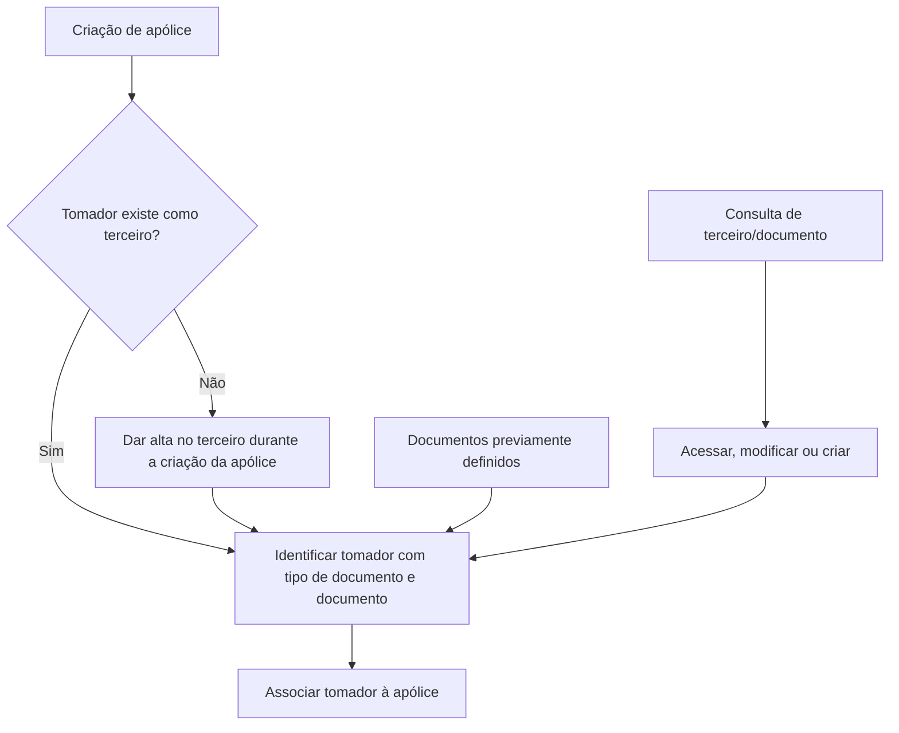

# Tomador — Processo de Identificação e Cadastro na Criação de Apólice

## 1. Metadados do Documento
- **Arquivo de Origem:** Não informado
- **Tipo de Documento:** Especificação Funcional em construção
- **Domínio / Sistema:** Reef / Mapfre — criação de apólices
- **Público-Alvo:** Negócio, analistas funcionais e equipes responsáveis pela criação de apólices
- **Data/Versão Identificada:** Não identificada

---

## 2. Resumo Executivo & Contexto de Negócio

O documento descreve o tratamento do **tomador** durante o processo de criação de uma apólice. O objetivo funcional é identificar quem será o tomador da apólice por meio de dados de um terceiro.

O tomador deve ser um terceiro previamente cadastrado antes da criação da apólice. Alternativamente, o terceiro pode ser cadastrado no próprio momento de criação da apólice.

A identificação do tomador requer, no mínimo, a seleção do tipo de documento e o preenchimento do número do documento correspondente. Os documentos permitidos devem estar definidos previamente em uma referência externa indicada pela documentação.

O conteúdo está marcado como **“EN CONSTRUCCIÓN”** e não fornece detalhes sobre telas, contratos de API, validações técnicas, integrações, permissões ou regras para tratamento de erros.

---

## 3. Arquitetura, Componentes & Tecnologias Envolvidas

Os elementos explicitamente citados são o processo de criação de apólice, o terceiro, o tomador, a consulta associada ao documento e a documentação Reef/Mapfre.



**Nota de Análise:** O documento menciona uma “consulta” que permite acessar, modificar ou criar informações, mas não identifica o nome da consulta, a URL, os métodos de acesso, os contratos de dados ou o sistema responsável por essa funcionalidade.

---

## 4. Regras de Negócio, Especificações Funcionais & Processos

1. O tomador da apólice deve ser identificado durante o processo de criação da apólice.
2. O tomador deve corresponder a um terceiro.
3. O terceiro que será tomador pode já estar cadastrado antes da criação da apólice.
4. Caso o tomador não exista como terceiro, o terceiro pode ser cadastrado no momento de criação da apólice.
5. Deve ser informado o tipo de documento que identificará o tomador.
6. Os tipos de documentos disponíveis devem estar previamente definidos conforme a documentação referenciada.
7. O campo **Documento** deve conter o número do documento relacionado ao tipo de documento selecionado.
8. A consulta mencionada no documento pode ser utilizada para acessar informações e, adicionalmente, modificá-las ou criá-las.

**Nota de Análise:** O texto não detalha quais tipos de documentos são aceitos, critérios de unicidade, obrigatoriedade dos campos, formato do número do documento, validações, regras de duplicidade ou comportamento após a criação do terceiro.

---

## 5. Tabelas de Parâmetros, Ambientes e Estruturas de Dados

| Item / Parâmetro | Descrição / Função | Tipo / Valores / Formato | Ambiente / Observações |
| :--- | :--- | :--- | :--- |
| Tomador | Terceiro identificado como tomador da apólice. | Terceiro | Deve existir previamente ou ser cadastrado durante a criação da apólice. |
| Tipo de documento do terceiro | Define o documento usado para identificar o tomador. | Não detalhado | Os documentos devem estar previamente definidos em documentação referenciada. |
| Documento | Número do documento associado ao tipo de documento informado. | Número de documento; formato não detalhado | Relacionado diretamente ao campo de tipo de documento. |
| Consulta | Recurso mencionado para acessar, modificar ou criar informações. | Não detalhado | O documento não identifica nome, URL, sistema ou contrato da consulta. |
| Reef | Contexto documental citado como “Documentation / DOCUMENTACIÓN Reef”. | Plataforma ou área documental; não detalhado | Também são exibidas referências a “Mapfredocument”. |
| Lifecycle | Metadado exibido na documentação. | `Approved Source` | Não há explicação adicional sobre o significado operacional. |
| Owner | Proprietário indicado na documentação. | `user:agonzalez_mapfre.com` | Valor apresentado literalmente no conteúdo bruto. |
| Idioma | Idioma exibido na navegação da documentação. | `ES` | O conteúdo principal está em espanhol. |

---

## 6. Bateria de Perguntas & Respostas para RAG (FAQ Sintético)

### P1: O que é o tomador no processo de criação de apólice?
**R:** O tomador é o terceiro que deve ser identificado durante a criação da apólice. O documento estabelece que o tomador deve corresponder a um terceiro cadastrado.

### P2: O tomador precisa estar cadastrado antes da criação da apólice?
**R:** Não obrigatoriamente. O tomador pode ser um terceiro previamente cadastrado ou pode ser cadastrado no momento da criação da apólice.

### P3: Quais informações são necessárias para identificar o tomador?
**R:** O documento solicita o tipo de documento do terceiro e o campo Documento, que deve conter o número relacionado ao tipo de documento selecionado.

### P4: Qual é a finalidade do campo “tipo de documento do terceiro”?
**R:** O tipo de documento do terceiro indica qual documento será usado para identificar o tomador da apólice.

### P5: O que deve ser informado no campo Documento?
**R:** O campo Documento deve conter o número do documento relacionado ao tipo de documento previamente informado.

### P6: Os tipos de documento podem ser definidos livremente durante o cadastro?
**R:** O documento informa que os documentos devem estar previamente definidos conforme a referência indicada. Não há detalhamento sobre a manutenção dessa lista ou sobre quem pode administrá-la.

### P7: O que fazer se o tomador não existir como terceiro?
**R:** Caso o tomador não exista, o terceiro pode ser cadastrado no momento de criação da apólice.

### P8: Para que serve a consulta mencionada na documentação?
**R:** A consulta pode ser utilizada para acessar informações e também para modificá-las ou criá-las. O documento não especifica qual consulta é essa, nem seus critérios de busca ou contratos técnicos.

### P9: O documento especifica APIs ou métodos HTTP para o cadastro do tomador?
**R:** Não. O conteúdo não apresenta APIs, métodos HTTP, endpoints, contratos JSON, tecnologias de integração ou detalhes de implementação.

### P10: O documento define o formato válido para o número de documento?
**R:** Não. O documento apenas determina que o campo Documento deve conter o número associado ao tipo de documento informado.

---

## 7. Glossário de Termos, Siglas & Conceitos-Chave

- **Tomador:** Terceiro que deve ser identificado no processo de criação da apólice.
- **Terceiro:** Entidade que pode já estar cadastrada ou ser cadastrada durante a criação da apólice para atuar como tomador.
- **Apólice:** Objeto cujo processo de criação requer a identificação do tomador.
- **Tipo de documento:** Informação que define o documento utilizado para identificar o tomador.
- **Documento:** Número vinculado ao tipo de documento informado.
- **Reef:** Nome citado no contexto da documentação disponível.
- **Lifecycle:** Metadado exibido como `Approved Source`.
- **Owner:** Metadado de propriedade exibido como `user:agonzalez_mapfre.com`.

---

## 8. Notas Críticas, Riscos & Limitações

- O documento está explicitamente marcado como **“EN CONSTRUCCIÓN”**.
- Não há identificação do arquivo original, data, versão ou autor formal do conteúdo.
- Não são detalhados os tipos de documentos previamente definidos.
- Não são fornecidas regras de validação, formatos, obrigatoriedade, mensagens de erro ou tratamento de documentos inválidos.
- A consulta capaz de acessar, modificar ou criar dados não é identificada tecnicamente.
- Não há informações sobre APIs, URLs, ambientes, credenciais, permissões, logs ou contratos de integração.
- Não são apresentadas regras para duplicidade de terceiros, atualização de dados existentes ou associação final entre terceiro e apólice.

---

## 9. Conteúdo Bruto Estruturado (Referência Fiel)

```text
--- [PÁGINA 1 DE 1] ---

EN CONSTRUCCIÓN
TOMADOR
En que consiste
Identicar quien es el tomador de la póliza. El tomador debe ser un tercero que ha sido dado de alta previamente a la creación de la póliza o,
puede darse de alta en el momento de creación de la póliza.
Proceso a seguir
A continuación detalla las información requerida.
tip de documento del tercero (   )
En este punto se debe indicar el documento con el que se identicará al tomador. Los documentos deben estar previamente denidos según
se indica en el siguiente enlace.
Documento (   )
Este campo alberga el número del documento que está relacionado con el campo anterior.
Se puede utilizar la consulta  para, además de acceder a la consulta, modicarlo o incluso crearlo.
Si el tomador no existe
Documentation / DOCUMENTACIÓN Reef
DOCUMENTACIÓN Reef
Mapfredocument
DOCUMENTACIÓN Reef
Owner
user:agonzalez_mapfre.com
Lifecycle
Approved Source
 / 
 VL
Buscar Inicio Soluciones Arquitecturas APIs Componentes Cloud Documentación Zeus Reef Ayuda
ES
```
