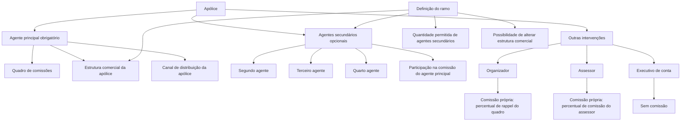

# Gestão de Agentes e Intervenções em Apólices — Documento Funcional Reef

## 1. Metadados do Documento
- **Arquivo de Origem:** Não identificado no conteúdo fornecido
- **Tipo de Documento:** Especificação Funcional
- **Domínio / Sistema:** Reef / Mapfre — gestão de intermediários, agentes e comissões em apólices
- **Público-Alvo:** Desenvolvedores, Arquitetos, Analistas Funcionais, Operação e Negócio
- **Data/Versão Identificada:** Não identificada

---

## 2. Resumo Executivo & Contexto de Negócio

O documento descreve a configuração de intermediários que participam de uma apólice. O objetivo é identificar as diferentes figuras de intermediação, as respectivas formas de atuação, as condições de participação e os efeitos sobre comissões, estrutura comercial e canal de comercialização da apólice.

Toda apólice deve possuir um **agente principal**, que determina a estrutura comercial e o canal de distribuição da apólice. Os agentes e demais figuras envolvidos devem existir previamente como agentes da companhia. O agente principal pode ser complementado por agentes secundários, outras intervenções de organizador e assessor, além de um executivo de contas.

Os agentes secundários podem atuar como segundo, terceiro ou quarto agente. Esses agentes não possuem comissão própria: participam de um percentual da comissão do agente principal. A quantidade de agentes secundários permitida depende da definição do ramo, e o registro deve respeitar uma sequência consecutiva.

As outras intervenções incluem organizador, assessor e executivo de contas. Organizador e assessor possuem comissão própria associada aos respectivos percentuais definidos no quadro de comissão. O executivo de contas não recebe comissão, mas pode ser informado mesmo que não exista um executivo previamente associado ao agente principal.

A especificação também define propriedades editáveis, condições de bloqueio e regras de consistência. Por exemplo, a soma do percentual do agente principal com os percentuais de todos os agentes secundários deve ser sempre igual a 100%.

---

## 3. Arquitetura, Componentes & Tecnologias Envolvidas

O conteúdo fornecido não descreve uma arquitetura técnica de software, integrações, APIs, bancos de dados, microsserviços, protocolos ou ambientes. A arquitetura identificável é funcional: uma apólice reúne intermediários e propriedades que afetam comissão, estrutura comercial e canal de distribuição.

### Componentes funcionais identificados

| Componente / Figura | Papel no processo |
| :--- | :--- |
| Apólice | Entidade que contém os intermediários, a estrutura comercial, o canal de distribuição e as regras de comissão. |
| Agente principal | Intermediário obrigatório da apólice; determina estrutura comercial e canal de comercialização. |
| Quadro de distribuição de comissões | Chave previamente definida que agrupa intermediários participantes da apólice. |
| Quadro de comissões | Quadro associado ao agente principal que determina os percentuais de comissão das figuras participantes. |
| Agente secundário | Intervenção classificada como segundo, terceiro ou quarto agente; participa da comissão do agente principal. |
| Organizador | Agente associado ao agente principal, com comissão própria baseada no percentual de rappel do quadro. |
| Assessor | Agente associado ao agente principal, com comissão própria baseada no percentual de comissão do assessor no quadro. |
| Executivo de conta | Terceiro associado ao agente; não recebe comissão. |
| Estrutura comercial | Estrutura à qual o agente principal e, por consequência, a apólice pertencem. |
| Estrutura de canais de distribuição | Estrutura que identifica a fonte de produção pela qual o agente pode comercializar. |
| Definição do ramo | Configuração que define, entre outros aspectos, se agentes secundários podem ser registrados, sua quantidade e a possibilidade de alterar a estrutura comercial. |



> **Nota de Análise:** O documento não detalha entidades técnicas, persistência de dados, métodos HTTP, contratos JSON, serviços, URLs, logs ou mecanismos de integração.

---

## 4. Regras de Negócio, Especificações Funcionais & Processos

### 4.1 Premissas gerais

1. As figuras que atuam como intermediários na apólice devem existir previamente como agentes da companhia.
2. A apólice deve possuir sempre um agente principal.
3. A apólice pode possuir agentes secundários e outras intervenções, conforme as regras aplicáveis.
4. A definição do ramo determina se agentes secundários podem ser registrados na apólice.
5. A definição do ramo determina o número de agentes secundários que podem ser incluídos.
6. A definição do ramo determina, quando aplicável, se a estrutura comercial pode ser modificada.
7. A definição pode permitir ou impedir alterações no organizador e no assessor associados ao agente principal.

### 4.2 Agente principal

O agente principal é a figura obrigatória de intermediação da apólice. O agente principal:

- possui origem livre;
- determina o quadro de comissão;
- possui comissão própria, correspondente ao percentual de comissão do agente no quadro;
- determina a estrutura comercial da apólice;
- determina o canal de comercialização ou distribuição da apólice;
- é identificado pela propriedade **Agente**;
- possui um **Quadro de comissões** associado;
- pode ter mais de uma estrutura comercial disponível para emissão;
- pode ter mais de um canal de comercialização disponível.

### 4.3 Quadro de distribuição de comissões

A propriedade **Cuadro de distribución de las comisiones** identifica a chave previamente definida que agrupa os intermediários que participam da apólice.

Quando um quadro de distribuição é especificado:

1. os intermediários identificados no quadro são utilizados;
2. as informações desses intermediários não podem ser modificadas;
3. somente o quadro de comissão pode ser modificado.

### 4.4 Quadro de comissões do agente principal

A propriedade **Cuadro de comisiones** contém a chave do quadro associado ao agente principal.

Esse quadro determina os percentuais de comissão das figuras que intervêm na apólice.

A modificação do quadro de comissões é permitida somente quando o agente principal possui mais de um quadro de comissão associado.

### 4.5 Estrutura comercial da apólice

A propriedade **Tercer nivel de la estructura comercial** identifica a estrutura comercial à qual pertence o agente principal e que será atribuída à apólice.

Regras de alteração:

1. Se o agente principal puder emitir em mais de uma estrutura comercial, pode ser selecionada uma estrutura diferente da estrutura padrão do agente.
2. A alteração é condicionada à permissão prevista na definição do ramo.
3. Se a definição do ramo não permitir a modificação da estrutura comercial, a propriedade permanece desabilitada.

### 4.6 Estrutura de canais de distribuição

A propriedade **Tercer nivel de la estructura de canales de distribución** identifica a fonte de produção pela qual o agente principal pode comercializar.

Regras de alteração:

1. Se o agente principal puder emitir por mais de um canal, pode ser informada uma fonte de produção diferente da fonte padrão do agente.
2. Quando o agente não puder emitir por mais de um canal, a propriedade não é habilitada.

### 4.7 Agentes secundários

Os agentes secundários são outros agentes que podem intervir na apólice. Eles não possuem comissão própria e participam de um percentual da comissão do agente principal.

As formas de atuação de agente secundário são:

- segundo agente;
- terceiro agente;
- quarto agente.

Regras para agentes secundários:

1. A possibilidade de registrar agentes secundários depende da definição do ramo.
2. O número de agentes secundários permitidos depende da definição do ramo.
3. Os agentes secundários devem ser registrados consecutivamente.
4. Caso um agente secundário não seja identificado em uma posição, não podem ser incluídos agentes secundários nas posições seguintes.
5. Um agente secundário pode ser segundo, terceiro ou quarto agente.
6. O código de terceiro identifica a chave do agente secundário que participa da apólice.
7. O percentual de participação do agente secundário incide sobre a comissão do agente principal.
8. O percentual inicial de participação do agente principal é 100%.
9. A participação do agente principal diminui à medida que agentes secundários são incluídos.
10. A redução da participação do agente principal corresponde à subtração dos percentuais de participação dos agentes secundários.
11. A soma dos percentuais de participação de todos os agentes secundários e do agente principal deve ser sempre igual a 100%.

### 4.8 Outras intervenções

As outras intervenções incluem organizador, assessor e executivo de contas.

#### Organizador

O organizador é um agente associado ao agente principal.

- A propriedade **Organizador** contém a chave do agente que identifica o organizador associado ao agente principal.
- O organizador depende do agente principal.
- O organizador não determina o quadro de comissão; utiliza o quadro do agente principal.
- O organizador possui comissão própria, correspondente ao percentual de rappel do quadro.
- O organizador não determina a estrutura comercial da apólice.
- O organizador não determina o canal de comercialização da apólice.
- Pode ser indicado um organizador diferente do organizador padrão associado ao agente principal somente se a definição permitir alteração.
- Caso a definição não permita alteração, a propriedade é apresentada desabilitada.

#### Assessor

O assessor é um agente associado ao agente principal.

- A propriedade **Asesor** contém a chave do agente que identifica o assessor associado ao agente principal.
- O assessor depende do agente principal.
- O assessor não determina o quadro de comissão; utiliza o quadro do agente principal.
- O assessor possui comissão própria, correspondente ao percentual de comissão do assessor no quadro.
- O assessor não determina a estrutura comercial da apólice.
- O assessor não determina o canal de comercialização da apólice.
- Pode ser indicado um assessor diferente do assessor padrão associado ao agente principal somente se a definição permitir alteração.
- Caso a definição não permita alteração, a propriedade é apresentada desabilitada.

#### Executivo de conta

O executivo de conta é outro terceiro associado ao agente principal.

- A propriedade **Ejecutivo** identifica a chave do executivo de contas associado ao agente.
- O executivo de conta depende do agente principal.
- O executivo de conta não determina o quadro de comissão.
- O executivo de conta não possui comissão.
- O executivo de conta não determina a estrutura comercial da apólice.
- O executivo de conta não determina o canal de comercialização da apólice.
- Um executivo de conta pode sempre ser informado, mesmo quando o agente principal não possui um executivo associado previamente.

---

## 5. Tabelas de Parâmetros, Ambientes e Estruturas de Dados

### 5.1 Formas de atuação e impactos funcionais

| Forma de atuação | Origem | Determina quadro de comissão? | Possui comissão própria? | Determina estrutura comercial da apólice? | Determina canal de comercialização da apólice? |
| :--- | :--- | :--- | :--- | :--- | :--- |
| Agente principal | Livre | Sim | Sim; percentual de comissão do agente no quadro | Sim | Sim |
| Organizador | Depende do agente principal | Não; utiliza o quadro do agente principal | Sim; percentual de rappel do quadro | Não | Não |
| Assessor | Depende do agente principal | Não; utiliza o quadro do agente principal | Sim; percentual de comissão do assessor no quadro | Não | Não |
| Segundo agente | Livre | Não | Não; participa da comissão do agente principal | Não | Não |
| Terceiro agente | Livre | Não | Não; participa da comissão do agente principal | Não | Não |
| Quarto agente | Livre | Não | Não; participa da comissão do agente principal | Não | Não |
| Executivo de conta | Depende do agente principal | Não | Não possui comissão | Não | Não |

### 5.2 Propriedades principais da apólice

| Item / Parâmetro | Descrição / Função | Tipo / Valores / Formato | Ambiente / Observações |
| :--- | :--- | :--- | :--- |
| Cuadro de distribución de las comisiones | Identifica a chave que agrupa os intermediários participantes da apólice. | Chave de quadro previamente definido | Se especificado, os intermediários do quadro não podem ser modificados; somente o quadro de comissão pode ser modificado. |
| Agente | Identifica a figura que atuará como intermediário principal da apólice. | Chave de agente | O agente principal determina a estrutura comercial e o canal de distribuição. |
| Cuadro de comisiones | Identifica o quadro associado ao agente principal que define percentuais de comissão das figuras participantes. | Chave de quadro | Alterável somente quando o agente possui mais de um quadro de comissão associado. |
| Tercer nivel de la estructura comercial | Identifica a estrutura comercial do agente principal e da apólice. | Estrutura comercial | Pode ser alterada se o agente emitir em mais de uma estrutura e a definição do ramo permitir. |
| Tercer nivel de la estructura de canales de distribución | Identifica a fonte de produção ou canal pelo qual o agente pode comercializar. | Estrutura de canal / fonte de produção | Pode ser alterada se o agente puder emitir por mais de um canal. |

### 5.3 Propriedades de agentes secundários

| Item / Parâmetro | Descrição / Função | Tipo / Valores / Formato | Ambiente / Observações |
| :--- | :--- | :--- | :--- |
| Actuación | Identifica a forma de intervenção do agente secundário. | Segundo agente, terceiro agente ou quarto agente | O registro deve respeitar a sequência consecutiva. |
| Código de tercero | Identifica a chave do agente secundário que intervém na apólice. | Chave de agente | O agente deve existir previamente como agente da companhia. |
| Porcentaje de participación del agente secundario | Registra a participação do agente secundário sobre a comissão do agente principal. | Percentual | A soma dos percentuais dos agentes secundários e do agente principal deve ser 100%. |
| Número de agentes secundarios | Quantidade de agentes secundários incluídos na apólice. | Quantidade | Depende da definição do ramo. |
| Porcentaje de participación del agente principal | Percentual remanescente da comissão do agente principal. | Percentual | Inicialmente 100%; é reduzido pelos percentuais atribuídos aos agentes secundários. |

### 5.4 Propriedades de outras intervenções

| Item / Parâmetro | Descrição / Função | Tipo / Valores / Formato | Ambiente / Observações |
| :--- | :--- | :--- | :--- |
| Organizador | Chave do agente organizador associado ao agente principal. | Chave de agente | Pode ser alterado se a definição permitir; caso contrário, fica desabilitado. |
| Asesor | Chave do agente assessor associado ao agente principal. | Chave de agente | Pode ser alterado se a definição permitir; caso contrário, fica desabilitado. |
| Ejecutivo | Chave do executivo de contas associado ao agente. | Chave de terceiro / executivo | Pode sempre ser informado, mesmo se não houver executivo associado previamente ao agente. |

### 5.5 Ambientes, URLs, logs e infraestrutura

| Item / Parâmetro | Descrição / Função | Tipo / Valores / Formato | Ambiente / Observações |
| :--- | :--- | :--- | :--- |
| Ambientes técnicos | Não detalhados no conteúdo fornecido. | Não identificado | Não há URLs, nomes de servidores, portas ou variáveis de ambiente. |
| Logs | Não detalhados no conteúdo fornecido. | Não identificado | Não há caminhos de logs, níveis de log ou procedimentos operacionais. |
| APIs e integrações | Não detalhadas no conteúdo fornecido. | Não identificado | Não há métodos HTTP, contratos JSON ou endpoints. |

---

## 6. Bateria de Perguntas & Respostas para RAG (FAQ Sintético)

### P1: Qual é o intermediário obrigatório em uma apólice?
**R:** A apólice deve possuir sempre um agente principal. O agente principal identifica a figura que atuará como intermediário principal e determina a estrutura comercial e o canal de distribuição da apólice.

### P2: Os agentes da apólice precisam estar cadastrados previamente?
**R:** Sim. As figuras que atuam como intermediários na apólice devem existir previamente como agentes da companhia.

### P3: Quais são as formas possíveis de agentes secundários?
**R:** Um agente secundário pode atuar como segundo agente, terceiro agente ou quarto agente. A quantidade de agentes secundários permitidos depende da definição do ramo.

### P4: Como funciona a comissão dos agentes secundários?
**R:** Agentes secundários não possuem comissão própria. Cada agente secundário recebe um percentual de participação sobre a comissão do agente principal. O percentual do agente principal, inicialmente igual a 100%, diminui conforme percentuais são atribuídos aos agentes secundários.

### P5: Qual regra de validação deve ser aplicada aos percentuais de participação?
**R:** A soma dos percentuais de participação de todos os agentes secundários e do agente principal deve ser sempre igual a 100%.

### P6: Os agentes secundários podem ser registrados em qualquer ordem?
**R:** Não. Os agentes secundários devem ser registrados de forma consecutiva. Se uma posição de agente secundário não for identificada, não podem ser incluídos mais agentes secundários nas posições posteriores.

### P7: Quando o quadro de comissões do agente principal pode ser modificado?
**R:** O quadro de comissões só pode ser modificado quando o agente principal possui mais de um quadro de comissão associado.

### P8: O que acontece quando é informado um quadro de distribuição de comissões?
**R:** Quando um quadro de distribuição é especificado, os intermediários identificados nesse quadro são utilizados e suas informações não podem ser modificadas. Somente o quadro de comissão pode ser modificado.

### P9: Em quais condições a estrutura comercial da apólice pode ser alterada?
**R:** A estrutura comercial pode ser alterada quando o agente principal pode emitir em mais de uma estrutura comercial e a definição do ramo permite a modificação. Se a definição do ramo não permitir, a propriedade fica desabilitada.

### P10: Quando é possível selecionar uma fonte de produção diferente no canal de distribuição?
**R:** Uma fonte de produção diferente da fonte padrão do agente pode ser indicada quando o agente pode emitir por mais de um canal. Caso contrário, a propriedade não é habilitada.

### P11: Organizador e assessor utilizam o quadro de comissão do agente principal?
**R:** Sim. Organizador e assessor não determinam um quadro de comissão próprio; ambos utilizam o quadro do agente principal. O organizador possui comissão própria baseada no percentual de rappel do quadro, e o assessor possui comissão própria baseada no percentual de comissão do assessor no quadro.

### P12: Quando o organizador ou assessor pode ser trocado?
**R:** Um organizador ou assessor diferente do associado por padrão ao agente principal pode ser informado somente quando a definição permitir a modificação. Se a alteração não for permitida, a propriedade correspondente fica desabilitada.

### P13: O executivo de contas recebe comissão?
**R:** Não. O executivo de contas não possui comissão própria, não determina o quadro de comissão, não determina a estrutura comercial e não determina o canal de comercialização da apólice.

### P14: É possível informar um executivo de conta se o agente principal não tiver um associado?
**R:** Sim. O documento determina que sempre pode ser indicado um executivo de conta, mesmo que o agente principal não tenha nenhum executivo associado previamente.

---

## 7. Glossário de Termos, Siglas & Conceitos-Chave

- **Agente principal:** Intermediário obrigatório da apólice que determina o quadro de comissão, a estrutura comercial e o canal de distribuição.
- **Agente secundário:** Agente que participa da comissão do agente principal sem possuir comissão própria; pode atuar como segundo, terceiro ou quarto agente.
- **Assessor:** Agente associado ao agente principal que possui comissão própria correspondente ao percentual de comissão do assessor no quadro.
- **Canal de distribuição:** Estrutura ou fonte de produção pela qual o agente principal pode comercializar a apólice.
- **Código de terceiro:** Chave que identifica o agente secundário que intervém na apólice.
- **Cuadro de comisiones:** Quadro associado ao agente principal que determina os percentuais de comissão das figuras participantes.
- **Cuadro de distribución de las comisiones:** Chave que agrupa intermediários participantes da apólice e que é previamente definida.
- **Definição do ramo:** Configuração do ramo que determina permissões e restrições, como agentes secundários permitidos, quantidade de agentes e alterações de estrutura comercial.
- **Executivo de conta:** Terceiro associado ao agente; não recebe comissão.
- **Estrutura comercial:** Estrutura à qual pertence o agente principal e, consequentemente, a apólice.
- **Fonte de produção:** Fonte identificada pela estrutura de canais de distribuição pela qual o agente pode comercializar.
- **Organizador:** Agente associado ao agente principal, com comissão própria calculada pelo percentual de rappel do quadro.
- **Percentual de participação:** Percentual da comissão do agente principal atribuído a um agente secundário.
- **Rappel:** Termo utilizado no documento para identificar o percentual do quadro que corresponde à comissão própria do organizador.
- **Reef:** Nome visível na documentação de origem; o conteúdo fornecido não detalha tecnicamente a plataforma.

---

## 8. Notas Críticas, Riscos & Limitações

- O documento não identifica o nome do arquivo de origem, versão, data de publicação, autor técnico ou responsáveis pela manutenção funcional.
- O conteúdo descreve regras funcionais, mas não apresenta modelo de dados, esquema de persistência, APIs, contratos de integração, serviços, URLs, logs ou procedimentos de implantação.
- A expressão **definição do ramo** é central para regras de permissões e quantidades, porém o documento não detalha onde essa definição é mantida nem quais valores configuráveis ela suporta.
- O documento menciona a ação **MODIFICAR**, mas não descreve detalhadamente permissões, perfis de usuário, trilha de auditoria ou validações técnicas da operação.
- Não são detalhados os comportamentos de erro para percentuais inválidos, códigos de agentes inexistentes, agentes inativos ou combinações de intervenções incompatíveis.
- Não há detalhamento sobre o significado operacional completo de **quadro de distribuição de comissões**, além de agrupar intermediários participantes.
- Não há detalhamento adicional sobre métodos de cálculo monetário, arredondamento, moeda, vigência ou liquidação das comissões.
- **Nota de Análise:** O texto extraído contém caracteres corrompidos, como `Identica`, `denida` e `modicar`. Estes foram preservados na seção de conteúdo bruto para fidelidade de auditoria.

---

## 9. Conteúdo Bruto Estruturado (Referência Fiel)

```text
--- [PÁGINA 1 DE 5] ---

AGENTE
En que consiste
Identicar las distintas guras que actúan como intermediarios en la póliza, así como las condiciones con las que participan.
Estas guras tienen que existir previamente como agentes de la compañía.
La póliza tiene que tener siempre un agente principal, pero además, pueden existir:
- Agentes secundarios:
Son otros agentes que pueden intervenir en la póliza, aunque no tienen una comisión propia, participan de un porcentaje de la comisión del
agente principal. La denición del ramo indica si se pueden registrar este tipo de agentes en la póliza.
- Otras intervenciones:
El agente puede estar asociado a otros agentes que actúan como organizador y asesor. Estas guras tienen su propia comisión.
Por otro lado, también puede tener asociado otro tercero que actúa como ejecutivo de cuentas. Esta gura no percibe comisión.
FORMA DE
ACTUACIÓN
ORIGEN ¿DETERMINA
CUADRO
COMISIÓN?
¿TIENE
COMISIÓN
PROPIA?
¿DETERMINA
ESTRUCTURA
COMERCIAL DE LA
PÓLIZA?
¿DETERMINA CANAL DE
COMERCIALIZACIÓN DE
LA PÓLIZA?
Agente
principal
Libre SI SI
(porcentaje de
comisión del
agente del
cuadro)
SI SI
Organizador Depende
del agente
principal
NO
(cuadro del
agente principal)
SI
(porcentaje de
rappel del
cuadro)
NO NO
Asesor Depende
del agente
principal
NO
(cuadro del
agente principal)
SI
(porcentaje de
comisión del
asesor del
cuadro)
NO NO
Segundo
agente
Libre NO NO
(participa de la
comisión del
NO NO
Documentation / DOCUMENTACIÓN Reef
DOCUMENTACIÓN Reef
Mapfredocument
DOCUMENTACIÓN Reef
Owner
user:agonzalez_mapfre.com
Lifecycle
Approved Source
 / 
 VL
Buscar Inicio Soluciones Arquitecturas APIs Componentes Cloud Documentación Zeus Reef Ayuda
ES


--- [PÁGINA 2 DE 5] ---

FORMA DE
ACTUACIÓN
ORIGEN ¿DETERMINA
CUADRO
COMISIÓN?
¿TIENE
COMISIÓN
PROPIA?
¿DETERMINA
ESTRUCTURA
COMERCIAL DE LA
PÓLIZA?
¿DETERMINA CANAL DE
COMERCIALIZACIÓN DE
LA PÓLIZA?
agente
principal)
Tercer agente Libre NO NO
(participa de la
comisión del
agente
principal)
NO NO
Cuarto agente Libre NO NO
(participa de de
la comisión del
agente
principal)
NO NO
Ejecutivo de
cuenta
Depende
del agente
principal
NO Sin comisión NO NO
Proceso a seguir
Propiedades
principales
¿Hay agentes
secundarios?
Propiedades de
agentes secundarios
Propiedades de
otras intervenciones
- Propiedades principales
- Propiedades de agentes secundarios
- Propiedades de otras intervenciones
Propiedades principales
A continuación se detalla la información requerida.
Cuadro de distribución de las comisiones (   )
Identica la clave que agrupa los intermediarios que participan en la póliza, denida previamente.


--- [PÁGINA 3 DE 5] ---

Si se especica un cuadro de distribución, se tomarán los intermediarios identicados en el cuadro y no se podrá modicar esta
información. Solo se permitirá modicar el cuadro de comisión.
AGENTE PRINCIPAL
Agente (   )
Clave que identica la gura que actuará como intermediario principal de la póliza y que determinará la estructura comercial de la misma, así
como el canal de distribución.
Cuadro de comisiones (   )
Esta propiedad contiene la clave del cuadro, asociado al agente principal, que determina los porcentajes de comisión de las guras que
intervienen en la póliza.
Solo se permite modicar cuando el agente tiene asociado más de un cuadro de comisión.
Tercer nivel de la estructura comercial (   )
Identica la estructura comercial a la que pertenece el agente principal y que será la estructura comercial a la que pertenece la póliza.
Si el agente puede emitir en más de una estructura comercial, se podrá seleccionar una estructura distinta a la que tiene por defecto,
siempre que se permita modicar la estructura comercial, según la denición del ramo, en caso contrario, no se habilita esta propiedad.
Tercer nivel de la estructura de canales de distribución (   )
Esta propiedad identica la fuente de producción por la que puede comercializar el agente.
Si el agente puede emitir por más de un canal, se podrá indicar una fuente de producción distinta a la que tiene el agente por defecto, en
caso contrario, no se habilita esta propiedad.
Propiedades de agentes secundarios
A continuación se detalla la información requerida.
Posibles acciones
 MODIFICAR ( )
AGENTES SECUNDARIOS
Actuación
¿Cuándo se puede modicar?
¿Cuándo se puede modicar?
¿Cuándo se puede modicar?


--- [PÁGINA 4 DE 5] ---

Identica la forma de intervención del agente en la póliza, pudiendo ser segundo, tercero o cuarto agente.
El número de agentes secundarios que se pueden incluir en la póliza depende de la denición del ramo.
Se deben registrar de forma consecutiva, de manera que si no se identica uno de estos agentes, signica que ya no se incluirán más
agentes secundarios.
Código de tercero (   )
Identica la clave de agente, del agente secundario que interviene en la póliza.
Porcentaje de participación del agente secundario (  )
Recoge la participación del agente secundario, sobre la comisión del agente principal.
El porcentaje de participación del agente principal, que en un inicio es el 100%, irá disminuyendo, según se vayan incluyendo agentes
secundarios, ya que se le resta el porcentaje de participación de estos.
La suma de los porcentajes de participación de los agentes secundarios y el del agente principal siempre tiene que ser 100.
Propiedades de otras intervenciones
A continuación se detalla la información requerida.
OTRAS INTERVENCIONES
Organizador (   )
Contiene la clave de agente con la que se identica el organizador asociado al agente principal.
Se podrá indicar un organizador distinto al que tiene asociado por defecto el agente principal, siempre que la denición permita su
modicación, en caso contrario, esta propiedad se mostrará inhabilitada.
Asesor (   )
Contiene la clave de agente con la que se identica el asesor asociado al agente principal.
Se podrá indicar un asesor distinto al que tiene asociado por defecto el agente principal, siempre que la denición permita su
modicación, en caso contrario, esta propiedad se mostrará inhabilitada.
Ejecutivo (   )
Identica la clave del ejecutivo de cuentas que se asocia al agente.
Número de agentes secundarios
Porcentaje de participación del agente principal
¿Cuándo se puede modicar?
¿Cuándo se puede modicar?


--- [PÁGINA 5 DE 5] ---

Siempre se puede indicar un ejecutivo de cuenta, aunque el agente no tenga asociado ninguno.
¿Cuándo se puede modicar?
```
