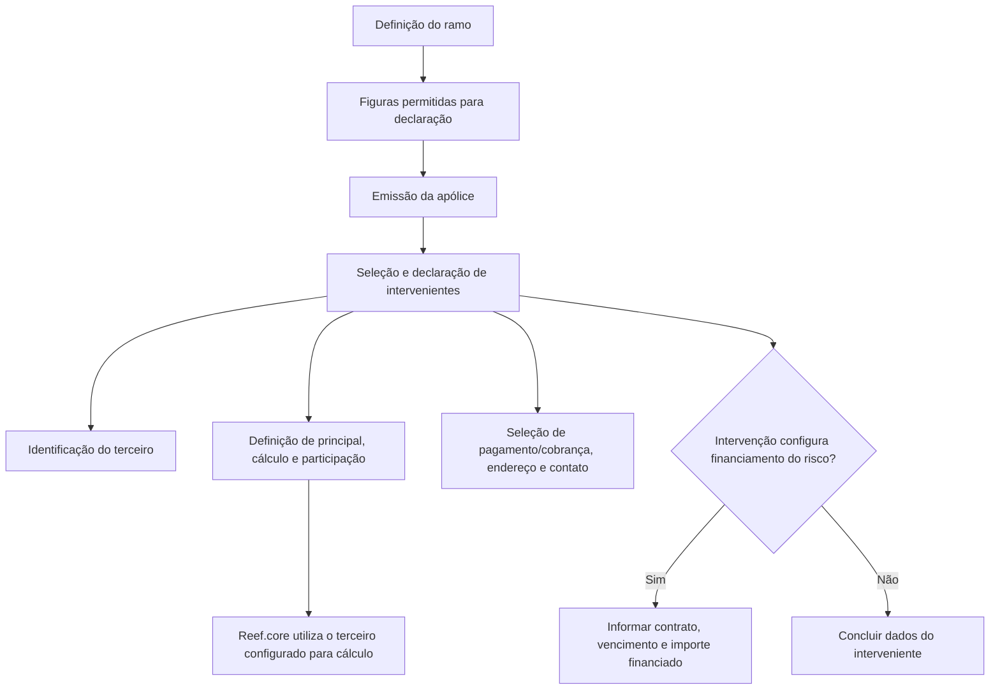

# Intervenções de Cliente no REEF — Configuração de Intervenientes em Apólices

## 1. Metadados do Documento
- **Arquivo de Origem:** Não identificado no conteúdo extraído
- **Tipo de Documento:** Manual Operacional
- **Domínio / Sistema:** REEF / Reef.core / Gestão de apólices
- **Público-Alvo:** Negócio, Operação, Analistas Funcionais e Desenvolvedores
- **Data/Versão Identificada:** Não identificada

---

## 2. Resumo Executivo & Contexto de Negócio

O documento descreve a funcionalidade de **Intervenções de Cliente** no sistema REEF, utilizada para determinar quais pessoas participam de uma apólice ou aplicação e de que forma essas pessoas participam. A definição prévia do ramo estabelece quais figuras podem ser declaradas; durante a emissão, são selecionadas as pessoas correspondentes.

A operação de intervenções contempla as ações de **criar**, **modificar**, **borrar** e **inabilitar**. O documento não detalha os critérios de autorização, interfaces, contratos técnicos ou efeitos de cada ação no ciclo de vida da apólice.

Para cada interveniente, o documento apresenta atributos de identificação, participação, cálculo, pagamento ou cobrança, endereço, meios de contato e sinalização de pessoa importante. Alguns campos são condicionados à definição configurada para a intervenção ou para o ramo.

Quando uma intervenção está configurada para indicar o terceiro que financia o risco segurado, o documento solicita informações específicas de financiamento: número de contrato, data de vencimento da financiamento e importe financiado pendente. Não são fornecidas regras adicionais para validação dos valores financeiros ou integração com sistemas externos.

---

## 3. Arquitetura, Componentes & Tecnologias Envolvidas

### Componentes e conceitos identificados

| Componente / Conceito | Papel descrito no documento |
| :--- | :--- |
| REEF | Sistema ou domínio no qual ocorre a gestão de intervenções de cliente. |
| Reef.core | Componente citado como responsável por utilizar o terceiro selecionado no campo **Cálculo** para realizar cálculos. |
| Ramo | Definição na qual são declaradas as figuras que podem ser informadas como intervenientes. |
| Apólice / aplicação | Contexto operacional no qual o terceiro informa o meio de pagamento ou cobrança, endereço e meio de contato a utilizar. |
| Interveniente | Terceiro associado a uma figura definida no ramo. |
| Terceiro | Pessoa identificada e associada a uma intervenção. |
| Financiamento | Configuração opcional de intervenção para identificar quem financia o risco segurado. |

### Fluxo funcional identificado



> **Nota de Análise:** O documento menciona REEF e Reef.core, mas não detalha arquitetura de infraestrutura, APIs, métodos HTTP, contratos JSON, bancos de dados, ambientes, URLs, portas ou tecnologias de implementação.

---

## 4. Regras de Negócio, Especificações Funcionais & Processos

### 4.1 Finalidade das intervenções de cliente

1. A funcionalidade determina quais pessoas intervêm em uma apólice.
2. A funcionalidade também determina a forma de participação dessas pessoas.
3. As figuras elegíveis devem ter sido declaradas previamente na definição do ramo.
4. Durante o processo de emissão, determina-se quais pessoas serão efetivamente declaradas.

### 4.2 Ações possíveis

O documento lista quatro ações possíveis para intervenções de cliente:

1. **CREAR**
2. **MODIFICAR**
3. **BORRAR**
4. **INHABILITAR**

> **Nota de Análise:** O documento apenas enumera as ações; não descreve regras de transição, validações, consequências operacionais, permissões ou distinções entre borrar e inabilitar.

### 4.3 Regras para identificação do interveniente

1. O campo **Tipo beneficiário** determina sobre qual figura definida no ramo os terceiros serão incorporados.
2. O campo **Tipo de documento** identifica o documento utilizado para identificar o interveniente.
3. Os documentos devem estar previamente definidos conforme referência a um enlace identificado como `[tip_docum]`.
4. O campo **Documento** contém o número do documento relacionado ao tipo de documento selecionado.
5. O documento indica que uma consulta pode ser utilizada para acessar, modificar ou criar o registro relacionado ao documento, mas o nome da consulta não foi preservado na extração.

### 4.4 Regras para múltiplos terceiros na mesma intervenção

1. Quando existir mais de um terceiro em uma mesma intervenção, a configuração pode permitir que a pessoa responsável pela operação escolha o terceiro **Principal**.
2. Quando existir mais de um terceiro em uma mesma intervenção, a configuração pode permitir que a pessoa responsável pela operação escolha o terceiro utilizado por **Reef.core** para realizar cálculos.
3. O documento não afirma que o terceiro principal e o terceiro utilizado para cálculo devem ser o mesmo terceiro.

### 4.5 Regras de participação percentual

1. O campo **Porcentaje de participación** é exigido conforme a definição realizada.
2. Dependendo da definição, a soma dos percentuais declarados pode precisar ser igual a **100 por cento**.
3. O documento não especifica precisão decimal, faixa mínima, faixa máxima, arredondamento ou comportamento em caso de soma inválida.

### 4.6 Regras de preferência operacional do terceiro

O terceiro associado à intervenção pode selecionar, entre registros previamente declarados, os seguintes dados para utilização na apólice ou aplicação:

1. **Meio de pagamento/cobrança:** meio de pagamento ou cobrança que o terceiro deseja utilizar.
2. **Direção:** endereço que o terceiro deseja utilizar.
3. **Meio de contato:** meio de contato que o terceiro deseja utilizar.
4. **V.I.P.:** indicador de que o terceiro é considerado uma pessoa importante.

### 4.7 Regras para financiamento do risco segurado

Quando a intervenção estiver configurada para indicar o terceiro que financia o risco segurado, devem ser solicitados os seguintes dados:

1. **Contrato:** número do contrato.
2. **Data de vencimento da financiamento:** data de vencimento do contrato.
3. **Importe financiado:** valor restante do financiamento.

> **Nota de Análise:** O documento termina após o campo “Importe financiado” e não detalha o fluxo indicado pela frase “Si el tercero no existe”, nem informa o procedimento de cadastro, consulta ou tratamento de inexistência do terceiro.

---

## 5. Tabelas de Parâmetros, Ambientes e Estruturas de Dados

### 5.1 Ações da funcionalidade

| Item / Parâmetro | Descrição / Função | Tipo / Valores / Formato | Ambiente / Observações |
| :--- | :--- | :--- | :--- |
| CREAR | Criar uma intervenção de cliente. | Ação listada no documento. | Critérios e efeitos não detalhados. |
| MODIFICAR | Modificar uma intervenção de cliente. | Ação listada no documento. | Critérios e efeitos não detalhados. |
| BORRAR | Excluir uma intervenção de cliente. | Ação listada no documento. | Critérios e efeitos não detalhados. |
| INHABILITAR | Inabilitar uma intervenção de cliente. | Ação listada no documento. | Critérios e efeitos não detalhados. |

### 5.2 Campos do interveniente

| Item / Parâmetro | Descrição / Função | Tipo / Valores / Formato | Ambiente / Observações |
| :--- | :--- | :--- | :--- |
| Tipo beneficiário | Determina a figura definida no ramo na qual os terceiros serão incorporados. | Figura definida no ramo. | O valor depende das figuras declaradas previamente no ramo. |
| Tipo de documento | Define o documento usado para identificar o interveniente. | Documento previamente definido. | O texto referencia o enlace `[tip_docum]`. |
| Documento | Armazena o número do documento relacionado ao tipo de documento. | Número de documento. | O texto menciona uma consulta para acessar, modificar ou criar o registro, sem identificá-la. |
| Principal | Indica o terceiro considerado principal em uma mesma intervenção com mais de um terceiro. | Seleção de terceiro. | Possível sob definição/configuração. |
| Cálculo | Indica o terceiro que Reef.core utilizará para realizar cálculos. | Seleção de terceiro. | Possível sob definição/configuração. |
| Porcentaje de participación | Registra o percentual de participação do interveniente. | Percentual. | Pode ser obrigatório; a soma pode ter de ser 100 por cento conforme definição. |
| Medio de pago/cobro | Define o meio de pagamento ou cobrança que o terceiro quer utilizar. | Meio previamente declarado. | Aplicável à apólice ou aplicação em operação. |
| Dirección | Define o endereço que o terceiro quer utilizar. | Endereço previamente declarado. | Aplicável à apólice ou aplicação em operação. |
| Medio de contacto | Define o meio de contato que o terceiro quer utilizar. | Meio de contato previamente declarado. | Aplicável à apólice ou aplicação em operação. |
| V.I.P. | Indica se o terceiro é considerado uma pessoa importante. | Indicador. | O documento não apresenta valores ou comportamento do indicador. |

### 5.3 Campos de financiamento do risco segurado

| Item / Parâmetro | Descrição / Função | Tipo / Valores / Formato | Ambiente / Observações |
| :--- | :--- | :--- | :--- |
| Contrato | Registra o número do contrato de financiamento. | Número de contrato. | Solicitado quando a intervenção configura quem financia o risco segurado. |
| Fecha de vencimiento de la financiación | Registra a data de vencimento do contrato. | Data. | Solicitada no contexto de financiamento do risco segurado. |
| Importe financiado | Registra o valor restante do financiamento. | Valor monetário não especificado. | O documento não especifica moeda, precisão ou regra de cálculo. |

### 5.4 Ambientes, rotas e integrações

| Item / Parâmetro | Descrição / Função | Tipo / Valores / Formato | Ambiente / Observações |
| :--- | :--- | :--- | :--- |
| Ambientes | Não identificados. | Não informado. | O documento não apresenta ambientes. |
| URLs | Não identificadas. | Não informado. | O documento não apresenta URLs. |
| Rotas de log | Não identificadas. | Não informado. | O documento não apresenta rotas ou parâmetros de log. |
| APIs / contratos | Não identificados. | Não informado. | O documento não detalha APIs, métodos HTTP ou payloads. |

---

## 6. Bateria de Perguntas & Respostas para RAG (FAQ Sintético)

### P1: Qual é a finalidade da funcionalidade de Intervenções de Cliente no REEF?
**R:** A funcionalidade de Intervenções de Cliente determina quais pessoas participam de uma apólice e de que forma participam. As figuras permitidas são declaradas anteriormente na definição do ramo, e durante a emissão são determinadas as pessoas que serão efetivamente informadas.

### P2: Quais ações estão disponíveis para uma intervenção de cliente?
**R:** O documento lista quatro ações: CREAR, MODIFICAR, BORRAR e INHABILITAR. Não há detalhamento sobre permissões, validações, efeitos de negócio ou diferenças operacionais entre borrar e inabilitar.

### P3: Para que serve o campo Tipo beneficiário?
**R:** O campo Tipo beneficiário determina sobre qual figura previamente definida no ramo os terceiros serão incorporados. Portanto, as opções disponíveis dependem da definição existente para o ramo.

### P4: Como o interveniente é identificado no processo?
**R:** O interveniente é identificado por meio dos campos Tipo de documento e Documento. O Tipo de documento deve corresponder a um documento previamente definido, e o campo Documento armazena o número associado ao tipo selecionado.

### P5: O que representa o campo Principal quando existem vários terceiros em uma intervenção?
**R:** Quando existe mais de um terceiro na mesma intervenção, pode haver configuração que permita à pessoa responsável pela operação selecionar qual terceiro será considerado principal. O documento não define critérios para essa escolha.

### P6: Qual terceiro o Reef.core usa para realizar cálculos?
**R:** O campo Cálculo permite selecionar, sob definição configurada, qual terceiro será utilizado pelo Reef.core para realizar cálculos quando existir mais de um terceiro em uma mesma intervenção.

### P7: A soma dos percentuais de participação sempre deve ser igual a 100 por cento?
**R:** Não necessariamente. O documento informa que o campo Porcentaje de participación será requerido conforme a definição realizada e que, se a definição assim determinar, a soma dos percentuais declarados deverá ser 100 por cento.

### P8: Quais preferências do terceiro podem ser escolhidas para uma apólice ou aplicação?
**R:** O terceiro pode escolher entre meios de pagamento ou cobrança previamente declarados, direções previamente declaradas e meios de contato previamente declarados para utilização na apólice ou aplicação sobre a qual a operação está sendo realizada.

### P9: O que significa o indicador V.I.P. do interveniente?
**R:** O indicador V.I.P. informa se o terceiro é considerado uma pessoa importante. O documento não detalha os valores permitidos, o impacto operacional ou regras associadas ao indicador.

### P10: Quais dados são solicitados quando um terceiro financia o risco segurado?
**R:** Quando a intervenção está configurada para identificar o terceiro que financia o risco segurado, devem ser solicitados o número do contrato, a data de vencimento da financiamento e o importe financiado, definido como o valor restante da financiamento.

### P11: O documento explica o que acontece se o terceiro não existir?
**R:** Não. O texto apresenta a frase “Si el tercero no existe”, mas a extração termina antes de fornecer qualquer procedimento, regra de cadastro ou tratamento operacional para essa situação.

### P12: O documento apresenta APIs, URLs ou ambientes para integrar com Intervenções de Cliente?
**R:** Não. O conteúdo extraído não fornece URLs, ambientes, portas, APIs, métodos HTTP, contratos JSON, logs ou detalhes de infraestrutura.

---

## 7. Glossário de Termos, Siglas & Conceitos-Chave

- **REEF:** Sistema ou domínio mencionado como contexto da funcionalidade de Intervenções de Cliente.
- **Reef.core:** Componente citado como utilizador do terceiro selecionado no campo Cálculo para realizar cálculos.
- **Ramo:** Definição na qual são declaradas as figuras que podem ser informadas durante a emissão.
- **Intervenção:** Contexto em que um ou mais terceiros são associados a uma figura definida no ramo.
- **Interveniente:** Terceiro participante de uma intervenção.
- **Terceiro:** Pessoa associada à intervenção e identificada por documento.
- **Principal:** Terceiro selecionado como principal quando houver mais de um terceiro em uma mesma intervenção.
- **Cálculo:** Seleção do terceiro que será utilizado por Reef.core para realizar cálculos.
- **Porcentaje de participación:** Percentual de participação do interveniente, potencialmente sujeito à regra de soma igual a 100 por cento.
- **V.I.P.:** Indicador de que o terceiro é considerado uma pessoa importante.
- **Financiamento:** Contexto no qual o interveniente é identificado como terceiro que financia o risco segurado.
- **Importe financiado:** Valor restante da financiamento.

---

## 8. Notas Críticas, Riscos & Limitações

- O documento não identifica o arquivo de origem, data, versão, autor técnico ou escopo de versão do REEF.
- O conteúdo não detalha APIs, integrações, contratos, persistência, URLs, ambientes, portas, autenticação ou observabilidade.
- As ações CREAR, MODIFICAR, BORRAR e INHABILITAR são listadas sem definição de regras, permissões ou consequências.
- Não são apresentados critérios de obrigatoriedade para todos os campos; diversos campos dependem de “definição” ou “configuração” não descrita.
- O documento não explica se o terceiro Principal deve coincidir com o terceiro de Cálculo.
- Não há regra detalhada para validação do percentual de participação além da possibilidade de soma igual a 100 por cento.
- A seção iniciada por “Si el tercero no existe” está incompleta na extração disponível.
- Caracteres corrompidos, como ``, estão presentes no conteúdo bruto extraído; esta estrutura preserva o texto original para auditoria.

---

## 9. Conteúdo Bruto Estruturado (Referência Fiel)

```text
--- [PÁGINA 1 DE 3] ---

EN CONSTRUCCIÓN
INTERVENCIONES DE CLIENTE
En que consiste
En este punto se determina qué personas y de qué forma intervienen en la póliza. Es decir, En la denición del ramo se declaró qué guras
podían ser declaradas en este punto y en el momento de emitir se determina cuales son esas personas.
Posibles acciones
 CREAR ( )
 MODIFICAR ( )
 BORRAR ( )
 INHABILITAR ( )
Proceso a seguir
A continuación detalla las información requerida.
Documentation / DOCUMENTACIÓN Reef
DOCUMENTACIÓN Reef
Mapfredocument
DOCUMENTACIÓN Reef
Owner
user:agonzalez_mapfre.com
Lifecycle
Approved Source
 / 
 VL
Buscar Inicio Soluciones Arquitecturas APIs Componentes Cloud Documentación Zeus Reef Ayuda
ES


--- [PÁGINA 2 DE 3] ---

INTERVINIENTE
Tipo beneciario (  )
Se determina sobre qué gura de las denidas en el [ramo][] se van a incorporar los terceros.
Tipo de documento (  )
En este punto se debe indicar el documento con el que se identicará al interviniente. Los documentos deben estar previamente denidos
según se indica en el siguiente [enlace][tip_docum].
Documento (  )
Este campo alberga el número del documento que está relacionado con el campo anterior.
Se puede utilizar la consulta  para, además de acceder a la consulta, modicarlo o incluso crearlo.
Principal (  )
En caso que exista más de un tercero para una misma intervención, es posible (bajo denición) que la persona que realiza la operación elija
cual será el tercero que que se considera como principal.
Cálculo (  )
En caso que exista más de un tercero para una misma intervención, es posible (bajo denición) que la persona que realiza la operación elija
cual será el tercero que utilizará Reef.core a la hora de realizar cálculos
Porcentaje de participación (  )
Este campo será requerido según la denición realizada y, es posible que la suma de porcentajes declarados deba ser el 100 por cien si así se
ha denido
Medio de pago/cobro (   )
En este punto es posible elegir de entre los distintos medios de pago o cobro declarados, cual es la que el tercero de la intervención quiere
utilizar en la póliza/aplicación sobre la que se está realizando la operación.
Dirección (   )
En este punto es posible elegir de entre las distintas direcciones declaradas, cual es la que el tercero de la intervención quiere utilizar en la
póliza/aplicación sobre la que se está realizando la operación.
Medio de contacto (   )
En este punto es posible elegir de entre los distintos medios de contacto declarados, cual es el que el tercero de la intervención quiere utilizar
en la póliza/aplicación sobre la que se está realizando la operación.
V.I.P. (  )
Indicaría si el tercero se considera una persona importante.
INTERVINIENTE
En el caso que se halla congurado en la intervención, se supone que se está indicando quien es el tercero que está nanciando el riesgo
asegurado y en este punto se solicita:
Contrato (  )
El número de contrato.
Fecha de vencimiento de la nanciación (  )
La fecha de vencimiento del contrato.
Si el tercero no existe


--- [PÁGINA 3 DE 3] ---

Importe nanciado (  )
El importe que resta de la nanciación.
```
