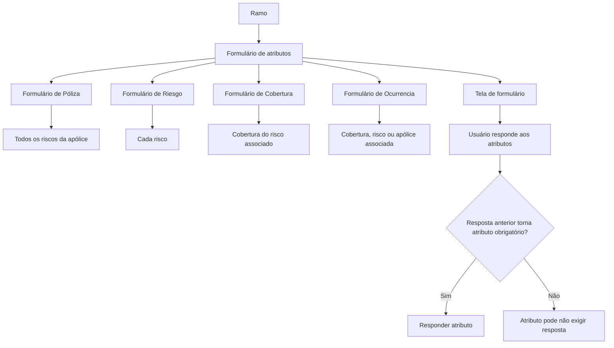

# Formulários de Atributos em Construção — Documentação Reef

## 1. Metadados do Documento
- **Arquivo de Origem:** Não identificado
- **Tipo de Documento:** Manual Operacional
- **Domínio / Sistema:** Reef / Mapfredocument
- **Público-Alvo:** Negócio, operação e usuários responsáveis pelo preenchimento de formulários
- **Data/Versão Identificada:** Não identificada

---

## 2. Resumo Executivo & Contexto de Negócio

O documento descreve o processo de preenchimento de formulários de atributos definidos em um ramo. Esses formulários são apresentados em tela e requerem respostas do usuário para registrar atributos associados a uma apólice, risco, cobertura ou ocorrência.

A abrangência de cada formulário depende do nível em que ele foi definido. Um formulário de **Póliza** afeta todos os riscos da apólice; um formulário de **Riesgo** afeta cada risco individualmente; um formulário de **Cobertura** afeta a cobertura do risco ao qual está associado; e um formulário de **Ocurrencia** afeta a cobertura, o risco ou a apólice à qual está associado.

O processo operacional consiste em responder aos atributos exibidos. O documento ressalta que a obrigatoriedade de alguns atributos pode depender das respostas fornecidas anteriormente. Portanto, não é necessariamente obrigatório responder a todos os atributos apresentados.

O conteúdo está identificado como documentação Reef e apresenta referências de navegação ao ambiente documental, incluindo Mapfredocument, além de indicar ciclo de vida **Approved**. Não há detalhamento sobre regras de validação específicas, tipos de campo, integrações, APIs, armazenamento das respostas ou critérios técnicos de obrigatoriedade condicional.

---

## 3. Arquitetura, Componentes & Tecnologias Envolvidas

| Componente / Termo | Descrição sustentada pelo documento |
| :--- | :--- |
| Reef | Contexto documental identificado como “DOCUMENTACIÓN Reef”. |
| Mapfredocument | Elemento citado na navegação/documentação. |
| Formulários de atributos | Formulários definidos em um ramo e preenchidos pelo usuário. |
| Póliza | Nível de formulário que afeta todos os riscos da apólice. |
| Riesgo | Nível de formulário que afeta cada risco da apólice. |
| Cobertura | Nível de formulário associado a uma cobertura de risco. |
| Ocurrencia | Nível de formulário associado a uma cobertura, risco ou apólice. |
| Tela de formulário | Interface em que o usuário responde aos atributos apresentados. |



> **Nota de Análise:** O documento não detalha arquitetura de software, tecnologias de implementação, endpoints, métodos HTTP, banco de dados, contratos JSON, autenticação ou integração entre Reef e Mapfredocument.

---

## 4. Regras de Negócio, Especificações Funcionais & Processos

### Definição dos formulários
1. O formulário deve ter sido definido no ramo.
2. Os formulários podem ser definidos em múltiplos níveis de escopo.
3. O escopo determina quais entidades são afetadas pelo formulário.

### Escopos de formulário
1. **Póliza:** afeta todos os riscos da apólice.
2. **Riesgo:** afeta cada um dos riscos da apólice.
3. **Cobertura:** afeta a cobertura do risco ao qual o formulário está associado.
4. **Ocurrencia:** afeta a cobertura, o risco ou a apólice aos quais está associado.

### Processo de preenchimento
1. O usuário visualiza em tela o formulário de atributos.
2. O usuário responde aos atributos apresentados.
3. A quantidade de atributos que precisa ser respondida depende das respostas já fornecidas.
4. Um atributo pode deixar de ser obrigatório de acordo com as respostas dadas a atributos anteriores.
5. Não é obrigatório responder a todos os atributos do formulário em todas as situações.

### Restrição funcional identificada
- A obrigatoriedade dos atributos é condicional e depende de respostas anteriores.
- O documento não informa quais atributos condicionam outros atributos, quais valores acionam obrigatoriedade nem como a validação é executada.

---

## 5. Tabelas de Parâmetros, Ambientes e Estruturas de Dados

| Item / Parâmetro | Descrição / Função | Tipo / Valores / Formato | Ambiente / Observações |
| :--- | :--- | :--- | :--- |
| Formulário de Póliza | Afeta todos os riscos da apólice. | Escopo de formulário | Definido no ramo. |
| Formulário de Riesgo | Afeta cada risco da apólice. | Escopo de formulário | Definido no ramo. |
| Formulário de Cobertura | Afeta a cobertura do risco associado. | Escopo de formulário | Definido no ramo. |
| Formulário de Ocurrencia | Afeta a cobertura, o risco ou a apólice associados. | Escopo de formulário | Definido no ramo. |
| Atributo | Campo ou informação para resposta no formulário apresentado em tela. | Não especificado | Pode possuir obrigatoriedade condicional. |
| Resposta anterior | Resposta dada a um atributo prévio, capaz de influenciar a obrigatoriedade de outro atributo. | Não especificado | Regra condicional mencionada sem detalhamento. |
| Lifecycle | Estado de ciclo de vida exibido na documentação. | `Approved` | Identificado no conteúdo de navegação. |
| Owner | Proprietário exibido na documentação. | `user:agonzalez_mapfre.com` | Valor reproduzido do documento. |
| Documentação | Referência documental do conteúdo. | `DOCUMENTACIÓN Reef` | Também há referência a Mapfredocument. |

---

## 6. Bateria de Perguntas & Respostas para RAG (FAQ Sintético)

### P1: Em que consiste o processo de atributos em construção?
**R:** O processo consiste em preencher um formulário de atributos definido em um ramo. O usuário responde, na tela, aos atributos apresentados pelo formulário.

### P2: Quais são os níveis de escopo dos formulários de atributos?
**R:** O documento identifica quatro níveis: Póliza, Riesgo, Cobertura e Ocurrencia.

### P3: O que um formulário definido no nível Póliza afeta?
**R:** Um formulário de Póliza afeta todos os riscos da apólice.

### P4: O que um formulário definido no nível Riesgo afeta?
**R:** Um formulário de Riesgo afeta cada um dos riscos da apólice.

### P5: A que entidade um formulário de Cobertura está associado?
**R:** Um formulário de Cobertura afeta a cobertura do risco ao qual está associado.

### P6: O que um formulário de Ocurrencia pode afetar?
**R:** Um formulário de Ocurrencia pode afetar a cobertura, o risco ou a apólice à qual está associado.

### P7: É obrigatório responder todos os atributos apresentados no formulário?
**R:** Não necessariamente. O documento informa que alguns atributos podem não ser obrigatórios, dependendo das respostas fornecidas a atributos anteriores.

### P8: Como é determinada a quantidade de atributos que devem ser respondidos?
**R:** A quantidade de atributos a responder depende das respostas apresentadas pelo usuário, pois respostas anteriores podem determinar que determinados atributos não sejam obrigatórios.

### P9: O documento especifica quais respostas tornam um atributo obrigatório ou opcional?
**R:** Não. O documento apenas informa que a obrigatoriedade pode depender de respostas anteriores, sem listar atributos, valores condicionantes ou regras detalhadas.

### P10: O documento descreve APIs, métodos HTTP ou contratos de integração do Reef?
**R:** Não. O conteúdo menciona a documentação Reef e Mapfredocument, mas não apresenta endpoints, métodos HTTP, contratos JSON ou detalhes de integração.

---

## 7. Glossário de Termos, Siglas & Conceitos-Chave

- **Atributo:** Informação ou campo que deve ser respondido pelo usuário no formulário.
- **Cobertura:** Entidade associada a um risco, afetada por formulários definidos no nível Cobertura.
- **Formulário:** Estrutura apresentada em tela para coleta de respostas de atributos.
- **Ocurrencia:** Escopo de formulário que pode afetar uma cobertura, um risco ou uma apólice associada.
- **Póliza:** Escopo de formulário que afeta todos os riscos de uma apólice.
- **Reef:** Nome identificado no contexto da documentação apresentada.
- **Riesgo:** Escopo de formulário que afeta individualmente cada risco.
- **Ramo:** Contexto no qual os formulários são definidos.

---

## 8. Notas Críticas, Riscos & Limitações

- O documento não especifica os atributos existentes, seus tipos, formatos, valores permitidos ou obrigatoriedade individual.
- Não há matriz de decisão para identificar quais respostas anteriores tornam outros atributos obrigatórios ou opcionais.
- Não foram identificados detalhes de persistência, auditoria, validação, mensagens de erro ou tratamento de exceções.
- Não há descrição de APIs, integrações, ambientes, servidores, URLs, logs ou componentes técnicos de backend.
- A segunda página foi identificada como página em branco ou contendo apenas elementos visuais/imagem.
- **Nota de Análise:** O conteúdo descreve o comportamento funcional dos formulários, mas não detalha contratos técnicos ou regras condicionais específicas.

---

## 9. Conteúdo Bruto Estruturado (Referência Fiel)

```text
--- [PÁGINA 1 DE 2] ---

EN CONSTRUCCIÓN
ATRIBUTOS
En que consiste
Cumplimentar el formulario que ha sido denido en el ramo. Los formularios pueden estar denidos en varios niveles. Estos son:
FORMULARIO DE... ÁMBITO DEL FORMULARIO QUE AFECTA A
Póliza Todos los riesgos de la póliza
Riesgo Cada uno de los riesgos de la póliza
Cobertura Aquella cobertura del riesgo al que está asociado
Ocurrencia Aquella cobertura, riesgo o póliza a la que está asociado
Proceso a seguir
Dar respuesta al formulario que se presenta en pantalla. El número de atributos a los que hay que responder dependerá de las respuestas que
se aporten ya que es posible que algún atributo no sea obligatorio dependiendo de respuestas dados a atributos anteriores. Es decir, no se
tiene porque contestar a todos.
Documentation / DOCUMENTACIÓN Reef
DOCUMENTACIÓN Reef
Mapfredocument
DOCUMENTACIÓN Reef
Owner
user:agonzalez_mapfre.com
Lifecycle
Approved Source
 / 
 VL
Buscar Inicio Soluciones Arquitecturas APIs Componentes Cloud Documentación Zeus Reef Ayuda
ES

--- [PÁGINA 2 DE 2] ---

[Página em branco ou apenas elementos visuais/imagem]
```
