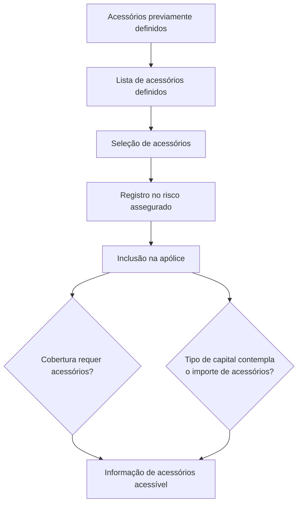

# Gestão de Acessórios no Risco Assegurado — Documentação Reef

## 1. Metadados do Documento
- **Arquivo de Origem:** `Não identificado`
- **Tipo de Documento:** Manual Operacional
- **Domínio / Sistema:** Reef / Mapfre — gestão de acessórios de risco em apólices
- **Público-Alvo:** Negócio, operação e usuários responsáveis pelo registro de riscos assegurados
- **Data/Versão Identificada:** Não identificada

---

## 2. Resumo Executivo & Contexto de Negócio

O documento descreve a funcionalidade **ACCESORIOS**, destinada ao registro dos acessórios que estarão segurados em uma apólice. Os acessórios são incluídos no risco assegurado e passam a compor as informações disponíveis durante a gestão da apólice.

A disponibilidade da informação de acessórios está vinculada a duas condições apresentadas: a definição de uma cobertura requer acessórios ou o tipo de capital de uma cobertura contempla o valor dos acessórios. O documento não detalha como essas condições são configuradas no sistema Reef.

Antes de serem associados ao risco, os acessórios devem estar previamente definidos. A partir da lista de acessórios definidos, o usuário pode selecionar aqueles que devem ser incluídos na apólice.

A funcionalidade apresenta as ações possíveis de criar, modificar, excluir e inabilitar acessórios. Para cada acessório selecionado, são apresentados identificador, descrição, valor, observações e indicação de baixa. O valor pode ser alterado desde que permaneça entre os limites mínimo e máximo permitidos.

---

## 3. Arquitetura, Componentes & Tecnologias Envolvidas

O conteúdo cita o ambiente de documentação **Reef**, com referências a **Mapfre**, **Mapfredocument**, **Zeus**, soluções, arquiteturas, APIs, componentes, cloud e documentação. Contudo, o documento não descreve arquitetura técnica, integrações, microsserviços, endpoints, protocolos, bancos de dados ou tecnologias de implementação.

Componentes e conceitos explicitamente mencionados:

| Componente / Conceito | Papel identificado no documento |
| :--- | :--- |
| Reef | Ambiente ou sistema onde a documentação e a gestão descrita estão disponíveis. |
| Risco assegurado | Entidade na qual os acessórios são registrados. |
| Apólice | Contexto contratual no qual os acessórios são incluídos e segurados. |
| Cobertura | Definição que pode requerer acessórios ou contemplar seu valor no tipo de capital. |
| Tipo de capital | Elemento de cobertura que pode contemplar o valor de acessórios. |
| Lista de acessórios definidos | Fonte de seleção dos acessórios que podem ser incluídos na apólice. |
| Mapfre / Mapfredocument | Referências exibidas no conteúdo de navegação e documentação. |
| Zeus | Referência exibida no conteúdo de navegação. |



> **Nota de Análise:** O documento não detalha a arquitetura de software do Reef, a persistência dos acessórios, os contratos de integração, métodos HTTP, APIs ou regras técnicas de autorização.

---

## 4. Regras de Negócio, Especificações Funcionais & Processos

### Objetivo funcional
- Registrar no risco os acessórios que estarão assegurados na apólice.
- Permitir a seleção, a partir de uma lista previamente definida, dos acessórios que serão incluídos na apólice.

### Condições de acesso à informação de acessórios
A informação de acessórios estará acessível quando ocorrer pelo menos uma das condições abaixo:
1. A definição de alguma cobertura indicar que requer acessórios.
2. O tipo de capital de alguma cobertura contemplar o valor dos acessórios.

### Pré-requisito para inclusão
- Os acessórios a incluir no risco devem ser definidos previamente.
- Somente acessórios presentes na lista de acessórios definidos podem ser selecionados para inclusão na apólice.

### Ações possíveis
- **Criar**
- **Modificar**
- **Excluir**
- **Inabilitar**

> **Nota de Análise:** O documento lista as ações possíveis, porém não detalha os critérios, permissões, efeitos ou etapas específicas para criar, modificar, excluir ou inabilitar um acessório.

### Dados do acessório

#### Acessório
- Exibe a chave que identifica o acessório selecionado.

#### Nome do acessório
- Contém a descrição que identifica o acessório.

#### Importe
- Contém o valor do acessório expresso na moeda da apólice.
- Exibe o valor do acessório previamente definido.
- O valor pode ser modificado somente quando o novo valor estiver entre o valor mínimo e o valor máximo permitido.

#### Observação
- Permite registrar qualquer informação adicional que se deseje indicar para o acessório.

#### Baixa
- Indica se o acessório continua integrando o risco assegurado.
- Também indica se o acessório já não está amparado pela apólice.

---

## 5. Tabelas de Parâmetros, Ambientes e Estruturas de Dados

| Item / Parâmetro | Descrição / Função | Tipo / Valores / Formato | Ambiente / Observações |
| :--- | :--- | :--- | :--- |
| Acessório | Exibe a chave que identifica o acessório selecionado. | Chave identificadora; formato não detalhado. | O acessório deve ter sido previamente definido. |
| Nome do acessório | Contém a descrição que identifica o acessório. | Descrição; formato não detalhado. | Associado ao acessório selecionado. |
| Importe | Contém o valor do acessório. | Valor expresso na moeda da apólice. | Pode ser modificado entre o valor mínimo e o valor máximo permitido. |
| Valor mínimo | Limite inferior para alteração do importe. | Valor; formato não detalhado. | O documento não informa como o limite é definido. |
| Valor máximo | Limite superior para alteração do importe. | Valor; formato não detalhado. | O documento não informa como o limite é definido. |
| Observação | Armazena informação adicional sobre o acessório. | Texto; formato não detalhado. | Campo opcional ou obrigatório não especificado. |
| Baixa | Indica se o acessório continua no risco assegurado ou não está mais amparado pela apólice. | Indicador; valores não detalhados. | O documento não especifica os valores possíveis do indicador. |
| Criar | Ação disponível para acessórios. | Ação funcional. | Processo não detalhado. |
| Modificar | Ação disponível para acessórios. | Ação funcional. | O importe possui regra explícita de intervalo permitido. |
| Excluir | Ação disponível para acessórios. | Ação funcional. | Efeitos sobre a apólice não detalhados. |
| Inabilitar | Ação disponível para acessórios. | Ação funcional. | Diferença funcional em relação à baixa não detalhada. |
| Moeda da apólice | Moeda na qual o importe do acessório é expresso. | Moeda; código ou formato não detalhado. | Associada à apólice. |

---

## 6. Bateria de Perguntas & Respostas para RAG (FAQ Sintético)

### P1: Qual é a finalidade da funcionalidade ACCESORIOS?
**R:** A funcionalidade ACCESORIOS serve para registrar no risco os acessórios que estarão assegurados na apólice.

### P2: Quando as informações de acessórios ficam acessíveis no risco assegurado?
**R:** As informações de acessórios ficam acessíveis quando a definição de alguma cobertura indica que requer acessórios ou quando o tipo de capital de alguma cobertura contempla o valor dos acessórios.

### P3: Um acessório pode ser incluído diretamente no risco sem cadastro prévio?
**R:** Não. O documento determina que os acessórios a incluir no risco devem estar previamente definidos. A inclusão ocorre mediante seleção a partir da lista de acessórios definidos.

### P4: Quais operações estão disponíveis para a gestão de acessórios?
**R:** O documento lista quatro ações possíveis para acessórios: criar, modificar, excluir e inabilitar. Não há detalhamento adicional sobre os fluxos ou regras de cada ação.

### P5: O que o campo Acessório apresenta?
**R:** O campo Acessório mostra a chave que identifica o acessório selecionado.

### P6: Como é definido o valor de um acessório na apólice?
**R:** O campo Importe contém o valor do acessório expresso na moeda da apólice. Inicialmente, é exibido o valor do acessório previamente definido.

### P7: Em quais condições o importe de um acessório pode ser alterado?
**R:** O importe pode ser modificado somente se o novo valor estiver entre o valor mínimo e o valor máximo permitido.

### P8: Qual é a finalidade do campo Observação?
**R:** O campo Observação contém qualquer informação adicional que se queira indicar para o acessório.

### P9: O que a indicação de Baixa informa sobre um acessório?
**R:** A indicação de Baixa informa se o acessório ainda faz parte do risco assegurado ou se já não está amparado pela apólice.

### P10: O documento informa como são calculados ou configurados os valores mínimo e máximo do importe?
**R:** Não. O documento apenas estabelece que o novo importe deve permanecer entre o valor mínimo e o valor máximo permitido, sem explicar a origem, o cálculo ou a configuração desses limites.

---

## 7. Glossário de Termos, Siglas & Conceitos-Chave

- **ACCESORIOS:** Funcionalidade para registrar acessórios que estarão segurados em uma apólice.
- **Acessório:** Elemento previamente definido que pode ser selecionado e incluído no risco assegurado.
- **Apólice:** Contexto no qual os acessórios são incluídos e ficam assegurados.
- **Baixa:** Indicador de que o acessório continua fazendo parte do risco assegurado ou já não está amparado pela apólice.
- **Cobertura:** Definição que pode requerer acessórios ou cujo tipo de capital pode contemplar o valor dos acessórios.
- **Importe:** Valor do acessório, expresso na moeda da apólice.
- **Risco assegurado:** Risco no qual os acessórios são registrados.
- **Reef:** Nome exibido no ambiente de documentação.
- **Tipo de capital:** Elemento de uma cobertura que pode contemplar o valor de acessórios.

---

## 8. Notas Críticas, Riscos & Limitações

- O documento não informa o nome do arquivo de origem, data, versão, autor técnico ou histórico de revisões.
- Os processos de criar, modificar, excluir e inabilitar são listados, mas não possuem detalhamento operacional.
- Não há definição dos formatos de chave do acessório, nome, importe, observação ou indicador de baixa.
- Não há descrição de como são definidos os valores mínimo e máximo permitidos para o importe.
- Não é especificado se o campo Observação é obrigatório, opcional, possui limite de caracteres ou suporta estrutura padronizada.
- O documento não esclarece a diferença operacional entre **inabilitar**, **excluir** e marcar um acessório com **baixa**.
- Não são apresentados perfis de acesso, matriz de permissões, trilha de auditoria, fluxos de aprovação ou validações adicionais.
- Não há detalhes de arquitetura, integrações, APIs, contratos JSON, rotas, servidores, ambientes, logs ou mecanismos de persistência.

---

## 9. Conteúdo Bruto Estruturado (Referência Fiel)

```text
--- [PÁGINA 1 DE 2] ---

ACCESORIOS
En que consiste
Registrar en el riesgo los accesorios que estarán asegurados en la póliza.
Esta información estará accesible siempre que la denición de alguna cobertura indique que requiere accesorios, o bien, el tipo de capital de
alguna cobertura contemple el importe de accesorios.
Los accesorios a incluir en el riesgo deben estar denidos previamente. De la lista de accesorios denidos, se podrán seleccionar los que se
quieran incluir en la póliza.
Posibles acciones
 CREAR ( )
 MODIFICAR ( )
 BORRAR ( )
 INHABILITAR ( )
Proceso a seguir
A continuación detalla la información requerida.
Documentation / DOCUMENTACIÓN Reef
DOCUMENTACIÓN Reef
Mapfredocument
DOCUMENTACIÓN Reef
Owner
user:agonzalez_mapfre.com
Lifecycle
Approved Source
 / 
 VL
Buscar Inicio Soluciones Arquitecturas APIs Componentes Cloud Documentación Zeus Reef Ayuda
ES


--- [PÁGINA 2 DE 2] ---

ACCESORIOS
Accesorio
Muestra la clave que identica el accesorio seleccionado.
Nombre accesorio
Contiene la descripción que identica el accesorio.
Importe (  )
Contiene el valor del accesorio, expresado en la moneda de la póliza.
En este campo se muestra el valor del accesorio, previamente denido, que podrá modicarse siempre que el nuevo valor se encuentre
entre el valor mínimo y valor máximo permitido.
Observación (  )
Este atributo contiene cualquier información adicional que se quiera indicar para el accesorio.
Baja (  )
Indica si el accesorio sigue formando parte del riesgo asegurado, o por el contrario, ya no está amparado por la póliza.
¿se puede modicar?
```
