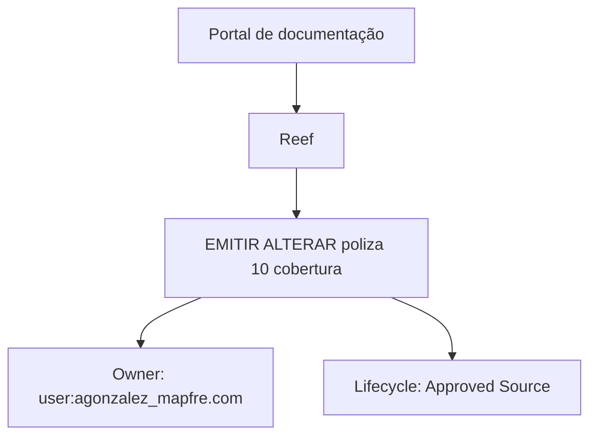

# Documentação Reef — Registro “EMITIR ALTERAR poliza 10 cobertura”

## 1. Metadados do Documento
- **Arquivo de Origem:** Não identificado
- **Tipo de Documento:** Documentação técnica — classificação inferida pelo conteúdo
- **Domínio / Sistema:** Reef / Mapfre
- **Público-Alvo:** Não identificado
- **Data/Versão Identificada:** Não identificada

---

## 2. Resumo Executivo & Contexto de Negócio

O conteúdo extraído referencia a área de documentação denominada **Reef**, associada a **Mapfre** por meio dos textos “Mapfredocument” e “user:agonzalez_mapfre.com”. O registro apresenta como título ou assunto principal: **“EMITIR ALTERAR poliza 10 cobertura”**.

O texto também contém a expressão “Documentation / DOCUMENTACIÓN Reef” e o status de ciclo de vida **“Approved Source”**. Dessa forma, o documento indica que o conteúdo é apresentado como uma fonte aprovada dentro de um portal ou repositório documental.

A navegação disponível menciona as categorias **Inicio**, **Soluciones**, **Arquitecturas**, **APIs**, **Componentes**, **Cloud**, **Documentación**, **Zeus**, **Reef** e **Ayuda**. Não há detalhamento técnico sobre funcionalidades, APIs, contratos, regras de emissão, alteração de apólice ou cobertura.

> **Nota de Análise:** O documento cita “EMITIR ALTERAR poliza 10 cobertura”, mas não define o significado de “10 cobertura”, as regras para emissão ou alteração, nem os fluxos funcionais correspondentes.

---

## 3. Arquitetura, Componentes & Tecnologias Envolvidas

O conteúdo não descreve uma arquitetura de software, integrações, microsserviços, tecnologias, servidores, APIs, bancos de dados ou ambientes técnicos.

Os únicos elementos identificáveis são referências de navegação e contexto documental:

- **Reef:** área ou domínio de documentação citado repetidamente.
- **Mapfredocument:** texto de identificação associado ao conteúdo.
- **Zeus:** item de navegação citado sem detalhamento.
- **APIs, Componentes, Cloud e Arquitecturas:** categorias de navegação citadas; o conteúdo não especifica recursos dentro delas.
- **Approved Source:** status de ciclo de vida ou aprovação exibido no registro.



> **Nota de Análise:** O diagrama representa somente relações explícitas ou diretamente organizacionais presentes no conteúdo extraído. Não representa arquitetura técnica, fluxo de dados ou integração entre sistemas.

---

## 4. Regras de Negócio, Especificações Funcionais & Processos

O conteúdo não fornece regras de negócio, critérios de validação, cálculos, condições operacionais, procedimentos passo a passo ou contratos funcionais.

Os elementos funcionais literalmente identificados são:

1. **EMITIR:** termo apresentado no título do registro.
2. **ALTERAR:** termo apresentado no título do registro.
3. **poliza:** termo apresentado no título do registro.
4. **10 cobertura:** termo apresentado no título do registro.

Não há explicação sobre:

- O processo de emissão de uma apólice.
- O processo de alteração de uma apólice.
- O significado de “poliza”.
- O significado operacional de “10 cobertura”.
- Critérios de elegibilidade, aprovação, rejeição ou validação.
- Usuários, perfis ou permissões envolvidos.
- Dados de entrada, saída ou persistência.

---

## 5. Tabelas de Parâmetros, Ambientes e Estruturas de Dados

| Item / Parâmetro | Descrição / Função | Tipo / Valores / Formato | Ambiente / Observações |
| :--- | :--- | :--- | :--- |
| Título do registro | Identificação exibida para o conteúdo | `EMITIR ALTERAR poliza 10 cobertura` | Não há detalhamento adicional |
| Área documental | Área ou domínio citado no conteúdo | `Reef` | Citado em “DOCUMENTACIÓN Reef” |
| Organização ou referência documental | Texto associado à documentação | `Mapfredocument` | Sem definição adicional |
| Owner | Proprietário exibido do conteúdo | `user:agonzalez_mapfre.com` | Valor literal extraído |
| Lifecycle | Status de ciclo de vida exibido | `Approved Source` | Sem definição de processo de aprovação |
| Idioma | Idioma exibido na interface | `ES` | O conteúdo inclui termos em espanhol |
| Navegação | Categorias exibidas no portal | `Inicio`, `Soluciones`, `Arquitecturas`, `APIs`, `Componentes`, `Cloud`, `Documentación`, `Zeus`, `Reef`, `Ayuda` | Não são descritas tecnicamente |

> **Nota de Análise:** O conteúdo não contém URLs, nomes de servidores, portas, variáveis de ambiente, caminhos de log, estruturas JSON, campos de banco de dados ou parâmetros técnicos.

---

## 6. Bateria de Perguntas & Respostas para RAG (FAQ Sintético)

### P1: Qual é o tema principal do registro da documentação Reef?
**R:** O tema principal exibido no conteúdo é “EMITIR ALTERAR poliza 10 cobertura”. O documento não explica o processo, as regras ou o significado detalhado desses termos.

### P2: Qual domínio ou sistema é citado no documento?
**R:** O domínio citado repetidamente é Reef, incluindo as expressões “Documentation / DOCUMENTACIÓN Reef” e “DOCUMENTACIÓN Reef”.

### P3: O documento detalha como emitir uma apólice?
**R:** Não. O conteúdo contém o termo “EMITIR” no título, mas não fornece etapas, pré-requisitos, regras de validação, dados obrigatórios ou integração necessária para emitir uma apólice.

### P4: O documento detalha como alterar uma apólice?
**R:** Não. O termo “ALTERAR” aparece no título do registro, sem detalhamento sobre operações permitidas, campos alteráveis, aprovações ou restrições.

### P5: O que significa “10 cobertura” no documento?
**R:** O conteúdo apenas apresenta a expressão “10 cobertura” como parte do título “EMITIR ALTERAR poliza 10 cobertura”. Não há definição funcional, técnica ou de negócio para essa expressão.

### P6: Quem é identificado como owner do conteúdo?
**R:** O owner exibido no conteúdo é `user:agonzalez_mapfre.com`.

### P7: Qual é o status de ciclo de vida do documento?
**R:** O status exibido no campo Lifecycle é `Approved Source`. O documento não descreve os critérios, responsáveis ou etapas que levam a esse status.

### P8: Quais categorias de navegação são citadas no portal?
**R:** As categorias citadas são Inicio, Soluciones, Arquitecturas, APIs, Componentes, Cloud, Documentación, Zeus, Reef e Ayuda.

### P9: O documento apresenta APIs ou contratos de integração?
**R:** Não. Embora “APIs” apareça como uma categoria de navegação, não há endpoints, métodos HTTP, autenticação, payloads, códigos de resposta ou contratos técnicos no conteúdo extraído.

### P10: Há informações sobre ambientes, servidores ou URLs?
**R:** Não. O conteúdo não apresenta URLs, ambientes, hosts, portas, servidores, credenciais, variáveis de configuração ou rotas de logs.

---

## 7. Glossário de Termos, Siglas & Conceitos-Chave

- **Reef:** nome de área, domínio ou seção de documentação citado no conteúdo. Não há expansão ou definição adicional.
- **Mapfredocument:** texto associado ao conteúdo documental; não há definição adicional.
- **Owner:** campo que identifica o proprietário do conteúdo como `user:agonzalez_mapfre.com`.
- **Lifecycle:** campo de ciclo de vida exibido com o valor `Approved Source`.
- **Approved Source:** status literal exibido no campo Lifecycle; o significado processual não é detalhado.
- **Póliza / poliza:** termo presente no título do registro; o documento não apresenta definição.
- **Cobertura:** termo presente no título do registro; o documento não apresenta definição.
- **Zeus:** item de navegação citado sem explicação funcional ou técnica.

---

## 8. Notas Críticas, Riscos & Limitações

- O conteúdo extraído é extremamente resumido e não contém especificação técnica ou funcional detalhada.
- Não há regras de negócio para emissão ou alteração de apólice.
- Não há descrição de APIs, métodos HTTP, contratos JSON, integrações, autenticação ou dados persistidos.
- Não há informações de ambiente, URL, servidor, porta, logs, monitoramento ou implantação.
- Não há definição para “10 cobertura”, “Reef”, “Zeus” ou “Mapfredocument” além das ocorrências literais.
- A classificação do documento como documentação técnica é inferida a partir dos textos de navegação e não está explicitamente declarada no conteúdo.

---

## 9. Conteúdo Bruto Estruturado (Referência Fiel)

```text
--- [PÁGINA 1 DE 1] ---

EMITIR ALTERAR poliza 10 cobertura
Documentation / DOCUMENTACIÓN Reef
DOCUMENTACIÓN Reef
Mapfredocument
DOCUMENTACIÓN Reef
Owner
user:agonzalez_mapfre.com
Lifecycle
Approved Source
 / 
 VL
Buscar Inicio Soluciones Arquitecturas APIs Componentes Cloud Documentación Zeus Reef Ayuda
ES
```
