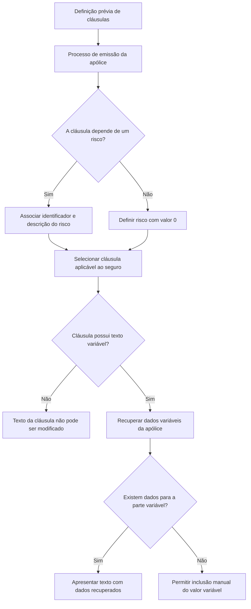

# Gestão de Cláusulas de Apólice — Documentação Reef

## 1. Metadados do Documento
- **Arquivo de Origem:** Não identificado no conteúdo fornecido
- **Tipo de Documento:** Manual Operacional
- **Domínio / Sistema:** Reef / Mapfre — gestão de cláusulas de apólice
- **Público-Alvo:** Negócio, operação e utilizadores responsáveis pela emissão de apólices
- **Data/Versão Identificada:** Não identificada

---

## 2. Resumo Executivo & Contexto de Negócio

O documento descreve a funcionalidade de gestão de **cláusulas** no contexto de emissão de apólices de seguro. Cláusulas representam condições que devem ser consideradas numa apólice segundo as características do risco assegurado.

A definição das cláusulas ocorre antes da emissão da apólice. Durante o processo de emissão, são selecionadas as cláusulas aplicáveis ao seguro que está a ser contratado. O documento cita como possíveis ações: criar, modificar, apagar e inabilitar cláusulas.

Cada cláusula pode estar associada a um risco específico ou ser aplicável ao nível da apólice. Quando a seleção não depende de um risco, o identificador de risco deve assumir o valor `0`.

O texto da cláusula pode conter informação variável dependente dos dados do contrato. Caso os dados necessários para uma parte variável não sejam encontrados ao recuperar os dados da apólice, o valor dessa parte pode ser introduzido manualmente. Nos demais casos, o texto da cláusula não pode ser alterado.

---

## 3. Arquitetura, Componentes & Tecnologias Envolvidas

Os componentes e conceitos explicitamente identificados são:

- **Reef:** contexto documental e funcional em que a gestão de cláusulas é apresentada.
- **Mapfre:** organização/sistema referenciado na documentação.
- **Apólice / Póliza:** contrato de seguro para o qual cláusulas são selecionadas.
- **Risco:** entidade que pode determinar a aplicabilidade de uma cláusula.
- **Cláusula:** condição previamente definida que pode ser incluída no contrato.
- **Dados da apólice:** fonte utilizada para preencher partes variáveis do texto da cláusula.
- **Mapfredocument:** termo exibido na navegação do conteúdo.
- **Zeus:** termo exibido na navegação do conteúdo, sem detalhamento funcional.



> **Nota de Análise:** O conteúdo não detalha tecnologias de implementação, APIs, métodos HTTP, contratos JSON, bases de dados, URLs de ambiente, autenticação ou integrações técnicas entre Reef, Mapfredocument e Zeus.

---

## 4. Regras de Negócio, Especificações Funcionais & Processos

### Finalidade das cláusulas

1. As cláusulas identificam as condições que devem ser consideradas conforme as características do risco assegurado.
2. As cláusulas são definidas previamente à emissão da apólice.
3. No processo de emissão, devem ser selecionadas as cláusulas que se aplicam ao seguro contratado.

### Ações possíveis

O documento lista as seguintes ações possíveis para cláusulas:

1. Criar.
2. Modificar.
3. Apagar.
4. Inabilitar.

> **Nota de Análise:** O conteúdo não descreve permissões, pré-condições, validações, efeitos de negócio ou fluxo operacional detalhado para criar, modificar, apagar ou inabilitar uma cláusula.

### Associação entre cláusula e risco

1. A propriedade **Riesgo** contém o identificador do risco afetado pela cláusula.
2. Quando a seleção da cláusula depende de um risco, a cláusula deve ser associada ao identificador desse risco.
3. Quando a seleção da cláusula não depende de risco e ocorre ao nível da apólice, a propriedade **Riesgo** deve possuir sempre o valor `0`.
4. A **Descrição do risco** apresenta o nome que identifica o risco afetado pela cláusula.

### Identificação e seleção da cláusula

1. A propriedade **Cláusula** identifica a chave da cláusula.
2. A propriedade **Nome cláusula** apresenta o título definido para a cláusula.
3. A propriedade **Seleção** indica se a cláusula está selecionada para inclusão no contrato.
4. A propriedade **Seleção** apenas está habilitada e pode ser modificada quando a definição da cláusula permite que o utilizador atue sobre ela.

### Texto variável e edição do texto da cláusula

1. A propriedade **Texto variável** informa se o texto da cláusula possui ou não informação variável.
2. Informação variável corresponde a dados dependentes do contrato.
3. A propriedade **Texto cláusula** apresenta o texto completo da cláusula.
4. Quando uma cláusula possui texto variável, o sistema recupera a informação a partir dos dados da apólice.
5. Se não forem encontrados dados para a parte variável, é possível inserir manualmente o valor correspondente.
6. Em qualquer outra situação, o texto da cláusula não pode ser modificado.

---

## 5. Tabelas de Parâmetros, Ambientes e Estruturas de Dados

| Item / Parâmetro | Descrição / Função | Tipo / Valores / Formato | Ambiente / Observações |
| :--- | :--- | :--- | :--- |
| Riesgo | Contém o identificador do risco afetado pela cláusula. | Identificador; valor `0` quando a cláusula é selecionada ao nível da apólice. | Aplicável à relação entre risco, apólice e cláusula. |
| Descripción del riesgo | Mostra o nome que identifica o risco afetado pela cláusula. | Texto. | Não aplicável quando a cláusula não depende de risco, segundo a regra do identificador `0`. |
| Cláusula | Identifica a chave da cláusula. | Chave/identificador. | Não é detalhada a estrutura ou o formato da chave. |
| Nombre cláusula | Mostra o título definido para a cláusula. | Texto. | Título previamente definido para a cláusula. |
| Selección | Indica se a cláusula está ou não selecionada para inclusão no contrato. | Estado de seleção. | Pode ser modificada somente quando a definição da cláusula permite ação do utilizador. |
| Texto variable | Indica se o texto da cláusula possui informação variável dependente do contrato. | Indicador lógico/estado, sem formato explicitado. | Determina o comportamento de preenchimento e edição do texto. |
| Texto cláusula | Mostra o texto completo da cláusula. | Texto. | Em regra, não pode ser modificado; há exceção para valor variável não encontrado nos dados da apólice. |
| Criar | Ação possível sobre cláusulas. | Ação. | Sem fluxo ou regras de autorização detalhados. |
| Modificar | Ação possível sobre cláusulas. | Ação. | A edição de texto possui a restrição descrita para texto variável. |
| Apagar | Ação possível sobre cláusulas. | Ação. | Sem regras de impacto ou retenção descritas. |
| Inabilitar | Ação possível sobre cláusulas. | Ação. | Sem definição de efeito funcional ou operacional. |
| Reef | Contexto de documentação exibido no conteúdo. | Sistema/domínio citado. | Não há detalhe técnico adicional. |
| Mapfredocument | Termo apresentado na navegação. | Sistema/área citada. | Não há descrição funcional no conteúdo. |
| Zeus | Termo apresentado na navegação. | Sistema/área citada. | Não há descrição funcional no conteúdo. |

---

## 6. Bateria de Perguntas & Respostas para RAG (FAQ Sintético)

### P1: Qual é a finalidade das cláusulas numa apólice de seguro?
**R:** As cláusulas identificam as condições que devem ser consideradas na apólice de acordo com as características do risco assegurado. As cláusulas são definidas antes da emissão e, durante a emissão, são selecionadas aquelas aplicáveis ao seguro contratado.

### P2: Em que momento as cláusulas são definidas e selecionadas?
**R:** As cláusulas são definidas previamente à emissão da apólice. A seleção das cláusulas aplicáveis ocorre durante o processo de emissão do seguro que está a ser contratado.

### P3: Quais ações o documento lista para a gestão de cláusulas?
**R:** O documento lista quatro ações possíveis: criar, modificar, apagar e inabilitar cláusulas. O conteúdo não detalha os passos, autorizações ou consequências operacionais dessas ações.

### P4: Quando o campo de risco deve ter valor `0`?
**R:** O campo **Riesgo** deve ter sempre o valor `0` quando a seleção da cláusula não depende de um risco específico e é feita ao nível da apólice.

### P5: O que representa a descrição do risco numa cláusula?
**R:** A **Descripción del riesgo** mostra o nome pelo qual se identifica o risco afetado pela cláusula.

### P6: O que o campo Seleção informa e quando pode ser alterado?
**R:** O campo **Selección** informa se a cláusula está selecionada para ser incluída no contrato. Esse campo somente fica habilitado e pode ser modificado quando a definição da cláusula permite a atuação do utilizador.

### P7: O que significa uma cláusula com texto variável?
**R:** Uma cláusula com **Texto variable** possui informação no seu texto que depende de dados do contrato. Esses dados são recuperados a partir das informações da apólice.

### P8: Quando é permitido preencher manualmente uma parte variável da cláusula?
**R:** O preenchimento manual é permitido quando a cláusula tem texto variável e, ao recuperar os dados da apólice, não são encontrados dados para a parte variável correspondente.

### P9: Em que situações o texto de uma cláusula não pode ser modificado?
**R:** Em qualquer situação diferente da ausência de dados para uma parte variável de uma cláusula com texto variável, o texto da cláusula não pode ser modificado.

### P10: O que identifica a propriedade Cláusula?
**R:** A propriedade **Cláusula** identifica a chave da cláusula. O documento não especifica o formato, o padrão ou a origem dessa chave.

### P11: O que é apresentado pelo campo Nome cláusula?
**R:** O campo **Nombre cláusula** apresenta o título definido para a cláusula.

### P12: O documento descreve APIs, contratos JSON ou métodos HTTP para a funcionalidade de cláusulas?
**R:** Não. O conteúdo fornecido descreve campos funcionais e regras de seleção, mas não apresenta APIs, contratos JSON, métodos HTTP, URLs, portas, tecnologias de implementação ou integração técnica.

---

## 7. Glossário de Termos, Siglas & Conceitos-Chave

- **Apólice / Póliza:** contrato de seguro no qual cláusulas podem ser selecionadas.
- **Cláusula:** condição previamente definida que deve ser considerada conforme o risco assegurado e que pode ser selecionada para inclusão no contrato.
- **Riesgo:** identificador do risco afetado por uma cláusula; deve assumir valor `0` quando a seleção é realizada ao nível da apólice.
- **Descripción del riesgo:** nome que identifica o risco afetado por uma cláusula.
- **Selección:** indicador de que uma cláusula está ou não selecionada para inclusão no contrato.
- **Texto variable:** indicador de que o texto da cláusula possui informação dependente dos dados do contrato.
- **Texto cláusula:** texto completo apresentado para a cláusula.
- **Reef:** domínio ou contexto documental citado no conteúdo.
- **Mapfredocument:** termo exibido na navegação do conteúdo, sem definição adicional.
- **Zeus:** termo exibido na navegação do conteúdo, sem definição adicional.

---

## 8. Notas Críticas, Riscos & Limitações

- O documento não identifica o nome do arquivo original, data, versão, autor técnico ou histórico de revisões.
- O conteúdo apresenta as ações criar, modificar, apagar e inabilitar, mas não descreve regras de autorização, auditoria, persistência, reversão ou impactos dessas operações.
- Não há detalhamento sobre APIs, microsserviços, contratos de integração, formatos de dados, base de dados, URLs, credenciais, ambientes ou mecanismos de autenticação.
- O comportamento de edição do texto é restrito: o preenchimento manual é permitido somente quando há texto variável e faltam dados da apólice para a parte variável.
- Os termos Reef, Mapfredocument e Zeus aparecem na navegação, mas o conteúdo não explica responsabilidades, fronteiras funcionais ou integrações entre esses elementos.
- As perguntas “¿Cuándo se pueden incluir o excluir una cláusulas?” e “¿Es posible modificar el texto de la cláusula?” aparecem no documento; a resposta explícita disponível cobre a alteração de texto, mas não detalha integralmente o processo de inclusão ou exclusão além da condição de a seleção estar habilitada pela definição da cláusula.

---

## 9. Conteúdo Bruto Estruturado (Referência Fiel)

```text
--- [PÁGINA 1 DE 3] ---

EN CONSTRUCCIÓN
CLÁUSULAS
En que consiste
Identicar en la póliza las condiciones que deben considerarse según las características del riesgo asegurado.
Las cláusulas se denen de forma previa a la emisión de la póliza. En el proceso de emisión se seleccionan aquellas cláusulas que aplican
para el seguro que se está contratando.
Posibles acciones
 CREAR ( )
 MODIFICAR ( )
 BORRAR ( )
 INHABILITAR ( )
Proceso a seguir
A continuación detalla la información requerida.
Documentation / DOCUMENTACIÓN Reef
DOCUMENTACIÓN Reef
Mapfredocument
DOCUMENTACIÓN Reef
Owner
user:agonzalez_mapfre.com
Lifecycle
Approved Source
 / 
 VL
Buscar Inicio Soluciones Arquitecturas APIs Componentes Cloud Documentación Zeus Reef Ayuda
ES


--- [PÁGINA 2 DE 3] ---

Riesgo
Contiene el identicador del riesgo al que afecta la cláusula.
Si la selección de la cláusula no depende de un riesgo, es a nivel póliza, esta propiedad tendrá siempre valor 0.
Descripción del riesgo
Muestra el nombre con el que se identica el riesgo al que afecta la cláusula.
Cláusula
Identica la clave de la cláusula.
Nombre cláusula
Muestra el título denido para la cláusula.
Selección (  )
Indica si la cláusula está o no seleccionada para ser incluida en el contrato.
Esta propiedad estará habilitada y se podrá modicar cuando la denición de la cláusula permita que el usuario pueda actuar sobre ella.
Texto variable
Esta propiedad muestra si el texto de la cláusula tiene o no información variable, es decir, datos que dependen del contrato.
Texto cláusula (  )
¿Cuándo se pueden incluir o excluir una cláusulas?


--- [PÁGINA 3 DE 3] ---

Muestra el texto completo de la cláusula.
Cuando la cláusula tiene texto variable, si al recuperar esta información de los datos de la póliza, no se encuentran datos para dicha parte
variable, es posible incluir el valor de forma manual. En cualquier otro caso, el texto de la cláusula no se puede modicar.
¿Es posible modicar el texto de la cláusula?
```
