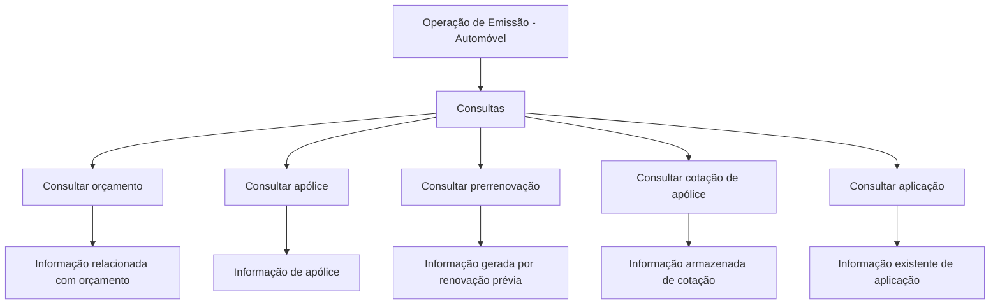

# Documentação de Operação de Emissão (Automóvel) — Consultas no Reef

## 1. Metadados do Documento
- **Arquivo de Origem:** Não identificado no conteúdo fornecido
- **Tipo de Documento:** Manual Operacional
- **Domínio / Sistema:** Reef; operação de emissão de Automóvel; Mapfre
- **Público-Alvo:** Usuários de operação e consulta no sistema Reef
- **Data/Versão Identificada:** Não identificada

---

## 2. Resumo Executivo & Contexto de Negócio

O documento apresenta opções de consulta disponíveis na operação de emissão para o domínio de Automóvel. O conteúdo está organizado como uma visão funcional de consultas, descrevendo o objetivo de cada opção disponível ao usuário.

As consultas permitem acessar informações relacionadas a orçamento, apólice, prerrenovação, cotação de apólice e aplicação. Em alguns casos, o documento informa que a localização inicial do registro ocorre por critérios de busca, antes do acesso às informações detalhadas.

O sistema ou repositório documental associado é identificado como **Reef**, com referências a **DOCUMENTACIÓN Reef**, **Documentation / DOCUMENTACIÓN Reef** e **Mapfredocument**. O material possui ciclo de vida identificado como **Approved**.

O conteúdo fornecido não detalha telas, campos de busca, critérios específicos, permissões, métodos de integração, URLs operacionais ou contratos técnicos. Portanto, a documentação permite compreender a finalidade declarada de cada consulta, mas não descreve sua implementação técnica ou seu procedimento operacional completo.

---

## 3. Arquitetura, Componentes & Tecnologias Envolvidas

### Componentes e elementos citados

| Componente / Elemento | Descrição baseada no conteúdo |
| :--- | :--- |
| Reef | Sistema, domínio ou repositório documental referenciado como “DOCUMENTACIÓN Reef”. |
| Operação de Emissão (Automóvel) | Contexto funcional no qual são disponibilizadas as opções de consulta. |
| Consultar orçamento | Opção para mostrar informações relacionadas a um orçamento previamente localizado. |
| Consultar apólice | Opção para acessar informações de uma apólice após seleção por critérios de busca. |
| Consultar prerrenovação | Opção para acessar informações geradas por uma renovação prévia. |
| Consultar cotação de apólice | Opção para acessar informações armazenadas relativas a uma cotação. |
| Consultar aplicação | Opção para visualizar informações existentes relativas a uma aplicação. |
| Mapfredocument | Termo exibido no conteúdo, sem detalhamento de finalidade ou integração. |
| Zeus | Item exibido na navegação do ambiente documental, sem detalhamento adicional. |
| Cloud | Item exibido na navegação do ambiente documental, sem detalhamento adicional. |
| APIs | Item exibido na navegação do ambiente documental, sem detalhamento adicional. |



> **Nota de Análise:** O conteúdo não descreve arquitetura de software, microsserviços, protocolos, banco de dados, integrações, tecnologias de desenvolvimento ou ambientes técnicos. O diagrama representa exclusivamente as relações funcionais explicitamente descritas.

---

## 4. Regras de Negócio, Especificações Funcionais & Processos

### 4.1 Consultar orçamento

A opção **CONSULTAR presupuesto** mostra informações relacionadas com um orçamento.

O orçamento deve ter sido previamente localizado mediante diferentes critérios de busca. O documento não especifica quais são os critérios de busca disponíveis, os campos utilizados, as regras de ordenação, os filtros ou as condições de acesso.

Fluxo funcional identificado:

1. O usuário utiliza critérios de busca para localizar previamente um orçamento.
2. O usuário seleciona ou acessa o orçamento localizado.
3. A opção de consulta mostra as informações relacionadas ao orçamento.

### 4.2 Consultar apólice

A opção **CONSULTAR póliza** permite acessar as informações de uma apólice.

A seleção da apólice é previamente facilitada por distintos critérios de busca. O documento não informa quais critérios podem ser utilizados nem quais dados da apólice são exibidos após o acesso.

Fluxo funcional identificado:

1. O usuário utiliza critérios de busca para facilitar a seleção da apólice.
2. O usuário seleciona uma apólice.
3. A funcionalidade permite o acesso às informações da apólice selecionada.

### 4.3 Consultar prerrenovação

A opção **CONSULTAR prerenovacion** facilita o acesso à informação gerada por uma renovação prévia.

O documento não define o conceito operacional de prerrenovação, os eventos que a geram, os critérios para localizá-la ou os dados apresentados na consulta.

Fluxo funcional identificado:

1. Existe informação gerada por uma renovação prévia.
2. O usuário utiliza a opção de consulta de prerrenovação.
3. A funcionalidade facilita o acesso à informação gerada.

### 4.4 Consultar cotação de apólice

A opção **CONSULTAR cotización póliza** acessa informação armazenada relativa a uma cotação.

O documento não detalha a origem da cotação, seus atributos, seu ciclo de vida, os critérios de busca, as regras de elegibilidade ou o relacionamento entre cotação e apólice.

Fluxo funcional identificado:

1. Há informação armazenada relativa a uma cotação.
2. O usuário solicita a consulta de cotação de apólice.
3. A funcionalidade acessa a informação armazenada.

### 4.5 Consultar aplicação

A opção **CONSULTAR aplicación** visualiza a informação existente relativa a uma aplicação.

O conteúdo não informa o significado de “aplicação” no contexto da emissão de Automóvel, nem descreve campos, estados, filtros ou regras de visualização.

Fluxo funcional identificado:

1. Existe informação relativa a uma aplicação.
2. O usuário utiliza a opção de consulta de aplicação.
3. A funcionalidade visualiza a informação existente.

---

## 5. Tabelas de Parâmetros, Ambientes e Estruturas de Dados

| Item / Parâmetro | Descrição / Função | Tipo / Valores / Formato | Ambiente / Observações |
| :--- | :--- | :--- | :--- |
| CONSULTAR presupuesto | Mostra informação relacionada com um orçamento. | Opção funcional de consulta. | Requer que o orçamento tenha sido previamente localizado por critérios de busca não especificados. |
| CONSULTAR póliza | Permite acessar informação de uma apólice. | Opção funcional de consulta. | A seleção prévia é facilitada por critérios de busca não especificados. |
| CONSULTAR prerenovacion | Facilita o acesso à informação gerada por uma renovação prévia. | Opção funcional de consulta. | Não há detalhamento do processo de renovação ou dos dados consultados. |
| CONSULTAR cotización póliza | Acessa a informação armazenada relativa a uma cotação. | Opção funcional de consulta. | Não há detalhamento dos campos ou da origem da cotação. |
| CONSULTAR aplicación | Visualiza a informação existente relativa a uma aplicação. | Opção funcional de consulta. | O significado funcional de aplicação não é detalhado. |
| Reef | Referência ao sistema, domínio ou repositório documental. | Nome próprio. | Exibido como “DOCUMENTACIÓN Reef”. |
| Mapfredocument | Termo apresentado no conteúdo. | Nome próprio. | Sem explicação funcional adicional. |
| Owner | Campo de propriedade do documento. | `user:agonzalez_mapfre.com` | Valor literal exibido no documento. |
| Lifecycle | Estado do ciclo de vida do documento. | `Approved` | Valor literal exibido no documento. |
| Idioma da interface | Idioma indicado no ambiente documental. | `ES` | Exibido na navegação. |
| Navegação documental | Opções apresentadas na interface. | Buscar, Inicio, Soluciones, Arquitecturas, APIs, Componentes, Cloud, Documentación, Zeus, Reef, Ayuda | O documento não explica a função de cada item. |

---

## 6. Bateria de Perguntas & Respostas para RAG (FAQ Sintético)

### P1: Quais opções de consulta são apresentadas na documentação de operação de emissão de Automóvel?
**R:** A documentação apresenta cinco opções de consulta: **Consultar orçamento**, **Consultar apólice**, **Consultar prerrenovação**, **Consultar cotação de apólice** e **Consultar aplicação**.

### P2: Qual é a finalidade da consulta de orçamento na operação de emissão de Automóvel?
**R:** A opção **Consultar orçamento** mostra a informação relacionada com um orçamento. O documento informa que o orçamento deve ter sido previamente localizado mediante diferentes critérios de busca, mas não especifica quais são esses critérios.

### P3: Como uma apólice é selecionada antes da consulta?
**R:** A documentação informa que a seleção de uma apólice é previamente facilitada por distintos critérios de busca. Após essa seleção, a opção **Consultar apólice** permite acessar as informações da apólice. Os critérios concretos não são detalhados.

### P4: O que a consulta de prerrenovação permite acessar?
**R:** A opção **Consultar prerrenovação** facilita o acesso à informação que foi gerada por uma renovação prévia. O documento não descreve quais informações são geradas nem como a renovação prévia é executada.

### P5: O que é recuperado pela consulta de cotação de apólice?
**R:** A opção **Consultar cotação de apólice** acessa a informação armazenada relativa a uma cotação. O conteúdo não especifica os campos da cotação, a origem dos dados ou o vínculo técnico entre a cotação e uma apólice.

### P6: Qual é a finalidade da consulta de aplicação?
**R:** A opção **Consultar aplicação** visualiza a informação existente relativa a uma aplicação. A documentação não define o conceito de aplicação dentro do processo de emissão de Automóvel.

### P7: O documento informa quais critérios de busca estão disponíveis para orçamento e apólice?
**R:** Não. O documento menciona que orçamento e apólice podem ser previamente localizados ou selecionados mediante diferentes critérios de busca, mas não informa os campos, filtros, operadores ou regras desses critérios.

### P8: Qual sistema ou domínio é mencionado na documentação?
**R:** O conteúdo menciona **Reef**, inclusive nas referências “DOCUMENTACIÓN Reef” e “Documentation / DOCUMENTACIÓN Reef”. O texto também apresenta o contexto de **operação de emissão de Automóvel**.

### P9: Qual é o status de ciclo de vida identificado para o documento?
**R:** O campo **Lifecycle** é apresentado com o valor **Approved**.

### P10: Quem é o proprietário identificado no conteúdo documental?
**R:** O campo **Owner** apresenta o valor literal `user:agonzalez_mapfre.com`.

### P11: A documentação descreve APIs, endpoints ou integrações técnicas?
**R:** Não. Embora “APIs” apareça como item de navegação na interface, o conteúdo não descreve endpoints, métodos HTTP, contratos, autenticação, integrações ou tecnologias.

### P12: A documentação contém instruções detalhadas para executar consultas no Reef?
**R:** Não integralmente. A documentação informa o propósito de cada opção de consulta, mas não inclui procedimentos de tela, campos obrigatórios, critérios de pesquisa específicos, permissões, mensagens de erro ou exemplos de resultados.

---

## 7. Glossário de Termos, Siglas & Conceitos-Chave

- **Reef:** Nome citado como “DOCUMENTACIÓN Reef”; o conteúdo não detalha se Reef é uma aplicação, módulo ou repositório documental.
- **Emissão (Automóvel):** Contexto operacional referido no título do documento.
- **Orçamento / presupuesto:** Registro consultável cuja informação é exibida após localização mediante critérios de busca.
- **Apólice / póliza:** Registro cuja informação pode ser acessada após seleção facilitada por critérios de busca.
- **Prerrenovação / prerenovacion:** Consulta de informação gerada por uma renovação prévia.
- **Cotação / cotización:** Informação armazenada que pode ser acessada pela consulta de cotação de apólice.
- **Aplicação / aplicación:** Entidade ou objeto consultável; o documento não define seu significado no domínio.
- **Mapfredocument:** Termo exibido no conteúdo sem definição adicional.
- **Lifecycle:** Campo de ciclo de vida do documento, com valor identificado como `Approved`.
- **Owner:** Campo de proprietário do documento, com valor identificado como `user:agonzalez_mapfre.com`.
- **ES:** Indicador de idioma exibido na interface.

---

## 8. Notas Críticas, Riscos & Limitações

- O conteúdo fornecido apresenta apenas descrições breves das opções de consulta; não contém instruções operacionais detalhadas.
- Não são identificados campos de pesquisa, filtros, parâmetros, critérios de ordenação, validações ou regras de permissão.
- Não há descrição de arquitetura técnica, componentes de infraestrutura, integrações, APIs, bancos de dados, endpoints, URLs ou ambientes.
- O documento cita Reef, Mapfredocument, Zeus, Cloud e APIs, mas não explica as responsabilidades ou relações técnicas desses elementos.
- A expressão “aplicação” é mencionada sem definição funcional no contexto de emissão de Automóvel.
- Não há data, versão, autoria documental completa, histórico de alterações ou identificação do arquivo de origem.
- **Nota de Análise:** O documento lista opções de consulta para orçamento, apólice, prerrenovação, cotação de apólice e aplicação, porém não detalha telas, contratos de dados, métodos de acesso ou critérios concretos de busca.

---

## 9. Conteúdo Bruto Estruturado (Referência Fiel)

```text
--- [PÁGINA 1 DE 1] ---

DOCUMENTACIÓN de OPERACIÓN de EMISIÓN (Automóvil) -
CONSULTA
CONSULTAS
Distintas opciones de consulta
CONSULTAR presupuesto
Muestra la información relacionada con
un presupuesto, previamente ubicado
mediante distintos criterios de búsqueda
CONSULTAR póliza
Permite el acceso a la información de una
póliza, donde previamente se ha facilitado
la selección mediante distintos criterios
de búsqueda
CONSULTAR prerenovacion
Facilita el acceso a la información que ha
sido generada por una renovación previa
CONSULTAR cotización póliza
Accede a la información almacenada
relativa a una cotización
CONSULTAR aplicación
Visualiza la información que existe relativa
a una aplicación
Documentation / DOCUMENTACIÓN Reef
DOCUMENTACIÓN Reef
Mapfredocument
DOCUMENTACIÓN Reef
Owner
user:agonzalez_mapfre.com
Lifecycle
Approved Source
 /
 VL
Buscar Inicio Soluciones Arquitecturas APIs Componentes Cloud Documentación Zeus Reef Ayuda
ES
```
