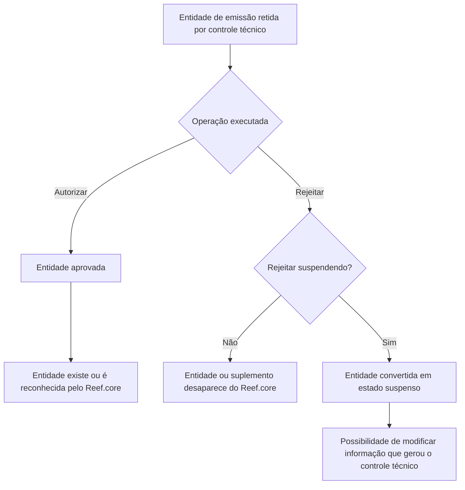

# Documentação de Operação de Emissão (Automóvel) — Controle Técnico no Reef.core

## 1. Metadados do Documento
- **Arquivo de Origem:** `Não informado`
- **Tipo de Documento:** `Manual Operacional`
- **Domínio / Sistema:** `Reef.core — Emissão de Automóvel / Controle Técnico`
- **Público-Alvo:** `Operação`
- **Data/Versão Identificada:** `Não identificada`
- **Owner identificado:** `user:agonzalez_mapfre.com`
- **Lifecycle identificado:** `Approved Source / VL`

---

## 2. Resumo Executivo & Contexto de Negócio

O documento descreve as operações de autorização e rejeição aplicáveis a entidades de emissão de Automóvel retidas por controle técnico no sistema Reef.core. As entidades abrangidas são orçamento, apólice, prerrenovação, declaração e aplicação, incluindo cenários de modificação mediante suplemento para apólices e aplicações.

A autorização de uma entidade retida por controle técnico altera o seu estado para aprovado. Após a aprovação, a entidade passa a existir ou ser reconhecida pelo restante do Reef.core conforme o seu tipo funcional: orçamento, apólice, apólice prerrenovada, declaração ou aplicação.

A rejeição sem suspensão impede a autorização da entidade e resulta no seu desaparecimento do Reef.core. Para suplementos de apólice ou aplicação, a rejeição também faz desaparecer o suplemento que havia ficado retido por controle técnico.

A rejeição com suspensão preserva uma possibilidade de correção da informação que originou o controle técnico. Dependendo da entidade, o resultado é um orçamento suspenso ou uma declaração suspensa. O documento não detalha as condições que fazem uma entidade ser retida, os perfis autorizados a executar cada operação, interfaces de operação, contratos de API ou mecanismos de auditoria.

---

## 3. Arquitetura, Componentes & Tecnologias Envolvidas

| Componente / Termo | Papel identificado no documento | Observações |
| :--- | :--- | :--- |
| Reef.core | Sistema que reconhece, mantém ou deixa de reconhecer entidades de emissão após operações de controle técnico. | Não há detalhes sobre arquitetura interna, módulos, APIs ou persistência. |
| Controle técnico | Mecanismo que retém entidades de emissão e exige autorização ou rejeição. | O documento não informa critérios, regras ou motores de decisão do controle técnico. |
| Mapfredocument | Ambiente ou repositório onde a documentação é apresentada. | O documento exibe a identificação “Mapfredocument”, sem detalhamento técnico. |
| Emissão (Automóvel) | Contexto funcional das operações documentadas. | Abrange orçamento, apólice, prerrenovação, declaração e aplicação. |
| Suplemento | Modificação realizada sobre uma apólice ou aplicação. | Há regras específicas para rejeitar suplementos retidos. |



> **Nota de Análise:** O documento descreve consequências funcionais das operações de controle técnico, mas não detalha componentes internos, tecnologias, protocolos, métodos HTTP, contratos JSON, bancos de dados, filas, URLs, ambientes ou rotas de log.

---

## 4. Regras de Negócio, Especificações Funcionais & Processos

### 4.1 Regra geral de autorização

Uma entidade retida por controle técnico pode ser autorizada. A autorização faz a entidade passar ao estado aprovado e permite que o restante do Reef.core a reconheça conforme a natureza da entidade.

| Operação | Entidade afetada | Resultado informado |
| :--- | :--- | :--- |
| AUTORIZAR orçamento | Orçamento retido por controle técnico | O orçamento passa a estar aprovado e existe para o restante do Reef.core. |
| AUTORIZAR apólice | Apólice retida por controle técnico | A apólice passa a estar aprovada e o restante do Reef.core reconhece a entidade como apólice. |
| AUTORIZAR prerrenovação | Apólice previamente renovada e retida por controle técnico | A apólice passa a estar aprovada e o restante do Reef.core reconhece a entidade como apólice prerrenovada. |
| AUTORIZAR declaração | Declaração retida por controle técnico | A declaração passa a estar aprovada e existe para o restante do Reef.core. |
| AUTORIZAR aplicação | Aplicação retida por controle técnico | A aplicação passa a estar aprovada e o restante do Reef.core reconhece a entidade como aplicação. |

### 4.2 Regra geral de rejeição sem suspensão

A rejeição sem suspensão impede a autorização da entidade retida por controle técnico. Como consequência, a entidade desaparece do Reef.core. Quando a rejeição se refere a um suplemento, o suplemento realizado sobre a entidade também desaparece.

| Operação | Entidade afetada | Resultado informado |
| :--- | :--- | :--- |
| RECHAZAR orçamento | Orçamento retido por controle técnico | O orçamento não é autorizado e desaparece do Reef.core. |
| RECHAZAR apólice | Apólice retida por controle técnico | A apólice não é autorizada e desaparece do Reef.core. |
| RECHAZAR apólice modificação | Suplemento de uma apólice retido por controle técnico | O suplemento não é autorizado e desaparece do Reef.core. |
| RECHAZAR prerrenovação | Renovação prévia de uma apólice retida por controle técnico | A prerrenovação não é autorizada e desaparece do Reef.core. |
| RECHAZAR declaração | Declaração retida por controle técnico | A declaração não é autorizada e desaparece do Reef.core. |
| RECHAZAR aplicação | Aplicação retida por controle técnico | A aplicação não é autorizada e desaparece do Reef.core. |
| RECHAZAR aplicação modificação | Suplemento de uma aplicação retido por controle técnico | O suplemento não é autorizado e desaparece do Reef.core. |

### 4.3 Regra geral de rejeição com suspensão

A rejeição com suspensão impede a autorização, mas converte a entidade para um estado suspenso. O objetivo explicitamente informado é permitir a modificação da informação que gerou o controle técnico.

| Operação | Entidade afetada | Estado resultante informado | Finalidade informada |
| :--- | :--- | :--- | :--- |
| RECHAZAR orçamento suspendendo | Orçamento retido por controle técnico | Orçamento suspenso | Permitir modificar a informação que gerou o controle técnico. |
| RECHAZAR apólice suspendendo | Apólice retida por controle técnico | Orçamento suspenso | Permitir modificar a informação que gerou o controle técnico. |
| RECHAZAR apólice modificação suspendendo | Suplemento de uma apólice retido por controle técnico | Orçamento suspenso | Permitir modificar a informação que gerou o controle técnico. |
| RECHAZAR declaração suspendendo | Declaração retida por controle técnico | Declaração suspensa | Permitir modificar a informação que gerou o controle técnico. |
| RECHAZAR aplicação suspendendo | Aplicação retida por controle técnico | Declaração suspensa | Permitir modificar a informação que gerou o controle técnico. |
| RECHAZAR aplicação modificação suspendendo | Suplemento de uma aplicação retido por controle técnico | Declaração suspensa | Permitir modificar a informação que gerou o controle técnico. |

> **Nota de Análise:** O documento afirma que a rejeição de apólice e de suplemento de apólice “suspendendo” resulta em orçamento suspenso. Também afirma que a rejeição de aplicação e de suplemento de aplicação “suspendendo” resulta em declaração suspensa. Essas relações foram preservadas literalmente; o documento não explica se representam conversões funcionais intencionais ou convenções específicas do Reef.core.

---

## 5. Tabelas de Parâmetros, Ambientes e Estruturas de Dados

| Item / Parâmetro | Descrição / Função | Tipo / Valores / Formato | Ambiente / Observações |
| :--- | :--- | :--- | :--- |
| Domínio funcional | Emissão de Automóvel sob controle técnico. | Emissão / Automóvel | Reef.core |
| Estado de entrada | Entidade retida por controle técnico. | Estado funcional | Pré-condição implícita para todas as operações descritas. |
| AUTORIZAR orçamento | Aprova um orçamento retido. | Operação de controle técnico | O orçamento passa a existir para o restante do Reef.core. |
| AUTORIZAR apólice | Aprova uma apólice retida. | Operação de controle técnico | O restante do Reef.core reconhece a entidade como apólice. |
| AUTORIZAR prerrenovação | Aprova uma apólice previamente renovada e retida. | Operação de controle técnico | O restante do Reef.core reconhece a entidade como apólice prerrenovada. |
| AUTORIZAR declaração | Aprova uma declaração retida. | Operação de controle técnico | A declaração passa a existir para o restante do Reef.core. |
| AUTORIZAR aplicação | Aprova uma aplicação retida. | Operação de controle técnico | O restante do Reef.core reconhece a entidade como aplicação. |
| RECHAZAR orçamento | Rejeita orçamento sem autorização. | Operação de controle técnico | O orçamento desaparece do Reef.core. |
| RECHAZAR orçamento suspendendo | Rejeita orçamento e converte para orçamento suspenso. | Operação de controle técnico | Permite modificar a informação causadora do controle técnico. |
| RECHAZAR apólice | Rejeita apólice sem autorização. | Operação de controle técnico | A apólice desaparece do Reef.core. |
| RECHAZAR apólice suspendendo | Rejeita apólice e converte para orçamento suspenso. | Operação de controle técnico | Permite modificar a informação causadora do controle técnico. |
| RECHAZAR apólice modificação | Rejeita suplemento de apólice. | Operação de controle técnico | O suplemento desaparece do Reef.core. |
| RECHAZAR apólice modificação suspendendo | Rejeita suplemento de apólice e converte para orçamento suspenso. | Operação de controle técnico | Permite modificar a informação causadora do controle técnico. |
| RECHAZAR prerrenovação | Rejeita renovação prévia de apólice. | Operação de controle técnico | A prerrenovação desaparece do Reef.core. |
| RECHAZAR declaração | Rejeita declaração sem autorização. | Operação de controle técnico | A declaração desaparece do Reef.core. |
| RECHAZAR declaração suspendendo | Rejeita declaração e converte para declaração suspensa. | Operação de controle técnico | Permite modificar a informação causadora do controle técnico. |
| RECHAZAR aplicação | Rejeita aplicação sem autorização. | Operação de controle técnico | A aplicação desaparece do Reef.core. |
| RECHAZAR aplicação suspendendo | Rejeita aplicação e converte para declaração suspensa. | Operação de controle técnico | Permite modificar a informação causadora do controle técnico. |
| RECHAZAR aplicação modificação | Rejeita suplemento de aplicação. | Operação de controle técnico | O suplemento desaparece do Reef.core. |
| RECHAZAR aplicação modificação suspendendo | Rejeita suplemento de aplicação e converte para declaração suspensa. | Operação de controle técnico | Permite modificar a informação causadora do controle técnico. |
| Owner | Responsável apresentado na documentação. | `user:agonzalez_mapfre.com` | Mapfredocument |
| Lifecycle | Ciclo de vida apresentado na documentação. | `Approved Source / VL` | O significado de `VL` não é detalhado. |

---

## 6. Bateria de Perguntas & Respostas para RAG (FAQ Sintético)

### P1: O que acontece ao autorizar um orçamento retido por controle técnico no Reef.core?
**R:** Ao executar a operação **AUTORIZAR orçamento**, o orçamento retido por controle técnico passa a estar aprovado. Como consequência, o orçamento passa a existir para o restante do Reef.core.

### P2: Qual é o resultado de autorizar uma apólice retida por controle técnico?
**R:** A operação **AUTORIZAR apólice** faz a apólice retida passar ao estado aprovado. Após a aprovação, o restante do Reef.core reconhece a entidade como uma apólice.

### P3: Como uma prerrenovação é reconhecida após autorização?
**R:** A operação **AUTORIZAR prerrenovação** aplica-se a uma apólice previamente renovada que está retida por controle técnico. A entidade passa a estar aprovada e o restante do Reef.core passa a reconhecê-la como apólice prerrenovada.

### P4: O que ocorre se um orçamento for rejeitado sem suspensão?
**R:** Na operação **RECHAZAR orçamento**, o orçamento retido por controle técnico não é autorizado. Como consequência, o orçamento desaparece do Reef.core.

### P5: Qual é a finalidade de rejeitar um orçamento “suspendendo”?
**R:** A operação **RECHAZAR orçamento suspendendo** não autoriza o orçamento, mas converte o orçamento em orçamento suspenso. O objetivo declarado é permitir modificar a informação que gerou o controle técnico.

### P6: O que ocorre ao rejeitar uma apólice com a opção “suspendendo”?
**R:** A operação **RECHAZAR apólice suspendendo** não autoriza a apólice retida por controle técnico e informa que a apólice passa a converter-se em um orçamento suspenso. Esse estado permite modificar a informação que originou o controle técnico.

### P7: O que acontece ao rejeitar um suplemento de apólice sem suspensão?
**R:** A operação **RECHAZAR apólice modificação** aplica-se a um suplemento realizado sobre uma apólice que ficou retido por controle técnico. O suplemento não é autorizado e desaparece do Reef.core.

### P8: Qual é a consequência de rejeitar uma declaração com suspensão?
**R:** Na operação **RECHAZAR declaração suspendendo**, a declaração retida não é autorizada e passa a converter-se em declaração suspensa. O estado suspenso permite modificar a informação que gerou o controle técnico.

### P9: O que acontece ao rejeitar uma aplicação sem suspensão?
**R:** A operação **RECHAZAR aplicação** impede a autorização da aplicação retida por controle técnico. Como consequência, a aplicação desaparece do Reef.core.

### P10: Em qual estado fica uma aplicação após “RECHAZAR aplicação suspendendo”?
**R:** Conforme o documento, a aplicação não é autorizada e passa a converter-se em uma declaração suspensa. A finalidade é permitir a modificação da informação que gerou o controle técnico.

### P11: Como é tratado um suplemento de aplicação rejeitado com suspensão?
**R:** A operação **RECHAZAR aplicação modificação suspendendo** aplica-se a um suplemento realizado sobre uma aplicação retida por controle técnico. O suplemento não é autorizado e passa a converter-se em uma declaração suspensa para permitir modificar a informação que originou o controle técnico.

### P12: O documento especifica APIs, métodos HTTP ou contratos de integração para as operações de controle técnico?
**R:** Não. O documento apresenta as operações e os seus efeitos funcionais no Reef.core, mas não informa métodos HTTP, endpoints, contratos JSON, tecnologias, rotas de logs, dados de autenticação ou detalhes de integração.

---

## 7. Glossário de Termos, Siglas & Conceitos-Chave

- **Reef.core:** Sistema citado como responsável por reconhecer, disponibilizar ou remover entidades de emissão após operações de controle técnico.
- **Controle técnico:** Controle que retém entidades de emissão até que sejam autorizadas ou rejeitadas.
- **Orçamento / presupuesto:** Entidade de orçamento no processo de emissão.
- **Apólice / póliza:** Entidade de apólice no processo de emissão.
- **Prerrenovação / prerenovación:** Estado ou entidade associada a uma apólice que foi renovada previamente.
- **Declaração / declaración:** Entidade de declaração no processo de emissão.
- **Aplicação / aplicación:** Entidade de aplicação no processo de emissão.
- **Suplemento:** Modificação realizada sobre uma apólice ou aplicação.
- **Suspendendo:** Qualificador das operações de rejeição que convertem a entidade em um estado suspenso e permitem modificar a informação que gerou o controle técnico.
- **Mapfredocument:** Identificação exibida no conteúdo da documentação; não há definição adicional.
- **VL:** Sigla exibida no campo Lifecycle como `Approved Source / VL`; significado não detalhado.

---

## 8. Notas Críticas, Riscos & Limitações

- O documento não informa os critérios que fazem orçamento, apólice, prerrenovação, declaração ou aplicação serem retidos por controle técnico.
- Não há especificação de usuários, papéis, permissões ou segregação de funções para autorizar ou rejeitar entidades.
- Não são apresentados endpoints, interfaces de usuário, APIs, protocolos, contratos de dados, mecanismos de auditoria, logs, transações ou tratamento de falhas.
- Não há detalhes sobre como uma entidade suspensa é modificada, reprocessada ou submetida novamente ao controle técnico.
- As operações de rejeição com suspensão possuem conversões de tipo explicitamente descritas: apólice e suplemento de apólice tornam-se orçamento suspenso; aplicação e suplemento de aplicação tornam-se declaração suspensa. O documento não explica a justificativa funcional dessas conversões.
- O documento não define o significado da sigla `VL` exibida no lifecycle.
- O conteúdo original contém caracteres de extração corrompidos na palavra `modicar`; a intenção textual aparente é “modificar”, mas a transcrição bruta abaixo preserva a extração fornecida.

---

## 9. Conteúdo Bruto Estruturado (Referência Fiel)

```text
--- [PÁGINA 1 DE 2] ---

DOCUMENTACIÓN de OPERACIÓN de EMISIÓN (Automóvil) -
CONTROL TÉCNICO
CONTROL TÉCNICO
Distintas operaciones de autorización y rechazo de controles técnicos de auditoría
AUTORIZAR presupuesto

Un presupuesto retenido por control
técnico pasa a estar aprobado y por
consiguiente, existe para el resto de
Reef.core
AUTORIZAR póliza

Una póliza retenida por control técnico
pasa a estar aprobada y por consiguiente,
hace que el resto de Reef.core la
reconozca como póliza
AUTORIZAR prerenovación

Una póliza que ha sido renovada
previamente y que está retenida por
control técnico pasa a estar aprobada y
por consiguiente, hace que el resto de
Reef.core la reconozca como póliza
prerenovada
AUTORIZAR declaración

Una declaración retenida por control
técnico pasa a estar aprobada y por
consiguiente, existe para el resto de
Reef.core
AUTORIZAR aplicación

Una aplicación retenida por control
técnico pasa a estar aprobada y por
consiguiente, hace que el resto de
Reef.core la reconozca como aplicación
RECHAZAR presupuesto

Un presupuesto retenido por control
técnico no es autorizado y por
consiguiente desaparece de Reef.core
RECHAZAR presupuesto suspendiendo

Un presupuesto retenido por control
técnico no es autorizado y pasa
convertirse en un presupuesto suspendido
y así dar la oportunidad de modicar la
información que generó el control técnico
RECHAZAR póliza

Una póliza retenida por control técnico no
es autorizada y por consiguiente
desaparece de Reef.core
RECHAZAR póliza suspendiendo

Una póliza retenida por control técnico no
es autorizada y pasa convertirse en un
presupuesto suspendido y así dar la
oportunidad de modicar la información
que generó el control técnico
Documentation / DOCUMENTACIÓN Reef
DOCUMENTACIÓN Reef
Mapfredocument
DOCUMENTACIÓN Reef
Owner
user:agonzalez_mapfre.com
Lifecycle
Approved Source
 /
 VL
Buscar Inicio Soluciones Arquitecturas APIs Componentes Cloud Documentación Zeus Reef Ayuda
ES

--- [PÁGINA 2 DE 2] ---

RECHAZAR póliza modicación

Un suplemento realizado a una póliza que
quedó retenido por control técnico no es
autorizado y por consiguiente desaparece
de Reef.core
RECHAZAR póliza modicación
suspendiendo

Un suplemento realizado a una póliza que
quedó retenido por control técnico no es
autorizado y pasa convertirse en un
presupuesto suspendido y así dar la
oportunidad de modicar la información
que generó el control técnico
RECHAZAR prerenovación

Una renovación previa a una póliza que
quedó retenida por control técnico no es
autorizada y por consiguiente desaparece
de Reef.core
RECHAZAR declaración

Una declaración retenida por control
técnico no es autorizada y por
consiguiente desaparece de Reef.core
RECHAZAR declaración suspendiendo

Una declaración retenida por control
técnico no es autorizada y pasa
convertirse en una declaración
suspendida y así dar la oportunidad de
modicar la información que generó el
control técnico
RECHAZAR aplicación

Una aplicación retenida por control
técnico no es autorizada y por
consiguiente desaparece de Reef.core
RECHAZAR aplicación suspendiendo

Una aplicación retenida por control
técnico no es autorizada y pasa
convertirse en una declaración
suspendida y así dar la oportunidad de
modicar la información que generó el
control técnico
RECHAZAR aplicación modicación

Un suplemento realizado a una aplicación
que quedó retenido por control técnico no
es autorizado y por consiguiente
desaparece de Reef.core
RECHAZAR aplicación modicación
suspendiendo

Un suplemento realizado a una aplicación
que quedó retenido por control técnico no
es autorizado y pasa convertirse en una
declaración suspendida y así dar la
oportunidad de modicar la información
que generó el control técnico
```
