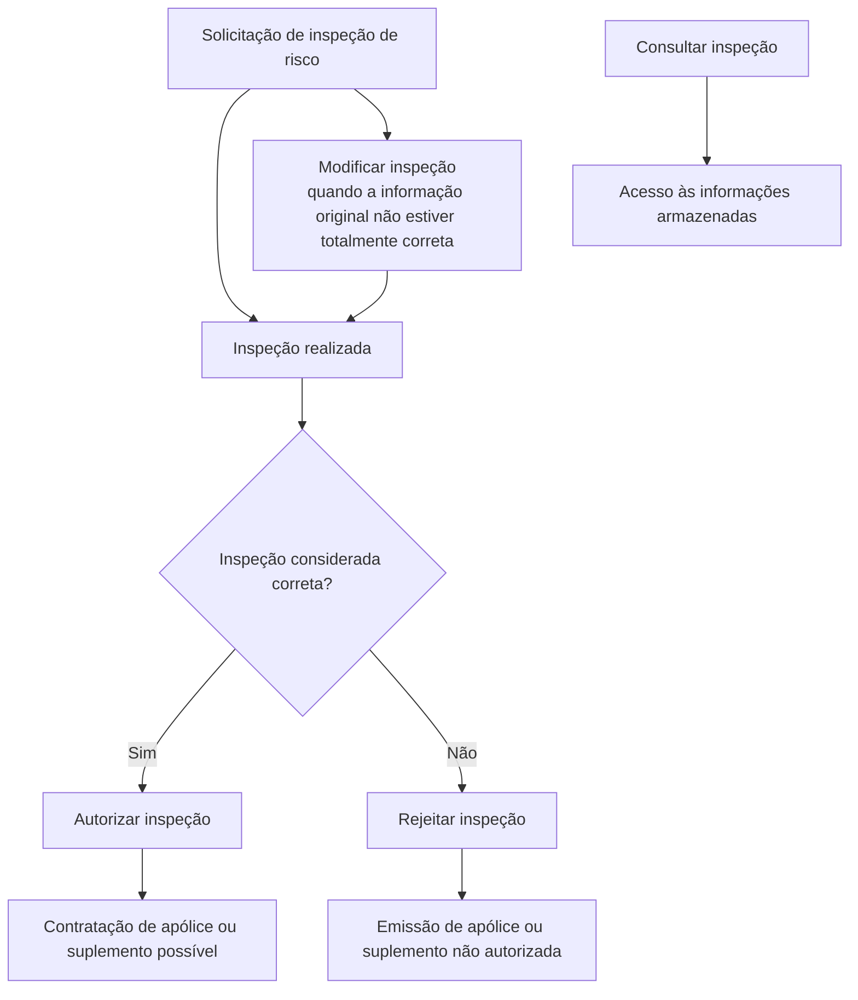

# Documentação de Operação de Emissão (Automóvel) — Inspeção

## 1. Metadados do Documento
- **Arquivo de Origem:** Não identificado no conteúdo fornecido
- **Tipo de Documento:** Procedimento
- **Domínio / Sistema:** Reef / Emissão de Automóvel / Inspeção
- **Público-Alvo:** Operação, negócio e equipes responsáveis pela emissão de apólices ou suplementos
- **Data/Versão Identificada:** Não identificada
- **Owner identificado:** `user:agonzalez_mapfre.com`
- **Lifecycle identificado:** Approved Source / VL

---

## 2. Resumo Executivo & Contexto de Negócio

O documento descreve as operações de **inspeção** relacionadas às revisões de risco no processo de **emissão de Automóvel**. A inspeção é apresentada como uma etapa para avaliar o estado de um risco antes da contratação de uma apólice ou da emissão de um suplemento.

A operação de criação gera uma solicitação de inspeção de risco contendo dados básicos do risco, localização e inspetor. A finalidade declarada é permitir que o risco seja avaliado e que seja determinado se ele pode ou não ser assegurado pela companhia.

O processo contempla manutenção da solicitação por meio da operação de modificação, utilizada quando as informações originalmente registradas não estão totalmente corretas. Após a realização da inspeção, a solicitação pode ser autorizada ou rejeitada, com efeitos diretos sobre a emissão da apólice ou suplemento.

A autorização indica que a inspeção foi considerada correta e que a contratação da apólice ou suplemento passa a ser possível. A rejeição indica que a inspeção não foi considerada correta e que a emissão da apólice ou suplemento não é autorizada. O documento também prevê consulta às informações armazenadas sobre uma inspeção.

---

## 3. Arquitetura, Componentes & Tecnologias Envolvidas

Os elementos explicitamente citados são:

| Componente / Termo | Papel identificado no documento |
| :--- | :--- |
| Reef | Contexto de documentação identificado como “DOCUMENTACIÓN Reef”. |
| Mapfredocument | Nome exibido no conteúdo de navegação/documentação. |
| Emissão de Automóvel | Processo de negócio ao qual as operações de inspeção pertencem. |
| Inspeção | Processo de revisão e avaliação de risco. |
| Apólice | Artefato cuja contratação ou emissão depende do resultado da inspeção. |
| Suplemento | Artefato cuja contratação ou emissão depende do resultado da inspeção. |
| Inspetor | Dado associado à solicitação de inspeção de risco. |
| Risco | Entidade avaliada durante a inspeção. |



> **Nota de Análise:** O conteúdo não especifica arquitetura de software, APIs, métodos HTTP, contratos JSON, bancos de dados, integrações, tecnologias de implementação, ambientes técnicos ou mecanismos de persistência para o processo de inspeção.

---

## 4. Regras de Negócio, Especificações Funcionais & Processos

### 4.1 Operação: Criar inspeção

A criação de inspeção gera uma solicitação de inspeção de risco. A solicitação contém:

- Dados básicos do risco;
- Localização;
- Inspetor.

A finalidade da solicitação é permitir a avaliação do estado do risco e determinar se o risco pode ou não ser assegurado pela companhia.

### 4.2 Operação: Modificar inspeção

A modificação de inspeção atualiza uma solicitação de inspeção quando, por qualquer motivo, a informação original não estiver totalmente correta.

O documento não detalha:

- Quais campos podem ser modificados;
- Quem pode executar a modificação;
- Regras de validação para alterações;
- Histórico, auditoria ou versionamento da solicitação.

### 4.3 Operação: Autorizar inspeção

A autorização ocorre após a realização da inspeção, quando a inspeção é considerada correta.

A consequência de negócio declarada é que a contratação da apólice ou do suplemento se torna possível.

### 4.4 Operação: Rejeitar inspeção

A rejeição ocorre após a realização da inspeção, quando a inspeção não é considerada correta.

A consequência de negócio declarada é que a emissão da apólice ou do suplemento não é autorizada.

### 4.5 Operação: Consultar inspeção

A consulta permite acessar as informações armazenadas sobre uma inspeção.

O documento não descreve filtros de consulta, permissões, formato de retorno ou quais informações específicas ficam armazenadas.

---

## 5. Tabelas de Parâmetros, Ambientes e Estruturas de Dados

| Item / Parâmetro | Descrição / Função | Tipo / Valores / Formato | Ambiente / Observações |
| :--- | :--- | :--- | :--- |
| Solicitação de inspeção de risco | Solicitação gerada para avaliação de um risco. | Não especificado | Criada na operação de criação de inspeção. |
| Dados básicos do risco | Informações básicas do risco a ser inspecionado. | Não especificado | Incluídos na solicitação de inspeção. |
| Localização | Informação de localização associada ao risco. | Não especificado | Incluída na solicitação de inspeção. |
| Inspetor | Informação sobre o inspetor associado à solicitação. | Não especificado | Incluído na solicitação de inspeção. |
| Informação original | Informação registrada inicialmente na solicitação. | Não especificado | Pode ser atualizada quando não estiver totalmente correta. |
| Resultado da inspeção | Determinação de que a inspeção foi considerada correta ou não correta. | Correta / não correta | Define autorização ou rejeição. |
| Autorização de inspeção | Resultado aplicável quando a inspeção é considerada correta. | Autorizada | Possibilita a contratação de apólice ou suplemento. |
| Rejeição de inspeção | Resultado aplicável quando a inspeção não é considerada correta. | Rejeitada | Não autoriza a emissão de apólice ou suplemento. |
| Informações armazenadas da inspeção | Informações disponíveis por meio da operação de consulta. | Não especificado | Conteúdo detalhado não informado. |
| Owner | Responsável identificado na página de documentação. | `user:agonzalez_mapfre.com` | Exibido como “Owner”. |
| Lifecycle | Estado identificado na página de documentação. | `Approved Source / VL` | Exibido como “Lifecycle”. |

---

## 6. Bateria de Perguntas & Respostas para RAG (FAQ Sintético)

### P1: Qual é o objetivo da operação de criar uma inspeção no processo de emissão de Automóvel?
**R:** A operação de criar inspeção gera uma solicitação de inspeção de risco com dados básicos do risco, localização e inspetor. O objetivo é avaliar o estado do risco e determinar se ele pode ou não ser assegurado pela companhia.

### P2: Quais informações são incluídas em uma solicitação de inspeção de risco?
**R:** O documento informa que a solicitação de inspeção de risco contém os dados básicos do risco, a localização e o inspetor. Não são detalhados os campos, formatos ou obrigatoriedades de cada informação.

### P3: Quando uma inspeção deve ser modificada?
**R:** Uma inspeção deve ser modificada quando, por qualquer motivo, a informação original da solicitação não estiver totalmente correta. O documento não define critérios adicionais, responsáveis ou campos editáveis.

### P4: Qual é a consequência de autorizar uma inspeção?
**R:** Após a inspeção ser realizada e considerada correta, a autorização da inspeção torna possível a contratação da apólice ou do suplemento.

### P5: O que ocorre quando uma inspeção é rejeitada?
**R:** Quando a inspeção é realizada e não é considerada correta, a inspeção é rejeitada. Nesse caso, a emissão da apólice ou do suplemento não é autorizada.

### P6: A rejeição da inspeção impede a emissão de quais itens?
**R:** A rejeição da inspeção impede a emissão de uma apólice ou de um suplemento, conforme descrito no documento.

### P7: O que a operação de consultar inspeção permite fazer?
**R:** A operação de consultar inspeção permite acessar as informações armazenadas sobre uma inspeção. O documento não especifica quais dados são retornados nem os critérios de pesquisa disponíveis.

### P8: Qual condição permite a contratação de uma apólice ou suplemento?
**R:** A contratação de uma apólice ou suplemento torna-se possível quando a inspeção foi realizada, considerada correta e autorizada.

### P9: O documento descreve APIs, métodos HTTP ou contratos de integração para inspeção?
**R:** Não. O documento apresenta as operações de criar, modificar, autorizar, rejeitar e consultar inspeção, mas não detalha APIs, métodos HTTP, contratos JSON, URLs, serviços ou integrações técnicas.

### P10: Qual sistema ou contexto de documentação é citado para o processo de inspeção?
**R:** O conteúdo identifica “DOCUMENTACIÓN Reef” e também apresenta “Mapfredocument” no contexto de documentação e navegação. O papel técnico específico desses elementos não é detalhado.

---

## 7. Glossário de Termos, Siglas & Conceitos-Chave

- **Apólice:** Item cuja contratação pode ser permitida após autorização da inspeção ou cuja emissão pode ser impedida após rejeição da inspeção.
- **Automóvel:** Contexto de emissão ao qual o documento associa as operações de inspeção.
- **Emissão:** Processo relacionado à apólice ou suplemento; a emissão pode não ser autorizada após rejeição da inspeção.
- **Inspeção:** Operação de revisão de risco que pode ser criada, modificada, autorizada, rejeitada ou consultada.
- **Inspetor:** Dado incluído na solicitação de inspeção de risco.
- **Mapfredocument:** Termo exibido no conteúdo de documentação; função não detalhada.
- **Reef:** Contexto de documentação explicitamente citado como “DOCUMENTACIÓN Reef”.
- **Risco:** Entidade cuja condição é avaliada por meio de uma inspeção para determinar se pode ser assegurada.
- **Solicitação de inspeção:** Registro criado com dados básicos do risco, localização e inspetor para avaliação do risco.
- **Suplemento:** Item cuja contratação pode ser permitida após autorização da inspeção ou cuja emissão pode ser impedida após rejeição da inspeção.
- **VL:** Valor exibido junto ao campo Lifecycle como “Approved Source / VL”; significado não detalhado no conteúdo.

---

## 8. Notas Críticas, Riscos & Limitações

- O conteúdo não identifica o nome do arquivo original, data, versão, autores adicionais ou histórico de alterações.
- O documento não detalha estados formais da solicitação de inspeção além das operações de criação, modificação, autorização, rejeição e consulta.
- Não há definição de papéis, permissões, matriz de aprovação ou responsáveis por criar, modificar, autorizar, rejeitar ou consultar inspeções.
- Não são descritos critérios técnicos ou de negócio para considerar uma inspeção “correta” ou “não correta”.
- O documento não define os campos que compõem os dados básicos do risco, a localização ou o inspetor.
- Não há informações sobre APIs, integrações, URLs, ambientes, bancos de dados, logs, mensagens de erro, auditoria ou requisitos não funcionais.
- Não são descritos procedimentos posteriores à rejeição, como correção, reinspeção, cancelamento ou escalonamento.
- **Nota de Análise:** O conteúdo é resumido e orientado às operações de negócio. Qualquer detalhamento de implementação, contratos, permissões ou critérios de decisão exigiria uma fonte documental adicional.

---

## 9. Conteúdo Bruto Estruturado (Referência Fiel)

```text
--- [PÁGINA 1 DE 1] ---

DOCUMENTACIÓN de OPERACIÓN de EMISIÓN (Automóvil) -
INSPECCIÓN
INSPECCIÓN
Operaciones relacionadas con las revisiones de riesgos
CREAR inspección

Se genera una solicitud de inspección de
riesgo con los datos básicos del riesgo,
ubicación e inspector con el fin de que se
evalúe el estado y pueda o no ser
asegurado por la compañía

MODIFICAR inspección
Se actualiza la solicitud de inspección si
por cualquier motivo la información
original no era totalmente correcta

AUTORIZAR inspección
Una vez realizada la inspección, esta se
considera correcta y es posible la
contratación de la póliza o suplemento

RECHAZAR inspección
Una vez realizada la inspección, esta no se
considera correcta y no se autoriza la
emisión de la póliza o suplemento

CONSULTAR inspección
Permite el acceso a la información
almacenada acerca de una inspección

Documentation / DOCUMENTACIÓN Reef
DOCUMENTACIÓN Reef
Mapfredocument
DOCUMENTACIÓN Reef
Owner
user:agonzalez_mapfre.com
Lifecycle
Approved Source
 /
VL
Buscar Inicio Soluciones Arquitecturas APIs Componentes Cloud Documentación Zeus Reef Ayuda
ES
```
