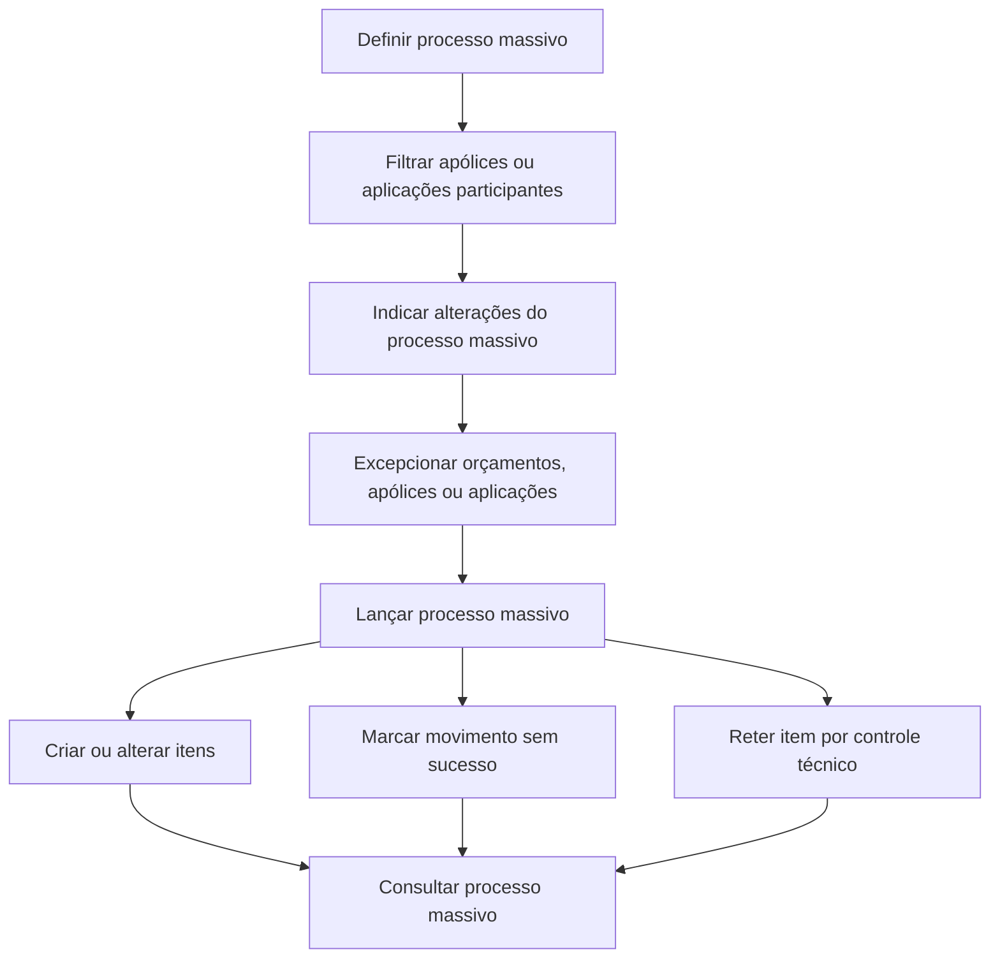

# Documentação de Operação de Emissão (Automóvel) — Processos Massivos

## 1. Metadados do Documento
- **Arquivo de Origem:** Não identificado
- **Tipo de Documento:** Manual Operacional
- **Domínio / Sistema:** Reef / Emissão de Automóvel
- **Público-Alvo:** Operação, Negócio e equipes responsáveis por emissão
- **Data/Versão Identificada:** Não identificada
- **Owner identificado:** `user:agonzalez_mapfre.com`
- **Lifecycle identificado:** Approved Source / VL

---

## 2. Resumo Executivo & Contexto de Negócio

O documento descreve processos massivos associados à operação de emissão para o domínio de Automóvel. Processos massivos são operações por lotes destinadas a criar ou alterar conjuntos de orçamentos, apólices e/ou aplicações.

O fluxo operacional permite definir um processo massivo, selecionar as apólices ou aplicações participantes, indicar as alterações que serão aplicadas e excluir elementos inicialmente selecionados. A execução do processo massivo pode produzir resultados distintos para cada item processado.

Após o lançamento, alguns orçamentos, apólices e/ou aplicações podem ser criados ou alterados com sucesso; outros podem ser marcados como movimentos sem sucesso; e outros podem permanecer retidos por controle técnico. O documento também prevê a consulta das informações relacionadas ao processo massivo.

> **Nota de Análise:** O conteúdo não detalha critérios técnicos de retenção, regras de elegibilidade, métodos de acesso, contratos de integração, campos de entrada ou mecanismos de tratamento de erro.

---

## 3. Arquitetura, Componentes & Tecnologias Envolvidas

Os elementos identificados no documento são:

| Componente / Conceito | Papel identificado |
| :--- | :--- |
| Reef | Contexto documental e sistema/plataforma associado à documentação. |
| Emissão (Automóvel) | Domínio operacional do documento. |
| Processos massivos | Operações por lotes para criação ou alteração de orçamentos, apólices e/ou aplicações. |
| Orçamentos | Entidades que podem ser criadas, alteradas, selecionadas, excluídas ou processadas. |
| Apólices | Entidades que podem ser criadas, alteradas, selecionadas, excluídas ou processadas. |
| Aplicações | Entidades que podem ser criadas, alteradas, selecionadas, excluídas ou processadas. |
| Controle técnico | Estado de retenção possível após a execução de um processo massivo. |
| Consulta de processo massivo | Acesso à informação existente relacionada ao processo massivo. |



> **Nota de Análise:** O documento não apresenta arquitetura de infraestrutura, microsserviços, APIs, bases de dados, ambientes, URLs, protocolos ou tecnologias de implementação.

---

## 4. Regras de Negócio, Especificações Funcionais & Processos

### Processo operacional de processos massivos

1. **Criar processo massivo**
   - Deve ser definido um processo massivo.
   - O processo massivo permite criar ou alterar orçamentos, apólices e/ou aplicações.

2. **Filtrar processo massivo**
   - Deve ser definida quais apólices ou aplicações participam de um processo massivo.
   - O documento menciona filtragem para apólices ou aplicações, sem detalhar atributos, critérios ou operadores de filtro.

3. **Indicar alteração no processo massivo**
   - Devem ser especificadas as alterações que serão realizadas pelo processo massivo.
   - As alterações indicadas serão sofridas pelas apólices e/ou aplicações participantes.

4. **Excepcionar processo massivo**
   - Deve ser determinado quais orçamentos, apólices ou aplicações inicialmente selecionados serão excluídos do processo massivo.
   - A exceção ocorre após a seleção inicial dos elementos participantes.

5. **Lançar processo massivo**
   - O lançamento executa o processo massivo.
   - Durante a execução, uma série de orçamentos, apólices e/ou aplicações será criada ou alterada.
   - Outros elementos podem ser marcados como itens cujo movimento não foi bem-sucedido.
   - Outros elementos podem ser retidos por controle técnico.

6. **Consultar processo massivo**
   - A consulta facilita o acesso à informação existente relacionada ao processo massivo.
   - O documento não especifica quais informações são disponibilizadas na consulta.

### Estados e resultados identificados

| Resultado / Estado | Significado sustentado pelo documento |
| :--- | :--- |
| Criado | Um orçamento, apólice e/ou aplicação pode ser criado durante a execução do processo massivo. |
| Alterado | Um orçamento, apólice e/ou aplicação pode ser alterado durante a execução do processo massivo. |
| Movimento sem sucesso | Um item pode ficar marcado quando o movimento não obtiver sucesso. |
| Retido por controle técnico | Um item pode permanecer retido por controle técnico após o lançamento. |
| Excluído do processo | Um orçamento, apólice ou aplicação inicialmente selecionado pode ser excluído antes do lançamento. |

---

## 5. Tabelas de Parâmetros, Ambientes e Estruturas de Dados

| Item / Parâmetro | Descrição / Função | Tipo / Valores / Formato | Ambiente / Observações |
| :--- | :--- | :--- | :--- |
| Processo massivo | Operação por lotes para criar ou alterar entidades de emissão. | Processo operacional | Associado à emissão de Automóvel. |
| Orçamento | Entidade que pode participar de criação, alteração, exceção ou execução massiva. | Entidade de negócio | Não há campos detalhados. |
| Apólice | Entidade que pode ser filtrada, alterada, excepcionada ou processada. | Entidade de negócio | Não há campos detalhados. |
| Aplicação | Entidade que pode ser filtrada, alterada, excepcionada ou processada. | Entidade de negócio | Não há campos detalhados. |
| Filtro | Define quais apólices ou aplicações intervêm no processo massivo. | Critério de seleção | Critérios específicos não detalhados. |
| Alterações indicadas | Modificações que serão aplicadas às apólices e/ou aplicações participantes. | Especificação de mudança | Conteúdo das alterações não detalhado. |
| Exceção | Remove da execução itens inicialmente selecionados. | Regra de exclusão | Aplica-se a orçamentos, apólices ou aplicações. |
| Lançamento | Execução do processo massivo. | Etapa operacional | Pode gerar criação, alteração, insucesso ou retenção técnica. |
| Controle técnico | Condição de retenção de itens processados. | Estado operacional | Critérios de retenção não detalhados. |
| Consulta | Acesso às informações relacionadas ao processo massivo. | Funcionalidade de consulta | Dados retornados não detalhados. |
| Owner | Responsável identificado na documentação. | Identificador de usuário | `user:agonzalez_mapfre.com` |
| Lifecycle | Situação identificada na documentação. | Texto | `Approved Source / VL` |

> **Nota de Análise:** O documento não fornece URLs, servidores, portas, variáveis de ambiente, caminhos de logs, esquemas de dados ou parâmetros técnicos configuráveis.

---

## 6. Bateria de Perguntas & Respostas para RAG (FAQ Sintético)

### P1: Qual é a finalidade de um processo massivo na emissão de Automóvel?
**R:** Um processo massivo permite criar ou alterar, em lote, orçamentos, apólices e/ou aplicações no contexto de emissão de Automóvel.

### P2: Quais entidades podem participar de um processo massivo?
**R:** O documento menciona orçamentos, apólices e aplicações como entidades que podem ser criadas, alteradas, excluídas ou afetadas pela execução de um processo massivo.

### P3: Como são definidos os participantes de um processo massivo?
**R:** A etapa de filtragem permite definir quais apólices ou aplicações intervêm no processo massivo. O documento não especifica os critérios de filtragem disponíveis.

### P4: O que significa indicar uma alteração em um processo massivo?
**R:** Indicar uma alteração consiste em especificar as mudanças que serão realizadas no processo massivo e que serão aplicadas às apólices e/ou aplicações participantes.

### P5: O que é excepcionar um processo massivo?
**R:** Excepcionar um processo massivo consiste em determinar quais orçamentos, apólices ou aplicações inicialmente selecionados serão excluídos da execução do processo.

### P6: Quais resultados podem ocorrer após lançar um processo massivo?
**R:** Após o lançamento, alguns orçamentos, apólices e/ou aplicações podem ser criados ou alterados; outros podem ser marcados como movimentos sem sucesso; e outros podem ser retidos por controle técnico.

### P7: O que acontece quando um movimento não tem sucesso?
**R:** O documento estabelece que itens cujo movimento não teve sucesso ficam marcados como tal. Não são fornecidos códigos de erro, causas possíveis ou procedimentos de correção.

### P8: O que significa uma retenção por controle técnico?
**R:** Uma retenção por controle técnico é um resultado possível da execução de um processo massivo. O documento afirma que determinados itens podem permanecer retidos, mas não detalha os critérios técnicos dessa retenção.

### P9: É possível consultar informações sobre um processo massivo?
**R:** Sim. A funcionalidade de consulta de processo massivo facilita o acesso à informação existente relacionada ao processo massivo, embora o documento não especifique os campos disponíveis nessa consulta.

### P10: O documento define APIs, métodos HTTP ou contratos JSON para processos massivos?
**R:** Não. O documento não informa APIs, métodos HTTP, contratos JSON, integrações, tecnologias de implementação ou endpoints relacionados aos processos massivos.

---

## 7. Glossário de Termos, Siglas & Conceitos-Chave

- **Reef:** Nome identificado no contexto da documentação e navegação documental.
- **Emissão:** Contexto funcional relacionado à criação ou alteração de elementos do domínio de Automóvel.
- **Automóvel:** Domínio de negócio indicado no título do documento.
- **Processo massivo:** Operação por lotes que permite criar ou alterar orçamentos, apólices e/ou aplicações.
- **Orçamento:** Entidade de negócio que pode ser criada, alterada ou excluída de um processo massivo.
- **Apólice:** Entidade de negócio que pode participar de filtragem, alteração, exceção e execução massiva.
- **Aplicação:** Entidade de negócio que pode participar de filtragem, alteração, exceção e execução massiva.
- **Excepcionar:** Excluir do processo massivo entidades inicialmente selecionadas.
- **Lançar:** Executar o processo massivo.
- **Controle técnico:** Condição de retenção possível para itens processados.
- **VL:** Sigla apresentada no campo Lifecycle, sem expansão no conteúdo fornecido.

---

## 8. Notas Críticas, Riscos & Limitações

- O conteúdo é resumido e não apresenta detalhamento técnico de implementação.
- Não são descritos os critérios de filtragem de apólices e aplicações.
- Não são especificados os tipos de alterações permitidas no processo massivo.
- Não são detalhadas as condições que levam um movimento a ser marcado como sem sucesso.
- Não são informados os critérios, responsáveis ou procedimentos para liberação de itens retidos por controle técnico.
- Não há informações sobre autenticação, autorização, integração, APIs, contratos de dados, infraestrutura ou monitoramento.
- Não há detalhamento do conteúdo consultável por meio da funcionalidade de consulta de processo massivo.

---

## 9. Conteúdo Bruto Estruturado (Referência Fiel)

```text
--- [PÁGINA 1 DE 1] ---

DOCUMENTACIÓN de OPERACIÓN de EMISIÓN (Automóvil) -
PROCESOS MASIVOS

PROCESOS MASIVOS
Operaciones relacionadas con procesos por lotes

CREAR proceso masivo
Se dene un proceso masivo que permita
crear o alterar presupuestos, pólizas y/o
aplicaciones

FILTRAR proceso masivo
Permite la denición de qué pólizas o
aplicaciones intervienen en un proceso
masivo

INDICAR CAMBIO proceso masivo
Se especican los cambios a realizar en el
proceso masivo y que sufrirán las pólizas
y/o aplicaciones que participen en él

EXCEPCIONAR proceso masivo
Se determina qué presupuesto, pólizas o
aplicaciones inicialmente seleccionadas
pasan a estar excluidas del proceso masivo

LANZAR proceso masivo
Ejecución del proceso masivo donde una
serie de presupuestos, póliza y/o
aplicaciones serán creadas o alteradas,
otras quedarán marcadas como que el
movimiento no tuvo éxito y otras quedarán
retenidas por control técnico

CONSULTAR proceso masivo
Facilita el acceso a la información que
existe relacionado con el proceso masivo

Documentation / DOCUMENTACIÓN Reef
DOCUMENTACIÓN Reef
Mapfredocument
DOCUMENTACIÓN Reef
Owner
user:agonzalez_mapfre.com
Lifecycle
Approved Source
/
VL
Buscar Inicio Soluciones Arquitecturas APIs Componentes Cloud Documentación Zeus Reef Ayuda
ES
```
