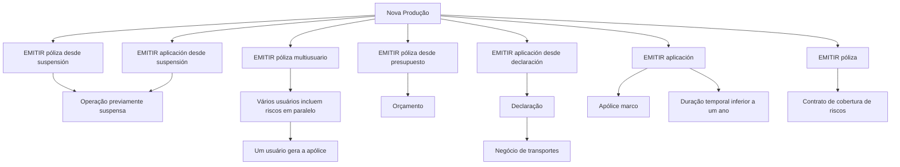

# Documentação de Operação de Emissão — Automóvel / Nova Produção

## 1. Metadados do Documento
- **Arquivo de Origem:** Não informado; conteúdo bruto fornecido na solicitação
- **Tipo de Documento:** Manual Operacional
- **Domínio / Sistema:** Reef — operação de emissão para Automóvel / Nova Produção
- **Público-Alvo:** Operação
- **Data/Versão Identificada:** Não identificada

---

## 2. Resumo Executivo & Contexto de Negócio

O documento descreve operações de **Nova Produção** relacionadas à emissão de apólices e aplicações no contexto de **Automóvel**. A operação central é **EMITIR póliza**, definida como a geração de um contrato que estabelece riscos cobertos, condições de cobertura e a cobertura aplicável quando ocorrer dano previsto.

A documentação apresenta diferentes formas de iniciar ou concluir a emissão: emissão direta de apólice, emissão a partir de uma suspensão, emissão multiusuário, emissão a partir de orçamento, emissão de aplicação, emissão de aplicação retomada de suspensão e emissão de aplicação a partir de declaração.

A modalidade **EMITIR póliza multiusuario** permite que vários usuários incluam riscos paralelamente. Após a inclusão dos riscos, um dos usuários gera a apólice. A modalidade **EMITIR aplicación** corresponde à emissão de apólice com duração temporária inferior a um ano e baseada em uma **póliza marco**.

O documento também distingue origens de informação para emissão. Uma apólice pode ser emitida a partir de um orçamento; para o negócio de transportes, o orçamento é denominado **declaração**, e a emissão pode usar essa declaração como origem.

---

## 3. Arquitetura, Componentes & Tecnologias Envolvidas

Os elementos identificados no documento são:

- **Reef:** sistema ou domínio documental mencionado como “DOCUMENTACIÓN Reef”.
- **Mapfredocument:** elemento citado na área de navegação/documentação.
- **Zeus:** elemento citado na área de navegação/documentação.
- **Nova Produção:** contexto operacional das operações de emissão.
- **Automóvel:** domínio funcional indicado no título.
- **Apólice:** contrato gerado pela operação de emissão.
- **Aplicação:** emissão temporal inferior a um ano, baseada em apólice marco.
- **Apólice marco:** apólice de referência para emissão de aplicações.
- **Orçamento:** fonte de informação para emissão de nova apólice.
- **Declaração:** nome utilizado para orçamento no tipo de negócio de transportes.
- **Suspensão:** estado anterior de uma operação que pode ser retomada para emissão.
- **Riscos:** informações incluídas na apólice, inclusive por múltiplos usuários em paralelo.



> **Nota de Análise:** O documento não detalha tecnologias de implementação, APIs, métodos HTTP, contratos JSON, bancos de dados, ambientes técnicos ou integrações entre Reef, Mapfredocument e Zeus.

---

## 4. Regras de Negócio, Especificações Funcionais & Processos

### 4.1 Operação EMITIR póliza

A operação **EMITIR póliza** consiste na geração de um contrato que estabelece:

1. O risco ou os riscos cobertos.
2. As condições nas quais os riscos são cobertos.
3. A cobertura que será fornecida quando o risco sofrer algum tipo de dano estabelecido.

### 4.2 Emissão de apólice a partir de suspensão

A operação **EMITIR póliza desde suspensión** é a realização da operação de emissão de apólice após a retomada de uma operação previamente suspensa.

### 4.3 Emissão de apólice multiusuário

A operação **EMITIR póliza multiusuario** tem a finalidade de emitir uma apólice com participação paralela de vários usuários.

Fluxo funcional identificado:

1. Vários usuários incluem riscos de forma paralela.
2. Todos os riscos devem ser incluídos.
3. Um dos usuários gera a apólice.

### 4.4 Emissão de apólice a partir de orçamento

A operação **EMITIR póliza desde presupuesto** realiza a emissão de apólice utilizando como origem as informações de um orçamento.

O orçamento serve como base para gerar a nova apólice.

### 4.5 Emissão de aplicação

A operação **EMITIR aplicación** é descrita como uma operação de emissão de apólice com as seguintes características:

- Possui duração temporal inferior a um ano.
- Sua informação é baseada em outra apólice, denominada **póliza marco**.

### 4.6 Emissão de aplicação a partir de suspensão

A operação **EMITIR aplicación desde suspensión** é a realização da emissão após retomar uma operação que havia sido previamente suspensa.

> **Nota de Análise:** A descrição afirma que a operação corresponde à emissão de apólice retomada de suspensão, embora o nome funcional se refira à emissão de aplicação. O documento não fornece detalhamento adicional sobre essa distinção.

### 4.7 Emissão de aplicação a partir de declaração

A operação **EMITIR aplicación desde declaración** realiza a emissão usando informações originadas de uma declaração.

Para o tipo de negócio de **transportes**, o orçamento recebe o nome de **declaração**. Essa declaração serve como base para a geração da nova apólice.

---

## 5. Tabelas de Parâmetros, Ambientes e Estruturas de Dados

| Item / Parâmetro | Descrição / Função | Tipo / Valores / Formato | Ambiente / Observações |
| :--- | :--- | :--- | :--- |
| Operação | EMITIR póliza | Operação de negócio | Gera contrato de cobertura de riscos |
| Operação | EMITIR póliza desde suspensión | Operação de negócio | Retoma operação previamente suspensa para emissão |
| Operação | EMITIR póliza multiusuario | Operação de negócio | Vários usuários incluem riscos em paralelo; um usuário gera a apólice |
| Operação | EMITIR póliza desde presupuesto | Operação de negócio | Usa orçamento como origem das informações |
| Operação | EMITIR aplicación | Operação de negócio | Duração inferior a um ano; baseada em apólice marco |
| Operação | EMITIR aplicación desde suspensión | Operação de negócio | Retoma operação previamente suspensa |
| Operação | EMITIR aplicación desde declaración | Operação de negócio | Usa declaração como origem das informações |
| Risco | Elemento coberto pelo contrato | Um ou mais riscos | Define o que é coberto pela apólice |
| Condições de cobertura | Condições nas quais o risco é coberto | Não detalhado | Parte do contrato gerado na emissão |
| Cobertura | Cobertura fornecida após dano estabelecido | Não detalhado | Parte do contrato gerado na emissão |
| Orçamento | Base de informação para emissão de apólice | Não detalhado | Em transportes, é denominado declaração |
| Declaração | Origem para emissão de aplicação | Não detalhado | Termo utilizado para orçamento no negócio de transportes |
| Apólice marco | Apólice de referência | Não detalhado | Base informacional para emissão de aplicação |
| Duração de aplicação | Duração temporal da aplicação | Menor que um ano | Regra explícita para EMITIR aplicación |
| Owner | Proprietário identificado na página | `user:agonzalez_mapfre.com` | Metadado exibido no conteúdo |
| Lifecycle | Ciclo de vida identificado na página | `Approved` | Metadado exibido no conteúdo |
| Source | Origem identificada na página | `VL` | Metadado exibido no conteúdo |

---

## 6. Bateria de Perguntas & Respostas para RAG (FAQ Sintético)

### P1: O que significa a operação EMITIR póliza na documentação de Nova Produção?
**R:** EMITIR póliza consiste em gerar o contrato que estabelece os riscos cobertos, as condições em que esses riscos são cobertos e a cobertura que será fornecida quando o risco sofrer algum tipo de dano estabelecido.

### P2: Qual é a diferença entre emitir uma apólice diretamente e emitir uma apólice a partir de suspensão?
**R:** A emissão direta gera a apólice como operação de emissão. A operação EMITIR póliza desde suspensión realiza a emissão após a retomada de uma operação que havia sido previamente suspensa.

### P3: Como funciona a operação EMITIR póliza multiusuario?
**R:** Na emissão multiusuário, vários usuários incluem riscos de forma paralela. Quando todos os riscos foram incluídos, um dos usuários gera a apólice.

### P4: Qual é a origem das informações na operação EMITIR póliza desde presupuesto?
**R:** A operação utiliza as informações de um orçamento como origem. O orçamento serve de base para a geração da nova apólice.

### P5: O que é uma aplicação na documentação de emissão?
**R:** Uma aplicação é a operação de emitir uma apólice com duração temporal inferior a um ano. As informações da aplicação são baseadas em outra apólice denominada póliza marco.

### P6: Qual é a duração máxima informada para uma aplicação?
**R:** O documento afirma que a aplicação possui duração temporal menor que um ano. Não é informado um prazo mínimo, unidade de cálculo adicional ou regras de exceção.

### P7: O que é uma póliza marco?
**R:** Póliza marco é a apólice usada como base de informação para a operação EMITIR aplicación. O documento não detalha sua estrutura, campos ou regras de elegibilidade.

### P8: Como funciona a emissão de aplicação a partir de declaração?
**R:** EMITIR aplicación desde declaración consiste em emitir uma apólice usando como origem as informações de uma declaração. No tipo de negócio de transportes, o orçamento é chamado de declaração, que serve como base para a geração da nova apólice.

### P9: O que significa declaração no contexto de transportes?
**R:** Para o tipo de negócio de transportes, o documento informa que o orçamento recebe o nome de declaração. Essa declaração pode ser usada como base para a emissão de uma aplicação.

### P10: O documento especifica APIs, URLs, métodos HTTP ou contratos técnicos do Reef?
**R:** Não. O conteúdo fornecido descreve operações funcionais de emissão, mas não apresenta APIs, URLs, métodos HTTP, contratos JSON, portas, tecnologias de implementação ou detalhes de infraestrutura.

---

## 7. Glossário de Termos, Siglas & Conceitos-Chave

- **Reef:** nome citado na documentação como “DOCUMENTACIÓN Reef”; o documento não define tecnicamente o sistema.
- **Nova Produção:** contexto de operações para criar novas apólices ou aplicações.
- **EMITIR póliza:** operação de geração de contrato de cobertura de riscos.
- **Póliza / Apólice:** contrato que define riscos cobertos, condições de cobertura e cobertura diante de dano estabelecido.
- **Risco:** elemento ou elementos cobertos pela apólice.
- **Cobertura:** proteção fornecida quando ocorre um dano estabelecido ao risco.
- **Suspensión / Suspensão:** condição de uma operação que foi interrompida e pode ser retomada.
- **Multiusuario:** modalidade em que vários usuários incluem riscos paralelamente.
- **Presupuesto / Orçamento:** fonte de informação para geração de nova apólice.
- **Aplicación / Aplicação:** emissão com duração inferior a um ano e baseada em apólice marco.
- **Póliza marco / Apólice marco:** apólice de referência usada como base para uma aplicação.
- **Declaración / Declaração:** denominação de orçamento no tipo de negócio de transportes.
- **Mapfredocument:** elemento de navegação/documentação citado sem definição adicional.
- **Zeus:** elemento de navegação/documentação citado sem definição adicional.
- **Owner:** campo de proprietário exibido como `user:agonzalez_mapfre.com`.
- **Lifecycle:** campo de ciclo de vida exibido como `Approved`.
- **Source:** campo de origem exibido como `VL`.

---

## 8. Notas Críticas, Riscos & Limitações

- O documento não identifica nome de arquivo, data, versão ou autor formal; apenas apresenta os metadados `Owner`, `Lifecycle` e `Source`.
- O conteúdo não especifica requisitos de autenticação, autorização, matrizes de permissão ou responsabilidades por perfil para operações de emissão.
- A modalidade multiusuário informa participação paralela de vários usuários, mas não descreve mecanismos de concorrência, conflitos de edição, bloqueio ou auditoria.
- Não são descritos critérios de validação para riscos, condições de cobertura, orçamento, declaração, apólice marco ou duração da aplicação.
- O documento não detalha tecnologias, APIs, integrações, banco de dados, ambientes, URLs, logs, mensageria ou procedimentos de recuperação.
- A descrição de **EMITIR aplicación desde suspensión** referencia a operação EMITIR póliza após retomada de suspensão; não há detalhamento suficiente para confirmar se essa formulação é intencional ou uma simplificação documental.
- Mapfredocument, Zeus e Reef são citados, mas suas relações técnicas e funcionais não são detalhadas.

---

## 9. Conteúdo Bruto Estruturado (Referência Fiel)

```text
--- [PÁGINA 1 DE 1] ---

DOCUMENTACIÓN de OPERACIÓN de EMISIÓN (Automóvil) - NUEVA
PRODUCCIÓN
NUEVA PRODUCCIÓN
Distintas formas de crear nuevas pólizas o aplicaciones
EMITIR póliza
Consiste en la generación del contrato por
el que se establece el riesgo o riesgos
cubiertos, las condiciones en las que se
cubre y la cobertura que se dará cuando el
riesgo sufra algún tipo de daño
establecido
EMITIR póliza desde suspensión
Es la realización de la operación EMITIR
póliza, habiendo retomado la operación
que había sido previamente suspendida
EMITIR póliza multiusuario
La finalidad de esta operación es la de
EMITIR póliza pero, en la que varios
usuarios se encuentran incluyendo riesgos
de forma paralela. Una vez que todos los
riesgos han sido incluidos, uno de los
usuarios genera la póliza
EMITIR póliza desde presupuesto
Consiste en EMITIR póliza tomando como
origen la información de un presupuesto
que sirve como base para la generación
de la nueva póliza
EMITIR aplicación
Realmente es la operación EMITIR póliza
con una duración temporal (menor a un
año), cuya información se basa en otra
póliza llamada póliza marco
EMITIR aplicación desde suspensión
Es la realización de la operación EMITIR
póliza, habiendo retomado la operación
que había sido previamente suspendida
EMITIR aplicación desde declaración
Consiste en EMITIR póliza tomando como
origen la información de una declaración
(para el tipo de negocio de transportes el
presupuesto se llama declaración), que
sirve como base para la generación de la
nueva póliza
Documentation / DOCUMENTACIÓN Reef
DOCUMENTACIÓN Reef
Mapfredocument
DOCUMENTACIÓN Reef
Owner
user:agonzalez_mapfre.com
Lifecycle
Approved Source
 / 
 VL
Buscar Inicio Soluciones Arquitecturas APIs Componentes Cloud Documentación Zeus Reef Ayuda
ES
```
