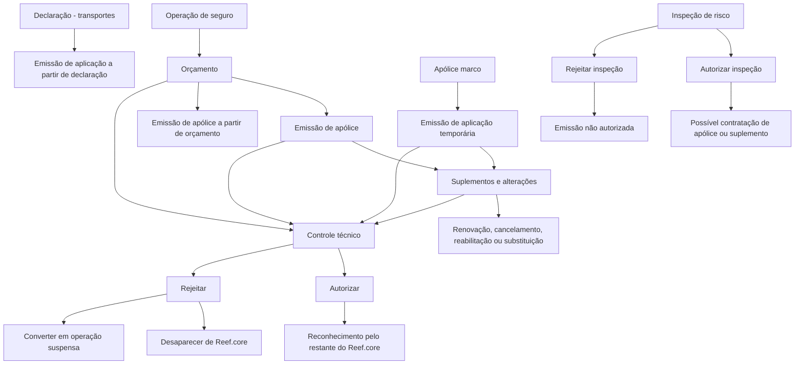

# Documentação de Operação de Emissão — Reef.core / Automóvel

## 1. Metadados do Documento
- **Arquivo de Origem:** Não identificado no conteúdo extraído
- **Tipo de Documento:** Manual Operacional
- **Domínio / Sistema:** Reef / Reef.core / operações de seguros
- **Público-Alvo:** Operação, negócio, analistas funcionais e equipes envolvidas em emissão e administração de seguros
- **Data/Versão Identificada:** Não identificada
- **Status identificado no portal:** Approved Source
- **Owner identificado:** `user:agonzalez_mapfre.com`

---

## 2. Resumo Executivo & Contexto de Negócio

O documento descreve operações de negócio disponíveis no domínio de seguros do Reef.core, abrangendo o ciclo de vida de orçamentos, apólices, aplicações, suplementos, renovações, cancelamentos, controles técnicos, inspeções, processos massivos e consultas.

A seção de nova produção apresenta formas de gerar propostas e contratos de seguro. Um orçamento permite cotar riscos, oferecer opções de seguro, custo e alternativas de fracionamento de pagamento. A emissão de apólice formaliza o contrato que estabelece os riscos cobertos, as condições de cobertura e a cobertura aplicável quando ocorre dano ao risco.

O documento diferencia conceitos operacionais relevantes: uma **aplicação** é uma emissão de apólice temporária, com duração inferior a um ano, baseada em outra apólice denominada apólice marco; uma **declaração** corresponde à operação de emissão de orçamento no negócio de transportes; e um **suplemento** altera informações presentes em uma apólice ou aplicação.

O Reef.core também incorpora processos de governança. Operações podem ficar retidas por controle técnico e, posteriormente, serem autorizadas ou rejeitadas. A autorização faz o objeto existir ou ser reconhecido pelo restante do Reef.core; a rejeição pode remover o objeto ou convertê-lo em objeto suspenso, permitindo alteração das informações que motivaram o controle técnico.

O conteúdo extraído é predominantemente funcional e operacional. Não apresenta contratos de API, métodos HTTP, modelo de dados físico, URLs, ambientes, versões de software, tecnologias de infraestrutura ou detalhes de implementação.

---

## 3. Arquitetura, Componentes & Tecnologias Envolvidas

### Componentes e conceitos identificados

| Componente / Termo | Papel identificado no documento |
| :--- | :--- |
| **Reef.core** | Sistema citado como consumidor/reconhecedor de orçamentos, apólices, prerenovações, declarações e aplicações autorizadas por controle técnico. |
| **Reef** | Domínio ou área documental identificada no portal de documentação. |
| **Mapfredocument** | Nome visível na navegação/identificação do portal documental. |
| **Orçamento / Presupuesto** | Proposta de seguro para um ou vários riscos; pode oferecer custo e opções de fracionamento de pagamento. |
| **Apólice / Póliza** | Contrato que define riscos cobertos, condições e cobertura em caso de dano. |
| **Aplicação / Aplicación** | Emissão de apólice temporária, inferior a um ano, baseada em uma apólice marco. |
| **Declaração / Declaración** | Nome dado ao orçamento no tipo de negócio de transportes. |
| **Suplemento** | Operação de modificação de informações de apólice ou aplicação. |
| **Controle técnico** | Processo que retém operações para autorização ou rejeição. |
| **Inspeção** | Revisão de risco que pode autorizar ou impedir a contratação de apólice ou suplemento. |
| **Processo massivo** | Processo em lote para criar ou alterar orçamentos, apólices e aplicações. |

### Fluxo funcional representativo



> **Nota de Análise:** O documento não detalha arquitetura de software, integrações técnicas, interfaces, bases de dados, protocolos, APIs ou tecnologias de execução. O diagrama representa exclusivamente relações funcionais explicitamente descritas.

---

## 4. Regras de Negócio, Especificações Funcionais & Processos

### 4.1. Orçamento e cotação

- **COTIZAR póliza:** operação relacionada ao seguro de um possível risco; oferece diferentes opções de seguro, o respetivo custo e diferentes opções de fracionamento de pagamento.
- **EMITIR presupuesto:** gera uma proposta de seguro para um ou vários riscos.
- **EMITIR presupuesto desde suspensión:** emite orçamento após retomar uma operação previamente suspensa.
- **EMITIR presupuesto desde presupuesto:** emite orçamento usando outro orçamento como base.
- **EMITIR presupuestos desde póliza:** emite orçamento usando uma apólice como base.
- **EMITIR declaración:** operação equivalente à emissão de orçamento para o negócio de transportes.

### 4.2. Nova produção

- **EMITIR póliza:** gera o contrato que estabelece o risco ou riscos cobertos, as condições de cobertura e a cobertura aplicável quando o risco sofre dano.
- **EMITIR póliza desde suspensión:** realiza emissão de apólice após retomada de uma operação previamente suspensa.
- **EMITIR póliza multiusuario:** permite que vários usuários incluam riscos em paralelo; após todos os riscos serem incluídos, um dos usuários gera a apólice.
- **EMITIR póliza desde presupuesto:** emite uma apólice usando a informação de um orçamento como base.
- **EMITIR aplicación:** corresponde à emissão de apólice com duração temporária inferior a um ano, baseada em uma apólice marco.
- **EMITIR aplicación desde suspensión:** emite aplicação após retomada de uma operação previamente suspensa.
- **EMITIR aplicación desde declaración:** emite apólice usando uma declaração como base; no negócio de transportes, o orçamento é denominado declaração.

### 4.3. Suplementos, modificações e efeitos financeiros

- **ALTERAR póliza:** modifica a maior parte das informações da apólice. Informações não modificáveis por esta operação são alteradas por outros suplementos. Mudanças podem afetar o custo do seguro e gerar cobrança ou devolução ao pagador.
- **ALTERAR póliza desde suspensión:** altera apólice após retomada de uma operação previamente suspensa.
- **ALTERAR póliza temporalmente:** realiza alteração cujo vencimento é anterior ao vencimento da apólice; caracteriza suplemento temporal.
- **ALTERAR póliza anualidad anterior:** modifica a apólice em data anterior à última renovação vigente; pode afetar o custo do seguro.
- **ALTERAR aplicación:** operação equivalente a ALTERAR póliza para uma aplicação.
- **ALTERAR aplicación desde suspensión:** altera aplicação após retomada de operação previamente suspensa.
- **ALTERAR aplicación temporalmente:** realiza suplemento temporal sobre aplicação, com vencimento anterior ao vencimento da aplicação.
- **ANULAR póliza modificación:** anula o último suplemento vigente realizado sobre uma apólice; desfaz a última modificação e pode afetar o custo do seguro.
- **ANULAR póliza modificación temporal:** anula o último suplemento temporal vigente.
- **ANULAR aplicación modificación:** equivalente à anulação de modificação de apólice, aplicado a uma aplicação.
- **ANULAR aplicación modificación temporal:** equivalente à anulação de modificação temporal de apólice, aplicado a uma aplicação.
- **ALTERAR póliza plan pago:** anula um ou mais recibos pendentes e realiza nova distribuição de recibos, ou seja, novo fracionamento de pagamento.
- **ALTERAR aplicación plan pago:** equivalente à alteração do plano de pagamento de apólice, aplicado a uma aplicação.
- **ALTERAR póliza cambio agente:** anula comissões e recibos, regenerando-os para um novo agente. Não afeta o custo do seguro.
- **ALTERAR aplicación cambio agente:** equivalente à alteração de agente de apólice, aplicada a uma aplicação.
- **DISMINUIR póliza por siniestro:** reduz a soma segurada de uma ou mais coberturas afetadas em um sinistro; a redução coincide com a liquidação do sinistro e não afeta o custo do seguro.
- **RESTITUIR póliza capital:** restaura soma segurada previamente reduzida por sinistro; a restituição afeta o custo do seguro.
- **EXTENDER póliza vigencia:** posterga o vencimento para data posterior ao vencimento original; a alteração afeta o custo do seguro.
- **REGULARIZAR póliza:** modifica a apólice em anualidade anterior, ou seja, no período anterior à última renovação vigente. O documento informa que este suplemento “no halla la cancelación”, sendo normal afetar o custo do seguro.
- **LIQUIDAR póliza:** regulariza situação em que houve cobrança antecipada de prêmio, por exemplo, prêmio em depósito pelo pagador. Pode aumentar ou diminuir o custo do seguro.
- **LIQUIDAR aplicación:** equivalente à liquidação de apólice, aplicada a uma aplicação.

### 4.4. Operações de vida e movimentos financeiros

- **CREAR aportación extraordinaria:** adiciona pontualmente uma quantidade econômica extra para incrementar expectativas de rentabilidade.
- **CREAR anticipo:** no seguro de vida, para contratos com direito de resgate previsto, representa a quantia recebida pelo segurado por conta do capital que lhe corresponderá, desde que sejam atendidas as condições da apólice.
- **CREAR cobro de anticipo:** consolida um anticipo.
- **CREAR prorrogado:** transformação por redução da apólice; reduz ou até anula o capital segurado para caso de vida, preservando o capital em caso de morte durante determinado período.
- **CREAR reducción:** ocorre quando contratante ou segurado deixa de pagar prêmios. A apólice original é rescindida e surge novo seguro com prêmio único representado pelas reservas matemáticas constituídas no contrato original, com capital segurado reduzido segundo os prêmios pagos.
- **CREAR rescate:** por vontade do segurado, permite receber o valor de resgate da provisão matemática constituída sobre o risco garantido. Após o resgate, a apólice é automaticamente rescindida.
- **CREAR rescate parcial:** equivalente ao resgate, mas o segurado não recebe o valor total.
- **ELIMINAR rescate parcial:** anula um resgate realizado parcialmente.

### 4.5. Renovação, cancelamento, reabilitação e substituição

- **PRERENOVAR póliza:** aplica todos os critérios para determinar o custo do seguro no novo período; o registro é virtual e o movimento não é real.
- **RENOVAR póliza:** efetiva a renovação real, determinando condições e custo do seguro para novo período de vigência.
- **RENOVAR póliza desde prerenovación:** realiza a renovação usando como base as informações geradas por PRERENOVAR póliza.
- **RENOVAR póliza desde suspensión:** realiza renovação após retomada de operação previamente suspensa.
- **CONVERTIR RENOVACIÓN:** realiza renovação cuja origem não é uma apólice de carteira, mas informações migradas de outro sistema.
- **ANULAR póliza modificación anualidad anterior:** anula movimento originado por ALTERAR póliza anualidad anterior; pode afetar o valor do seguro.
- **ANULAR póliza:** cancela a apólice e pode gerar valor a devolver ao pagador.
- **ANULAR póliza extinción riesgo:** aplica-se quando o risco sofre dano que leva à sua inexistência, como sinistro total; não implica devolução de custo.
- **ANULAR aplicación:** equivalente à anulação de apólice, aplicada a uma aplicação.
- **REHABILITAR póliza:** anula o cancelamento de apólice. A apólice volta a vigorar na situação anterior ao cancelamento, com eficácia na mesma data da anulação.
- **REHABILITAR póliza extensión vigencia:** reabilita em data posterior à anulação. O vencimento é movido pelo tempo em que a apólice ficou anulada e não há custo adicional.
- **REHABILITAR póliza sin extensión vigencia:** o período em que a apólice esteve anulada produz redução de custo no momento da reabilitação.
- **REHABILITAR póliza modificando cualquier dato:** equivalente à reabilitação de apólice, permitindo modificar qualquer informação.
- **REHABILITAR aplicación:** equivalente à reabilitação de apólice, aplicada a uma aplicação.
- **REEMPLAZAR póliza:** emite nova apólice usando outra apólice como base.
- **REEMPLAZAR póliza renovando:** operação análoga a CONVERTIR RENOVACIÓN; a apólice-base deve estar anulada.

### 4.6. Controle técnico

| Operação | Regra e resultado |
| :--- | :--- |
| AUTORIZAR presupuesto | Um orçamento retido por controle técnico é aprovado e passa a existir para o restante do Reef.core. |
| AUTORIZAR póliza | Uma apólice retida é aprovada e reconhecida como apólice pelo restante do Reef.core. |
| AUTORIZAR prerenovación | Uma apólice prerenovada e retida é aprovada e reconhecida como apólice prerenovada pelo restante do Reef.core. |
| AUTORIZAR declaración | Uma declaração retida é aprovada e passa a existir para o restante do Reef.core. |
| AUTORIZAR aplicación | Uma aplicação retida é aprovada e reconhecida como aplicação pelo restante do Reef.core. |
| RECHAZAR presupuesto | Orçamento retido não é autorizado e desaparece do Reef.core. |
| RECHAZAR presupuesto suspendiendo | Orçamento retido não é autorizado, transforma-se em orçamento suspenso e pode ser modificado. |
| RECHAZAR póliza | Apólice retida não é autorizada e desaparece do Reef.core. |
| RECHAZAR póliza suspendiendo | Apólice retida não é autorizada, transforma-se em orçamento suspenso e pode ser modificada. |
| RECHAZAR póliza modificación | Suplemento de apólice retido não é autorizado e desaparece do Reef.core. |
| RECHAZAR póliza modificación suspendiendo | Suplemento de apólice retido não é autorizado, transforma-se em orçamento suspenso e pode ser modificado. |
| RECHAZAR prerenovación | Prerenovação retida não é autorizada e desaparece do Reef.core. |
| RECHAZAR declaración | Declaração retida não é autorizada e desaparece do Reef.core. |
| RECHAZAR declaración suspendiendo | Declaração retida não é autorizada, transforma-se em declaração suspensa e pode ser modificada. |
| RECHAZAR aplicación | Aplicação retida não é autorizada e desaparece do Reef.core. |
| RECHAZAR aplicación suspendiendo | Aplicação retida não é autorizada e passa a uma declaração suspensa, segundo o texto extraído. |
| RECHAZAR aplicación modificación | Suplemento de aplicação retido não é autorizado e desaparece do Reef.core. |
| RECHAZAR aplicación modificación suspendiendo | Suplemento de aplicação retido não é autorizado e passa a uma declaração suspensa, segundo o texto extraído. |

> **Nota de Análise:** O texto extraído indica “presupuesto suspendido” para certas rejeições de apólice e “declaración suspendida” para certas rejeições de aplicação. Esta referência preserva a redação apresentada, sem inferir se esses termos representam comportamento intencional ou inconsistência documental.

### 4.7. Inspeção

1. **CREAR inspección:** gera solicitação de inspeção de risco com dados básicos do risco, localização e inspetor, para avaliar o estado do risco e determinar se pode ser segurado.
2. **MODIFICAR inspección:** atualiza a solicitação quando a informação original não está totalmente correta.
3. **AUTORIZAR inspección:** após a realização, considera a inspeção correta e permite contratar apólice ou suplemento.
4. **RECHAZAR inspección:** após a realização, considera a inspeção incorreta e não autoriza a emissão de apólice ou suplemento.
5. **CONSULTAR inspección:** permite acessar as informações armazenadas sobre uma inspeção.

### 4.8. Processos massivos

1. **CREAR proceso masivo:** define processo massivo para criar ou alterar orçamentos, apólices e/ou aplicações.
2. **FILTRAR proceso masivo:** define quais apólices ou aplicações participarão do processo massivo.
3. **INDICAR CAMBIO proceso masivo:** especifica as mudanças que serão realizadas nas apólices e/ou aplicações participantes.
4. **EXCEPCIONAR proceso masivo:** define orçamentos, apólices ou aplicações inicialmente selecionados que serão excluídos.
5. **LANZAR proceso masivo:** executa o processo; objetos podem ser criados ou alterados, marcados como movimentação sem sucesso ou retidos por controle técnico.
6. **CONSULTAR proceso masivo:** permite acessar as informações relacionadas ao processo massivo.

### 4.9. Consultas

- **CONSULTAR presupuesto:** apresenta informações de um orçamento localizado por diferentes critérios de busca.
- **CONSULTAR póliza:** acessa informações de uma apólice após seleção por diferentes critérios de busca.
- **CONSULTAR prerenovacion:** acessa informações geradas por uma renovação prévia.
- **CONSULTAR cotización póliza:** acessa informações armazenadas sobre uma cotação.
- **CONSULTAR aplicación:** apresenta as informações existentes relativas a uma aplicação.

---

## 5. Tabelas de Parâmetros, Ambientes e Estruturas de Dados

| Item / Parâmetro | Descrição / Função | Tipo / Valores / Formato | Ambiente / Observações |
| :--- | :--- | :--- | :--- |
| Custo do seguro | Valor afetado por determinadas operações de alteração, regularização, restituição, extensão, cancelamento ou reabilitação. | Econômico; valor não detalhado. | Não há fórmula ou moeda identificada. |
| Fracionamento de pagamento | Distribuição de pagamento oferecida na cotação ou recalculada em alteração de plano de pagamento. | Opções de fracionamento; valores não detalhados. | ALTERAR póliza plan pago anula recibos pendentes e redistribui recibos. |
| Recibos | Registros que podem ser anulados e regenerados em mudança de agente ou plano de pagamento. | Não detalhado. | Associados a apólice e aplicação em operações análogas. |
| Comissões | Registros anulados e regenerados para novo agente. | Não detalhado. | ALTERAR póliza cambio agente não afeta custo do seguro. |
| Soma segurada | Valor de cobertura que pode ser reduzido por sinistro ou restaurado posteriormente. | Não detalhado. | DISMINUIR póliza por siniestro e RESTITUIR póliza capital. |
| Vencimento | Data final de vigência de apólice ou aplicação. | Data; formato não identificado. | Pode ser anterior em suplemento temporal ou posterior em extensão de vigência. |
| Apólice marco | Apólice que serve de base para uma aplicação. | Referência de origem. | Aplicação possui duração menor que um ano. |
| Reservas matemáticas | Reservas constituídas em favor do segurado no contrato original. | Econômico; valor não detalhado. | Utilizadas na operação CREAR reducción. |
| Valor de resgate | Valor recebido pelo segurado no resgate. | Econômico; valor não detalhado. | Após CREAR rescate, a apólice é rescindida automaticamente. |
| Dados básicos do risco | Informação necessária para criação de solicitação de inspeção. | Dados de risco; estrutura não detalhada. | Inclui localização e inspetor. |
| Localização | Dado da solicitação de inspeção. | Não detalhado. | Usado em CREAR inspección. |
| Inspetor | Participante associado à solicitação de inspeção. | Não detalhado. | Usado em CREAR inspección. |
| Critérios de busca | Critérios para localizar orçamento ou apólice antes de consulta. | Não detalhado. | Não há lista de filtros nem campos de pesquisa. |
| Ambiente / URL / servidor | Não informado. | Não aplicável. | O conteúdo não apresenta URLs, portas, hosts ou ambientes técnicos. |
| Logs / rotas de log | Não informado. | Não aplicável. | O conteúdo não apresenta parâmetros de logging. |

---

## 6. Bateria de Perguntas & Respostas para RAG (FAQ Sintético)

### P1: O que diferencia a emissão de uma apólice da emissão de um orçamento no Reef.core?
**R:** A emissão de orçamento gera uma proposta de seguro para um ou vários riscos. A emissão de apólice gera o contrato que estabelece os riscos cobertos, as condições de cobertura e a cobertura aplicável quando o risco sofre dano.

### P2: O que é uma aplicação e qual é sua relação com uma apólice marco?
**R:** Uma aplicação é a operação de emissão de apólice com duração temporária inferior a um ano. A informação da aplicação é baseada em outra apólice, denominada apólice marco.

### P3: Como funciona a emissão de apólice multiusuário?
**R:** Na emissão de apólice multiusuário, vários usuários incluem riscos de forma paralela. Depois que todos os riscos forem incluídos, um dos usuários gera a apólice.

### P4: Qual é a diferença entre prerenovar e renovar uma apólice?
**R:** PRERENOVAR póliza aplica critérios para determinar o custo do seguro do novo período, mas o movimento é registrado virtualmente e não é real. RENOVAR póliza realiza a renovação real, definindo condições e custo do seguro para novo período de vigência.

### P5: Quando uma alteração de apólice pode gerar cobrança ou devolução ao pagador?
**R:** ALTERAR póliza permite modificar a maior parte das informações da apólice. Quando as mudanças identificadas afetam o custo do seguro, a operação pode provocar cobrança ou devolução ao pagador do seguro.

### P6: O que ocorre quando uma apólice retida por controle técnico é autorizada?
**R:** AUTORIZAR póliza faz com que uma apólice retida por controle técnico passe a estar aprovada. Como consequência, o restante do Reef.core reconhece a entidade como apólice.

### P7: O que ocorre quando um orçamento retido por controle técnico é rejeitado suspendendo?
**R:** RECHAZAR presupuesto suspendiendo não autoriza o orçamento retido, mas o converte em orçamento suspenso. Isso permite modificar a informação que gerou o controle técnico.

### P8: Qual é o impacto de DISMINUIR póliza por siniestro?
**R:** A operação reduz a soma segurada de uma ou várias coberturas afetadas na tramitação de um sinistro. A redução coincide com a liquidação realizada no sinistro e não afeta o custo do seguro.

### P9: Como funciona a reabilitação de apólice com extensão de vigência?
**R:** REHABILITAR póliza extensión vigencia é semelhante à reabilitação comum, mas a data de reabilitação é posterior à data de anulação. O vencimento é deslocado pelo período em que a apólice esteve anulada, sem gerar custo adicional do seguro.

### P10: Em que situação é utilizado CONVERTIR RENOVACIÓN?
**R:** CONVERTIR RENOVACIÓN realiza uma renovação de apólice a partir de informação migrada de outro sistema, e não a partir de uma apólice existente na carteira.

### P11: Qual é a finalidade de uma inspeção de risco?
**R:** A inspeção avalia o estado de um risco para determinar se ele pode ou não ser segurado pela companhia. A solicitação contém dados básicos do risco, localização e inspetor.

### P12: Quais resultados podem ocorrer ao lançar um processo massivo?
**R:** Ao executar LANZAR proceso masivo, orçamentos, apólices e/ou aplicações podem ser criados ou alterados. Outros podem ser marcados como movimentos sem sucesso, ou retidos por controle técnico.

---

## 7. Glossário de Termos, Siglas & Conceitos-Chave

- **Reef.core:** Sistema mencionado como responsável por reconhecer ou disponibilizar objetos autorizados pelo controle técnico.
- **Apólice / Póliza:** Contrato de seguro que estabelece riscos cobertos, condições e cobertura.
- **Orçamento / Presupuesto:** Proposta de seguro para um ou vários riscos.
- **Cotação / Cotización:** Informação armazenada relativa a uma proposta de seguro.
- **Aplicação / Aplicación:** Apólice temporária, inferior a um ano, baseada em apólice marco.
- **Apólice marco / Póliza marco:** Apólice usada como base de informação para uma aplicação.
- **Declaração / Declaración:** Denominação do orçamento no tipo de negócio de transportes.
- **Suplemento:** Operação de alteração das informações de apólice ou aplicação.
- **Anualidade anterior / Anualidad anterior:** Período anterior à última renovação vigente.
- **Prerenovação / Prerenovación:** Renovação virtual que calcula condições e custo, sem gerar movimento real.
- **Controle técnico:** Processo de retenção, autorização ou rejeição de operações.
- **Risco:** Elemento passível de cobertura ou avaliação pela companhia seguradora.
- **Sinistro / Siniestro:** Evento cuja tramitação pode afetar a soma segurada de coberturas.
- **Soma segurada:** Valor de cobertura que pode ser reduzido ou restituído.
- **Recibo:** Registro de cobrança que pode ser anulado, redistribuído ou regenerado.
- **Resgate / Rescate:** Recebimento, pelo segurado, do valor de resgate associado à provisão matemática.
- **Reserva matemática / Reserva matemática:** Reserva constituída em favor do segurado no contrato original.
- **Processo massivo / Proceso masivo:** Processo em lote para criar ou alterar objetos de seguro.
- **Inspeção / Inspección:** Revisão de risco que pode permitir ou impedir emissão de apólice ou suplemento.

---

## 8. Notas Críticas, Riscos & Limitações

- O documento não informa APIs, serviços técnicos, endpoints, métodos HTTP, esquemas JSON, bancos de dados, mecanismos de autenticação, ambientes, servidores, URLs, portas ou caminhos de logs.
- O documento não apresenta versões, datas de publicação ou histórico de alterações.
- As regras de cálculo de custo do seguro são mencionadas, mas fórmulas, parâmetros, moeda, critérios tarifários e algoritmos não são detalhados.
- A documentação indica que determinadas operações podem afetar custo, cobrança ou devolução, porém não especifica os critérios de cálculo.
- A operação **PRERENOVAR póliza** gera registro virtual, não movimento real; processos consumidores devem distinguir prerenovação de renovação efetiva.
- Operações de rejeição suspendendo preservam oportunidade de correção, mas o texto usa termos potencialmente divergentes para certos casos de apólice e aplicação.
- **Nota de Análise:** Não é possível determinar, apenas a partir do conteúdo, se as referências a “orçamento suspenso” em rejeições de apólice e a “declaração suspensa” em rejeições de aplicação são regras de negócio intencionais ou inconsistências de redação/extração.
- Não há detalhamento adicional sobre critérios de autorização de controle técnico, critérios de aprovação de inspeção ou condições de seleção de processos massivos.

---

## 9. Conteúdo Bruto Estruturado (Referência Fiel)

```text
--- [PÁGINA 1 DE 7] ---

DOCUMENTACIÓN de OPERACIÓN de EMISIÓN (Automóvil) -
PRESUPUESTO
PRESUPUESTO
Operaciones relacionadas con los de seguro de un posible riesgo
COTIZAR póliza
Ofrecer distintas opciones de un seguro
junto con su coste y diferentes opciones
de fraccionamiento de pago
EMITIR presupuesto
Generar una proposición de seguro de uno
varios riesgos
EMITIR presupuesto desde suspensión
Es la operación EMITIR presupuesto,
habiendo retomado la operación que
había sido previamente suspendida
EMITIR presupuesto desde presupuesto
Consiste en EMITIR presupuesto tomando
como origen la información de otro
presupuesto que sirve como base para la
generación del nuevo presupuesto
EMITIR presupuestos desde póliza
Permite EMITIR presupuesto tomando
como origen la información de una póliza
que sire como base para la generación del
nuevo presupuesto
EMITIR declaración
Esta operación es la misma que EMITIR
presupuesto pero para el tipo de negocio
de transportes
NUEVA PRODUCCIÓN
Distintas formas de crear nuevas pólizas o aplicaciones
EMITIR póliza
Consiste en la generación del contrato por
el que se establece el riesgo o riesgos
cubiertos, las condiciones en las que se
cubre y la cobertura que se dará cuando el
EMITIR póliza desde suspensión
Es la realización de la operación EMITIR
póliza, habiendo retomado la operación
que había sido previamente suspendida
EMITIR póliza multiusuario
La finalidad de esta operación es la de
EMITIR póliza pero, en la que varios
usuarios se encuentran incluyendo riesgos
de forma paralela. Una vez que todos los
Documentation / DOCUMENTACIÓN Reef
DOCUMENTACIÓN Reef
Mapfredocument
DOCUMENTACIÓN Reef
Owner
user:agonzalez_mapfre.com
Lifecycle
Approved Source

--- [PÁGINA 2 DE 7] ---

riesgo sufra algún tipo de daño
establecido
riesgos han sido incluidos, uno de los
usuarios genera la póliza
EMITIR póliza desde presupuesto
Consiste en EMITIR póliza tomando como
origen la información de un presupuesto
que sirve como base para la generación
de la nueva póliza
EMITIR aplicación
Realmente es la operación EMITIR póliza
con una duración temporal (menor a un
año), cuya información se basa en otra
póliza llamada póliza marco
EMITIR aplicación desde suspensión
Es la realización de la operación EMITIR
póliza, habiendo retomado la operación
que había sido previamente suspendida
EMITIR aplicación desde declaración
Consiste en EMITIR póliza tomando como
origen la información de una declaración
(para el tipo de negocio de transportes el
presupuesto se llama declaración), que
sirve como base para la generación de la
nueva póliza
SUPLEMENTO
Operaciones relacionadas con la modificación de la información que contiene una póliza o aplicación
ALTERAR póliza
Permite la modificación de la mayor parte
de la información de la póliza. La
información que no se permite modificar
en este suplemento, se permite mediante
otros suplementos. Los cambios
identificados pueden afectar al coste del
seguro, provocando un cobro o devolución
al pagador del seguro
ALTERAR póliza desde suspensión
Consiste en realizar la operación ALTERAR
póliza, habiendo retomado la operación
que había sido previamente suspendida
ALTERAR póliza temporalmente
Realiza una operación ALTERAR póliza
cuyo vencimiento es anterior al
vencimiento de la póliza. Es decir, se
realiza un suplemento temporal
ALTERAR póliza anualidad anterior
Permite realizar una modificación de la
póliza, pero a una fecha anterior a la
última renovación vigente realizada.
Puede afectar al coste del seguro
ALTERAR aplicación
Esta operación es igual a ALTERAR póliza,
pero para el concepto de aplicación
ALTERAR aplicación desde suspensión
Consiste en realizar la operación ALTERAR
aplicación, habiendo retomado la
operación que había sido previamente
suspendida
ALTERAR aplicación temporalmente
Realiza una operación ALTERAR aplicación
cuyo vencimiento es anterior al
vencimiento de la aplicación. Es decir, se
realiza un suplemento temporal
ANULAR póliza modificación
Consiste en anular el último suplemento
vigente realizado sobre la póliza. Es decir,
se "deshace" la última modificación que
haya sufrido la póliza. Puede afectar al
coste del seguro
ANULAR póliza modificación temporal
Esta operación es análoga a ANULAR
póliza modificación, pero anula el últimos
suplemento temporal vigente
ANULAR aplicación modificación
Operación análoga a ANULAR póliza
modificación, pero afectando a una
aplicación
ANULAR aplicación modificación
temporal
Análoga a ANULAR póliza modificación
temporal, pero afectando a una aplicación
ALTERAR póliza plan pago
Realiza la anulación de uno o varios
recibos pendientes y con ese importe se

--- [PÁGINA 3 DE 7] ---

realiza una nueva distribución de recibos.
Es decir, se vuelve a fraccionar el pago
ALTERAR aplicación plan pago
Operación análoga a ALTERAR póliza plan
pago, pero afectando a una aplicación
ALTERAR póliza cambio agente
Realiza la anulación de las comisiones y
recibos y regenera las comisiones y
recibos para un nuevo agente. No afecta al
coste del seguro
ALTERAR aplicación cambio agente
Operación idéntica a ALTERAR póliza
cambio agente, pero afectando a una
aplicación
DISMINUIR póliza por siniestro
Reduce la suma asegurada de una o
varias coberturas afectadas en la
tramitación de un siniestro. La reducción
coincide con la liquidación realizada por la
tramitación. No afecta al coste del seguro
RESTITUIR póliza capital
Restituye la suma asegurada que
previamente ha sido reducida por la
tramitación de un siniestro. La restitución
afecta al coste del seguro
EXTENDER póliza vigencia
Altera el vencimiento de la póliza
llevándolo a una fecha posterior al
vencimiento original. Esta alteración
afecta al coste del seguro
REGULARIZAR póliza
Modificación de la póliza que afecta a la
anualidad anterior. Es decir, al periodo
previo a la última renovación vigente.
Tiene la particularidad de que este
suplemento no halla la cancelación por lo
que es normal que afecte al coste del
seguro
CREAR aportación extraordinaria
Movimiento que es generado cuando se
añade una cantidad económica extra y
que se realiza de forma puntual, con el fin
de incrementar las expectativas de
rentabilidad
CREAR anticipo
En el seguro de vida, y respecto a las
modalidades de contratos en los que se
ha previsto el derecho de rescate, es la
cantidad que puede percibir el asegurado
a cuenta del capital que en su momento le
corresponda, cumplidas las condiciones
establecidas en la póliza
CREAR cobro de anticipo
Consolidación de un anticipo
CREAR prorrogado
Es la transformación por reducción de la
póliza en la que, si bien se reduce o
incluso anula el capital asegurado para
caso de vida, continúa en cambio en vigor
el capital para caso de muerte durante un
cierto tiempo
CREAR reducción
Movimiento que se produce cuando, al
dejar de pagar el contratante o asegurado
las primas estipuladas, se rescinde la
póliza original, surgiendo un nuevo seguro
con prima única representada por las
reservas matemáticas que, a favor del
asegurado, se habían constituido en el
contrato primitivo, y con un capital
asegurado disminuido, a tenor de las
primas pagadas hasta ese momento
CREAR rescate
Modificación que por voluntad del
asegurado, este percibe el importe que le
corresponde (valor de rescate) de la
provisión matemática constituida sobre el
riesgo que tenía garantizado. Efectuado el
rescate, la póliza rescatada queda
automáticamente rescindida
CREAR rescate parcial
Movimiento equivalente a CREAR rescate,
pero el importe que recibe el asegurado no
es el total
ELIMINAR rescate parcial
Anulación de un rescate realizado
parcialmente
LIQUIDAR póliza
Modificación que permite regularizar la
situación cuando hubo un cobro
anticipado de prima
LIQUIDAR aplicación
Movimiento análogo a LIQUIDAR póliza,
pero afectando a una aplicación
PRERENOVAR póliza
Realiza una renovación aplicando todos
los criterios con el fin de determinar cual
será el coste del seguro para el nuevo
periodo de la póliza. Tiene la salvedad que

--- [PÁGINA 4 DE 7] ---

(por ejemplo hubo una prima en depósito por parte del
pagador). Este suplemento puede implicar
un incremento o decremento del coste del
seguro
la operación se registra de forma virtual
por lo que el movimiento no es real
RENOVAR póliza
Realiza la renovación real de la póliza. Es
decir, se determina las condiciones y el
coste del seguro para un nuevo periodo de
vigencia
RENOVAR póliza desde prerenovación
Realiza la operación RENOVAR póliza, pero
la base es la renovación previa que se
hizo. Es decir, toma la información
generada por la operación PRERENOVAR
póliza y renueva la póliza
RENOVAR póliza desde suspensión
Consiste en realizar la operación
RENOVAR póliza, habiendo retomando la
operación que había sido previamente
suspendida
CONVERTIR RENOVACIÓN (cargas en el
sistema, renovando)
Consiste en realizar la operación
RENOVAR póliza, salvo que el origen de la
información no es una póliza de la cartera,
la información parte de una migración de
otro sistema. Es decir, con la información
migrada desde otro sistema, se produce
una renovación de póliza
ANULAR póliza modificación anualidad
anterior
Es un movimiento análogo a ANULAR
póliza modificación, pero el origen es un
suplemento realizado a la anualidad
anterior. Es decir se anula un movimiento
generado con la peración ALTERAR póliza
anualidad anterior. Este movimiento puede
afectar al importe del seguro
ANULAR póliza
Realiza la cancelación de la póliza, puede
generar un importe a devolver al pagador
ANULAR póliza extinción riesgo
Este movimiento se aplica cuando el
riesgo ha sufrido tal daño que el deja de
existir (como por ejemplo un siniestro
total). Este movimiento no implica
devolución de coste
ANULAR aplicación
Movimiento análogo a ANULAR póliza,
pero afectando a una aplicación
REHABILITAR póliza
Es la anulación de una cancelación de
póliza. Es decir, la póliza vuelve a estar
vigente con la situación previa a la
anulación. La Rehabilitación es efectiva el
mismo día en el que se anuló la póliza
REHABILITAR póliza extensión vigencia
Operación análoga a REHABILITAR póliza,
salvo que la fecha de rehabilitación es
posterior a la fecha de anulación de la
póliza. Este cambio en la fecha, implica
una extensión de la póliza y no genera coste
adicional del seguro
REHABILITAR póliza sin extensión
vigencia
Análoga a la operación REHABILITAR
póliza extensión vigencia, salvo que el
tiempo en el que la póliza estuvo anulada
genera una reducción de coste a la hora
de rehabilitar
REHABILITAR póliza modificando
cualquier dato
Análoga a la operación REHABILITAR
póliza, pero permite modificar cualquier
información de esta
REHABILITAR aplicación
Operación análoga a REHABILITAR póliza,
pero afectando a una aplicación
REEMPLAZO
Distintas posibilidades que permite tomar una póliza como información de partida para crear una nueva
REEMPLAZAR póliza
Consiste en EMITIR póliza tomando como origen la información
de otra póliza que sirve como base para la generación de la nueva
REEMPLAZAR póliza renovando
Operación análoga a CONVERTIR RENOVACIÓN. La póliza que
sirve como base debe estar anulada

--- [PÁGINA 5 DE 7] ---

CONTROL TÉCNICO
Distintas operaciones de autorización y rechazo de controles técnicos de auditoría
AUTORIZAR presupuesto
Un presupuesto retenido por control
técnico pasa a estar aprobado y por
consiguiente, existe para el resto de
Reef.core
AUTORIZAR póliza
Una póliza retenida por control técnico
pasa a estar aprobada y por consiguiente,
hace que el resto de Reef.core la
reconozca como póliza
AUTORIZAR prerenovación
Una póliza que ha sido renovada
previamente y que está retenida por
control técnico pasa a estar aprobada y
por consiguiente, hace que el resto de
Reef.core la reconozca como póliza
prerenovada
AUTORIZAR declaración
Una declaración retenida por control
técnico pasa a estar aprobada y por
consiguiente, existe para el resto de
Reef.core
AUTORIZAR aplicación
Una aplicación retenida por control
técnico pasa a estar aprobada y por
consiguiente, hace que el resto de
Reef.core la reconozca como aplicación
RECHAZAR presupuesto
Un presupuesto retenido por control
técnico no es autorizado y por
consiguiente desaparece de Reef.core
RECHAZAR presupuesto suspendiendo
Un presupuesto retenido por control
técnico no es autorizado y pasa
convertirse en un presupuesto suspendido
y así dar la oportunidad de modificar la
información que generó el control técnico
RECHAZAR póliza
Una póliza retenida por control técnico no
es autorizada y por consiguiente
desaparece de Reef.core
RECHAZAR póliza suspendiendo
Una póliza retenida por control técnico no
es autorizada y pasa convertirse en un
presupuesto suspendido y así dar la
oportunidad de modificar la información
que generó el control técnico
RECHAZAR póliza modificación
Un suplemento realizado a una póliza que
quedó retenido por control técnico no es
autorizado y por consiguiente desaparece
de Reef.core
RECHAZAR póliza modificación
suspendiendo
Un suplemento realizado a una póliza que
quedó retenido por control técnico no es
autorizado y pasa convertirse en un
presupuesto suspendido y así dar la
oportunidad de modificar la información
que generó el control técnico
RECHAZAR prerenovación
Una renovación previa a una póliza que
quedó retenida por control técnico no es
autorizada y por consiguiente desaparece
de Reef.core
RECHAZAR declaración
Una declaración retenida por control
técnico no es autorizada y por
consiguiente desaparece de Reef.core
RECHAZAR declaración suspendiendo
Una declaración retenida por control
técnico no es autorizada y pasa
convertirse en una declaración
suspendida y así dar la oportunidad de
modificar la información que generó el
control técnico
RECHAZAR aplicación
Una aplicación retenida por control
técnico no es autorizada y por
consiguiente desaparece de Reef.core
RECHAZAR aplicación suspendiendo
Una aplicación retenida por control
técnico no es autorizada y pasa
convertirse en una declaración
suspendida y así dar la oportunidad de
RECHAZAR aplicación modificación
Un suplemento realizado a una aplicación
que quedó retenido por control técnico no
es autorizado y por consiguiente
desaparece de Reef.core
RECHAZAR aplicación modificación
suspendiendo
Un suplemento realizado a una aplicación
que quedó retenido por control técnico no
es autorizado y pasa convertirse en una

--- [PÁGINA 6 DE 7] ---

modificar la información que generó el
control técnico
declaración suspendida y así dar la
oportunidad de modificar la información
que generó el control técnico
INSPECCIÓN
Operaciones relacionadas con las revisiones de riesgos
CREAR inspección
Se genera una solicitud de inspección de
riesgo con los datos básicos del riesgo,
ubicación e inspector con el fin de que se
evalúe el estado y pueda o no ser
asegurado por la compañía
MODIFICAR inspección
Se actualiza la solicitud de inspección si
por cualquier motivo la información
original no era totalmente correcta
AUTORIZAR inspección
Una vez realizada la inspección, esta se
considera correcta y es posible la
contratación de la póliza o suplemento
RECHAZAR inspección
Una vez realizada la inspección, esta no se
considera correcta y no se autoriza la
emisión de la póliza o suplemento
CONSULTAR inspección
Permite el acceso a la información
almacenada acerca de una inspección
PROCESOS MASIVOS
Operaciones relacionadas con procesos por lotes
CREAR proceso masivo
Se define un proceso masivo que permita
crear o alterar presupuestos, pólizas y/o
aplicaciones
FILTRAR proceso masivo
Permite la definición de qué pólizas o
aplicaciones intervienen en un proceso
masivo
INDICAR CAMBIO proceso masivo
Se especifican los cambios a realizar en el
proceso masivo y que sufrirán las pólizas
y/o aplicaciones que participen en él
EXCEPCIONAR proceso masivo
Se determina qué presupuesto, pólizas o
aplicaciones inicialmente seleccionadas
pasan a estar excluidas del proceso
masivo
LANZAR proceso masivo
Ejecución del proceso masivo donde una
serie de presupuestos, póliza y/o
aplicaciones serán creadas o alteradas,
otras quedarán marcadas como que el
movimiento no tuvo éxito y otras quedarán
retenidas por control técnico
CONSULTAR proceso masivo
Facilita el acceso a la información que
existe relacionado con el proceso masivo
CONSULTAS
Distintas opciones de consulta
CONSULTAR presupuesto
Muestra la información relacionada con
un presupuesto, previamente ubicado
mediante distintos criterios de búsqueda
CONSULTAR póliza
Permite el acceso a la información de una
póliza, donde previamente se ha facilitado
CONSULTAR prerenovacion
Facilita el acceso a la información que ha
sido generada por una renovación previa

--- [PÁGINA 7 DE 7] ---

la selección mediante distintos criterios
de búsqueda
CONSULTAR cotización póliza
Accede a la información almacenada
relativa a una cotización
CONSULTAR aplicación
Visualiza la información que existe relativa
a una aplicación
Checking links...
```
