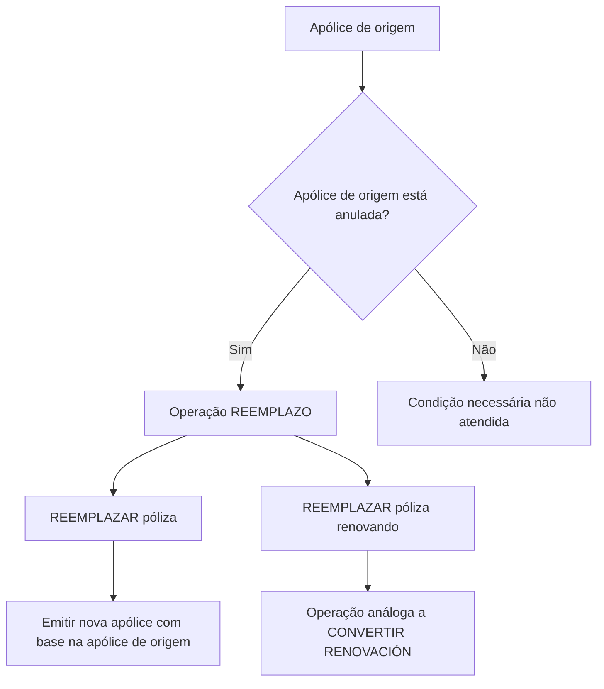

# Documentação de Operação de Emissão de Automóvel — Reemplazo

## 1. Metadados do Documento
- **Arquivo de Origem:** Não informado no conteúdo fornecido
- **Tipo de Documento:** Procedimento
- **Domínio / Sistema:** Reef / Mapfre — emissão de apólices de Automóvel
- **Público-Alvo:** Operação, Negócio e usuários do sistema Reef
- **Data/Versão Identificada:** Não identificada

---

## 2. Resumo Executivo & Contexto de Negócio

O conteúdo descreve a operação **REEMPLAZO** no contexto de **emissão de apólices de Automóvel**. A operação permite utilizar uma apólice existente como informação de partida para criar uma nova apólice.

A modalidade **REEMPLAZAR póliza** consiste em emitir uma nova apólice usando os dados de outra apólice como base. A condição explicitamente informada é que a apólice utilizada como origem deve estar anulada.

O conteúdo também apresenta a modalidade **REEMPLAZAR póliza renovando**, caracterizada como uma operação análoga a **CONVERTIR RENOVACIÓN**. Para essa modalidade, a apólice de origem também deve estar anulada.

O material está associado à documentação Reef, menciona Mapfredocument e apresenta estado de ciclo de vida **Approved**. Não há detalhamento de telas, passos operacionais no sistema, contratos de integração, campos de apólice, validações complementares ou tratamento de erros.

---

## 3. Arquitetura, Componentes & Tecnologias Envolvidas

Os elementos explicitamente mencionados são:

- **Reef:** Contexto de documentação e navegação apresentado no conteúdo.
- **Mapfredocument:** Termo exibido no conteúdo, sem detalhamento funcional ou técnico.
- **REEMPLAZO:** Operação de emissão de uma nova apólice com base em uma apólice anterior.
- **REEMPLAZAR póliza:** Modalidade de emissão baseada em apólice anulada.
- **REEMPLAZAR póliza renovando:** Modalidade análoga a CONVERTIR RENOVACIÓN e baseada em apólice anulada.
- **CONVERTIR RENOVACIÓN:** Operação usada como referência de analogia; o documento não fornece seu fluxo ou regras.
- **Documentación Reef:** Área ou classificação documental mencionada.
- **Lifecycle Approved:** Situação de ciclo de vida apresentada para o conteúdo.
- **Owner:** `user:agonzalez_mapfre.com`.



> **Nota de Análise:** O conteúdo não identifica sistemas integrados, tecnologias, APIs, métodos HTTP, contratos JSON, banco de dados, infraestrutura, ambientes técnicos ou componentes de microsserviços.

---

## 4. Regras de Negócio, Especificações Funcionais & Processos

### Operação REEMPLAZO

A operação REEMPLAZO representa diferentes possibilidades para utilizar uma apólice como informação de partida na criação de uma nova apólice.

### Modalidade: REEMPLAZAR póliza

1. Uma apólice existente é utilizada como origem de informação.
2. A operação consiste em emitir uma nova apólice.
3. A nova apólice é gerada usando a informação da apólice de origem como base.
4. A apólice de origem deve estar anulada.

### Modalidade: REEMPLAZAR póliza renovando

1. Uma apólice existente é utilizada como origem de informação.
2. A operação é análoga a **CONVERTIR RENOVACIÓN**.
3. A apólice de origem deve estar anulada.

### Restrições explicitamente identificadas

- A condição comum às modalidades apresentadas é que a apólice usada como base/origem esteja anulada.
- O documento não detalha o significado operacional de “anulada”, nem informa como o estado é validado.
- O documento não descreve quais dados da apólice de origem são copiados, reutilizados, recalculados ou obrigatoriamente alterados na nova emissão.
- O documento não detalha as etapas internas de CONVERTIR RENOVACIÓN.

---

## 5. Tabelas de Parâmetros, Ambientes e Estruturas de Dados

| Item / Parâmetro | Descrição / Função | Tipo / Valores / Formato | Ambiente / Observações |
| :--- | :--- | :--- | :--- |
| REEMPLAZO | Operação que permite tomar uma apólice como informação de partida para criar uma nova apólice | Operação de emissão | Contexto: emissão de Automóvel |
| REEMPLAZAR póliza | Emite uma nova apólice tomando como origem a informação de outra apólice | Modalidade da operação REEMPLAZO | A apólice de origem deve estar anulada |
| REEMPLAZAR póliza renovando | Operação análoga a CONVERTIR RENOVACIÓN | Modalidade da operação REEMPLAZO | A apólice de origem deve estar anulada |
| Apólice de origem | Apólice cuja informação é usada como base para gerar uma nova apólice | Apólice | Deve estar anulada |
| CONVERTIR RENOVACIÓN | Operação usada como referência para REEMPLAZAR póliza renovando | Operação | Não detalhada no conteúdo |
| Produto / ramo | Automóvil | Domínio de emissão | Informado no título do documento |
| Documentación Reef | Identificação ou área documental exibida | Classificação documental | Sem detalhamento adicional |
| Mapfredocument | Termo exibido na fonte | Não especificado | Sem detalhamento adicional |
| Owner | Responsável informado no conteúdo | `user:agonzalez_mapfre.com` | Valor literal apresentado |
| Lifecycle | Estado do ciclo de vida do conteúdo | Approved | Apresentado na fonte |
| Idioma | Idioma de navegação exibido | ES | Apresentado na fonte |

---

## 6. Bateria de Perguntas & Respostas para RAG (FAQ Sintético)

### P1: O que é a operação REEMPLAZO na emissão de apólices de Automóvel?
**R:** REEMPLAZO é uma operação que permite usar uma apólice como informação de partida para criar e emitir uma nova apólice no contexto de Automóvel.

### P2: Qual é a condição obrigatória para uma apólice ser usada em REEMPLAZAR póliza?
**R:** A apólice que serve como origem ou base para a geração da nova apólice deve estar anulada.

### P3: O que ocorre na modalidade REEMPLAZAR póliza?
**R:** Na modalidade REEMPLAZAR póliza, uma nova apólice é emitida tomando como origem as informações de outra apólice. A apólice de origem deve estar anulada.

### P4: O que é REEMPLAZAR póliza renovando?
**R:** REEMPLAZAR póliza renovando é uma modalidade da operação REEMPLAZO descrita como análoga à operação CONVERTIR RENOVACIÓN. A apólice utilizada como base deve estar anulada.

### P5: Qual é a relação entre REEMPLAZAR póliza renovando e CONVERTIR RENOVACIÓN?
**R:** O documento informa que REEMPLAZAR póliza renovando é uma operação análoga a CONVERTIR RENOVACIÓN. Entretanto, o conteúdo não detalha o fluxo, as etapas ou as regras de CONVERTIR RENOVACIÓN.

### P6: A operação REEMPLAZO se aplica a qual produto ou ramo?
**R:** O título do conteúdo identifica a documentação como relacionada à operação de emissão de Automóvel.

### P7: O documento informa quais dados da apólice anulada são reutilizados na nova apólice?
**R:** Não. O documento apenas estabelece que a nova apólice é gerada usando as informações de outra apólice como base, sem especificar campos, dados reutilizados, exceções ou alterações obrigatórias.

### P8: O documento descreve validações adicionais além da exigência de anulação da apólice de origem?
**R:** Não. A única condição operacional explicitamente apresentada é que a apólice de origem deve estar anulada.

### P9: Qual é o estado de ciclo de vida indicado para a documentação?
**R:** O conteúdo apresenta o campo Lifecycle com o valor **Approved**.

### P10: Quem é o owner indicado no conteúdo da documentação?
**R:** O owner exibido é `user:agonzalez_mapfre.com`.

---

## 7. Glossário de Termos, Siglas & Conceitos-Chave

- **REEMPLAZO:** Operação que permite tomar uma apólice como informação de partida para criar uma nova apólice.
- **REEMPLAZAR póliza:** Modalidade de REEMPLAZO que emite uma nova apólice com base em outra apólice anulada.
- **REEMPLAZAR póliza renovando:** Modalidade de REEMPLAZO análoga a CONVERTIR RENOVACIÓN, com exigência de apólice de origem anulada.
- **CONVERTIR RENOVACIÓN:** Operação citada como análoga a REEMPLAZAR póliza renovando; não detalhada na fonte.
- **Póliza / Apólice:** Registro usado como origem de informação para a geração de uma nova apólice.
- **Anulada:** Estado obrigatório da apólice de origem nas modalidades apresentadas.
- **Reef:** Nome presente na documentação e na navegação exibida.
- **Mapfredocument:** Termo apresentado no conteúdo, sem definição adicional.
- **Lifecycle:** Campo de ciclo de vida documental; o valor exibido é Approved.
- **ES:** Indicador de idioma exibido na navegação.

---

## 8. Notas Críticas, Riscos & Limitações

- O conteúdo é resumido e não fornece um procedimento operacional detalhado para executar REEMPLAZO.
- Não há especificação de telas, comandos, serviços, APIs, contratos, campos obrigatórios ou formatos de dados.
- Não são descritos critérios para validar que uma apólice está anulada.
- Não são informados comportamentos para tentativas de uso de uma apólice não anulada.
- CONVERTIR RENOVACIÓN é apenas citado como operação análoga; seu funcionamento não é explicado.
- Não há informações sobre permissões, perfis de acesso, trilhas de auditoria, logs, ambientes ou URLs.
- Não há datas, versão de documento ou identificação de arquivo na fonte fornecida.
- **Nota de Análise:** O conteúdo lista as operações REEMPLAZAR póliza e REEMPLAZAR póliza renovando, mas não detalha seus métodos de execução, contratos técnicos ou regras além do status anulado da apólice de origem.

---

## 9. Conteúdo Bruto Estruturado (Referência Fiel)

```text
--- [PÁGINA 1 DE 1] ---

DOCUMENTACIÓN de OPERACIÓN de EMISIÓN (Automóvil) -
REEMPLAZO
REEMPLAZO
Distintas posibilidades que permite tomar una póliza como información de partida para crear una nueva
REEMPLAZAR póliza
Consiste en EMITIR póliza tomando como origen la información
de otra póliza que sirve como base para la generación de la nueva
póliza. La póliza que sirve como base debe estar anulada
REEMPLAZAR póliza renovando
Operación análoga a CONVERTIR RENOVACIÓN. La póliza que
sirve como base debe estar anulada
Documentation / DOCUMENTACIÓN Reef
DOCUMENTACIÓN Reef
Mapfredocument
DOCUMENTACIÓN Reef
Owner
user:agonzalez_mapfre.com
Lifecycle
Approved Source
 / 
 VL
Buscar Inicio Soluciones Arquitecturas APIs Componentes Cloud Documentación Zeus Reef Ayuda
ES
```
