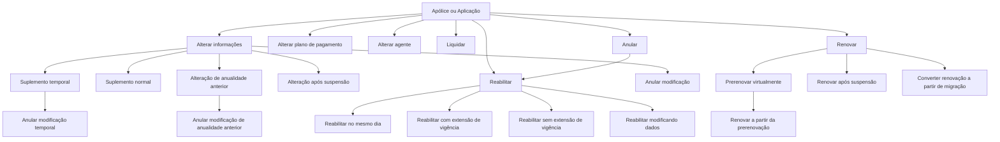

# Documentação de Operação de Emissão — Suplementos, Renovação, Anulação e Reabilitação de Apólices e Aplicações

## 1. Metadados do Documento
- **Arquivo de Origem:** `Não informado — conteúdo bruto fornecido na solicitação`
- **Tipo de Documento:** `Manual Operacional`
- **Domínio / Sistema:** `Emissão de seguros; Reef; Mapfredocument`
- **Público-Alvo:** `Não identificado explicitamente; conteúdo aplicável a operação, negócio e suporte a processos de apólices`
- **Data/Versão Identificada:** `Não identificada`
- **Estado do documento indicado no conteúdo:** `Approved Source`

---

## 2. Resumo Executivo & Contexto de Negócio

O documento descreve operações de emissão relacionadas a suplementos e movimentos incidentes sobre **apólices** e **aplicações**. Os movimentos abrangem alteração de informações, anulação de suplementos, redistribuição de pagamento, alteração de agente, redução ou restituição de capital, extensão de vigência, regularização, renovação, cancelamento e reabilitação.

As operações podem afetar elementos financeiros do seguro, incluindo o **custo do seguro**, cobranças, devoluções ao pagador, recibos, comissões, soma assegurada, capital assegurado, valor de resgate e reservas matemáticas. O documento diferencia explicitamente movimentos que afetam o custo daqueles que não o afetam.

Diversas operações possuem equivalentes para o conceito de **aplicação**, normalmente definidos como análogos às operações de apólice. O documento também registra variantes temporárias, variantes executadas após suspensão, movimentos referentes à anualidade anterior e movimentos de reabilitação com diferentes impactos sobre vigência e custo.

O conteúdo é predominantemente funcional e operacional. Não são apresentados contratos de integração, métodos HTTP, modelos de dados, URLs, servidores, logs, tecnologias de implementação ou detalhes de arquitetura de software.

---

## 3. Arquitetura, Componentes & Tecnologias Envolvidas

### Componentes e conceitos identificados

| Componente / Conceito | Papel identificado no documento |
| :--- | :--- |
| Reef | Área de documentação indicada no cabeçalho do conteúdo. |
| Mapfredocument | Referência exibida no conteúdo como fonte ou ambiente documental. |
| Apólice | Entidade sobre a qual são realizadas operações de alteração, anulação, renovação, cancelamento, liquidação e reabilitação. |
| Aplicação | Entidade que possui operações análogas a diversas operações realizadas sobre apólices. |
| Suplemento | Movimento associado à modificação de informações de apólice ou aplicação. |
| Pagador do seguro | Parte que pode receber cobrança ou devolução decorrente de alterações e cancelamentos. |
| Agente | Entidade associada a comissões e recibos, podendo ser alterada por movimento específico. |
| Recibo | Elemento financeiro que pode ser anulado, redistribuído ou regenerado. |
| Comissão | Elemento associado ao agente, anulado e regenerado na alteração de agente. |
| Siniestro / siniestro | Evento de sinistro que pode reduzir a soma assegurada e justificar extinção de risco. |

### Fluxo funcional consolidado



> **Nota de Análise:** O diagrama representa relações funcionais explicitamente descritas no conteúdo. O documento não detalha arquitetura de infraestrutura, sistemas integrados, APIs, persistência, filas, protocolos ou tecnologias de implementação.

---

## 4. Regras de Negócio, Especificações Funcionais & Processos

### 4.1 Operações de alteração

- **ALTERAR póliza:** permite modificar a maior parte das informações da apólice. Informações não modificáveis por esse suplemento devem ser tratadas por outros suplementos. Alterações identificadas podem afetar o custo do seguro e provocar cobrança ou devolução ao pagador.
- **ALTERAR póliza desde suspensión:** realiza a operação `ALTERAR póliza` após retomada de uma operação que havia sido previamente suspensa.
- **ALTERAR póliza temporalmente:** realiza uma alteração cuja data de vencimento é anterior ao vencimento da apólice; caracteriza um suplemento temporal.
- **ALTERAR póliza anualidad anterior:** realiza modificação em data anterior à última renovação vigente. Pode afetar o custo do seguro.
- **ALTERAR aplicación:** operação equivalente a `ALTERAR póliza`, aplicada ao conceito de aplicação.
- **ALTERAR aplicación desde suspensión:** realiza `ALTERAR aplicación` após retomada de operação previamente suspensa.
- **ALTERAR aplicación temporalmente:** realiza alteração de aplicação com vencimento anterior ao vencimento da aplicação; caracteriza suplemento temporal.
- **ALTERAR póliza plan pago:** anula um ou mais recibos pendentes e distribui novamente o respectivo valor em novos recibos; o pagamento é novamente fracionado.
- **ALTERAR aplicación plan pago:** operação análoga a `ALTERAR póliza plan pago`, aplicada a uma aplicação.
- **ALTERAR póliza cambio agente:** anula comissões e recibos e regenera comissões e recibos para um novo agente. Não afeta o custo do seguro.
- **ALTERAR aplicación cambio agente:** operação idêntica a `ALTERAR póliza cambio agente`, aplicada a uma aplicação.

### 4.2 Anulação de modificações e cancelamentos

- **ANULAR póliza modificación:** anula o último suplemento vigente efetuado sobre a apólice, desfazendo a última modificação sofrida. Pode afetar o custo do seguro.
- **ANULAR póliza modificación temporal:** anula o último suplemento temporal vigente; é análoga à anulação de modificação de apólice.
- **ANULAR aplicación modificación:** operação análoga à anulação de modificação de apólice, aplicada a uma aplicação.
- **ANULAR aplicación modificación temporal:** operação análoga à anulação de modificação temporal de apólice, aplicada a uma aplicação.
- **ANULAR póliza modificación anualidad anterior:** anula movimento originado por `ALTERAR póliza anualidad anterior`. Pode afetar o importe do seguro.
- **ANULAR póliza:** cancela a apólice e pode gerar valor a devolver ao pagador.
- **ANULAR póliza extinción riesgo:** aplica-se quando o risco sofre dano que faz com que deixe de existir, como em um sinistro total. Não implica devolução de custo.
- **ANULAR aplicación:** operação análoga a `ANULAR póliza`, aplicada a uma aplicação.

### 4.3 Sinistro, capital e vigência

- **DISMINUIR póliza por siniestro:** reduz a soma assegurada de uma ou mais coberturas afetadas no tratamento de um sinistro. A redução coincide com a liquidação realizada no tratamento do sinistro. Não afeta o custo do seguro.
- **RESTITUIR póliza capital:** restitui soma assegurada anteriormente reduzida pelo tratamento de sinistro. A restituição afeta o custo do seguro.
- **EXTENDER póliza vigencia:** altera o vencimento da apólice para data posterior ao vencimento original. A alteração afeta o custo do seguro.

### 4.4 Regularização, aportes, antecipações e resgates

- **REGULARIZAR póliza:** modifica a apólice em anualidade anterior, ou seja, no período anterior à última renovação vigente. O documento informa como particularidade que esse suplemento “no halla la cancelación”; é normal que afete o custo do seguro.
- **CREAR aportación extraordinaria:** movimento gerado pela inclusão pontual de valor econômico adicional para aumentar expectativas de rentabilidade.
- **CREAR anticipo:** em seguro de vida e em modalidades contratuais com direito de resgate previsto, representa valor que o segurado pode receber por conta do capital que lhe corresponderá, desde que cumpridas as condições estabelecidas na apólice.
- **CREAR cobro de anticipo:** consolidação de um anticipo.
- **CREAR prorrogado:** transformação por redução da apólice. Pode reduzir ou anular o capital assegurado para caso de vida, mantendo em vigor por certo tempo o capital para caso de morte.
- **CREAR reducción:** ocorre quando contratante ou segurado deixa de pagar prêmios estipulados. A apólice original é rescindida e surge novo seguro com prêmio único representado pelas reservas matemáticas constituídas no contrato inicial, com capital assegurado reduzido conforme os prêmios pagos até então.
- **CREAR rescate:** por vontade do segurado, permite receber o valor de resgate da provisão matemática constituída sobre o risco garantido. Após o resgate, a apólice resgatada fica automaticamente rescindida.
- **CREAR rescate parcial:** equivalente ao resgate, porém o segurado não recebe o valor total.
- **ELIMINAR rescate parcial:** anulação de resgate realizado parcialmente.
- **LIQUIDAR póliza:** regulariza situação em que ocorreu cobrança antecipada de prêmio, por exemplo, existência de prêmio em depósito pelo pagador. Pode aumentar ou diminuir o custo do seguro.
- **LIQUIDAR aplicación:** movimento análogo a `LIQUIDAR póliza`, aplicado a uma aplicação.

### 4.5 Renovação

- **PRERENOVAR póliza:** realiza renovação aplicando todos os critérios para determinar o custo do seguro no novo período da apólice. O movimento é registrado virtualmente e não é real.
- **RENOVAR póliza:** realiza renovação real da apólice, determinando condições e custo do seguro para novo período de vigência.
- **RENOVAR póliza desde prerenovación:** executa `RENOVAR póliza` usando a informação gerada por `PRERENOVAR póliza`.
- **RENOVAR póliza desde suspensión:** executa `RENOVAR póliza` após retomada de operação previamente suspensa.
- **CONVERTIR RENOVACIÓN (cargas en el sistema, renovando):** realiza `RENOVAR póliza` com informação originada em migração de outro sistema, e não em apólice já pertencente à carteira.

### 4.6 Reabilitação

- **REHABILITAR póliza:** anula o cancelamento da apólice. A apólice volta a vigorar na situação anterior à anulação. A reabilitação é efetiva no mesmo dia em que a apólice foi anulada.
- **REHABILITAR póliza extensión vigencia:** análoga à reabilitação de apólice, mas a data de reabilitação é posterior à data de anulação. A vigência é estendida pelo período em que a apólice permaneceu anulada. Não gera custo adicional de seguro.
- **REHABILITAR póliza sin extensión vigencia:** análoga à reabilitação com extensão de vigência, mas o tempo em que a apólice esteve anulada gera redução de custo no momento da reabilitação.
- **REHABILITAR póliza modificando cualquier dato:** análoga à reabilitação de apólice, permitindo modificar qualquer informação da apólice.
- **REHABILITAR aplicación:** operação análoga a `REHABILITAR póliza`, aplicada a uma aplicação.

---

## 5. Tabelas de Parâmetros, Ambientes e Estruturas de Dados

| Item / Parâmetro | Descrição / Função | Tipo / Valores / Formato | Ambiente / Observações |
| :--- | :--- | :--- | :--- |
| ALTERAR póliza | Modifica a maior parte das informações da apólice. | Suplemento de alteração. | Pode gerar cobrança ou devolução e afetar o custo. |
| ALTERAR póliza desde suspensión | Retoma alteração previamente suspensa. | Variante de alteração. | Apólice. |
| ALTERAR póliza temporalmente | Altera apólice com vencimento anterior ao vencimento da apólice. | Suplemento temporal. | Apólice. |
| ALTERAR póliza anualidad anterior | Altera apólice em data anterior à última renovação vigente. | Alteração de anualidade anterior. | Pode afetar custo. |
| ALTERAR aplicación | Altera dados de aplicação. | Operação análoga a alteração de apólice. | Aplicação. |
| ANULAR póliza modificación | Desfaz último suplemento vigente da apólice. | Anulação de suplemento. | Pode afetar custo. |
| ANULAR póliza modificación temporal | Desfaz último suplemento temporal vigente. | Anulação temporal. | Apólice. |
| ANULAR aplicación modificación | Desfaz modificação em aplicação. | Anulação de suplemento. | Aplicação. |
| ALTERAR póliza plan pago | Anula recibos pendentes e realiza nova distribuição. | Refracionamento de pagamento. | Apólice. |
| ALTERAR póliza cambio agente | Anula e regenera comissões e recibos para novo agente. | Alteração de agente. | Não afeta custo. |
| DISMINUIR póliza por siniestro | Reduz soma assegurada conforme liquidação do sinistro. | Movimento por sinistro. | Não afeta custo. |
| RESTITUIR póliza capital | Restitui soma assegurada reduzida por sinistro. | Restituição de capital. | Afeta custo. |
| EXTENDER póliza vigencia | Posterga o vencimento da apólice. | Extensão de vigência. | Afeta custo. |
| REGULARIZAR póliza | Modifica período anterior à última renovação vigente. | Regularização de anualidade anterior. | Normalmente afeta custo. |
| CREAR aportación extraordinaria | Adiciona quantia econômica pontual. | Aporte extraordinário. | Objetivo de aumentar expectativas de rentabilidade. |
| CREAR anticipo | Permite antecipação ao segurado em condições de resgate. | Antecipação em seguro de vida. | Condições definidas na apólice. |
| CREAR prorrogado | Mantém capital de morte por certo tempo após redução. | Transformação por redução. | Capital de vida pode ser reduzido ou anulado. |
| CREAR reducción | Cria novo seguro após inadimplência de prêmios. | Redução contratual. | Prêmio único baseado em reservas matemáticas. |
| CREAR rescate | Paga valor de resgate ao segurado. | Resgate total. | Apólice fica automaticamente rescindida. |
| CREAR rescate parcial | Paga parte do valor de resgate. | Resgate parcial. | Não paga o valor total. |
| ELIMINAR rescate parcial | Anula resgate parcial. | Anulação. | — |
| LIQUIDAR póliza | Regulariza cobrança antecipada de prêmio. | Liquidação. | Pode aumentar ou diminuir custo. |
| PRERENOVAR póliza | Calcula virtualmente condições e custo da renovação. | Renovação virtual. | Movimento não real. |
| RENOVAR póliza | Renova efetivamente a apólice. | Renovação real. | Define condições e custo para novo período. |
| CONVERTIR RENOVACIÓN | Renova com informação migrada de outro sistema. | Renovação a partir de migração. | Não parte de apólice da carteira. |
| ANULAR póliza | Cancela apólice. | Cancelamento. | Pode gerar devolução ao pagador. |
| ANULAR póliza extinción riesgo | Cancela por extinção do risco. | Cancelamento por sinistro/extinção. | Não implica devolução de custo. |
| REHABILITAR póliza | Desfaz cancelamento de apólice. | Reabilitação. | Eficaz no mesmo dia da anulação. |
| REHABILITAR póliza extensión vigencia | Reabilita após data de anulação e estende vigência. | Reabilitação com extensão. | Não gera custo adicional. |
| REHABILITAR póliza sin extensión vigencia | Reabilita sem estender vigência. | Reabilitação sem extensão. | Período anulado reduz custo. |
| REHABILITAR póliza modificando cualquier dato | Reabilita permitindo modificar informações. | Reabilitação com alteração. | Apólice. |
| Operações de aplicação | Operações análogas sobre aplicação. | Alterar, anular, liquidar e reabilitar. | O documento não detalha diferenças adicionais além da entidade afetada. |

> **Nota de Análise:** O conteúdo não fornece parâmetros técnicos, tipos de campos, URLs, ambientes, nomes de servidores, variáveis, caminhos de log ou estruturas JSON/XML.

---

## 6. Bateria de Perguntas & Respostas para RAG (FAQ Sintético)

### P1: Qual operação permite alterar a maior parte das informações de uma apólice?
**R:** A operação `ALTERAR póliza` permite modificar a maior parte das informações da apólice. Informações que não podem ser modificadas por esse suplemento devem ser tratadas por outros suplementos. A operação pode afetar o custo do seguro e gerar cobrança ou devolução ao pagador.

### P2: Qual é a diferença entre ALTERAR póliza e ALTERAR póliza temporalmente?
**R:** `ALTERAR póliza` modifica informações da apólice sem que o documento especifique uma condição temporal de vencimento. `ALTERAR póliza temporalmente` realiza uma alteração cujo vencimento é anterior ao vencimento da apólice, sendo caracterizada como suplemento temporal.

### P3: Como desfazer o último suplemento vigente de uma apólice?
**R:** Deve-se utilizar `ANULAR póliza modificación`. A operação anula o último suplemento vigente efetuado sobre a apólice e desfaz a última modificação sofrida. Esse movimento pode afetar o custo do seguro.

### P4: Como o sistema trata uma alteração de plano de pagamento de apólice?
**R:** `ALTERAR póliza plan pago` anula um ou mais recibos pendentes e, com o respectivo valor, realiza nova distribuição de recibos. Na prática, o pagamento é novamente fracionado.

### P5: A alteração de agente afeta o custo do seguro?
**R:** Não. `ALTERAR póliza cambio agente` anula comissões e recibos e regenera ambos para um novo agente, mas o documento determina expressamente que a operação não afeta o custo do seguro.

### P6: O que acontece quando uma apólice é diminuída por sinistro?
**R:** `DISMINUIR póliza por siniestro` reduz a soma assegurada de uma ou mais coberturas afetadas no tratamento do sinistro. A redução coincide com a liquidação efetuada no sinistro e não afeta o custo do seguro.

### P7: Qual operação restitui capital reduzido por sinistro e qual impacto financeiro ela possui?
**R:** `RESTITUIR póliza capital` restitui a soma assegurada que havia sido reduzida em razão do tratamento de um sinistro. Diferentemente da diminuição por sinistro, a restituição afeta o custo do seguro.

### P8: Qual a diferença entre prerenovação e renovação de apólice?
**R:** `PRERENOVAR póliza` aplica critérios para determinar o custo do seguro do próximo período, mas registra a operação de forma virtual, portanto o movimento não é real. `RENOVAR póliza` efetiva a renovação real e determina as condições e o custo para novo período de vigência.

### P9: Como funciona a renovação a partir de uma migração de outro sistema?
**R:** `CONVERTIR RENOVACIÓN` executa uma renovação de apólice, mas a informação de origem não vem de uma apólice da carteira. A renovação é produzida com base em informação migrada de outro sistema.

### P10: Em que situação a anulação de apólice não gera devolução de custo?
**R:** `ANULAR póliza extinción riesgo` é aplicada quando o risco sofreu dano tal que deixou de existir, como em um sinistro total. O documento estabelece que esse movimento não implica devolução de custo.

### P11: Qual é o efeito da reabilitação de apólice com extensão de vigência?
**R:** `REHABILITAR póliza extensión vigencia` é utilizada quando a reabilitação ocorre em data posterior à data de anulação. A vigência é estendida pelo mesmo período em que a apólice permaneceu anulada e não há geração de custo adicional do seguro.

### P12: O que ocorre após a criação de um resgate total?
**R:** Em `CREAR rescate`, o segurado recebe o valor de resgate da provisão matemática constituída sobre o risco garantido. Depois de realizado o resgate, a apólice resgatada fica automaticamente rescindida.

---

## 7. Glossário de Termos, Siglas & Conceitos-Chave

- **Apólice / póliza:** entidade contratual sobre a qual são executadas operações de emissão, alteração, renovação, anulação e reabilitação.
- **Aplicação / aplicación:** conceito que possui operações análogas a várias operações de apólice.
- **Suplemento:** movimento relacionado à modificação das informações de uma apólice ou aplicação.
- **Anualidade anterior / anualidad anterior:** período anterior à última renovação vigente.
- **Custo do seguro:** valor que pode ser afetado por determinadas operações.
- **Pagador:** parte que pode receber cobrança ou devolução decorrente de operações sobre o seguro.
- **Recibo:** elemento financeiro que pode ser anulado, redistribuído ou regenerado.
- **Comissão:** elemento associado ao agente e que pode ser anulado e regenerado na alteração de agente.
- **Soma assegurada:** valor assegurado de coberturas, passível de redução e restituição após sinistro.
- **Sinistro / siniestro:** evento que pode afetar coberturas, soma assegurada e existência do risco.
- **Prerenovação:** renovação virtual utilizada para determinar condições e custo de novo período.
- **Resgate / rescate:** recebimento, pelo segurado, do valor de resgate da provisão matemática.
- **Reservas matemáticas:** reservas constituídas em favor do segurado, utilizadas na descrição da operação `CREAR reducción`.
- **Reabilitação:** anulação de um cancelamento para retorno da apólice à vigência.
- **Reef:** referência à documentação exibida no conteúdo.
- **Mapfredocument:** referência documental exibida no conteúdo.

---

## 8. Notas Críticas, Riscos & Limitações

- O documento não apresenta detalhes técnicos de implementação, tais como APIs, métodos HTTP, contratos JSON, eventos, banco de dados, filas, autenticação, URLs, servidores ou rotas de logs.
- O conteúdo não define pré-condições operacionais, perfis de autorização, validações de entrada, regras de elegibilidade ou tratamento de exceções para cada operação.
- A maior parte das operações sobre aplicação é descrita somente como análoga à respectiva operação sobre apólice; diferenças funcionais específicas não são detalhadas.
- Existem trechos com caracteres corrompidos na extração, como `modicación`, `n` e `peración`. A interpretação funcional foi preservada sem inventar conteúdo ausente.
- A descrição de `REGULARIZAR póliza` contém a expressão “no halla la cancelación”, que foi mantida como limitação semântica, pois o documento não explica tecnicamente seu significado.
- Não são informadas versões, datas de publicação, autoria técnica, critérios de auditoria ou responsabilidades operacionais.

---

## 9. Conteúdo Bruto Estruturado (Referência Fiel)

```text
--- [PÁGINA 1 DE 4] ---

DOCUMENTACIÓN de OPERACIÓN de EMISIÓN (Automóvil) -
SUPLEMENTO

SUPLEMENTO
Operaciones relacionadas con la modificación de la información que contiene una póliza o aplicación

ALTERAR póliza
Permite la modificación de la mayor parte de la información de la póliza. La información que no se permite modificar en este suplemento, se permite mediante otros suplementos. Los cambios identificados pueden afectar al coste del seguro, provocando un cobro o devolución al pagador del seguro.

ALTERAR póliza desde suspensión
Consiste en realizar la operación ALTERAR póliza, habiendo retomado la operación que había sido previamente suspendida.

ALTERAR póliza temporalmente
Realiza una operación ALTERAR póliza cuyo vencimiento es anterior al vencimiento de la póliza. Es decir, se realiza un suplemento temporal.

ALTERAR póliza anualidad anterior
Permite realizar una modificación de la póliza, pero a una fecha anterior a la última renovación vigente realizada. Puede afectar al coste del seguro.

ALTERAR aplicación
Esta operación es igual a ALTERAR póliza, pero para el concepto de aplicación.

ALTERAR aplicación desde suspensión
Consiste en realizar la operación ALTERAR aplicación, habiendo retomado la operación que había sido previamente suspendida.

ALTERAR aplicación temporalmente
Realiza una operación ALTERAR aplicación cuyo vencimiento es anterior al vencimiento de la aplicación. Es decir, se realiza un suplemento temporal.

ANULAR póliza modificación
Consiste en anular el último suplemento vigente realizado sobre la póliza. Es decir, se "deshace" la última modificación que haya sufrido la póliza. Puede afectar al coste del seguro.

ANULAR póliza modificación temporal
Esta operación es análoga a ANULAR póliza modificación, pero anula el últimos suplemento temporal vigente.

Documentation / DOCUMENTACIÓN Reef
DOCUMENTACIÓN Reef
Mapfredocument
Owner: user:agonzalez_mapfre.com
Lifecycle: Approved Source

--- [PÁGINA 2 DE 4] ---

ANULAR aplicación modificación
Operación análoga a ANULAR póliza modificación, pero afectando a una aplicación.

ANULAR aplicación modificación temporal
Análoga a ANULAR póliza modificación temporal, pero afectando a una aplicación.

ALTERAR póliza plan pago
Realiza la anulación de uno o varios recibos pendientes y con ese importe se realiza una nueva distribución de recibos. Es decir, se vuelve a fraccionar el pago.

ALTERAR aplicación plan pago
Operación análoga a ALTERAR póliza plan pago, pero afectando a una aplicación.

ALTERAR póliza cambio agente
Realiza la anulación de las comisiones y recibos y regenera las comisiones y recibos para un nuevo agente. No afecta al coste del seguro.

ALTERAR aplicación cambio agente
Operación idéntica a ALTERAR póliza cambio agente, pero afectando a una aplicación.

DISMINUIR póliza por siniestro
Reduce la suma asegurada de una o varias coberturas afectadas en la tramitación de un siniestro. La reducción coincide con la liquidación realizada por la tramitación. No afecta al coste del seguro.

RESTITUIR póliza capital
Restituye la suma asegurada que previamente ha sido reducida por la tramitación de un siniestro. La restitución afecta al coste del seguro.

EXTENDER póliza vigencia
Altera el vencimiento de la póliza llevándolo a una fecha posterior al vencimiento original. Esta alteración afecta al coste del seguro.

REGULARIZAR póliza
Modificación de la póliza que afecta a la anualidad anterior. Es decir, al periodo previo a la última renovación vigente. Tiene la particularidad de que este suplemento no halla la cancelación por lo que es normal que afecte al coste del seguro.

CREAR aportación extraordinaria
Movimiento que es generado cuando se añade una cantidad económica extra y que se realiza de forma puntual, con el fin de incrementar las expectativas de rentabilidad.

CREAR anticipo
En el seguro de vida, y respecto a las modalidades de contratos en los que se ha previsto el derecho de rescate, es la cantidad que puede percibir el asegurado a cuenta del capital que en su momento le corresponda, cumplidas las condiciones establecidas en la póliza.

CREAR cobro de anticipo
Consolidación de un anticipo.

CREAR prorrogado
Es la transformación por reducción de la póliza en la que, si bien se reduce o incluso anula el capital asegurado para caso de vida, continúa en cambio en vigor el capital para caso de muerte durante un cierto tiempo.

CREAR reducción
Movimiento que se produce cuando, al dejar de pagar el contratante o asegurado las primas estipuladas, se rescinde la póliza original, surgiendo un nuevo seguro con prima única representada por las reservas matemáticas que, a favor del asegurado, se habían constituido en el contrato primitivo, y con un capital asegurado disminuido, a tenor de las primas pagadas hasta ese momento.

CREAR rescate
Modificación que por voluntad del asegurado, este percibe el importe que le corresponde (valor de rescate) de la provisión matemática constituida sobre el riesgo que tenía garantizado. Efectuado el rescate, la póliza rescatada queda automáticamente rescindida.

CREAR rescate parcial
Movimiento equivalente a CREAR rescate, pero el importe que recibe el asegurado no es el total.

ELIMINAR rescate parcial
Anulación de un rescate realizado parcialmente.

--- [PÁGINA 3 DE 4] ---

LIQUIDAR póliza
Modificación que permite regularizar la situación cuando hubo un cobro anticipado de prima (por ejemplo hubo una prima en depósito por parte del pagador). Este suplemento puede implicar un incremento o decremento del coste del seguro.

LIQUIDAR aplicación
Movimiento análogo a LIQUIDAR póliza, pero afectando a una aplicación.

PRERENOVAR póliza
Realiza una renovación aplicando todos los criterios con el fin de determinar cual será el coste del seguro para el nuevo periodo de la póliza. Tiene la salvedad que la operación se registra de forma virtual por lo que el movimiento no es real.

RENOVAR póliza
Realiza la renovación real de la póliza. Es decir, se determina las condiciones y el coste del seguro para un nuevo periodo de vigencia.

RENOVAR póliza desde prerenovación
Realiza la operación RENOVAR póliza, pero la base es la renovación previa que se hizo. Es decir, toma la información generada por la operación PRERENOVAR póliza y renueva la póliza.

RENOVAR póliza desde suspensión
Consiste en realizar la operación RENOVAR póliza, habiendo retomando la operación que había sido previamente suspendida.

CONVERTIR RENOVACIÓN (cargas en el sistema, renovando)
Consiste en realizar la operación RENOVAR póliza, salvo que el origen de la información no es una póliza de la cartera, la información parte de una migración de otro sistema. Es decir, con la información migrada desde otro sistema, se produce una renovación de póliza.

ANULAR póliza modificación anualidad anterior
Es un movimiento análogo a ANULAR póliza modificación, pero el origen es un suplemento realizado a la anualidad anterior. Es decir se anula un movimiento generado con la operación ALTERAR póliza anualidad anterior. Este movimiento puede afectar al importe del seguro.

ANULAR póliza
Realiza la cancelación de la póliza, puede generar un importe a devolver al pagador.

ANULAR póliza extinción riesgo
Este movimiento se aplica cuando el riesgo ha sufrido tal daño que el deja de existir (como por ejemplo un siniestro total). Este movimiento no implica devolución de coste.

ANULAR aplicación
Movimiento análogo a ANULAR póliza, pero afectando a una aplicación.

REHABILITAR póliza
Es la anulación de una cancelación de póliza. Es decir, la póliza vuelve a estar vigente con la situación previa a la anulación. La Rehabilitación es efectiva el mismo día en el que se anuló la póliza.

REHABILITAR póliza extensión vigencia
Operación análoga a REHABILITAR póliza, salvo que la fecha de rehabilitación es posterior a la fecha de anulación de la póliza. Este cambio en la fecha, implica una extensión de la póliza (el vencimiento se mueve tanto tiempo como la póliza estuvo anulada) y no genera coste adicional del seguro.

REHABILITAR póliza sin extensión vigencia
Análoga a la operación REHABILITAR póliza extensión vigencia, salvo que el tiempo en el que la póliza estuvo anulada genera una reducción de coste a la hora de rehabilitar.

REHABILITAR póliza modificando cualquier dato
Análoga a la operación REHABILITAR póliza, pero permite modificar cualquier información de esta.

--- [PÁGINA 4 DE 4] ---

REHABILITAR aplicación
Operación análoga a REHABILITAR póliza, pero afectando a una aplicación.
```
