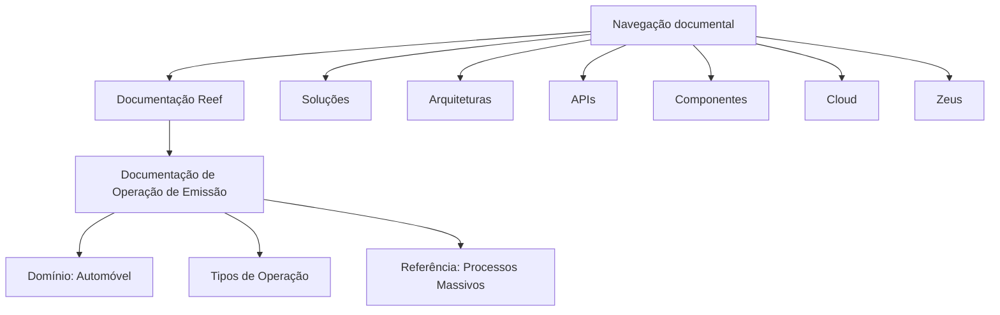

# Documentação de Operação de Emissão — Automóvel (Reef)

## 1. Metadados do Documento
- **Arquivo de Origem:** Não identificado no conteúdo extraído
- **Tipo de Documento:** Manual Operacional
- **Domínio / Sistema:** Reef; operação de emissão de Automóvel; Mapfre
- **Público-Alvo:** Operação e negócio
- **Data/Versão Identificada:** Não identificada

---

## 2. Resumo Executivo & Contexto de Negócio

O conteúdo extraído identifica uma documentação orientada à operação de emissão no domínio de **Automóvel**. O documento declara que a documentação é direcionada à operação e ao tipo de negócio, mas não apresenta regras operacionais detalhadas, etapas de emissão ou critérios de elegibilidade.

A documentação está associada a **Reef** e menciona **Mapfre** por meio do termo `Mapfredocument`. Também há referência visual a **PROCESSOS MASIVOS**, porém a extração não contém a descrição desses processos, seus gatilhos, sistemas participantes ou resultados esperados.

O fragmento apresenta elementos de navegação de um repositório documental, incluindo as categorias Soluções, Arquiteturas, APIs, Componentes, Cloud, Documentação, Zeus, Reef e Ajuda. Não há especificação técnica dos componentes listados.

A informação disponível é insuficiente para estabelecer contratos de integração, tecnologias, endpoints, ambientes, parâmetros operacionais ou fluxos completos de negócio. A fonte deve ser tratada como um índice ou capa documental, não como uma especificação completa de emissão.

---

## 3. Arquitetura, Componentes & Tecnologias Envolvidas

Componentes e termos identificados:

| Componente / Termo | Evidência no conteúdo | Detalhamento disponível |
| :--- | :--- | :--- |
| Reef | `DOCUMENTACIÓN Reef` | Não detalhado |
| Automóvel | `EMISIÓN (Automóvil)` | Associado ao tema da operação de emissão |
| Mapfre | `Mapfredocument` | Não detalhado |
| Processos Massivos | `Imagen PROCESOS MASIVOS` | Apenas referência a uma imagem; fluxo não extraído |
| Zeus | Item de navegação | Não detalhado |
| APIs | Item de navegação | Nenhuma API, rota ou contrato informado |
| Cloud | Item de navegação | Nenhuma infraestrutura ou ambiente informado |



> *Nota de Análise: O conteúdo extraído não descreve comunicação entre Reef, Zeus, APIs, Cloud ou outros componentes. O diagrama representa somente associações explicitamente visíveis no fragmento documental.*

---

## 4. Regras de Negócio, Especificações Funcionais & Processos

1. O documento é declarado como documentação de operação de emissão para o domínio de **Automóvel**.
2. A documentação é explicitamente orientada à operação e ao tipo de negócio.
3. O conteúdo menciona a existência de **Tipos de Operação**, mas não enumera, define ou diferencia os tipos.
4. O conteúdo menciona uma imagem intitulada ou relacionada a **PROCESSOS MASIVOS**, mas não disponibiliza a imagem, etapas, entradas, saídas, regras de processamento ou tratamento de falhas.
5. Não foram identificadas regras de cálculo, critérios de validação, políticas de emissão, estados de processo, perfis de usuário, permissões ou exceções operacionais.

> *Nota de Análise: O documento lista “TIPOS DE OPERACIÓN”, porém não detalha quais operações existem, como são selecionadas ou quais regras são aplicáveis a cada uma.*

---

## 5. Tabelas de Parâmetros, Ambientes e Estruturas de Dados

| Item / Parâmetro | Descrição / Função | Tipo / Valores / Formato | Ambiente / Observações |
| :--- | :--- | :--- | :--- |
| Domínio de negócio | Operação de emissão | Automóvel | Não informado |
| Sistema documental | Repositório ou contexto documental citado | Reef | Não informado |
| Processo citado | Referência a processos massivos | Não especificado | Associado a uma imagem não extraída |
| Proprietário | Identificação exibida no repositório documental | `user:agonzalez_mapfre.com` | Valor apresentado literalmente no conteúdo |
| Ciclo de vida | Estado mostrado no repositório | `Approved Source` | Sem data ou critério de aprovação |
| Idioma da interface | Idioma exibido na navegação | `ES` | Interface em espanhol |
| Seção de navegação | Categoria de conteúdo | Soluciones | Sem detalhamento |
| Seção de navegação | Categoria de conteúdo | Arquitecturas | Sem detalhamento |
| Seção de navegação | Categoria de conteúdo | APIs | Sem detalhamento |
| Seção de navegação | Categoria de conteúdo | Componentes | Sem detalhamento |
| Seção de navegação | Categoria de conteúdo | Cloud | Sem detalhamento |
| Seção de navegação | Categoria de conteúdo | Zeus | Sem detalhamento |
| Seção de navegação | Categoria de conteúdo | Reef | Sem detalhamento |

---

## 6. Bateria de Perguntas & Respostas para RAG (FAQ Sintético)

### P1: Qual é o tema principal da documentação apresentada?
**R:** A documentação é orientada à operação de emissão no domínio de **Automóvel**. O fragmento também informa que o conteúdo é orientado à operação e ao tipo de negócio.

### P2: O documento descreve quais são os tipos de operação de emissão?
**R:** Não. O conteúdo apresenta o título `TIPOS DE OPERACIÓN`, mas não lista, define ou explica os tipos de operação.

### P3: O que o documento informa sobre processos massivos?
**R:** O documento contém a referência `Imagen PROCESOS MASIVOS`. Não há, na extração disponível, detalhes sobre o fluxo, sistemas envolvidos, critérios de execução ou resultados dos processos massivos.

### P4: Qual sistema ou contexto documental é citado no conteúdo?
**R:** O sistema ou contexto documental citado é **Reef**, evidenciado pelas ocorrências `Documentation / DOCUMENTACIÓN Reef` e `DOCUMENTACIÓN Reef`.

### P5: Há APIs ou contratos técnicos descritos para a emissão de Automóvel?
**R:** Não. Embora `APIs` apareça como item de navegação, o conteúdo não apresenta endpoints, métodos HTTP, contratos JSON, autenticação ou integrações técnicas.

### P6: O documento fornece informações sobre ambientes, servidores ou URLs?
**R:** Não. Não foram identificados ambientes, servidores, URLs, portas, variáveis de configuração ou rotas de logs no conteúdo extraído.

### P7: Quem é identificado como proprietário da documentação?
**R:** O campo `Owner` apresenta o valor literal `user:agonzalez_mapfre.com`.

### P8: Qual é o status de ciclo de vida mostrado para o conteúdo?
**R:** O campo `Lifecycle` apresenta o valor `Approved Source`. O fragmento não explica o significado operacional desse status nem informa a data de aprovação.

### P9: Quais categorias aparecem na navegação do repositório documental?
**R:** A navegação contém as categorias `Soluciones`, `Arquitecturas`, `APIs`, `Componentes`, `Cloud`, `Documentación`, `Zeus`, `Reef` e `Ayuda`.

### P10: O documento apresenta regras de negócio para emissão de Automóvel?
**R:** Não há regras de negócio detalhadas na extração. O conteúdo apenas posiciona a documentação no contexto de operação de emissão e tipo de negócio para Automóvel.

---

## 7. Glossário de Termos, Siglas & Conceitos-Chave

- **Reef:** Nome de sistema, contexto ou área documental citado como `DOCUMENTACIÓN Reef`. O conteúdo não fornece expansão ou definição adicional.
- **Emisión:** Termo em espanhol que identifica o tema operacional do documento. No conteúdo, está associado a Automóvel.
- **Automóvil:** Domínio de negócio indicado para a documentação de operação de emissão.
- **Tipos de Operación:** Seção ou título citado no documento, sem detalhamento dos tipos existentes.
- **Procesos Masivos:** Referência a uma imagem ou conteúdo visual; não há definição operacional extraída.
- **Approved Source:** Valor exibido no campo `Lifecycle`; seu significado específico não é definido no conteúdo.
- **Zeus:** Item de navegação do repositório documental, sem definição adicional.
- **Mapfredocument:** Termo apresentado literalmente no conteúdo; não há explicação sobre sua função ou escopo.

---

## 8. Notas Críticas, Riscos & Limitações

- O conteúdo disponível é um fragmento extremamente resumido e não contém detalhes suficientes para operação, desenvolvimento ou suporte técnico da emissão de Automóvel.
- A referência a `PROCESSOS MASIVOS` aponta para uma imagem não disponível na extração; qualquer reconstrução detalhada desse processo seria especulativa.
- Não há contratos de API, integração, modelo de dados, parâmetros, validações, erros, responsáveis operacionais ou procedimentos de contingência.
- Não foram identificadas versões, datas, URLs, ambientes, servidores ou evidências de configuração.
- O valor `Approved Source` é apresentado sem definição do ciclo de aprovação, governança ou validade documental.
- A presença de itens como APIs, Cloud, Componentes e Zeus na navegação não comprova que esses elementos façam parte da arquitetura da operação de emissão.

---

## 9. Conteúdo Bruto Estruturado (Referência Fiel)

```text
--- [PÁGINA 1 DE 1] ---

DOCUMENTACIÓN de OPERACIÓN de EMISIÓN (Automóvil)
 Documentación orientada a la operación y tipo de negocio
TIPOS DE OPERACIÓN
 
  
 
  
Imagen PROCESOS MASIVOS 
Documentation / DOCUMENTACIÓN Reef
DOCUMENTACIÓN Reef
Mapfredocument
DOCUMENTACIÓN Reef
Owner
user:agonzalez_mapfre.com
Lifecycle
Approved Source
 / 
 VL
Buscar Inicio Soluciones Arquitecturas APIs Componentes Cloud Documentación Zeus Reef Ayuda
ES
```
