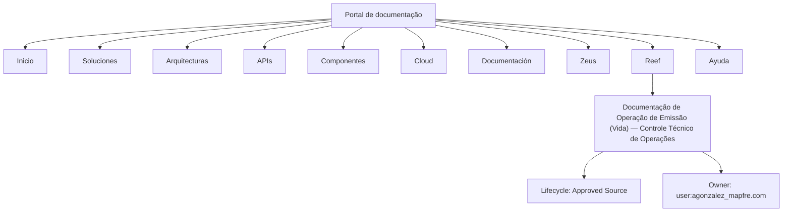

# Documentação de Operação de Emissão (Vida) — Controle Técnico de Operações Reef

## 1. Metadados do Documento
- **Arquivo de Origem:** Não identificado no conteúdo fornecido
- **Tipo de Documento:** Manual Operacional
- **Domínio / Sistema:** Reef; Emissão (Vida); Mapfre
- **Público-Alvo:** Operações e Controle Técnico
- **Data/Versão Identificada:** Não identificada
- **Status de Ciclo de Vida:** Approved Source
- **Owner Identificado:** `user:agonzalez_mapfre.com`

---

## 2. Resumo Executivo & Contexto de Negócio

O conteúdo fornecido identifica uma documentação denominada **“DOCUMENTACIÓN de OPERACIÓN de EMISIÓN (Vida) - CONTROL TÉCNICO OPERACIONES”**. O documento está associado ao domínio ou sistema **Reef**, com referências explícitas a **Mapfre** e ao contexto de emissão relacionado a **Vida**.

A navegação apresentada indica que a documentação faz parte de um ambiente corporativo de consulta, contendo categorias como Soluções, Arquiteturas, APIs, Componentes, Cloud, Documentação, Zeus, Reef e Ajuda. Essa estrutura sugere que o documento é acessado por meio de um portal documental que centraliza ativos técnicos e operacionais.

O documento apresenta o estado de ciclo de vida **Approved Source**, o que indica que o conteúdo é classificado como uma fonte aprovada. O proprietário registrado é `user:agonzalez_mapfre.com`.

**Nota de Análise:** o trecho fornecido não detalha procedimentos operacionais, regras de emissão, integrações, métodos HTTP, contratos, ambientes, URLs, tecnologias, parâmetros ou fluxos de negócio. Portanto, este relatório preserva somente as informações explicitamente presentes.

---

## 3. Arquitetura, Componentes & Tecnologias Envolvidas

Os elementos explicitamente citados são:

| Componente / Termo | Papel identificado no conteúdo |
| :--- | :--- |
| Reef | Sistema, domínio ou área documental mencionada no título e na navegação. |
| Mapfre | Referência corporativa presente como `Mapfredocument`. |
| Emisión (Vida) | Contexto funcional indicado no título da documentação. |
| Control Técnico Operaciones | Contexto operacional e técnico indicado no título. |
| Zeus | Categoria ou área disponível na navegação do portal. |
| APIs | Categoria de consulta disponível na navegação do portal. |
| Cloud | Categoria de consulta disponível na navegação do portal. |
| Arquitecturas | Categoria de consulta disponível na navegação do portal. |
| Componentes | Categoria de consulta disponível na navegação do portal. |



**Nota de Análise:** o diagrama representa exclusivamente a organização de navegação e os metadados explicitamente extraídos. O conteúdo não descreve uma arquitetura de software, comunicação entre serviços ou fluxo de dados.

---

## 4. Regras de Negócio, Especificações Funcionais & Processos

O conteúdo fornecido não apresenta regras de negócio, critérios de validação, cálculos, condições de emissão, procedimentos operacionais detalhados, etapas de processo ou restrições funcionais.

As informações funcionais identificáveis limitam-se a:

1. A documentação está relacionada a **Operação de Emissão (Vida)**.
2. A documentação menciona **Controle Técnico** e **Operações**.
3. O conteúdo está associado à documentação **Reef**.
4. O ciclo de vida informado é **Approved Source**.
5. O proprietário informado é `user:agonzalez_mapfre.com`.

**Nota de Análise:** não há detalhamento suficiente para reconstruir um processo de emissão, uma máquina de estados, um fluxo operacional ou regras de validação sem introduzir informações não sustentadas pelo texto original.

---

## 5. Tabelas de Parâmetros, Ambientes e Estruturas de Dados

| Item / Parâmetro | Descrição / Função | Tipo / Valores / Formato | Ambiente / Observações |
| :--- | :--- | :--- | :--- |
| Título do documento | Identifica a documentação de operação de emissão relacionada a Vida. | `DOCUMENTACIÓN de OPERACIÓN de EMISIÓN (Vida) - CONTROL TÉCNICO OPERACIONES` | Sem versão ou data identificada. |
| Domínio documental | Referência ao contexto documental do sistema ou área Reef. | `Documentation / DOCUMENTACIÓN Reef`; `DOCUMENTACIÓN Reef` | Associado ao portal de documentação. |
| Referência corporativa | Texto corporativo presente no conteúdo extraído. | `Mapfredocument` | O conteúdo não explica a finalidade do termo. |
| Owner | Proprietário indicado no documento. | `user:agonzalez_mapfre.com` | Identificador apresentado literalmente. |
| Lifecycle | Estado de ciclo de vida da fonte documental. | `Approved Source` | Não há definição adicional do status. |
| Idioma da interface | Idioma indicado no portal. | `ES` | A interface exibida está em espanhol. |
| Categorias de navegação | Seções disponíveis no portal documental. | Buscar; Inicio; Soluciones; Arquitecturas; APIs; Componentes; Cloud; Documentación; Zeus; Reef; Ayuda | Não são detalhadas no conteúdo. |

**Nota de Análise:** o texto não contém servidores, nomes de ambientes, endpoints, variáveis, caminhos de logs, parâmetros técnicos ou estruturas de dados.

---

## 6. Bateria de Perguntas & Respostas para RAG (FAQ Sintético)

### P1: Qual é o tema principal do documento?
**R:** O documento trata de **operação de emissão relacionada a Vida**, no contexto de **Controle Técnico de Operações** e da documentação **Reef**.

### P2: A qual domínio ou sistema a documentação está associada?
**R:** A documentação está associada explicitamente a **Reef**, conforme as referências `Documentation / DOCUMENTACIÓN Reef` e `DOCUMENTACIÓN Reef`.

### P3: Qual organização ou referência corporativa é citada no conteúdo?
**R:** O conteúdo apresenta a referência textual `Mapfredocument`, indicando associação com **Mapfre**. O trecho fornecido não detalha a relação operacional ou técnica dessa referência.

### P4: Quem é o owner identificado para o documento?
**R:** O owner informado literalmente no conteúdo é `user:agonzalez_mapfre.com`.

### P5: Qual é o ciclo de vida indicado para a documentação?
**R:** O campo **Lifecycle** está preenchido com o valor **Approved Source**.

### P6: O documento apresenta APIs, endpoints ou contratos de integração?
**R:** Não. Embora a navegação do portal inclua a categoria **APIs**, o conteúdo fornecido não descreve endpoints, métodos HTTP, contratos JSON, autenticação ou integrações.

### P7: Quais categorias de navegação estão disponíveis no portal mostrado?
**R:** O portal apresenta as categorias: Buscar, Inicio, Soluciones, Arquitecturas, APIs, Componentes, Cloud, Documentación, Zeus, Reef e Ayuda.

### P8: Existe uma descrição detalhada do processo de emissão de Vida?
**R:** Não. O título identifica o contexto como “Operação de Emissão (Vida)”, mas o texto fornecido não contém etapas, responsáveis, regras, validações ou exceções do processo.

### P9: Há informações sobre ambientes, servidores, URLs ou rotas de log?
**R:** Não. O conteúdo não fornece ambientes, servidores, URLs, portas, rotas de logs ou parâmetros de infraestrutura.

### P10: O conteúdo informa uma versão ou data do documento?
**R:** Não. Não foi identificada data, versão ou histórico de revisões no trecho fornecido.

---

## 7. Glossário de Termos, Siglas & Conceitos-Chave

- **APIs:** Categoria de navegação exibida no portal. O conteúdo não expande a sigla nem descreve interfaces específicas.
- **Approved Source:** Valor informado para o campo **Lifecycle**; o documento não define formalmente esse status.
- **Cloud:** Categoria de navegação exibida no portal.
- **Emisión (Vida):** Contexto de emissão relacionado a Vida, conforme o título do documento.
- **ES:** Indicador de idioma exibido no portal, correspondente a espanhol.
- **Lifecycle:** Campo de ciclo de vida do documento.
- **Mapfre:** Referência corporativa presente no texto por meio de `Mapfredocument`.
- **Owner:** Campo que identifica o responsável ou proprietário do documento.
- **Reef:** Domínio, sistema ou área documental explicitamente citada.
- **Zeus:** Categoria ou área de navegação exibida no portal.

---

## 8. Notas Críticas, Riscos & Limitações

- O conteúdo fornecido é extremamente resumido e contém principalmente título, metadados e itens de navegação.
- Não há especificação de arquitetura de software, componentes internos, integrações, banco de dados, ambientes ou tecnologias.
- Não há procedimentos operacionais detalhados para emissão de Vida.
- Não há regras de negócio, condições de validação, matrizes de responsabilidade ou critérios de exceção.
- Não há data, versão, identificador documental ou histórico de alterações.
- O status **Approved Source** é apresentado, mas seu significado operacional não é explicado.
- A referência `Mapfredocument` aparece no conteúdo, porém não possui detalhamento adicional.
- Qualquer detalhamento adicional sobre Reef, Mapfre, emissão de Vida, Zeus ou APIs exigiria conteúdo-fonte complementar para evitar alucinação.

---

## 9. Conteúdo Bruto Estruturado (Referência Fiel)

```text
--- [PÁGINA 1 DE 1] ---

DOCUMENTACIÓN de OPERACIÓN de EMISIÓN (Vida) - CONTROL
TÉCNICO
OPERACIONES
Documentation / DOCUMENTACIÓN Reef
DOCUMENTACIÓN Reef
Mapfredocument
DOCUMENTACIÓN Reef
Owner
user:agonzalez_mapfre.com
Lifecycle
Approved Source
 / 
 VL
Buscar Inicio Soluciones Arquitecturas APIs Componentes Cloud Documentación Zeus Reef Ayuda
ES
```
