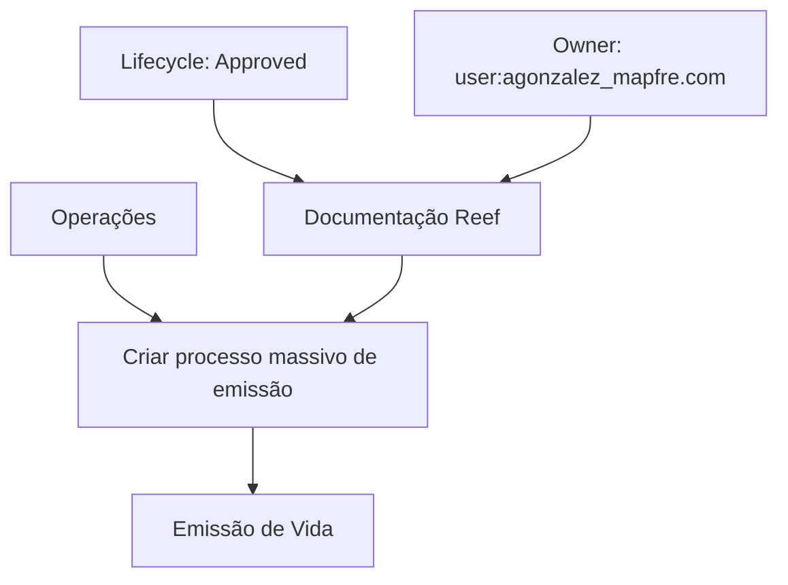

# Documentação de Operação de Emissão (Vida) — Processos Massivos

## 1. Metadados do Documento
- **Arquivo de Origem:** Não identificado
- **Tipo de Documento:** Procedimento / Documentação de Operação
- **Domínio / Sistema:** Reef; operação de emissão de Vida; processos massivos
- **Público-Alvo:** Operações, desenvolvedores, arquitetos e equipes de suporte
- **Data/Versão Identificada:** Não identificada

---

## 2. Resumo Executivo & Contexto de Negócio

O conteúdo apresentado referencia uma documentação operacional relacionada à **emissão de Vida** por meio de **processos massivos**. O item operacional explicitamente identificado é a criação de um processo massivo de emissão.

A documentação está associada ao contexto **Reef**, com referências a “Documentación Reef”, “DOCUMENTACIÓN Reef” e à área de navegação “Reef”. O texto também apresenta referências a **Mapfredocument**, **Mapfre** no identificador de proprietário e **Zeus** como item de navegação documental.

O documento possui status de ciclo de vida **Approved**, indicando que a fonte está aprovada. O proprietário identificado é `user:agonzalez_mapfre.com`.

Não há detalhamento sobre regras de seleção, entradas, saídas, contratos de integração, tratamentos de erro, métodos HTTP, estruturas de dados ou etapas executáveis para criar o processo massivo de emissão. A única operação descrita nominalmente é **“Crear proceso masivo emisión”**.

---

## 3. Arquitetura, Componentes & Tecnologias Envolvidas

### Componentes e referências identificadas

| Componente / Termo | Papel identificado no conteúdo |
| :--- | :--- |
| Reef | Contexto de documentação e item de navegação. |
| Operações | Área funcional associada ao processo de emissão massiva. |
| Emissão (Vida) | Domínio operacional explicitamente mencionado. |
| Processos massivos | Tipo de processo tratado pela documentação. |
| Criar processo massivo de emissão | Operação identificada no documento. |
| Mapfredocument | Referência documental citada sem descrição adicional. |
| Zeus | Referência presente na navegação, sem função detalhada. |
| APIs | Item de navegação presente; nenhuma API específica é descrita. |
| Cloud | Item de navegação presente; nenhum recurso ou ambiente Cloud é detalhado. |
| Owner | Campo de propriedade documental. |
| Lifecycle | Campo de ciclo de vida documental. |
| Approved | Status de ciclo de vida da fonte. |

### Fluxo conceitual explicitamente identificável



> **Nota de Análise:** O diagrama representa somente as relações semânticas explicitamente presentes no conteúdo. O documento não descreve arquitetura de aplicações, integrações técnicas, bancos de dados, APIs, protocolos, ambientes ou fluxos de dados.

---

## 4. Regras de Negócio, Especificações Funcionais & Processos

### Processo identificado

1. O documento trata de **processos massivos** no domínio de **emissão de Vida**.
2. A operação nomeada é **“Crear proceso masivo emisión”**.
3. A operação está associada à área de **Operações**.
4. A documentação está vinculada ao contexto **Reef**.
5. A fonte documental possui ciclo de vida identificado como **Approved**.

### Regras, validações e restrições documentadas

Não foram identificadas regras de negócio detalhadas, critérios de elegibilidade, regras de cálculo, parâmetros de entrada, validações, exceções, aprovações operacionais ou resultados esperados para a criação do processo massivo de emissão.

> **Nota de Análise:** O documento lista a operação “Crear proceso masivo emisión”, porém não detalha o procedimento operacional, as pré-condições, os campos necessários, os sistemas envolvidos, os métodos de execução ou os critérios de sucesso e falha.

---

## 5. Tabelas de Parâmetros, Ambientes e Estruturas de Dados

| Item / Parâmetro | Descrição / Função | Tipo / Valores / Formato | Ambiente / Observações |
| :--- | :--- | :--- | :--- |
| Processo | Criar processo massivo de emissão | Operação | Associado à emissão de Vida. |
| Domínio | Emissão (Vida) | Domínio funcional | Relacionado a processos massivos. |
| Área | Operações | Área funcional | Contexto da operação documentada. |
| Contexto documental | Reef | Sistema / área documental | Citado repetidamente como “Documentación Reef”. |
| Proprietário | `user:agonzalez_mapfre.com` | Identificador de usuário | Valor apresentado no campo `Owner`. |
| Ciclo de vida | Approved | Status | Valor apresentado no campo `Lifecycle`. |
| Fonte | Mapfredocument | Referência documental | Sem explicação funcional adicional. |
| Referência de navegação | Zeus | Item de navegação | Sem detalhamento de integração ou função. |
| Idioma | ES | Código de idioma | Identificado na navegação do documento. |
| APIs | APIs | Item de navegação | Nenhuma API, rota ou contrato foi informado. |
| Cloud | Cloud | Item de navegação | Nenhum ambiente ou recurso Cloud foi informado. |

---

## 6. Bateria de Perguntas & Respostas para RAG (FAQ Sintético)

### P1: Qual é o objetivo principal da documentação?
**R:** A documentação referencia a operação de criação de um processo massivo de emissão no domínio de Vida. O conteúdo associa essa operação à área de Operações e ao contexto documental Reef.

### P2: Qual operação é explicitamente citada no documento?
**R:** A operação explicitamente citada é **“Crear proceso masivo emisión”**, ou seja, criar um processo massivo de emissão.

### P3: Qual é o domínio funcional tratado?
**R:** O domínio funcional identificado é **emissão de Vida**, conforme o título “DOCUMENTACIÓN de OPERACIÓN de EMISIÓN (Vida) - PROCESOS MASIVOS”.

### P4: A documentação descreve como executar o processo massivo de emissão?
**R:** Não. O conteúdo apenas nomeia a criação do processo massivo de emissão, sem apresentar etapas operacionais, parâmetros, telas, comandos, validações ou critérios de conclusão.

### P5: Qual sistema ou contexto documental é mencionado?
**R:** O contexto documental mencionado é **Reef**, citado como “Documentación Reef” e “DOCUMENTACIÓN Reef”.

### P6: Quem é o proprietário identificado da documentação?
**R:** O proprietário identificado no campo `Owner` é `user:agonzalez_mapfre.com`.

### P7: Qual é o status de ciclo de vida da fonte?
**R:** O campo `Lifecycle` apresenta o valor **Approved**, indicando que a fonte possui esse status de ciclo de vida.

### P8: O documento especifica APIs para o processo de emissão massiva?
**R:** Não. Embora “APIs” apareça como item de navegação, o conteúdo não fornece nomes de APIs, URLs, métodos HTTP, autenticação, payloads, contratos ou códigos de resposta.

### P9: O documento informa ambientes, servidores ou configurações Cloud?
**R:** Não. “Cloud” aparece como item de navegação, mas não há informações sobre ambientes, servidores, endpoints, portas, credenciais, variáveis ou serviços Cloud.

### P10: O que é Mapfredocument no contexto apresentado?
**R:** `Mapfredocument` é uma referência textual presente no conteúdo. O documento não explica sua função, relação técnica com Reef ou papel no processo de emissão massiva.

### P11: O documento apresenta detalhes sobre Zeus?
**R:** Não. `Zeus` aparece somente como item de navegação, sem descrição de responsabilidade, integração ou participação no processo de emissão.

### P12: Quais limitações devem ser consideradas ao usar esta documentação como referência operacional?
**R:** A principal limitação é a ausência de detalhamento operacional e técnico. Não são informados pré-requisitos, campos, regras de negócio, fluxos de exceção, dados de entrada, dados de saída, integrações ou instruções para executar a criação do processo massivo de emissão.

---

## 7. Glossário de Termos, Siglas & Conceitos-Chave

- **Reef:** Contexto, sistema ou área de documentação mencionada repetidamente no conteúdo. A função detalhada não é informada.
- **Emissão (Vida):** Domínio funcional referido pelo documento; não há descrição adicional do produto, apólice ou transação de emissão.
- **Processos massivos:** Tipo de processo citado no título e na operação de criação. O documento não define volume, periodicidade ou mecanismo de processamento.
- **Operações:** Área funcional associada à criação do processo massivo de emissão.
- **Owner:** Campo de propriedade documental que identifica `user:agonzalez_mapfre.com`.
- **Lifecycle:** Campo de ciclo de vida documental.
- **Approved:** Valor do campo `Lifecycle`.
- **Mapfredocument:** Referência documental citada sem definição.
- **Zeus:** Item de navegação citado sem definição.
- **APIs:** Item de navegação citado; nenhuma interface de programação é detalhada.
- **Cloud:** Item de navegação citado; nenhum serviço, infraestrutura ou ambiente é detalhado.
- **ES:** Código de idioma exibido no conteúdo.

---

## 8. Notas Críticas, Riscos & Limitações

- O conteúdo não fornece instruções executáveis para a operação **“Crear proceso masivo emisión”**.
- Não foram identificadas regras de negócio, critérios de validação, parâmetros de processamento, limites de volume ou políticas de reprocessamento.
- Não há informações sobre sistemas integrados, APIs, contratos, formatos de mensagens, segurança, autenticação ou autorização.
- Não há URLs, ambientes, servidores, portas, caminhos de logs, dashboards, mecanismos de monitoramento ou procedimentos de contingência.
- As referências a **Mapfredocument**, **Zeus**, **APIs** e **Cloud** não possuem detalhamento adicional no texto.
- O status **Approved** é identificado, mas o documento não apresenta data de aprovação, versão, histórico de alterações ou aprovadores.
- O campo de proprietário contém `user:agonzalez_mapfre.com`; o conteúdo não informa nome completo, equipe responsável ou canal de suporte.

---

## 9. Conteúdo Bruto Estruturado (Referência Fiel)

```text
--- [PÁGINA 1 DE 1] ---

DOCUMENTACIÓN de OPERACIÓN de EMISIÓN (Vida) - PROCESOS
MASIVOS
OPERACIONES
CREAR proceso masivo emisión
Documentation / DOCUMENTACIÓN Reef
DOCUMENTACIÓN Reef
Mapfredocument
DOCUMENTACIÓN Reef
Owner
user:agonzalez_mapfre.com
Lifecycle
Approved Source
 /
 VL
Buscar Inicio Soluciones Arquitecturas APIs Componentes Cloud Documentación Zeus Reef Ayuda
ES
```
