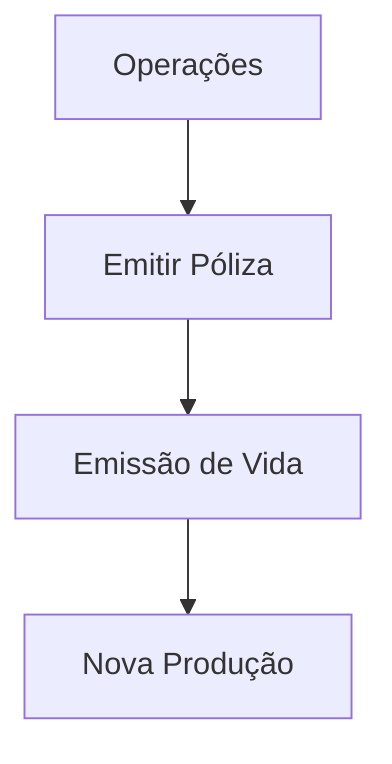

# Documentação de Operação de Emissão (Vida) — Nova Produção no Reef

## 1. Metadados do Documento
- **Arquivo de Origem:** Não identificado no conteúdo extraído
- **Tipo de Documento:** Manual Operacional
- **Domínio / Sistema:** Reef / Mapfre — Operações de emissão de apólices de Vida
- **Público-Alvo:** Operações
- **Data/Versão Identificada:** Não identificada

---

## 2. Resumo Executivo & Contexto de Negócio

O conteúdo apresenta uma referência documental denominada **“DOCUMENTACIÓN de OPERACIÓN de EMISIÓN (Vida) - NUEVA PRODUCCIÓN”**. O escopo explicitamente indicado é o de **operações** relacionadas à ação de **emitir apólice** no contexto de produtos de **Vida** e de **nova produção**.

A documentação está associada ao domínio **Reef** e contém referências a **Mapfre**, incluindo os termos “Mapfredocument” e o identificador de proprietário `user:agonzalez_mapfre.com`. O estado de ciclo de vida apresentado é **Approved Source**, o que indica que o conteúdo foi identificado como uma fonte aprovada no ambiente documental exibido.

A interface ou portal de documentação citado disponibiliza navegação para áreas como Início, Soluções, Arquiteturas, APIs, Componentes, Cloud, Documentação, Zeus, Reef e Ajuda. Contudo, o conteúdo bruto não explica as responsabilidades dessas áreas nem detalha o procedimento operacional para emissão da apólice.

> **Nota de Análise:** O documento identifica o tema operacional de emissão de apólices de Vida em nova produção, mas não fornece passos de execução, regras de elegibilidade, contratos de integração, dados de entrada ou resultados esperados.

---

## 3. Arquitetura, Componentes & Tecnologias Envolvidas

Os elementos explicitamente citados são:

| Componente / Termo | Papel identificado no conteúdo |
| :--- | :--- |
| Reef | Domínio ou área documental associada ao conteúdo. |
| Mapfre | Referência corporativa presente no conteúdo. |
| Mapfredocument | Termo exibido no conteúdo, sem detalhamento funcional. |
| Zeus | Item disponível na navegação do portal documental. |
| Operações | Área funcional indicada para a documentação. |
| Emitir Póliza | Ação operacional citada. |
| Vida | Linha de negócio ou contexto da emissão citado no título. |
| Nova Produção | Contexto operacional citado no título. |

O conteúdo não descreve integrações, camadas de arquitetura, APIs, bancos de dados, microsserviços, tecnologias, ambientes ou fluxo de dados. Portanto, não há evidência suficiente para reconstruir um diagrama de arquitetura ou um fluxo Mermaid sem extrapolar o texto original.

---

## 4. Regras de Negócio, Especificações Funcionais & Processos

### Escopo funcional explicitamente citado

1. A documentação está relacionada à **operação de emissão**.
2. O contexto da emissão é **Vida**.
3. O contexto de negócio ou operação é **nova produção**.
4. A ação funcional apresentada é **“Emitir Póliza”**.
5. O conteúdo possui associação documental com **Reef** e referências a **Mapfre**.

### Processo identificado

O único processo identificável no conteúdo é a ação de emitir uma apólice:



> **Nota de Análise:** O diagrama representa exclusivamente os termos explicitamente presentes no conteúdo. O documento não informa atores, pré-requisitos, etapas intermediárias, critérios de validação, sistemas envolvidos, exceções, aprovações ou resultado da emissão.

### Regras e validações

Não foram identificadas regras de negócio, parâmetros de cálculo, validações, campos obrigatórios, condições de aprovação, políticas de emissão ou critérios de erro no conteúdo fornecido.

---

## 5. Tabelas de Parâmetros, Ambientes e Estruturas de Dados

| Item / Parâmetro | Descrição / Função | Tipo / Valores / Formato | Ambiente / Observações |
| :--- | :--- | :--- | :--- |
| Título documental | Identifica a documentação de operação de emissão de Vida para nova produção. | `DOCUMENTACIÓN de OPERACIÓN de EMISIÓN (Vida) - NUEVA PRODUCCIÓN` | Não detalhado |
| Área | Área responsável ou público funcional indicado. | `OPERACIONES` | Não detalhado |
| Ação operacional | Ação funcional listada no conteúdo. | `EMITIR Póliza` | Não detalhado |
| Domínio documental | Referência de documentação Reef. | `Documentation / DOCUMENTACIÓN Reef` | Não detalhado |
| Referência corporativa | Termo apresentado no conteúdo. | `Mapfredocument` | Função não detalhada |
| Proprietário | Identificador exibido como owner da documentação. | `user:agonzalez_mapfre.com` | Não detalhado |
| Ciclo de vida | Estado apresentado para a fonte documental. | `Approved Source` | Não detalhado |
| Navegação — Soluções | Área disponível no portal. | `Soluciones` | Sem descrição adicional |
| Navegação — Arquiteturas | Área disponível no portal. | `Arquitecturas` | Sem descrição adicional |
| Navegação — APIs | Área disponível no portal. | `APIs` | Sem descrição adicional |
| Navegação — Componentes | Área disponível no portal. | `Componentes` | Sem descrição adicional |
| Navegação — Cloud | Área disponível no portal. | `Cloud` | Sem descrição adicional |
| Navegação — Zeus | Área disponível no portal. | `Zeus` | Sem descrição adicional |
| Navegação — Reef | Área disponível no portal. | `Reef` | Sem descrição adicional |
| Idioma da interface | Código de idioma exibido. | `ES` | Espanhol |

---

## 6. Bateria de Perguntas & Respostas para RAG (FAQ Sintético)

### P1: Qual é o tema principal da documentação?
**R:** A documentação trata de operações de emissão de apólices de **Vida** no contexto de **nova produção**, conforme o título “DOCUMENTACIÓN de OPERACIÓN de EMISIÓN (Vida) - NUEVA PRODUCCIÓN”.

### P2: Qual ação operacional é explicitamente mencionada?
**R:** A ação operacional explicitamente mencionada é **“Emitir Póliza”**.

### P3: Qual área funcional está associada ao documento?
**R:** A área funcional indicada no conteúdo é **OPERACIONES**.

### P4: Qual sistema ou domínio documental é associado ao conteúdo?
**R:** O conteúdo está associado à documentação **Reef**, com ocorrências de “Documentation / DOCUMENTACIÓN Reef” e “DOCUMENTACIÓN Reef”.

### P5: O documento descreve o procedimento passo a passo para emitir uma apólice?
**R:** Não. O conteúdo apenas cita a ação “Emitir Póliza”, sem fornecer passos operacionais, dados de entrada, validações, aprovações, exceções ou resultados da emissão.

### P6: O documento especifica APIs ou contratos de integração para a emissão de apólices?
**R:** Não. Embora a navegação da interface inclua uma área denominada “APIs”, o conteúdo não descreve endpoints, métodos HTTP, contratos, payloads, autenticação ou integrações.

### P7: Quem é o proprietário identificado da documentação?
**R:** O proprietário exibido no conteúdo é `user:agonzalez_mapfre.com`.

### P8: Qual é o estado de ciclo de vida da fonte documental?
**R:** O estado de ciclo de vida apresentado é **Approved Source**.

### P9: O conteúdo informa versão ou data do documento?
**R:** Não. Não há data, número de versão ou histórico de revisões identificável no conteúdo extraído.

### P10: Quais áreas estão disponíveis na navegação do portal documental?
**R:** A navegação apresenta: Início, Soluções, Arquiteturas, APIs, Componentes, Cloud, Documentação, Zeus, Reef e Ajuda.

### P11: O documento detalha a função de Mapfredocument?
**R:** Não. O termo “Mapfredocument” aparece no conteúdo, mas não possui explicação funcional, técnica ou operacional adicional.

### P12: Há ambientes, servidores, URLs, portas ou caminhos de log definidos?
**R:** Não. O conteúdo não apresenta informações sobre ambientes, servidores, URLs, portas, rotas de log ou parâmetros técnicos de infraestrutura.

---

## 7. Glossário de Termos, Siglas & Conceitos-Chave

- **APIs:** Área de navegação exibida no portal documental; o conteúdo não define APIs específicas.
- **Approved Source:** Estado de ciclo de vida apresentado para a fonte documental.
- **Cloud:** Área de navegação exibida no portal documental; não detalhada.
- **Documentación Reef:** Referência à documentação associada ao domínio ou sistema Reef.
- **Emitir Póliza:** Ação operacional de emissão de apólice citada no conteúdo.
- **ES:** Código de idioma exibido na interface, indicando espanhol.
- **Mapfre:** Referência corporativa presente no conteúdo.
- **Mapfredocument:** Termo presente no conteúdo, sem definição adicional.
- **Nueva Producción:** Contexto de nova produção citado no título da documentação.
- **OPERACIONES:** Área funcional indicada no documento.
- **Reef:** Domínio, sistema ou área documental citada no conteúdo.
- **Vida:** Contexto ou linha de negócio associada à emissão de apólices.
- **Zeus:** Área disponível na navegação do portal, sem detalhamento adicional.

---

## 8. Notas Críticas, Riscos & Limitações

- O conteúdo extraído é predominantemente composto por título, elementos de navegação e metadados de portal; não contém detalhamento operacional suficiente para executar a emissão de apólices.
- Não há descrição de pré-requisitos, perfis de acesso, dados obrigatórios, regras de elegibilidade, validações, exceções ou critérios de sucesso da emissão.
- Não há especificação de arquitetura, integrações, APIs, tecnologias, ambientes, servidores, URLs, logs ou mecanismos de monitoramento.
- O termo **Mapfredocument** é citado sem definição.
- A relação funcional ou técnica entre **Reef**, **Zeus**, **Mapfre** e a operação de emissão não é descrita.
- A data, versão, autoria completa e histórico de alterações não foram identificados.
- O estado **Approved Source** é apresentado, mas o documento não explica os critérios, responsáveis ou processo que conferiram essa aprovação.

---

## 9. Conteúdo Bruto Estruturado (Referência Fiel)

```text
--- [PÁGINA 1 DE 1] ---

DOCUMENTACIÓN de OPERACIÓN de EMISIÓN (Vida) - NUEVA
PRODUCCIÓN
OPERACIONES
EMITIR Póliza
Documentation / DOCUMENTACIÓN Reef
DOCUMENTACIÓN Reef
Mapfredocument
DOCUMENTACIÓN Reef
Owner
user:agonzalez_mapfre.com
Lifecycle
Approved Source
 / 
 VL
Buscar Inicio Soluciones Arquitecturas APIs Componentes Cloud Documentación Zeus Reef Ayuda
ES
```
