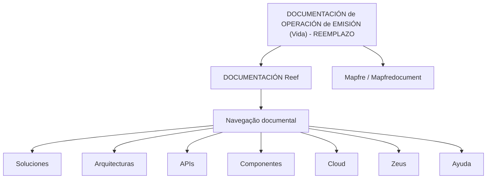

# DOCUMENTACIÓN de OPERACIÓN de EMISIÓN (Vida) - REEMPLAZO

## 1. Metadados do Documento
- **Arquivo de Origem:** Não identificado
- **Tipo de Documento:** Procedimento
- **Domínio / Sistema:** Reef / Mapfre
- **Público-Alvo:** Não identificado
- **Data/Versão Identificada:** Não identificada

---

## 2. Resumo Executivo & Contexto de Negócio

O conteúdo apresenta uma referência documental denominada **“DOCUMENTACIÓN de OPERACIÓN de EMISIÓN (Vida) - REEMPLAZO”**. Os termos “OPERACIÓN”, “EMISIÓN”, “Vida” e “REEMPLAZO” fazem parte do título, mas o trecho não descreve o processo operacional, regras de emissão ou condições de substituição.

A documentação está associada a **Reef**, identificada também como “DOCUMENTACIÓN Reef”. O conteúdo inclui referências a **Mapfre**, ao identificador “Mapfredocument” e a uma estrutura de navegação com áreas como Soluções, Arquiteturas, APIs, Componentes, Cloud, Documentação, Zeus, Reef e Ajuda.

O documento possui estado de ciclo de vida **“Approved Source”** e apresenta o proprietário como `user:agonzalez_mapfre.com`. Também há as marcações `VL`, `ES` e `Owner`, sem explicação adicional sobre seus significados.

> **Nota de Análise:** O trecho fornecido funciona predominantemente como cabeçalho, metadado e navegação de um repositório documental. Não há detalhamento sobre arquitetura, integrações, métodos, contratos, regras de negócio, parâmetros operacionais ou fluxos de emissão.

---

## 3. Arquitetura, Componentes & Tecnologias Envolvidas

Os elementos explicitamente citados são **Reef**, **Mapfre**, **Zeus**, APIs, Componentes e Cloud. O conteúdo não descreve relações técnicas, protocolos, interfaces, tecnologias de implementação ou fluxo de dados entre esses elementos.



> **Nota de Análise:** O diagrama representa somente a associação documental e as opções de navegação textual presentes no conteúdo. Ele não representa uma arquitetura de software confirmada.

---

## 4. Regras de Negócio, Especificações Funcionais & Processos

Não foram identificadas regras de negócio, critérios de elegibilidade, cálculos, validações, etapas operacionais ou exceções no conteúdo fornecido.

Os únicos elementos de processo ou governança explicitamente apresentados são:

1. O documento possui o estado de ciclo de vida **“Approved Source”**.
2. O proprietário informado é `user:agonzalez_mapfre.com`.
3. O título referencia uma operação de emissão associada a “Vida” e “Reemplazo”.
4. O contexto documental referencia Reef e Mapfre.

> **Nota de Análise:** O documento não especifica como executar a operação de emissão, quais dados são obrigatórios, quais sistemas devem ser chamados, nem quais condições caracterizam um “REEMPLAZO”.

---

## 5. Tabelas de Parâmetros, Ambientes e Estruturas de Dados

| Item / Parâmetro | Descrição / Função | Tipo / Valores / Formato | Ambiente / Observações |
| :--- | :--- | :--- | :--- |
| Título | Identificação da documentação | `DOCUMENTACIÓN de OPERACIÓN de EMISIÓN (Vida) - REEMPLAZO` | Sem detalhamento adicional |
| Contexto documental | Repositório ou domínio documental citado | `DOCUMENTACIÓN Reef` / `Documentation / DOCUMENTACIÓN Reef` | Associado a Reef |
| Organização / referência | Nome presente no conteúdo | `Mapfre` / `Mapfredocument` | Não há explicação funcional |
| Proprietário | Responsável indicado pelo conteúdo | `user:agonzalez_mapfre.com` | Campo `Owner` |
| Ciclo de vida | Estado do documento | `Approved Source` | Campo `Lifecycle` |
| Marcador | Código apresentado junto ao ciclo de vida | `VL` | Significado não identificado |
| Idioma | Indicador de idioma apresentado | `ES` | O conteúdo está predominantemente em espanhol |
| Navegação | Áreas listadas na interface documental | `Buscar`, `Inicio`, `Soluciones`, `Arquitecturas`, `APIs`, `Componentes`, `Cloud`, `Documentación`, `Zeus`, `Reef`, `Ayuda` | Não representa necessariamente componentes técnicos |
| Ambientes | Dados de ambiente, URL, servidor ou porta | Não informado | Não identificado no conteúdo |
| Logs | Caminhos, variáveis ou plataformas de log | Não informado | Não identificado no conteúdo |

---

## 6. Bateria de Perguntas & Respostas para RAG (FAQ Sintético)

### P1: Qual é o título da documentação apresentada?
**R:** O título apresentado é **“DOCUMENTACIÓN de OPERACIÓN de EMISIÓN (Vida) - REEMPLAZO”**.

### P2: Qual domínio ou sistema é mencionado no documento?
**R:** O conteúdo referencia **Reef**, por meio das expressões “Documentation / DOCUMENTACIÓN Reef” e “DOCUMENTACIÓN Reef”. Também menciona Mapfre e Mapfredocument.

### P3: Quem é o proprietário indicado para a documentação?
**R:** O campo `Owner` apresenta o valor `user:agonzalez_mapfre.com`.

### P4: Qual é o estado de ciclo de vida do documento?
**R:** O campo `Lifecycle` apresenta o estado **“Approved Source”**.

### P5: O documento detalha o procedimento de operação de emissão?
**R:** Não. O conteúdo disponibilizado apresenta o título e metadados da documentação, mas não descreve etapas, entradas, validações, saídas ou responsáveis pelo procedimento de emissão.

### P6: O documento especifica APIs ou contratos de integração?
**R:** Não. “APIs” aparece como item de navegação, mas não há métodos HTTP, endpoints, formatos JSON, contratos, autenticação ou integrações descritos.

### P7: Quais áreas aparecem na navegação documental?
**R:** A navegação lista: `Buscar`, `Inicio`, `Soluciones`, `Arquitecturas`, `APIs`, `Componentes`, `Cloud`, `Documentación`, `Zeus`, `Reef` e `Ayuda`.

### P8: O documento informa URLs, ambientes, servidores ou portas?
**R:** Não. O conteúdo não apresenta URLs, nomes de ambiente, endereços de servidor, portas, credenciais ou configurações de conectividade.

### P9: O que significa o marcador “VL”?
**R:** O marcador `VL` aparece no conteúdo, porém não há definição explícita para seu significado.

### P10: O que é “REEMPLAZO” no contexto da operação de emissão?
**R:** “REEMPLAZO” faz parte do título da documentação. O conteúdo fornecido não define o conceito, critérios, condições ou impacto operacional desse termo.

### P11: O documento apresenta regras específicas para o domínio Vida?
**R:** Não. “Vida” aparece no título como contexto da operação de emissão, mas não há regras funcionais, produtos, coberturas, cálculos ou validações relacionadas ao domínio.

### P12: O documento menciona Zeus como componente de arquitetura?
**R:** Não é possível confirmar isso. “Zeus” aparece na lista de navegação documental, sem qualquer descrição técnica, relação arquitetural ou função operacional.

---

## 7. Glossário de Termos, Siglas & Conceitos-Chave

- **APIs:** Termo listado na navegação documental; o conteúdo não fornece definição ou contratos de interface.
- **Approved Source:** Estado informado no campo `Lifecycle`.
- **Cloud:** Termo listado na navegação documental; não há detalhamento de serviços, provedores ou ambientes.
- **DOCUMENTACIÓN Reef:** Referência documental associada a Reef.
- **EMISIÓN:** Termo presente no título da documentação; não há definição processual adicional.
- **ES:** Marcador apresentado no conteúdo; o texto está predominantemente em espanhol.
- **Lifecycle:** Campo que registra o ciclo de vida do documento.
- **Mapfre / Mapfredocument:** Referências nominais presentes no conteúdo.
- **Owner:** Campo de identificação do proprietário da documentação.
- **REEMPLAZO:** Termo presente no título; não definido no conteúdo fornecido.
- **Reef:** Sistema, domínio ou contexto documental citado no conteúdo.
- **VL:** Marcador presente junto ao conteúdo; significado não identificado.
- **Zeus:** Termo listado na navegação documental; função não especificada.

---

## 8. Notas Críticas, Riscos & Limitações

- O conteúdo fornecido não contém o corpo operacional da documentação de emissão.
- Não há regras de negócio, fluxos de processo, diagramas originais, parâmetros, contratos de API ou estruturas de dados.
- Não foram identificados ambientes, URLs, servidores, portas, logs ou mecanismos de monitoramento.
- Os termos `VL`, `Zeus`, `Mapfredocument`, “Vida” e “REEMPLAZO” não possuem definição adicional no trecho.
- A associação entre Reef, Mapfre, Zeus, APIs, Componentes e Cloud não pode ser interpretada como integração técnica confirmada, pois esses itens aparecem apenas em uma estrutura de navegação.

---

## 9. Conteúdo Bruto Estruturado (Referência Fiel)

```text
--- [PÁGINA 1 DE 1] ---

DOCUMENTACIÓN de OPERACIÓN de EMISIÓN (Vida) - REEMPLAZO
OPERACIONES
Documentation / DOCUMENTACIÓN Reef
DOCUMENTACIÓN Reef
Mapfredocument
DOCUMENTACIÓN Reef
Owner
user:agonzalez_mapfre.com
Lifecycle
Approved Source
 / 
 VL
Buscar Inicio Soluciones Arquitecturas APIs Componentes Cloud Documentación Zeus Reef Ayuda
ES
```
