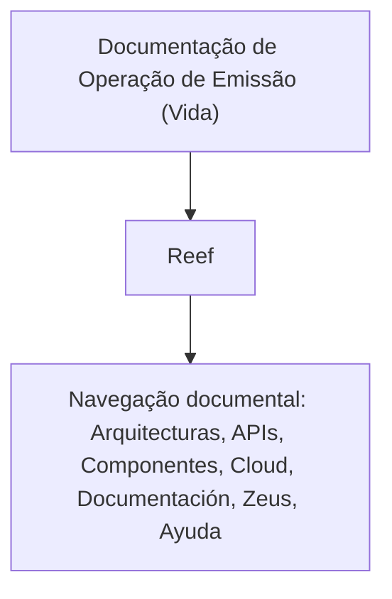

# Documentação de Operação de Emissão (Vida) — Suplemento: Alterar Póliza Plan Pago

## 1. Metadados do Documento
- **Arquivo de Origem:** `Não identificado`
- **Tipo de Documento:** `Procedimento`
- **Domínio / Sistema:** `Reef / Operações de Emissão (Vida)`
- **Público-Alvo:** `Não identificado; o conteúdo menciona Operações`
- **Data/Versão Identificada:** `Não identificada`

---

## 2. Resumo Executivo & Contexto de Negócio

O conteúdo identifica uma documentação operacional associada à **Emissão (Vida)** e intitulada **“SUPLEMENTO OPERACIONES ALTERAR Póliza plan pago”**. O material está relacionado ao contexto de alteração de apólice e plano de pagamento.

A navegação apresentada associa o documento ao domínio **Reef**, com referências a áreas de arquitetura, APIs, componentes, cloud, documentação, Zeus e ajuda. Entretanto, o texto extraído não descreve integrações, regras de alteração, telas, contratos técnicos ou procedimentos executáveis.

O registro possui ciclo de vida **Approved Source** e identifica o proprietário como `user:agonzalez_mapfre.com`. Não há versão, data, detalhamento funcional, ambiente, URL, servidor ou configuração técnica identificável no conteúdo fornecido.

---

## 3. Arquitetura, Componentes & Tecnologias Envolvidas

Os únicos elementos de domínio ou navegação citados são: **Reef**, **Zeus**, **Arquitecturas**, **APIs**, **Componentes**, **Cloud** e **Mapfredocument**. O conteúdo não estabelece relações técnicas, fluxo de dados, responsabilidades ou interfaces entre esses elementos.

> **Nota de Análise:** O documento menciona Reef e Zeus no menu de navegação, mas não detalha arquitetura, microsserviços, tecnologias, métodos HTTP, contratos JSON, bancos de dados ou fluxos de integração.



---

## 4. Regras de Negócio, Especificações Funcionais & Processos

O conteúdo fornecido apresenta somente o título operacional:

- **SUPLEMENTO OPERACIONES**
- **ALTERAR Póliza plan pago**

Não foram identificados critérios de elegibilidade, regras de cálculo, condições de validação, campos obrigatórios, sequência operacional, aprovações, exceções, mensagens de erro ou efeitos da alteração de apólice/plano de pagamento.

> **Nota de Análise:** O título sugere um procedimento de alteração de apólice e plano de pagamento no domínio de Emissão (Vida), mas o documento extraído não contém instruções ou regras adicionais para executar essa operação.

---

## 5. Tabelas de Parâmetros, Ambientes e Estruturas de Dados

| Item / Parâmetro | Descrição / Função | Tipo / Valores / Formato | Ambiente / Observações |
| :--- | :--- | :--- | :--- |
| Documento | `DOCUMENTACIÓN de OPERACIÓN de EMISIÓN (Vida) - SUPLEMENTO` | Título documental | Sem versão ou data identificada |
| Operação | `ALTERAR Póliza plan pago` | Tema operacional | Não há fluxo detalhado |
| Domínio documental | `Reef` | Sistema/domínio citado | Não há detalhes técnicos sobre Reef |
| Propriedade | `user:agonzalez_mapfre.com` | Owner | Identificação literal do proprietário |
| Ciclo de vida | `Approved Source` | Lifecycle | Estado informado no conteúdo |
| Idioma da interface | `ES` | Código apresentado | O significado do código não é explicitado |
| Navegação | `Buscar`, `Inicio`, `Soluciones`, `Arquitecturas`, `APIs`, `Componentes`, `Cloud`, `Documentación`, `Zeus`, `Reef`, `Ayuda` | Itens de navegação | Não representam necessariamente componentes integrados |
| Referência | `Mapfredocument` | Termo citado | Função não detalhada |

---

## 6. Bateria de Perguntas & Respostas para RAG (FAQ Sintético)

### P1: Qual é o assunto principal da documentação?
**R:** A documentação trata de operações de emissão no domínio **Vida**, com foco no suplemento denominado **“ALTERAR Póliza plan pago”**.

### P2: O documento descreve como alterar uma apólice ou plano de pagamento?
**R:** Não. O conteúdo identifica a operação “ALTERAR Póliza plan pago”, mas não apresenta passos, campos, validações, regras de negócio ou critérios para executar a alteração.

### P3: Qual sistema ou domínio é mencionado na documentação?
**R:** O conteúdo menciona **Reef** como domínio ou área documental associada ao material.

### P4: O documento informa o proprietário do conteúdo?
**R:** Sim. O campo **Owner** apresenta o valor literal `user:agonzalez_mapfre.com`.

### P5: Qual é o ciclo de vida informado para a documentação?
**R:** O campo **Lifecycle** apresenta o valor **Approved Source**.

### P6: Existem APIs, microsserviços ou contratos técnicos detalhados?
**R:** Não. Embora “APIs” apareça na navegação, o documento não descreve endpoints, métodos HTTP, contratos, autenticação, payloads ou integrações.

### P7: O documento identifica ambientes, servidores ou URLs?
**R:** Não. Não foram identificados nomes de ambientes, endereços, URLs, portas, servidores ou parâmetros de configuração.

### P8: Zeus possui alguma função técnica descrita no documento?
**R:** Não. **Zeus** aparece somente entre os itens de navegação; sua função, integração ou responsabilidade não é explicada.

### P9: Há data, versão ou histórico de revisão?
**R:** Não. O texto extraído não contém data, versão, número de revisão ou histórico de alterações.

### P10: Qual idioma é indicado na interface apresentada?
**R:** A interface apresenta o código **ES**. O documento não explica explicitamente o significado desse código.

---

## 7. Glossário de Termos, Siglas & Conceitos-Chave

- **Reef:** Nome citado como domínio, sistema ou área de documentação; não há definição adicional no conteúdo.
- **Zeus:** Termo exibido na navegação; a função não é detalhada.
- **APIs:** Item de navegação citado no documento; não há interfaces técnicas descritas.
- **Cloud:** Item de navegação citado; não há serviços, provedores ou configurações informadas.
- **Lifecycle:** Campo de ciclo de vida documental.
- **Approved Source:** Valor apresentado para o campo Lifecycle.
- **Owner:** Campo que identifica a propriedade do documento.
- **Póliza:** Termo usado no título da operação; o conteúdo não fornece definição adicional.
- **Plan pago:** Termo usado no título da operação; o conteúdo não fornece definição adicional.
- **ES:** Código apresentado na interface, sem significado explicitado no texto.

---

## 8. Notas Críticas, Riscos & Limitações

- O conteúdo extraído é altamente resumido e não permite reconstruir um procedimento operacional completo.
- Não há detalhes sobre regras de alteração de apólice, plano de pagamento, permissões, validações ou tratamento de exceções.
- Não há evidências para afirmar integrações entre Reef, Zeus, APIs, componentes ou cloud.
- O título sugere um contexto de operação de emissão para Vida, mas não especifica processo de negócio, impacto operacional ou responsabilidade de equipes.
- A ausência de data, versão e histórico limita a rastreabilidade documental.
- O estado **Approved Source** é apresentado, mas o documento não define o significado operacional desse estado.

---

## 9. Conteúdo Bruto Estruturado (Referência Fiel)

```text
--- [PÁGINA 1 DE 1] ---

DOCUMENTACIÓN de OPERACIÓN de EMISIÓN (Vida) - SUPLEMENTO
OPERACIONES
ALTERAR Póliza plan pago
Documentation / DOCUMENTACIÓN Reef
DOCUMENTACIÓN Reef
Mapfredocument
DOCUMENTACIÓN Reef
Owner
user:agonzalez_mapfre.com
Lifecycle
Approved Source
 /
 VL
Buscar Inicio Soluciones Arquitecturas APIs Componentes Cloud Documentación Zeus Reef Ayuda
ES
```
