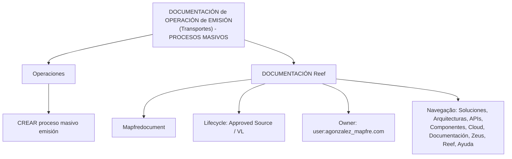

# Documentação de Operação de Emissão (Transportes) — Processos Massivos no Reef

## 1. Metadados do Documento
- **Arquivo de Origem:** Não identificado; conteúdo fornecido como extração textual de uma página.
- **Tipo de Documento:** Manual Operacional.
- **Domínio / Sistema:** Reef; Operação de Emissão; Transportes; Processos Massivos.
- **Público-Alvo:** Não identificado.
- **Data/Versão Identificada:** Não identificada. O texto contém `Lifecycle Approved Source / VL`, sem detalhamento de versão ou data.

---

## 2. Resumo Executivo & Contexto de Negócio

O conteúdo apresenta uma documentação denominada **“DOCUMENTACIÓN de OPERACIÓN de EMISIÓN (Transportes) - PROCESOS MASIVOS”**, associada ao contexto de **Operações** e ao sistema ou domínio identificado como **Reef**. A referência funcional explícita é **“CREAR proceso masivo emisión”**, indicando a existência de um processo operacional para criação de emissão em massa.

A página está inserida em um ambiente de documentação identificado repetidamente como **“DOCUMENTACIÓN Reef”**. A extração também registra elementos de navegação ou categorização, incluindo Soluções, Arquiteturas, APIs, Componentes, Cloud, Documentação, Zeus, Reef e Ajuda.

O documento possui indicação de ciclo de vida como **Approved Source**, com a marca adicional `VL`, e registra o proprietário como `user:agonzalez_mapfre.com`. Não há descrição operacional detalhada, etapas de execução, critérios de validação, contratos de integração, tecnologias, URLs, ambientes ou parâmetros técnicos.

> **Nota de Análise:** O documento cita a criação de processo massivo de emissão, mas não descreve entradas, saídas, regras de processamento, mecanismos de execução ou tratamento de falhas.

---

## 3. Arquitetura, Componentes & Tecnologias Envolvidas

Os elementos explicitamente citados são:

| Componente / Termo | Evidência no conteúdo | Detalhamento disponível |
| :--- | :--- | :--- |
| Reef | `Documentation / DOCUMENTACIÓN Reef` | Identificado como contexto de documentação; não há descrição técnica do sistema. |
| Operação de Emissão | `DOCUMENTACIÓN de OPERACIÓN de EMISIÓN` | Identificada como tema documental; sem fluxo operacional detalhado. |
| Transportes | `(Transportes)` | Identificado como domínio ou contexto; sem definição adicional. |
| Processos Massivos | `PROCESOS MASIVOS` | Identificado como escopo do documento; sem especificação de processamento. |
| Criar processo massivo de emissão | `CREAR proceso masivo emisión` | Identificada como operação; não há instruções, parâmetros ou resultado esperado. |
| Zeus | Item de navegação `Zeus` | Não há relação técnica ou funcional explicada com Reef. |
| Mapfredocument | `Mapfredocument` | Termo citado sem descrição. |

O conteúdo não contém arquitetura de software, integrações, microsserviços, tecnologias, APIs, bancos de dados, filas, protocolos ou fluxos de dados. O diagrama abaixo representa somente a organização documental e os rótulos observados, não uma arquitetura técnica:



---

## 4. Regras de Negócio, Especificações Funcionais & Processos

A única operação funcional explicitamente identificada é:

1. **Criar processo massivo de emissão**
   - Nome apresentado no conteúdo original: `CREAR proceso masivo emisión`.
   - Contexto apresentado: Operações de Emissão, no domínio de Transportes.
   - Não foram identificados critérios de elegibilidade, regras de negócio, campos obrigatórios, usuários autorizados, aprovações, cálculos, periodicidade, etapas de processamento ou tratamento de exceções.

2. **Estado documental**
   - O ciclo de vida é apresentado como `Approved Source / VL`.
   - O significado operacional de `VL` não é definido pelo conteúdo disponível.
   - Não há evidência de que esse estado represente aprovação de execução, aprovação funcional ou publicação documental; apenas a classificação exibida deve ser considerada.

> **Nota de Análise:** A extração não fornece detalhamento suficiente para reconstruir o procedimento de emissão massiva. Qualquer regra adicional sobre validação, lote, apólice, transporte, usuários ou integração seria especulativa e não deve ser inferida.

---

## 5. Tabelas de Parâmetros, Ambientes e Estruturas de Dados

| Item / Parâmetro | Descrição / Função | Tipo / Valores / Formato | Ambiente / Observações |
| :--- | :--- | :--- | :--- |
| Título documental | Identifica a documentação de operação de emissão para Transportes e processos massivos. | `DOCUMENTACIÓN de OPERACIÓN de EMISIÓN (Transportes) - PROCESOS MASIVOS` | Não há versão ou data associada. |
| Área | Contexto organizacional apresentado na página. | `OPERACIONES` | Sem detalhamento adicional. |
| Operação | Operação funcional citada. | `CREAR proceso masivo emisión` | Sem descrição de procedimento. |
| Contexto documental | Nome do contexto de documentação exibido. | `Documentation / DOCUMENTACIÓN Reef` | Repetido no conteúdo extraído. |
| Proprietário | Identificador de owner apresentado. | `user:agonzalez_mapfre.com` | O texto não detalha responsabilidades ou contato. |
| Ciclo de vida | Estado exibido para o conteúdo. | `Approved Source / VL` | Significado de `VL` não identificado. |
| Plataforma documental | Termo exibido na página. | `Mapfredocument` | Função não detalhada. |
| Idioma exibido | Indicador de idioma da interface. | `ES` | O texto principal está em espanhol. |
| Navegação | Categorias ou áreas exibidas no menu. | `Buscar`, `Inicio`, `Soluciones`, `Arquitecturas`, `APIs`, `Componentes`, `Cloud`, `Documentación`, `Zeus`, `Reef`, `Ayuda` | Não representam necessariamente componentes integrados. |
| URLs / servidores / logs | Não identificados. | Não informado. | O conteúdo não contém endereços, hosts, rotas ou caminhos de log. |
| Parâmetros de processo | Não identificados. | Não informado. | Não há campos, tipos ou valores permitidos. |

---

## 6. Bateria de Perguntas & Respostas para RAG (FAQ Sintético)

### P1: Qual é o tema principal da documentação?
**R:** A documentação trata de **Operação de Emissão** no contexto de **Transportes**, com foco em **Processos Massivos**.

### P2: Qual operação é citada no documento?
**R:** A operação explicitamente citada é **“CREAR proceso masivo emisión”**, ou seja, criar um processo massivo de emissão.

### P3: O documento explica como executar o processo massivo de emissão?
**R:** Não. O conteúdo somente apresenta o nome da operação. Não há etapas, pré-requisitos, parâmetros de entrada, telas, comandos, resultados esperados ou tratamento de falhas.

### P4: Qual sistema ou contexto documental está associado ao conteúdo?
**R:** O conteúdo está associado a **Reef**, identificado pelas referências `Documentation / DOCUMENTACIÓN Reef` e `DOCUMENTACIÓN Reef`.

### P5: O documento especifica APIs ou contratos técnicos para a emissão massiva?
**R:** Não. Embora `APIs` apareça como item de navegação, o texto não apresenta endpoints, métodos HTTP, payloads, autenticação, contratos ou integrações.

### P6: Quem é identificado como proprietário do documento?
**R:** O proprietário registrado no conteúdo é `user:agonzalez_mapfre.com`.

### P7: Qual é o ciclo de vida exibido para o documento?
**R:** O ciclo de vida exibido é `Approved Source / VL`. O documento não explica o significado de `VL` nem os critérios que levaram à aprovação.

### P8: O documento contém informações sobre ambientes, servidores ou URLs?
**R:** Não. Não foram identificados nomes de ambientes, servidores, URLs, portas, credenciais, caminhos de execução ou rotas de log.

### P9: Qual domínio de negócio é mencionado junto à operação de emissão?
**R:** O domínio mencionado é **Transportes**, apresentado no título `DOCUMENTACIÓN de OPERACIÓN de EMISIÓN (Transportes) - PROCESOS MASIVOS`.

### P10: Zeus possui alguma integração documentada com Reef?
**R:** Não há integração documentada. `Zeus` aparece apenas como um item de navegação, sem descrição funcional, técnica ou relacional.

### P11: O que é Mapfredocument no contexto apresentado?
**R:** `Mapfredocument` é um termo exibido no conteúdo, mas não possui definição, função ou relacionamento detalhado na extração disponível.

### P12: Há regras de negócio para validação da emissão em massa?
**R:** Não. A extração não apresenta regras de validação, condições de aprovação, critérios de seleção, cálculos ou exceções para a emissão massiva.

---

## 7. Glossário de Termos, Siglas & Conceitos-Chave

- **Reef:** Contexto ou sistema associado à documentação, citado como `DOCUMENTACIÓN Reef`; não há definição funcional ou técnica adicional.
- **Operação de Emissão:** Tema documental relacionado à emissão; o conteúdo não define o processo.
- **Processos Massivos:** Escopo citado no título; não há definição de lote, volume, periodicidade ou mecanismo de execução.
- **Transportes:** Domínio ou contexto indicado no título; sem detalhamento.
- **Mapfredocument:** Termo apresentado na página, sem definição no conteúdo.
- **Zeus:** Item de navegação apresentado, sem definição ou relação documentada com Reef.
- **APIs:** Item de navegação. O documento não especifica APIs concretas.
- **Cloud:** Item de navegação. Não há serviços, provedores ou arquitetura em nuvem descritos.
- **VL:** Marcador exibido junto a `Approved Source`; significado não identificado.

---

## 8. Notas Críticas, Riscos & Limitações

- O conteúdo extraído é extremamente resumido e não permite estabelecer um procedimento operacional completo para a criação de processo massivo de emissão.
- Não há definição de responsabilidades operacionais além do identificador de proprietário `user:agonzalez_mapfre.com`.
- Não há informações sobre entradas, saídas, regras de negócio, validações, exceções, auditoria, logs, monitoramento ou recuperação de falhas.
- Não há arquitetura técnica, contratos de API, integrações, componentes de software, ambientes ou credenciais documentados.
- Os termos Reef, Zeus, Mapfredocument e VL são citados, mas não definidos; suas interpretações não devem ser extrapoladas.
- Os itens do menu de navegação não comprovam implementação, dependência ou integração entre as áreas listadas.

---

## 9. Conteúdo Bruto Estruturado (Referência Fiel)

```text
--- [PÁGINA 1 DE 1] ---

DOCUMENTACIÓN de OPERACIÓN de EMISIÓN (Transportes) -
PROCESOS MASIVOS
OPERACIONES
CREAR proceso masivo emisión
Documentation / DOCUMENTACIÓN Reef
DOCUMENTACIÓN Reef
Mapfredocument
DOCUMENTACIÓN Reef
Owner
user:agonzalez_mapfre.com
Lifecycle
Approved Source
 /
 VL
Buscar Inicio Soluciones Arquitecturas APIs Componentes Cloud Documentación Zeus Reef Ayuda
ES
```
