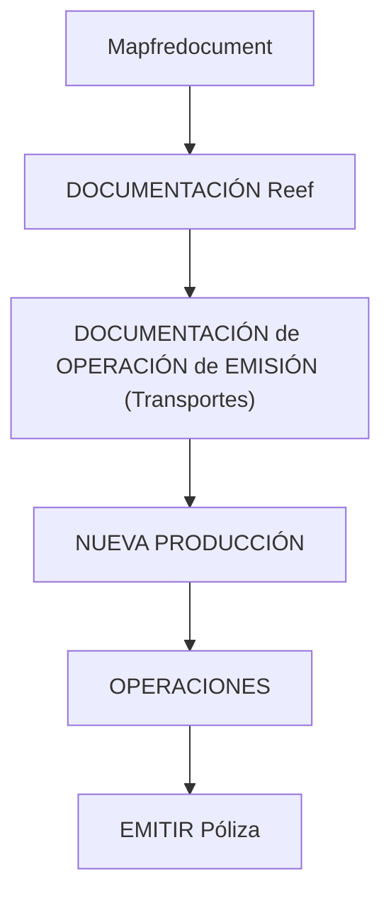

# Documentação de Operação de Emissão (Transportes) — Nova Produção

## 1. Metadados do Documento
- **Arquivo de Origem:** Não identificado no conteúdo extraído
- **Tipo de Documento:** Procedimento
- **Domínio / Sistema:** Operação de emissão de Transportes; Reef; Mapfredocument
- **Público-Alvo:** Operações
- **Data/Versão Identificada:** Não identificada

---

## 2. Resumo Executivo & Contexto de Negócio

O conteúdo extraído identifica uma documentação intitulada **“DOCUMENTACIÓN de OPERACIÓN de EMISIÓN (Transportes) - NUEVA PRODUCCIÓN”**. O tema explicitamente apresentado é a operação de emissão de apólices no domínio de Transportes, associada a um contexto denominado Nova Produção.

O documento apresenta referências à ação operacional **“EMITIR Póliza”**, à documentação Reef e ao ambiente ou portal Mapfredocument. Também identifica um responsável documental por meio do campo **Owner**, com o valor `user:agonzalez_mapfre.com`.

A extração contém elementos de navegação, incluindo Soluções, Arquiteturas, APIs, Componentes, Cloud, Documentação, Zeus, Reef e Ajuda. Entretanto, o conteúdo não descreve fluxos operacionais detalhados, regras de validação, contratos de integração, tecnologias, URLs, ambientes técnicos ou procedimentos passo a passo.

> **Nota de Análise:** O conteúdo confirma a existência de uma documentação operacional para emissão de apólices de Transportes em Nova Produção, mas não detalha as etapas necessárias para emitir uma apólice, os sistemas envolvidos no processamento ou as regras de negócio aplicáveis.

---

## 3. Arquitetura, Componentes & Tecnologias Envolvidas

Os elementos identificados no conteúdo são:

- **Reef:** Referenciado como “DOCUMENTACIÓN Reef”.
- **Mapfredocument:** Referenciado como ambiente, portal ou contexto documental.
- **Operações:** Área associada à emissão de apólice.
- **Transportes:** Domínio de negócio explicitamente citado no título.
- **Nova Produção:** Contexto operacional explicitamente citado no título.
- **Zeus:** Item disponível na navegação apresentada.
- **APIs, Componentes e Cloud:** Itens de navegação apresentados, sem detalhamento técnico adicional.



> **Nota de Análise:** O diagrama representa exclusivamente as relações contextuais e hierárquicas inferíveis dos rótulos presentes na extração. O documento não descreve arquitetura de software, integrações, microsserviços, bancos de dados, protocolos, métodos HTTP ou contratos JSON.

---

## 4. Regras de Negócio, Especificações Funcionais & Processos

O conteúdo extraído apresenta os seguintes elementos funcionais e operacionais:

1. O documento está associado à **operação de emissão**.
2. O domínio operacional indicado é **Transportes**.
3. O contexto indicado é **Nova Produção**.
4. A ação funcional identificada é **“EMITIR Póliza”**.
5. A área ou público contextual explicitamente citado é **OPERACIONES**.
6. O material é referenciado como **DOCUMENTACIÓN Reef**.
7. O documento apresenta um campo de ciclo de vida com o valor **Approved Source**.
8. O documento apresenta o identificador **VL**, sem definição contextual adicional.

> **Nota de Análise:** Não foram identificadas regras de elegibilidade, cálculos, condições de emissão, validações de campos, perfis de autorização, estados de apólice, exceções operacionais ou critérios de aprovação.

---

## 5. Tabelas de Parâmetros, Ambientes e Estruturas de Dados

| Item / Parâmetro | Descrição / Função | Tipo / Valores / Formato | Ambiente / Observações |
| :--- | :--- | :--- | :--- |
| Título do documento | Identifica a documentação de operação de emissão para Transportes | `DOCUMENTACIÓN de OPERACIÓN de EMISIÓN (Transportes) - NUEVA PRODUCCIÓN` | Nova Produção |
| Área | Contexto organizacional apresentado | `OPERACIONES` | Sem detalhamento adicional |
| Ação funcional | Ação apresentada no conteúdo | `EMITIR Póliza` | Não são descritas etapas, entradas ou saídas |
| Documentação | Referência documental do sistema ou domínio | `DOCUMENTACIÓN Reef` | Reef |
| Plataforma ou portal | Nome apresentado na extração | `Mapfredocument` | Sem URL identificada |
| Owner | Responsável documental informado | `user:agonzalez_mapfre.com` | Valor literal extraído |
| Lifecycle | Estado de ciclo de vida informado | `Approved Source` | Sem definição adicional |
| Identificador | Sigla ou identificador apresentado | `VL` | Significado não identificado |
| Idioma | Idioma exibido na navegação | `ES` | Espanhol |
| Navegação | Categorias ou seções apresentadas | `Buscar`, `Inicio`, `Soluciones`, `Arquitecturas`, `APIs`, `Componentes`, `Cloud`, `Documentación`, `Zeus`, `Reef`, `Ayuda` | Sem especificação funcional das categorias |

---

## 6. Bateria de Perguntas & Respostas para RAG (FAQ Sintético)

### P1: Qual é o objetivo da documentação de operação identificada?
**R:** A documentação identificada tem o título “DOCUMENTACIÓN de OPERACIÓN de EMISIÓN (Transportes) - NUEVA PRODUCCIÓN”. O conteúdo a associa à operação de emissão no domínio de Transportes e ao contexto de Nova Produção.

### P2: Qual ação operacional é mencionada no documento?
**R:** A ação operacional explicitamente mencionada é “EMITIR Póliza”. O conteúdo não detalha os passos, dados de entrada, validações ou resultado esperado dessa ação.

### P3: Qual é o domínio de negócio citado na documentação?
**R:** O domínio de negócio citado é Transportes, conforme indicado no título “DOCUMENTACIÓN de OPERACIÓN de EMISIÓN (Transportes) - NUEVA PRODUCCIÓN”.

### P4: O documento descreve como emitir uma apólice?
**R:** Não. O conteúdo contém a expressão “EMITIR Póliza”, mas não fornece um procedimento detalhado, sequência de telas, regras de validação, campos obrigatórios ou condições de sucesso para a emissão.

### P5: Quem é o responsável identificado pela documentação?
**R:** O campo `Owner` contém o valor `user:agonzalez_mapfre.com`. O texto extraído não apresenta nome completo, equipe, função ou responsabilidade operacional adicional.

### P6: Qual é o status de ciclo de vida informado?
**R:** O campo `Lifecycle` apresenta o valor `Approved Source`. O conteúdo não define o significado operacional, documental ou de governança desse estado.

### P7: Quais sistemas ou referências documentais são citados?
**R:** O conteúdo cita `Mapfredocument`, `DOCUMENTACIÓN Reef`, `Zeus` e `Reef`. Não há descrição técnica das responsabilidades desses elementos nem de integrações entre eles.

### P8: Existem APIs descritas para a operação de emissão?
**R:** Não. Embora `APIs` apareça como item de navegação, a extração não apresenta endpoints, métodos HTTP, autenticação, payloads, contratos JSON ou documentação de integração.

### P9: Quais ambientes técnicos são especificados?
**R:** O único contexto de ambiente ou estágio explicitamente indicado é `NUEVA PRODUCCIÓN`. Não há URLs, servidores, portas, credenciais, variáveis de configuração ou nomes formais de ambientes adicionais.

### P10: O documento apresenta regras de negócio para emissão de apólices de Transportes?
**R:** Não. A extração identifica o tema de emissão de apólices de Transportes, mas não especifica regras de negócio, cálculos, critérios de aceitação, restrições ou exceções.

### P11: Em qual idioma a interface documental parece estar configurada?
**R:** A navegação apresenta o código `ES`, além de rótulos em espanhol como `Buscar`, `Inicio`, `Soluciones`, `Arquitecturas`, `Documentación` e `Ayuda`. Isso indica apresentação em espanhol no conteúdo extraído.

---

## 7. Glossário de Termos, Siglas & Conceitos-Chave

- **APIs:** Item de navegação apresentado no conteúdo; não há detalhamento de APIs específicas.
- **Approved Source:** Valor apresentado no campo `Lifecycle`; o significado não é definido no conteúdo extraído.
- **Cloud:** Item de navegação apresentado; não há arquitetura ou serviço de nuvem descrito.
- **EMITIR Póliza:** Ação funcional ou operacional explicitamente mencionada.
- **ES:** Código de idioma exibido na navegação; o conteúdo utiliza rótulos em espanhol.
- **Lifecycle:** Campo de ciclo de vida apresentado com o valor `Approved Source`.
- **Mapfredocument:** Nome apresentado no conteúdo; a função técnica ou organizacional não é detalhada.
- **NUEVA PRODUCCIÓN:** Contexto explicitamente associado à documentação de emissão de Transportes.
- **OPERACIONES:** Área ou contexto organizacional apresentado.
- **Owner:** Campo que identifica o responsável documental como `user:agonzalez_mapfre.com`.
- **Reef:** Termo citado em “DOCUMENTACIÓN Reef”; não há expansão ou definição adicional.
- **Transportes:** Domínio de negócio associado à documentação de emissão.
- **VL:** Identificador apresentado após `Approved Source`; sem significado definido no conteúdo.
- **Zeus:** Item de navegação apresentado; sem função detalhada.

---

## 8. Notas Críticas, Riscos & Limitações

- O conteúdo extraído é limitado a títulos, rótulos, metadados e itens de navegação.
- Não há descrição de arquitetura de software, componentes técnicos, integrações, APIs, bancos de dados ou protocolos.
- Não foram identificados procedimentos operacionais detalhados para a emissão de apólices.
- Não foram identificadas regras de negócio, critérios de validação, parâmetros de cálculo, fluxos de exceção ou critérios de aprovação.
- Não há URLs, servidores, portas, credenciais, configurações de ambiente ou caminhos de logs.
- A sigla ou identificador `VL` não possui definição no conteúdo extraído.
- Os termos Reef, Mapfredocument e Zeus são citados, mas suas responsabilidades não são explicadas.
- Não foram disponibilizadas notas do apresentador, páginas adicionais ou anexos técnicos na extração fornecida.

---

## 9. Conteúdo Bruto Estruturado (Referência Fiel)

```text
--- [PÁGINA 1 DE 1] ---

DOCUMENTACIÓN de OPERACIÓN de EMISIÓN (Transportes) -
NUEVA PRODUCCIÓN
OPERACIONES
EMITIR Póliza
Documentation / DOCUMENTACIÓN Reef
DOCUMENTACIÓN Reef
Mapfredocument
DOCUMENTACIÓN Reef
Owner
user:agonzalez_mapfre.com
Lifecycle
Approved Source
 / 
 VL
Buscar Inicio Soluciones Arquitecturas APIs Componentes Cloud Documentación Zeus Reef Ayuda
ES
```
