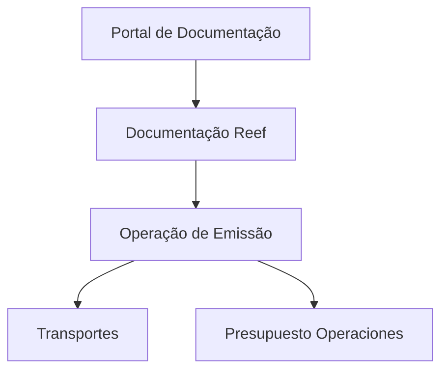

# Documentação de Operação de Emissão (Transportes) — Presupuesto Operaciones

## 1. Metadados do Documento
- **Arquivo de Origem:** Não identificado no conteúdo fornecido
- **Tipo de Documento:** Manual Operacional
- **Domínio / Sistema:** Reef / Emissão de Transportes / Presupuesto Operaciones
- **Público-Alvo:** Não identificado
- **Data/Versão Identificada:** Não identificada

---

## 2. Resumo Executivo & Contexto de Negócio

O conteúdo fornecido identifica uma documentação de operação relacionada à **emissão para Transportes** e ao contexto de **Presupuesto Operaciones**. A referência recorrente a “DOCUMENTACIÓN Reef” indica que o material está associado ao domínio ou repositório documental denominado **Reef**.

O texto também apresenta referências de navegação para áreas como Soluções, Arquiteturas, APIs, Componentes, Cloud, Documentação, Zeus, Reef e Ajuda. Essas referências sugerem que o documento foi extraído de uma plataforma corporativa de documentação, porém o conteúdo não descreve a função operacional dessas áreas.

O ciclo de vida apresentado é **Approved**, indicando que a fonte documental estava marcada como aprovada no ambiente de origem. O texto também identifica `user:agonzalez_mapfre.com` como proprietário do documento.

**Nota de Análise:** O conteúdo fornecido não detalha regras de emissão, passos operacionais, integrações, sistemas envolvidos, APIs, contratos, parâmetros, ambientes ou procedimentos de suporte.

---

## 3. Arquitetura, Componentes & Tecnologias Envolvidas

Os únicos componentes ou domínios explicitamente citados são:

| Componente / Termo | Evidência no conteúdo | Detalhamento disponível |
| :--- | :--- | :--- |
| Reef | “Documentation / DOCUMENTACIÓN Reef” | Não detalhado |
| Emissão | “DOCUMENTACIÓN de OPERACIÓN de EMISIÓN” | Não detalhado |
| Transportes | “EMISIÓN (Transportes)” | Não detalhado |
| Presupuesto Operaciones | “PRESUPUESTO OPERACIONES” | Não detalhado |
| Zeus | Item de navegação | Não detalhado |
| APIs | Item de navegação | Não detalhado |
| Cloud | Item de navegação | Não detalhado |



**Nota de Análise:** O diagrama representa somente a associação textual entre os termos apresentados. O documento não descreve arquitetura técnica, comunicação entre componentes ou fluxo de dados.

---

## 4. Regras de Negócio, Especificações Funcionais & Processos

Não foram identificadas regras de negócio, critérios de validação, cálculos, fluxos operacionais, estados de processo, métodos HTTP, contratos de integração ou restrições técnicas no conteúdo fornecido.

Os elementos funcionais explicitamente presentes são:

1. O documento é identificado como documentação de operação de emissão.
2. O escopo textual menciona Transportes.
3. O escopo textual menciona Presupuesto Operaciones.
4. O documento está associado à documentação Reef.
5. O ciclo de vida documental está identificado como `Approved`.

---

## 5. Tabelas de Parâmetros, Ambientes e Estruturas de Dados

| Item / Parâmetro | Descrição / Função | Tipo / Valores / Formato | Ambiente / Observações |
| :--- | :--- | :--- | :--- |
| Owner | Proprietário identificado no documento | `user:agonzalez_mapfre.com` | Origem documental |
| Lifecycle | Estado do ciclo de vida do documento | `Approved` | Origem documental |
| Idioma | Idioma exibido na navegação | `ES` | Interface ou portal de origem |
| Domínio documental | Área documental citada | `Reef` | Sem detalhamento adicional |
| Processo citado | Processo associado ao documento | `EMISIÓN (Transportes)` | Sem passos operacionais descritos |
| Contexto adicional | Tópico associado à emissão | `PRESUPUESTO OPERACIONES` | Sem detalhamento adicional |
| Navegação | Áreas listadas no portal | Buscar, Inicio, Soluciones, Arquitecturas, APIs, Componentes, Cloud, Documentación, Zeus, Reef, Ayuda | Não são especificadas como componentes técnicos |

---

## 6. Bateria de Perguntas & Respostas para RAG (FAQ Sintético)

### P1: Qual é o tema principal da documentação fornecida?
**R:** O tema principal identificado é a documentação de operação de emissão, com referência explícita a Transportes e Presupuesto Operaciones.

### P2: Qual domínio ou sistema é citado na documentação?
**R:** O domínio ou sistema explicitamente citado é Reef, por meio das referências “Documentation / DOCUMENTACIÓN Reef” e “DOCUMENTACIÓN Reef”.

### P3: O documento descreve o processo operacional de emissão?
**R:** Não. O conteúdo identifica a documentação como relacionada à operação de emissão, mas não apresenta etapas, responsáveis, entradas, saídas ou critérios operacionais.

### P4: Qual é o estado de ciclo de vida do documento?
**R:** O campo `Lifecycle` possui o valor `Approved`, indicando que a fonte documental estava aprovada no contexto de origem.

### P5: Quem é identificado como proprietário do documento?
**R:** O campo `Owner` identifica `user:agonzalez_mapfre.com` como proprietário do documento.

### P6: Existem APIs ou contratos de integração detalhados?
**R:** Não. “APIs” aparece apenas como item de navegação do portal, sem métodos, URLs, contratos JSON, autenticação ou especificações técnicas.

### P7: O documento informa ambientes, servidores ou URLs?
**R:** Não. O conteúdo não apresenta URLs, nomes de servidores, portas, credenciais, ambientes ou configurações de infraestrutura.

### P8: O que significa Presupuesto Operaciones no contexto fornecido?
**R:** “PRESUPUESTO OPERACIONES” é um tópico explicitamente associado à documentação de operação de emissão. O conteúdo não fornece definição funcional adicional.

### P9: Zeus é um sistema integrado à operação de emissão?
**R:** Não é possível afirmar. “Zeus” aparece somente como item de navegação, sem evidência de integração, dependência ou relacionamento técnico com Reef ou com o processo de emissão.

### P10: Qual idioma aparece na interface de origem?
**R:** O conteúdo apresenta o identificador `ES`, além de textos em espanhol como “Buscar”, “Inicio”, “Soluciones” e “Documentación”, indicando uma interface em espanhol.

---

## 7. Glossário de Termos, Siglas & Conceitos-Chave

- **Reef:** Domínio, sistema ou área documental citada no conteúdo; não há definição adicional.
- **Emisión:** Termo em espanhol para emissão; aparece no título da documentação operacional.
- **Transportes:** Contexto associado ao processo de emissão; não há detalhamento adicional.
- **Presupuesto Operaciones:** Tópico associado à documentação; não há definição adicional.
- **Lifecycle:** Campo de ciclo de vida documental, identificado com o valor `Approved`.
- **Owner:** Campo de propriedade documental, identificado com `user:agonzalez_mapfre.com`.
- **APIs:** Item de navegação do portal; não há especificação de interfaces de programação.
- **Cloud:** Item de navegação do portal; não há descrição de infraestrutura em nuvem.
- **Zeus:** Item de navegação do portal; não há descrição funcional ou técnica.

---

## 8. Notas Críticas, Riscos & Limitações

- O conteúdo extraído é predominantemente composto por título, metadados e navegação de portal.
- Não há instruções operacionais para o processo de emissão.
- Não há arquitetura de software, integrações, contratos de API, tecnologias, ambientes, logs ou parâmetros técnicos.
- Não há versão, data, nome de arquivo ou público-alvo explicitamente identificados.
- Relações entre Reef, Zeus, APIs, Cloud e a operação de emissão não podem ser inferidas além da presença conjunta no menu de navegação.
- **Nota de Análise:** O documento menciona “EMISIÓN (Transportes)” e “PRESUPUESTO OPERACIONES”, porém não detalha regras funcionais, métodos operacionais ou responsabilidades associadas.

---

## 9. Conteúdo Bruto Estruturado (Referência Fiel)

```text
--- [PÁGINA 1 DE 1] ---

DOCUMENTACIÓN de OPERACIÓN de EMISIÓN (Transportes) -
PRESUPUESTO
OPERACIONES
Documentation / DOCUMENTACIÓN Reef
DOCUMENTACIÓN Reef
Mapfredocument
DOCUMENTACIÓN Reef
Owner
user:agonzalez_mapfre.com
Lifecycle
Approved Source
 / 
 VL
Buscar Inicio Soluciones Arquitecturas APIs Componentes Cloud Documentación Zeus Reef Ayuda
ES
```
