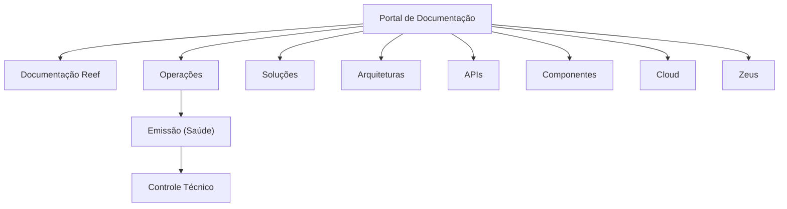

# Documentação de Operação de Emissão (Saúde) — Controle Técnico de Operações Reef

## 1. Metadados do Documento
- **Arquivo de Origem:** Não identificado
- **Tipo de Documento:** Manual Operacional
- **Domínio / Sistema:** Reef / Operações de Emissão (Saúde)
- **Público-Alvo:** Operação e equipes técnicas
- **Data/Versão Identificada:** Não identificada

---

## 2. Resumo Executivo & Contexto de Negócio

O conteúdo identifica uma documentação aprovada relacionada à operação de emissão no domínio de Saúde, com referência a controle técnico e operações. O documento está associado ao contexto de documentação Reef e Mapfre.

A navegação apresentada indica que a documentação está hospedada em um ambiente corporativo com áreas para soluções, arquiteturas, APIs, componentes, cloud, documentação, Zeus, Reef e ajuda. O texto também identifica um responsável associado ao domínio `mapfre.com`.

Não há detalhamento adicional sobre processos de emissão, regras de negócio, integrações, componentes técnicos, fluxos operacionais, contratos de API ou procedimentos de controle técnico.

---

## 3. Arquitetura, Componentes & Tecnologias Envolvidas

| Componente / Termo | Contexto identificado |
| :--- | :--- |
| Reef | Contexto de documentação mencionado no conteúdo. |
| Operações | Área associada à documentação de emissão e ao controle técnico. |
| Saúde | Domínio da emissão identificado no título. |
| Mapfre | Organização ou contexto corporativo mencionado por meio de `Mapfredocument` e do domínio do responsável. |
| Zeus | Área de navegação mencionada, sem detalhamento de função. |
| Cloud | Área de navegação mencionada, sem detalhamento de tecnologia ou ambiente. |
| APIs | Área de navegação mencionada, sem APIs específicas descritas. |



> **Nota de Análise:** O conteúdo não descreve integrações técnicas, protocolos, microsserviços, servidores, fluxos de dados ou tecnologias de implementação.

---

## 4. Regras de Negócio, Especificações Funcionais & Processos

O texto fornecido não apresenta regras de negócio, critérios de elegibilidade, cálculos, validações, etapas de emissão, estados de processo ou procedimentos operacionais detalhados.

Os únicos fatos funcionais sustentados pelo conteúdo são:

1. Existe uma documentação denominada **“DOCUMENTACIÓN de OPERACIÓN de EMISIÓN (Salud) - CONTROL TÉCNICO”**.
2. A documentação está relacionada a **OPERACIONES**.
3. O artefato possui ciclo de vida identificado como **Approved Source**.
4. O contexto documental menciona **Reef** e **Mapfredocument**.
5. Há um responsável identificado como `user:agonzalez_mapfre.com`.

> **Nota de Análise:** O documento cita “Emissão (Saúde)” e “Controle Técnico”, mas não detalha operações executáveis, responsabilidades por etapa, exceções ou resultados esperados.

---

## 5. Tabelas de Parâmetros, Ambientes e Estruturas de Dados

| Item / Parâmetro | Descrição / Função | Tipo / Valores / Formato | Ambiente / Observações |
| :--- | :--- | :--- | :--- |
| Título | Identifica a documentação de operação de emissão no domínio Saúde. | `DOCUMENTACIÓN de OPERACIÓN de EMISIÓN (Salud) - CONTROL TÉCNICO` | Não há versão ou data. |
| Área | Área organizacional indicada no documento. | `OPERACIONES` | Sem detalhamento adicional. |
| Contexto documental | Referência ao domínio de documentação Reef. | `Documentation / DOCUMENTACIÓN Reef` | Também aparece como `DOCUMENTACIÓN Reef`. |
| Organização / referência | Texto corporativo identificado. | `Mapfredocument` | Sem explicação no conteúdo. |
| Responsável | Proprietário identificado no portal. | `user:agonzalez_mapfre.com` | O conteúdo não fornece nome completo ou atribuições. |
| Ciclo de vida | Situação documental indicada. | `Approved Source` | Sem critérios de aprovação informados. |
| Identificador adicional | Texto exibido após o ciclo de vida. | `VL` | Significado não detalhado. |
| Idioma da interface | Idioma selecionado na navegação. | `ES` | Indica espanhol. |
| Seções disponíveis | Áreas de navegação do portal. | Buscar, Inicio, Soluciones, Arquitecturas, APIs, Componentes, Cloud, Documentación, Zeus, Reef, Ayuda | Não representam necessariamente componentes da solução. |

---

## 6. Bateria de Perguntas & Respostas para RAG (FAQ Sintético)

### P1: Qual é o assunto principal da documentação apresentada?
**R:** A documentação é identificada como **“DOCUMENTACIÓN de OPERACIÓN de EMISIÓN (Salud) - CONTROL TÉCNICO”**, associando operação de emissão no domínio de Saúde a um contexto de controle técnico.

### P2: Qual área está associada à documentação de emissão em Saúde?
**R:** A área explicitamente identificada no conteúdo é **OPERACIONES**. O documento não detalha a estrutura organizacional, processos ou responsabilidades dessa área.

### P3: Qual sistema ou domínio documental é citado no conteúdo?
**R:** O conteúdo cita **Reef** em expressões como `Documentation / DOCUMENTACIÓN Reef` e `DOCUMENTACIÓN Reef`. Não há descrição da função técnica ou de negócio de Reef.

### P4: Qual é o estado de ciclo de vida da documentação?
**R:** O ciclo de vida apresentado é **Approved Source**. O conteúdo não informa quem aprovou o documento, quando ocorreu a aprovação ou quais critérios foram utilizados.

### P5: Quem é o responsável identificado pela documentação?
**R:** O responsável exibido é `user:agonzalez_mapfre.com`. Não há nome completo, cargo, equipe ou escopo de responsabilidade descritos.

### P6: O documento apresenta APIs, endpoints ou contratos de integração?
**R:** Não. Embora a navegação mencione a seção **APIs**, o conteúdo não fornece endpoints, métodos HTTP, contratos JSON, autenticação, versões ou especificações de integração.

### P7: Existem regras detalhadas para a operação de emissão de Saúde?
**R:** Não. O texto identifica a operação de emissão em Saúde, mas não descreve regras de negócio, validações, etapas de processamento, exceções ou critérios de aprovação.

### P8: Quais áreas estão disponíveis na navegação do portal documental?
**R:** A navegação lista: `Buscar`, `Inicio`, `Soluciones`, `Arquitecturas`, `APIs`, `Componentes`, `Cloud`, `Documentación`, `Zeus`, `Reef` e `Ayuda`.

### P9: O documento identifica algum ambiente técnico, servidor ou URL?
**R:** Não. Não há URLs, hosts, portas, nomes de ambientes, servidores ou variáveis de configuração no conteúdo fornecido.

### P10: Qual idioma aparece selecionado na interface?
**R:** A interface apresenta `ES`, indicando o idioma espanhol.

---

## 7. Glossário de Termos, Siglas & Conceitos-Chave

- **Reef:** Contexto ou área de documentação citada no conteúdo; a função não é detalhada.
- **OPERACIONES:** Área relacionada ao documento de operação de emissão.
- **EMISIÓN (Salud):** Operação de emissão no domínio de Saúde, conforme título do documento.
- **CONTROL TÉCNICO:** Expressão presente no título; o conteúdo não define seus procedimentos ou escopo.
- **Approved Source:** Estado de ciclo de vida informado para a documentação.
- **VL:** Identificador exibido no conteúdo, sem significado detalhado.
- **Zeus:** Área de navegação mencionada, sem explicação funcional ou técnica.
- **ES:** Identificador de idioma espanhol exibido na interface.

---

## 8. Notas Críticas, Riscos & Limitações

- O conteúdo fornecido é predominantemente uma identificação de página documental e sua navegação, não uma especificação operacional completa.
- Não há processos, fluxos, regras de negócio, responsabilidades, critérios de controle técnico ou instruções de emissão descritos.
- Não há informações sobre arquitetura, ambientes, integrações, APIs, dados, logs, segurança ou tratamento de erros.
- Os itens `Reef`, `Zeus`, `VL`, `Mapfredocument` e `Approved Source` são mencionados sem definição contextual suficiente.
- A ausência de versão e data impede determinar a atualidade do documento.
- O diagrama Mermaid representa apenas relações contextuais explicitamente inferíveis pela navegação e pelo título; não representa arquitetura técnica implementada.

---

## 9. Conteúdo Bruto Estruturado (Referência Fiel)

```text
--- [PÁGINA 1 DE 1] ---

DOCUMENTACIÓN de OPERACIÓN de EMISIÓN (Salud) - CONTROL
TÉCNICO
OPERACIONES
Documentation / DOCUMENTACIÓN Reef
DOCUMENTACIÓN Reef
Mapfredocument
DOCUMENTACIÓN Reef
Owner
user:agonzalez_mapfre.com
Lifecycle
Approved Source
 / 
 VL
Buscar Inicio Soluciones Arquitecturas APIs Componentes Cloud Documentación Zeus Reef Ayuda
ES
```
