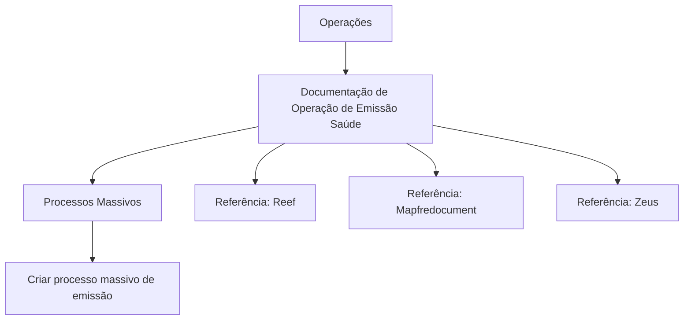

# Documentação de Operação de Emissão (Saúde) — Processos Massivos

## 1. Metadados do Documento
- **Arquivo de Origem:** Não identificado no conteúdo fornecido
- **Tipo de Documento:** Procedimento
- **Domínio / Sistema:** Reef / Emissão (Saúde) / Mapfre
- **Público-Alvo:** Operações
- **Data/Versão Identificada:** Não identificada
- **Owner identificado:** `user:agonzalez_mapfre.com`
- **Lifecycle identificado:** Approved

---

## 2. Resumo Executivo & Contexto de Negócio

O conteúdo fornecido identifica uma documentação denominada **“DOCUMENTACIÓN de OPERACIÓN de EMISIÓN (Salud) - PROCESOS MASIVOS”**. O escopo explicitamente indicado é operacional e está relacionado à emissão no domínio de Saúde, com foco em processos massivos.

A única operação funcional explicitamente apresentada é **“CREAR proceso masivo emisión”**, indicando que a documentação contempla a criação de um processo massivo de emissão. O trecho não detalha os passos operacionais, pré-requisitos, entradas, validações, saídas ou responsáveis pela execução.

A documentação está associada a referências denominadas **Reef**, **Mapfredocument** e **Zeus**, conforme a navegação apresentada. O estado de ciclo de vida registrado é **Approved**, sugerindo que a fonte está aprovada no repositório de documentação, sem que o conteúdo fornecido detalhe o critério de aprovação.

O texto também apresenta elementos de navegação para áreas como Soluções, Arquiteturas, APIs, Componentes, Cloud, Documentação, Zeus, Reef e Ajuda. Não há detalhamento adicional sobre integrações, arquitetura técnica, tecnologias, APIs ou ambientes.

---

## 3. Arquitetura, Componentes & Tecnologias Envolvidas

### Componentes e referências identificadas

| Componente / Referência | Papel identificado no conteúdo | Detalhamento disponível |
| :--- | :--- | :--- |
| Emissão (Saúde) | Domínio funcional da documentação | Não detalhado |
| Processos Massivos | Escopo operacional da documentação | Não detalhado |
| Reef | Referência de documentação e navegação | Não detalhado |
| Mapfredocument | Referência exibida no conteúdo | Não detalhado |
| Zeus | Opção de navegação para documentação | Não detalhado |
| Soluções | Área de navegação | Não detalhado |
| Arquiteturas | Área de navegação | Não detalhado |
| APIs | Área de navegação | Não detalhado |
| Componentes | Área de navegação | Não detalhado |
| Cloud | Área de navegação | Não detalhado |
| Ajuda | Área de navegação | Não detalhado |



> **Nota de Análise:** O conteúdo fornecido não descreve arquitetura de software, fluxos de integração, microsserviços, protocolos, métodos HTTP, contratos de APIs, bancos de dados, servidores ou tecnologias de implementação.

---

## 4. Regras de Negócio, Especificações Funcionais & Processos

### Processo identificado

1. O documento está relacionado a **operações de emissão no domínio de Saúde**.
2. O documento cita o processo **“CREAR proceso masivo emisión”**.
3. Não foram fornecidos critérios de elegibilidade, regras de cálculo, parâmetros de entrada, tratamento de erros, aprovações, agendamentos, limites de volume ou etapas de execução.
4. O ciclo de vida da documentação está indicado como **Approved**.
5. O owner indicado no conteúdo é `user:agonzalez_mapfre.com`.

> **Nota de Análise:** A expressão “CREAR proceso masivo emisión” é o único procedimento funcional explicitamente identificado. O conteúdo não apresenta instruções operacionais suficientes para reproduzir a criação de um processo massivo de emissão.

---

## 5. Tabelas de Parâmetros, Ambientes e Estruturas de Dados

| Item / Parâmetro | Descrição / Função | Tipo / Valores / Formato | Ambiente / Observações |
| :--- | :--- | :--- | :--- |
| Título da documentação | Identifica a documentação de operação | `DOCUMENTACIÓN de OPERACIÓN de EMISIÓN (Salud) - PROCESOS MASIVOS` | Domínio de Emissão (Saúde) |
| Operação citada | Criação de processo massivo de emissão | `CREAR proceso masivo emisión` | Sem detalhamento operacional |
| Área funcional | Contexto de operação | `OPERACIONES` | Não detalhado |
| Owner | Proprietário identificado no repositório | `user:agonzalez_mapfre.com` | Valor literal apresentado |
| Lifecycle | Estado do ciclo de vida da documentação | `Approved` | Critérios não informados |
| Referência documental | Referência exibida | `Documentation / DOCUMENTACIÓN Reef` | Sem detalhamento |
| Referência documental | Referência exibida | `DOCUMENTACIÓN Reef` | Sem detalhamento |
| Referência documental | Referência exibida | `Mapfredocument` | Sem detalhamento |
| Idioma da interface | Idioma exibido | `ES` | Interface em espanhol |
| Navegação | Áreas apresentadas na interface | Buscar, Inicio, Soluciones, Arquitecturas, APIs, Componentes, Cloud, Documentación, Zeus, Reef, Ayuda | Não representa necessariamente componentes técnicos |

---

## 6. Bateria de Perguntas & Respostas para RAG (FAQ Sintético)

### P1: Qual é o objetivo da documentação de operação apresentada?
**R:** A documentação trata de operações de emissão no domínio de Saúde e é intitulada “DOCUMENTACIÓN de OPERACIÓN de EMISIÓN (Salud) - PROCESOS MASIVOS”.

### P2: Qual processo operacional é explicitamente citado no conteúdo?
**R:** O processo citado é “CREAR proceso masivo emisión”, isto é, criar um processo massivo de emissão.

### P3: O documento descreve passo a passo como criar um processo massivo de emissão?
**R:** Não. O conteúdo apenas cita a operação “CREAR proceso masivo emisión” e não apresenta etapas, telas, campos, parâmetros, validações ou critérios de conclusão.

### P4: Qual é o domínio de negócio associado à emissão descrita?
**R:** O domínio explicitamente indicado é Saúde, conforme o título “EMISIÓN (Salud)”.

### P5: Quem é o owner identificado na documentação?
**R:** O owner registrado é `user:agonzalez_mapfre.com`.

### P6: Qual é o ciclo de vida da documentação?
**R:** O ciclo de vida informado é `Approved`.

### P7: O documento informa APIs ou contratos de integração para o processo de emissão massiva?
**R:** Não. Embora “APIs” apareça como item de navegação, o conteúdo não especifica endpoints, métodos HTTP, contratos, autenticação ou sistemas integrados.

### P8: Reef é descrito como um sistema técnico ou microsserviço?
**R:** Não. Reef aparece como referência de documentação e navegação, mas o conteúdo fornecido não define sua função técnica, arquitetura ou responsabilidades.

### P9: Existem ambientes, URLs, servidores ou credenciais documentados?
**R:** Não. O trecho não apresenta URLs, nomes de ambiente, servidores, portas, caminhos de logs ou credenciais.

### P10: Zeus possui alguma função detalhada no documento?
**R:** Não. Zeus aparece somente como uma opção na navegação apresentada, sem descrição funcional ou técnica.

---

## 7. Glossário de Termos, Siglas & Conceitos-Chave

- **Emisión:** Termo em espanhol usado no documento para o processo de emissão.
- **Salud:** Domínio de Saúde referido no título da documentação.
- **Procesos Masivos:** Escopo de processos executados em massa; o comportamento, volume e regras desses processos não são detalhados.
- **Operaciones:** Área operacional indicada no conteúdo.
- **Reef:** Referência documental e item de navegação; significado técnico não detalhado.
- **Mapfredocument:** Referência exibida no conteúdo; significado técnico não detalhado.
- **Zeus:** Item de navegação; significado técnico não detalhado.
- **Lifecycle:** Campo que indica o ciclo de vida da documentação.
- **Approved:** Valor do campo Lifecycle, indicando que a documentação está aprovada.
- **Owner:** Campo que identifica o proprietário associado à documentação.

---

## 8. Notas Críticas, Riscos & Limitações

- O conteúdo fornecido é extremamente resumido e não contém instruções suficientes para executar o processo de criação massiva de emissão.
- Não há especificação de entradas, dados obrigatórios, validações, regras de negócio, permissões, aprovações ou resultados esperados.
- Não há descrição de arquitetura, dependências, sistemas integrados, APIs, tecnologias, ambientes, logs ou mecanismos de monitoramento.
- Não foram identificadas datas, versões, identificadores de documento ou histórico de alterações.
- A presença de “APIs”, “Cloud”, “Arquiteturas” e “Componentes” na navegação não comprova que esses tópicos façam parte do procedimento documentado.
- O status `Approved` é apresentado sem critérios de governança, aprovador ou data de aprovação.

---

## 9. Conteúdo Bruto Estruturado (Referência Fiel)

```text
--- [PÁGINA 1 DE 1] ---

DOCUMENTACIÓN de OPERACIÓN de EMISIÓN (Salud) - PROCESOS
MASIVOS
OPERACIONES
CREAR proceso masivo emisión
Documentation / DOCUMENTACIÓN Reef
DOCUMENTACIÓN Reef
Mapfredocument
DOCUMENTACIÓN Reef
Owner
user:agonzalez_mapfre.com
Lifecycle
Approved Source
 / 
 VL
Buscar Inicio Soluciones Arquitecturas APIs Componentes Cloud Documentación Zeus Reef Ayuda
ES
```
