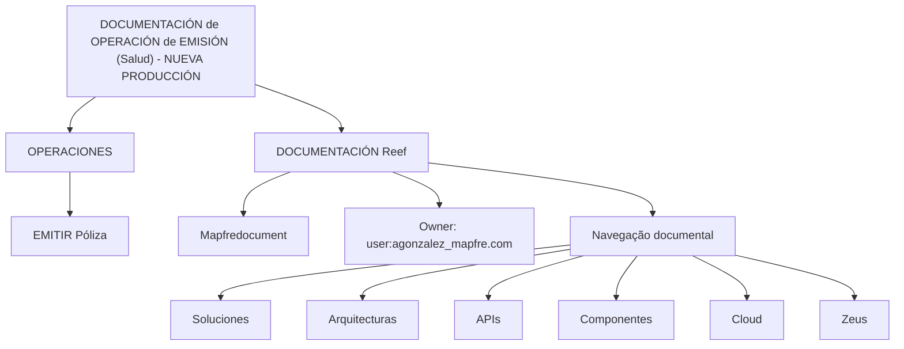

# Documentação de Operação de Emissão (Saúde) — Nova Produção

## 1. Metadados do Documento
- **Arquivo de Origem:** Não identificado
- **Tipo de Documento:** Procedimento
- **Domínio / Sistema:** Reef / Mapfre — Operações de emissão de apólice de Saúde
- **Público-Alvo:** Operação
- **Data/Versão Identificada:** Não identificada

---

## 2. Resumo Executivo & Contexto de Negócio

O conteúdo apresenta uma referência documental intitulada **“DOCUMENTACIÓN de OPERACIÓN de EMISIÓN (Salud) - NUEVA PRODUCCIÓN”**, vinculada ao contexto de **Operações** e à atividade de **emitir apólice**.

A documentação está associada a **Reef**, com referências adicionais a **Mapfredocument** e à navegação documental de Mapfre. O texto também identifica um proprietário documental: `user:agonzalez_mapfre.com`.

O conteúdo exibido não descreve etapas operacionais, regras de emissão, contratos de integração, sistemas de origem ou destino, nem critérios de validação para a emissão de apólices. Portanto, a utilidade principal deste registro é identificar a existência, o tema e a localização contextual da documentação.

---

## 3. Arquitetura, Componentes & Tecnologias Envolvidas

Os componentes, áreas e referências explicitamente identificados são:

- **Reef:** contexto documental mencionado diversas vezes.
- **Mapfredocument:** referência documental apresentada no conteúdo.
- **Operações:** área associada ao processo.
- **Emitir Póliza:** atividade funcional descrita.
- **Zeus:** item disponível na navegação documental.
- **Cloud:** item disponível na navegação documental.
- **APIs:** item disponível na navegação documental.
- **Arquitecturas**, **Componentes**, **Soluciones** e **Ayuda:** itens de navegação apresentados.



> **Nota de Análise:** O conteúdo não detalha a arquitetura de software, integrações, protocolos, tecnologias implementadas, ambientes ou relações técnicas entre Reef, Mapfredocument, Zeus, APIs e Cloud.

---

## 4. Regras de Negócio, Especificações Funcionais & Processos

### Processo identificado

1. O documento está relacionado à área de **Operações**.
2. A atividade funcional explicitamente apresentada é **Emitir Póliza**.
3. O escopo indicado no título é **Emissão**, no domínio de **Salud**, para **Nueva Producción**.
4. A documentação é apresentada no contexto de **Reef**.

### Regras e critérios identificados

Não foram identificadas regras de negócio detalhadas, critérios de elegibilidade, cálculos, validações, transições de estado, exceções operacionais ou instruções passo a passo.

> **Nota de Análise:** O documento lista a atividade “Emitir Póliza”, mas não informa como a emissão deve ser executada, quais dados são obrigatórios, quais validações devem ocorrer ou quais sistemas participam da operação.

---

## 5. Tabelas de Parâmetros, Ambientes e Estruturas de Dados

| Item / Parâmetro | Descrição / Função | Tipo / Valores / Formato | Ambiente / Observações |
| :--- | :--- | :--- | :--- |
| Título documental | Identifica a documentação de operação de emissão para Saúde em nova produção | `DOCUMENTACIÓN de OPERACIÓN de EMISIÓN (Salud) - NUEVA PRODUCCIÓN` | Não detalhado |
| Área | Área associada ao conteúdo | `OPERACIONES` | Não detalhado |
| Atividade | Ação funcional citada | `EMITIR Póliza` | Não detalhado |
| Contexto documental | Plataforma ou domínio documental mencionado | `DOCUMENTACIÓN Reef` | Repetido no conteúdo |
| Referência documental | Nome apresentado como referência | `Mapfredocument` | Não detalhado |
| Proprietário | Identificador do proprietário documental | `user:agonzalez_mapfre.com` | Campo apresentado como `Owner` |
| Ciclo de vida | Estado ou categoria apresentada | `Lifecycle` | Não detalhado |
| Fonte | Indicador exibido na interface | `Approved Source` | Não detalhado |
| Idioma | Idioma exibido na navegação | `ES` | Espanhol |
| Navegação | Opções de navegação documental | Buscar, Inicio, Soluciones, Arquitecturas, APIs, Componentes, Cloud, Documentación, Zeus, Reef, Ayuda | Não representa necessariamente componentes implementados |

---

## 6. Bateria de Perguntas & Respostas para RAG (FAQ Sintético)

### P1: Qual é o tema principal da documentação?
**R:** A documentação trata de operações de emissão no domínio de Saúde, conforme o título `DOCUMENTACIÓN de OPERACIÓN de EMISIÓN (Salud) - NUEVA PRODUCCIÓN`.

### P2: Qual atividade operacional é citada no documento?
**R:** A atividade citada é `EMITIR Póliza`, isto é, emitir uma apólice.

### P3: A qual área organizacional o documento está associado?
**R:** O conteúdo apresenta a área `OPERACIONES`, indicando associação com operações.

### P4: Qual sistema ou contexto documental é mencionado repetidamente?
**R:** O contexto documental mencionado repetidamente é `DOCUMENTACIÓN Reef`.

### P5: Quem é o proprietário identificado para a documentação?
**R:** O proprietário identificado no conteúdo é `user:agonzalez_mapfre.com`.

### P6: O documento descreve os passos necessários para emitir uma apólice?
**R:** Não. O conteúdo apenas cita a atividade `EMITIR Póliza`; não apresenta etapas, campos, validações, exceções ou critérios operacionais para a emissão.

### P7: Quais opções de navegação documental aparecem no conteúdo?
**R:** As opções apresentadas são Buscar, Inicio, Soluciones, Arquitecturas, APIs, Componentes, Cloud, Documentación, Zeus, Reef e Ayuda.

### P8: O documento informa APIs ou contratos de integração para emissão de apólice?
**R:** Não. Embora `APIs` apareça como item de navegação, o conteúdo não especifica endpoints, métodos HTTP, contratos, payloads ou integrações.

### P9: Existe indicação de ambiente técnico, URL, servidor ou porta?
**R:** Não. O conteúdo não fornece URLs, nomes de servidores, portas, credenciais ou identificação de ambientes técnicos.

### P10: Qual é o idioma indicado na interface documental?
**R:** O idioma indicado é `ES`, correspondente a espanhol.

---

## 7. Glossário de Termos, Siglas & Conceitos-Chave

- **APIs:** Item de navegação apresentado no conteúdo; o documento não fornece definição adicional.
- **Cloud:** Item de navegação apresentado no conteúdo; o documento não fornece definição adicional.
- **DOCUMENTACIÓN Reef:** Referência documental associada a Reef.
- **EMISIÓN:** Emissão, no contexto do título documental.
- **ES:** Indicador de idioma espanhol.
- **Mapfredocument:** Referência documental exibida no conteúdo.
- **Nueva Producción:** Escopo indicado no título; não há detalhamento adicional.
- **OPERACIONES:** Área operacional associada à atividade de emitir apólice.
- **Póliza:** Apólice, objeto da atividade `EMITIR Póliza`.
- **Reef:** Domínio ou contexto documental mencionado no conteúdo.
- **Zeus:** Item de navegação apresentado; não há definição adicional.

---

## 8. Notas Críticas, Riscos & Limitações

- O conteúdo é extremamente resumido e não contém procedimento operacional executável.
- Não há descrição de arquitetura, componentes técnicos implementados, integrações, dados de entrada ou saída, APIs, logs, URLs, ambientes ou servidores.
- Não foram identificados critérios de validação, regras de elegibilidade, regras de cálculo, tratamento de erros ou processos de contingência.
- Os itens de navegação, como `APIs`, `Cloud` e `Zeus`, não devem ser interpretados como evidência de uso técnico no processo de emissão.
- A propriedade documental é apresentada como `user:agonzalez_mapfre.com`, mas o conteúdo não informa responsabilidades, contatos ou fluxo de aprovação.
- O campo `Approved Source` é exibido, porém não há explicação sobre seu significado operacional ou documental.

---

## 9. Conteúdo Bruto Estruturado (Referência Fiel)

```text
--- [PÁGINA 1 DE 1] ---

DOCUMENTACIÓN de OPERACIÓN de EMISIÓN (Salud) - NUEVA
PRODUCCIÓN
OPERACIONES
EMITIR Póliza
Documentation / DOCUMENTACIÓN Reef
DOCUMENTACIÓN Reef
Mapfredocument
DOCUMENTACIÓN Reef
Owner
user:agonzalez_mapfre.com
Lifecycle
Approved Source
 / 
 VL
Buscar Inicio Soluciones Arquitecturas APIs Componentes Cloud Documentación Zeus Reef Ayuda
ES
```
