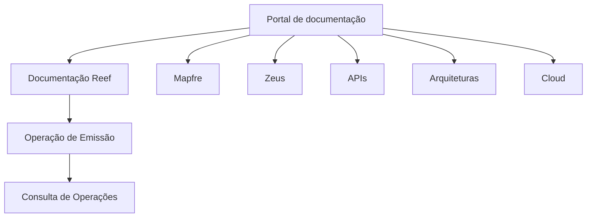

# Documentação de Operação de Emissão — Consulta de Operações Reef

## 1. Metadados do Documento
- **Arquivo de Origem:** Não identificado
- **Tipo de Documento:** Manual Operacional
- **Domínio / Sistema:** Reef / Mapfre
- **Público-Alvo:** Operação, Arquitetos, Desenvolvedores
- **Data/Versão Identificada:** Não identificada

---

## 2. Resumo Executivo & Contexto de Negócio

O conteúdo apresenta referências a uma documentação de operação de emissão, com foco em **consulta de operações** no domínio **Reef**. O documento está classificado como documentação Reef e associado ao contexto corporativo Mapfre.

A navegação indicada inclui áreas de Soluções, Arquiteturas, APIs, Componentes, Cloud, Documentação, Zeus, Reef e Ajuda. Essa estrutura sugere que a documentação de operação está disponível em um repositório corporativo de conhecimento técnico e funcional.

O texto identifica um responsável como `user:agonzalez_mapfre.com` e apresenta o ciclo de vida como `Approved Source`. Não há detalhamento de regras de emissão, contratos de API, telas, métodos HTTP, dados de consulta, ambientes ou procedimentos operacionais.

> **Nota de Análise:** O documento menciona “OPERACIONES” e “CONSULTA”, mas não especifica critérios de busca, regras de negócio, integrações, entradas, saídas ou fluxos de processamento.

---

## 3. Arquitetura, Componentes & Tecnologias Envolvidas

Os elementos explicitamente citados são Reef, Mapfre, Zeus, Soluções, Arquiteturas, APIs, Componentes, Cloud, Documentação e Ajuda. O texto não descreve relações técnicas, protocolos, microsserviços, bancos de dados ou fluxos de dados entre esses elementos.



> **Nota de Análise:** O diagrama representa apenas a organização e os termos presentes no conteúdo bruto; ele não descreve uma arquitetura de integração técnica.

---

## 4. Regras de Negócio, Especificações Funcionais & Processos

O conteúdo não apresenta regras de negócio detalhadas, condições de validação, etapas operacionais, cálculos, exceções ou restrições funcionais.

Informações identificadas:

1. O documento está relacionado à **operação de emissão**.
2. O assunto inclui **consulta de operações**.
3. O domínio documental é identificado como **Reef**.
4. O contexto corporativo contém referência a **Mapfre**.
5. O ciclo de vida informado é **Approved Source**.
6. O responsável informado é `user:agonzalez_mapfre.com`.

> **Nota de Análise:** Não há informação suficiente para definir o processo de consulta de operações, os dados consultados, os perfis autorizados ou os resultados esperados.

---

## 5. Tabelas de Parâmetros, Ambientes e Estruturas de Dados

| Item / Parâmetro | Descrição / Função | Tipo / Valores / Formato | Ambiente / Observações |
| :--- | :--- | :--- | :--- |
| Documentação Reef | Classificação documental identificada no conteúdo | Texto | Associada ao domínio Reef |
| Operação de Emissão | Tema principal indicado no título do conteúdo | Texto | Não há detalhamento operacional |
| Consulta | Operação ou funcionalidade mencionada | Texto | Não há critérios de consulta informados |
| Operações | Assunto relacionado à consulta | Texto | Não há lista de operações ou estados |
| Owner | Responsável pelo documento | `user:agonzalez_mapfre.com` | Valor literal extraído |
| Lifecycle | Estado de ciclo de vida do documento | `Approved Source` | Valor literal extraído |
| Idioma | Idioma exibido na interface | `ES` | Interface em espanhol |
| Zeus | Área ou item de navegação citado | Texto | Sem detalhamento adicional |
| APIs | Área ou item de navegação citado | Texto | Nenhuma API descrita |
| Cloud | Área ou item de navegação citado | Texto | Nenhum ambiente Cloud descrito |

---

## 6. Bateria de Perguntas & Respostas para RAG (FAQ Sintético)

### P1: Qual é o tema principal da documentação Reef apresentada?
**R:** O conteúdo está relacionado à documentação de operação de emissão, com referência explícita à consulta de operações no domínio Reef.

### P2: O documento detalha como consultar operações de emissão?
**R:** Não. O conteúdo apenas menciona “CONSULTA” e “OPERACIONES”, sem informar filtros, telas, APIs, parâmetros, resultados ou sequência operacional.

### P3: Qual domínio ou sistema é citado no documento?
**R:** O domínio identificado é Reef. O conteúdo também contém referências a Mapfre e Zeus, mas não explica a relação técnica ou funcional entre esses termos.

### P4: Quem é o responsável identificado pela documentação?
**R:** O responsável apresentado no conteúdo é `user:agonzalez_mapfre.com`.

### P5: Qual é o ciclo de vida do documento?
**R:** O ciclo de vida informado é `Approved Source`.

### P6: Quais áreas de conhecimento aparecem na navegação da documentação?
**R:** A navegação menciona Soluções, Arquiteturas, APIs, Componentes, Cloud, Documentação, Zeus, Reef e Ajuda.

### P7: O documento informa URLs, servidores ou ambientes?
**R:** Não. Não há URLs, nomes de servidores, portas, credenciais, ambientes ou rotas de log no conteúdo fornecido.

### P8: Existem APIs documentadas para a consulta de operações?
**R:** Não. “APIs” aparece apenas como item de navegação; o conteúdo não descreve endpoints, métodos HTTP, contratos JSON, autenticação ou códigos de resposta.

### P9: Há regras de negócio para emissão ou consulta de operações?
**R:** Não há regras de negócio explícitas. O documento não descreve validações, condições, cálculos, exceções ou critérios de decisão.

### P10: Em qual idioma a interface documental é apresentada?
**R:** A interface apresenta o marcador `ES`, indicando espanhol no conteúdo exibido.

---

## 7. Glossário de Termos, Siglas & Conceitos-Chave

- **Reef:** Domínio ou sistema identificado na documentação.
- **Mapfre:** Referência corporativa presente no conteúdo.
- **Zeus:** Área, sistema ou item de navegação citado sem detalhamento adicional.
- **APIs:** Item de navegação; o conteúdo não define APIs específicas.
- **Cloud:** Item de navegação; o conteúdo não identifica provedores, recursos ou ambientes.
- **Owner:** Campo que identifica o responsável pelo documento.
- **Lifecycle:** Campo que indica o estado de ciclo de vida documental.
- **Approved Source:** Valor do ciclo de vida apresentado no conteúdo.
- **ES:** Marcador de idioma exibido na interface, correspondente ao espanhol.

---

## 8. Notas Críticas, Riscos & Limitações

- O conteúdo é extremamente resumido e não apresenta procedimentos operacionais executáveis.
- Não há especificação de consulta de operações, regras de emissão, filtros, perfis, integrações ou contratos.
- Não há detalhes de arquitetura, tecnologias, versões, ambientes, servidores ou dependências.
- Não há evidência suficiente para inferir a função técnica de Reef, Zeus, Mapfre, APIs ou Cloud além das menções literais.
- A classificação `Approved Source` está presente, mas o documento não explica o significado operacional desse estado.

---

## 9. Conteúdo Bruto Estruturado (Referência Fiel)

```text
--- [PÁGINA 1 DE 1] ---

DOCUMENTACIÓN de OPERACIÓN de EMISIÓN (Generales) -
CONSULTA
OPERACIONES
Documentation / DOCUMENTACIÓN Reef
DOCUMENTACIÓN Reef
Mapfredocument
DOCUMENTACIÓN Reef
Owner
user:agonzalez_mapfre.com
Lifecycle
Approved Source
 / 
 VL
Buscar Inicio Soluciones Arquitecturas APIs Componentes Cloud Documentación Zeus Reef Ayuda
ES
```
