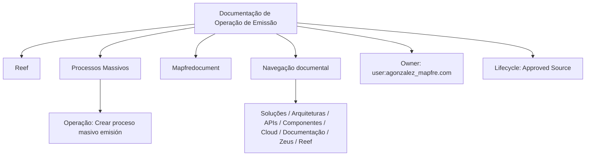

# Documentação de Operação de Emissão — Processos Massivos e Operações no Reef

## 1. Metadados do Documento
- **Arquivo de Origem:** Não identificado no conteúdo fornecido
- **Tipo de Documento:** Procedimento / Documentação de Operação
- **Domínio / Sistema:** Reef; emissão; processos massivos; operações
- **Público-Alvo:** Operação, desenvolvedores, arquitetos e usuários de documentação corporativa
- **Data/Versão Identificada:** Não identificada

---

## 2. Resumo Executivo & Contexto de Negócio

O conteúdo fornecido referencia uma documentação de operação de emissão, com foco em processos massivos e em uma operação identificada como “Crear proceso masivo emisión”. O idioma predominante é espanhol, com referências a termos em inglês, como “Owner”, “Lifecycle” e “Approved Source”.

A documentação está associada ao domínio Reef e inclui referências de navegação a áreas corporativas como Soluções, Arquiteturas, APIs, Componentes, Cloud, Documentação, Zeus e Reef. O conteúdo também menciona “Mapfredocument”, indicando uma possível relação com o contexto documental da Mapfre, sem detalhar essa integração.

O material extraído não descreve etapas operacionais, regras de validação, contratos de API, tecnologias, ambientes, responsáveis funcionais ou resultados esperados para o processo massivo de emissão. Portanto, esta referência deve ser interpretada como uma identificação documental e não como um manual operacional completo.

---

## 3. Arquitetura, Componentes & Tecnologias Envolvidas

Os elementos explicitamente citados são:

- **Reef:** domínio ou sistema ao qual a documentação está associada.
- **Processos massivos:** categoria operacional indicada no título.
- **Emissão:** operação ou domínio funcional abordado.
- **Crear proceso masivo emisión:** operação mencionada de forma textual.
- **Mapfredocument:** referência documental citada sem detalhamento.
- **Zeus:** item disponível na navegação documental, sem relação técnica detalhada.
- **Soluções, Arquiteturas, APIs, Componentes e Cloud:** áreas de navegação da plataforma documental.
- **Owner:** `user:agonzalez_mapfre.com`.
- **Lifecycle:** `Approved Source`.
- **VL:** sigla ou identificador citado sem expansão.



> **Nota de Análise:** O conteúdo não apresenta uma arquitetura de software, fluxo de integração, endpoints, métodos HTTP, modelos de dados ou tecnologias de implementação.

---

## 4. Regras de Negócio, Especificações Funcionais & Processos

O conteúdo indica a existência de uma operação chamada **“Crear proceso masivo emisión”**, no contexto de **processos massivos** e **emissão**.

Não foram fornecidas regras de negócio, critérios de elegibilidade, entradas obrigatórias, validações, etapas de execução, tratamento de erros, aprovações, responsáveis operacionais ou saídas esperadas.

> **Nota de Análise:** O documento lista a operação “Crear proceso masivo emisión”, porém não detalha como criar o processo, quais dados são necessários, quais regras são aplicadas ou como o resultado da emissão é acompanhado.

---

## 5. Tabelas de Parâmetros, Ambientes e Estruturas de Dados

| Item / Parâmetro | Descrição / Função | Tipo / Valores / Formato | Ambiente / Observações |
| :--- | :--- | :--- | :--- |
| Documentação de Operação de Emissão | Título ou assunto principal da documentação | Texto | Associada a processos massivos |
| Processos Massivos | Categoria de processo mencionada | Texto | Não há definição adicional |
| Crear proceso masivo emisión | Operação identificada no conteúdo | Texto | Não há passos, parâmetros ou contratos descritos |
| Reef | Sistema, domínio ou área documental citada | Texto | Referenciado em “Documentation / DOCUMENTACIÓN Reef” |
| Mapfredocument | Referência documental citada | Texto | Relação técnica não detalhada |
| Owner | Proprietário identificado no documento | `user:agonzalez_mapfre.com` | Não há nome completo ou papel adicional |
| Lifecycle | Estado do ciclo de vida documental | `Approved Source` | Sem definição adicional |
| VL | Sigla ou identificador | `VL` | Significado não informado |
| Idioma | Opção de idioma exibida | `ES` | Indica espanhol |
| Navegação documental | Áreas listadas na interface | Buscar, Inicio, Soluciones, Arquitecturas, APIs, Componentes, Cloud, Documentación, Zeus, Reef, Ayuda | Não representa necessariamente componentes integrados |

---

## 6. Bateria de Perguntas & Respostas para RAG (FAQ Sintético)

### P1: Qual é o tema principal da documentação?
**R:** A documentação aborda a operação de emissão, com referência específica a processos massivos e à operação “Crear proceso masivo emisión”.

### P2: Qual sistema ou domínio é citado no documento?
**R:** O documento cita Reef em expressões como “Documentation / DOCUMENTACIÓN Reef” e “DOCUMENTACIÓN Reef”. O conteúdo não explica as responsabilidades funcionais ou técnicas de Reef.

### P3: O documento descreve como criar um processo massivo de emissão?
**R:** Não. O conteúdo apenas menciona a operação “Crear proceso masivo emisión”, sem apresentar etapas, campos, validações, pré-requisitos ou resultados esperados.

### P4: Quem é o proprietário identificado para a documentação?
**R:** O campo “Owner” contém o valor `user:agonzalez_mapfre.com`. Não há outras informações sobre a pessoa, equipe ou responsabilidade associada.

### P5: Qual é o status de ciclo de vida informado?
**R:** O documento apresenta o campo “Lifecycle” com o valor “Approved Source”.

### P6: Há APIs, endpoints ou contratos JSON descritos?
**R:** Não. Embora “APIs” apareça como item de navegação, o conteúdo não fornece URLs, métodos HTTP, contratos JSON, autenticação ou detalhes de integração.

### P7: O documento informa ambientes, servidores, URLs ou portas?
**R:** Não. Não há ambientes, servidores, URLs, portas, credenciais ou parâmetros de implantação no conteúdo fornecido.

### P8: Qual idioma é indicado na interface documental?
**R:** A interface apresenta o identificador “ES”, que indica espanhol.

### P9: O que é “Mapfredocument” no contexto apresentado?
**R:** “Mapfredocument” é uma referência textual presente no conteúdo. O documento não explica se representa um sistema, repositório, módulo ou artefato documental.

### P10: O que significa a sigla “VL”?
**R:** O documento contém a sigla “VL”, mas não fornece sua expansão ou significado no contexto de operação de emissão ou Reef.

### P11: Quais áreas estão disponíveis na navegação apresentada?
**R:** A navegação lista: Buscar, Inicio, Soluciones, Arquitecturas, APIs, Componentes, Cloud, Documentación, Zeus, Reef e Ayuda.

---

## 7. Glossário de Termos, Siglas & Conceitos-Chave

- **Reef:** Sistema, domínio ou área documental citada; o conteúdo não fornece definição funcional ou técnica.
- **Processos Massivos:** Categoria de processo mencionada em associação à emissão; sem detalhamento operacional.
- **Emissão:** Domínio operacional indicado no título; sem definição adicional.
- **Crear proceso masivo emisión:** Operação citada para criação de um processo massivo de emissão.
- **Owner:** Campo que identifica o proprietário da documentação como `user:agonzalez_mapfre.com`.
- **Lifecycle:** Campo de ciclo de vida documental, com valor `Approved Source`.
- **Approved Source:** Valor exibido para o ciclo de vida; sem definição do significado corporativo.
- **Mapfredocument:** Termo citado sem explicação.
- **Zeus:** Termo exibido na navegação documental, sem explicação.
- **VL:** Sigla não expandida no conteúdo.
- **ES:** Identificador de idioma exibido; associado ao espanhol.

---

## 8. Notas Críticas, Riscos & Limitações

- O conteúdo fornecido é extremamente resumido e não constitui um procedimento operacional executável.
- Não há descrição de entradas, saídas, responsáveis, fluxos de exceção, métricas, auditoria ou monitoramento para a operação de emissão.
- Não há dados sobre APIs, contratos, microsserviços, bancos de dados, ambientes, logs, URLs, autenticação ou permissões.
- Os termos Reef, Mapfredocument, Zeus e VL são citados sem definição suficiente para estabelecer relações técnicas ou funcionais.
- A ausência de detalhes impede inferir como a operação “Crear proceso masivo emisión” deve ser executada ou validada.

---

## 9. Conteúdo Bruto Estruturado (Referência Fiel)

```text
--- [PÁGINA 1 DE 1] ---

DOCUMENTACIÓN de OPERACIÓN de EMISIÓN (Generales) -
PROCESOS MASIVOS
OPERACIONES
CREAR proceso masivo emisión
Documentation / DOCUMENTACIÓN Reef
DOCUMENTACIÓN Reef
Mapfredocument
DOCUMENTACIÓN Reef
Owner
user:agonzalez_mapfre.com
Lifecycle
Approved Source
 / 
 VL
Buscar Inicio Soluciones Arquitecturas APIs Componentes Cloud Documentación Zeus Reef Ayuda
ES
```
