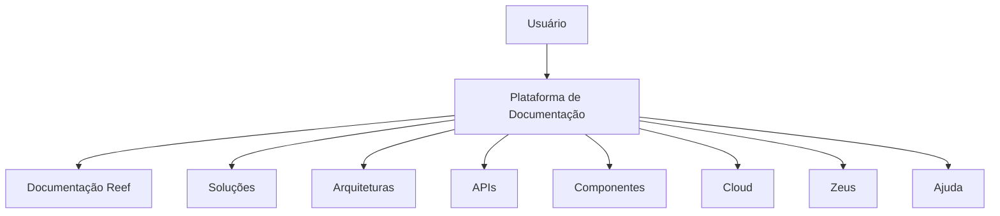

# Documentação de Operação de Emissão (Generales) — Reemplazo / Operaciones

## 1. Metadados do Documento
- **Arquivo de Origem:** Não identificado; conteúdo bruto fornecido como excerto.
- **Tipo de Documento:** Procedimento / Documentação Operacional.
- **Domínio / Sistema:** Reef; referências a Mapfre, Zeus, Cloud, APIs e Componentes.
- **Público-Alvo:** Operação, Arquitetos e equipes que consultam documentação Reef.
- **Data/Versão Identificada:** Não identificada.

---

## 2. Resumo Executivo & Contexto de Negócio

O conteúdo identifica uma documentação intitulada **“DOCUMENTACIÓN de OPERACIÓN de EMISIÓN (Generales) - REEMPLAZO OPERACIONES”**. O material está associado à documentação Reef e aparenta estar localizado em um ambiente corporativo de gestão documental.

A navegação apresentada expõe áreas como Soluções, Arquiteturas, APIs, Componentes, Cloud, Documentação, Zeus, Reef e Ajuda. Essas referências indicam que a documentação é acessada em uma plataforma centralizada de conhecimento técnico e operacional.

O documento contém a identificação de um proprietário (`user:agonzalez_mapfre.com`) e o ciclo de vida **Approved Source**, o que sustenta que o conteúdo possui uma classificação de aprovação na origem documental.

**Nota de Análise:** o excerto não descreve o processo de emissão, regras de substituição, etapas operacionais, contratos de API, arquitetura, ambientes ou parâmetros técnicos. Portanto, essas informações não foram inferidas.

---

## 3. Arquitetura, Componentes & Tecnologias Envolvidas

Os elementos explicitamente citados são Reef, Mapfre, Zeus, Soluções, Arquiteturas, APIs, Componentes, Cloud, Documentação e Ajuda. O conteúdo não especifica responsabilidades, integrações ou fluxos entre esses elementos.



**Nota de Análise:** o diagrama representa somente a estrutura de navegação explicitamente visível no conteúdo fornecido; não representa uma arquitetura técnica ou um fluxo de integração.

---

## 4. Regras de Negócio, Especificações Funcionais & Processos

O conteúdo apresenta o título de uma documentação de operação de emissão associada a “Generales”, “Reemplazo” e “Operaciones”.

Não há regras de negócio, critérios de validação, condições de substituição, cálculos, fluxos passo a passo ou restrições funcionais detalhados no excerto.

A única informação de governança documental explicitamente disponível é o ciclo de vida **Approved Source**.

---

## 5. Tabelas de Parâmetros, Ambientes e Estruturas de Dados

| Item / Parâmetro | Descrição / Função | Tipo / Valores / Formato | Ambiente / Observações |
| :--- | :--- | :--- | :--- |
| Título documental | Identifica a documentação de operação de emissão | `DOCUMENTACIÓN de OPERACIÓN de EMISIÓN (Generales) - REEMPLAZO OPERACIONES` | Não informado |
| Área documental | Referência à documentação Reef | `Documentation / DOCUMENTACIÓN Reef` | Não informado |
| Sistema / domínio | Sistema ou área mencionada no conteúdo | `Reef` | Não informado |
| Organização / referência | Referência presente no texto | `Mapfre` / `Mapfredocument` | Relação não detalhada |
| Owner | Proprietário indicado no conteúdo | `user:agonzalez_mapfre.com` | Identificador textual fornecido |
| Lifecycle | Estado de ciclo de vida documental | `Approved Source` | Significado operacional não detalhado |
| Idioma da interface | Idioma exibido na navegação | `ES` | Espanhol |
| Seção de navegação | Área de soluções | `Soluciones` | Relação com o documento não detalhada |
| Seção de navegação | Área de arquitetura | `Arquitecturas` | Relação com o documento não detalhada |
| Seção de navegação | Área de APIs | `APIs` | Relação com o documento não detalhada |
| Seção de navegação | Área de componentes | `Componentes` | Relação com o documento não detalhada |
| Seção de navegação | Área de nuvem | `Cloud` | Relação com o documento não detalhada |
| Seção de navegação | Área Zeus | `Zeus` | Relação com o documento não detalhada |
| Seção de navegação | Área de ajuda | `Ayuda` | Relação com o documento não detalhada |

---

## 6. Bateria de Perguntas & Respostas para RAG (FAQ Sintético)

### P1: Qual é o título identificado na documentação?
**R:** O título identificado é `DOCUMENTACIÓN de OPERACIÓN de EMISIÓN (Generales) - REEMPLAZO OPERACIONES`.

### P2: Qual domínio ou sistema é citado no conteúdo?
**R:** O domínio ou sistema explicitamente citado é **Reef**, por meio das expressões `Documentation / DOCUMENTACIÓN Reef` e `DOCUMENTACIÓN Reef`.

### P3: Quem é o proprietário indicado para a documentação?
**R:** O proprietário indicado no conteúdo é `user:agonzalez_mapfre.com`.

### P4: Qual é o estado de ciclo de vida apresentado no excerto?
**R:** O ciclo de vida apresentado é `Approved Source`. O excerto não detalha quais controles, aprovações ou consequências operacionais estão associados a esse estado.

### P5: O documento descreve o fluxo operacional de emissão?
**R:** Não. O conteúdo fornece apenas o título relacionado à operação de emissão, mas não apresenta etapas, responsabilidades, entradas, saídas ou exceções do fluxo operacional.

### P6: O conteúdo detalha regras para “REEMPLAZO”?
**R:** Não. O termo `REEMPLAZO` aparece no título, porém não há descrição de regras, critérios, eventos disparadores ou procedimentos de substituição.

### P7: Quais áreas de navegação corporativa são mencionadas?
**R:** São mencionadas as áreas Buscar, Inicio, Soluciones, Arquitecturas, APIs, Componentes, Cloud, Documentación, Zeus, Reef e Ayuda.

### P8: Existe alguma API, endpoint ou contrato JSON documentado?
**R:** Não. Apesar de a opção de navegação `APIs` ser citada, o excerto não apresenta endpoints, métodos HTTP, payloads, autenticação ou contratos de integração.

### P9: O conteúdo informa ambientes, URLs, servidores ou portas?
**R:** Não. Não há URLs, nomes de servidores, ambientes, portas, caminhos de log ou variáveis de configuração no conteúdo fornecido.

### P10: O documento apresenta data ou versão?
**R:** Não. Nenhuma data, número de versão ou histórico de revisões é identificado no excerto.

---

## 7. Glossário de Termos, Siglas & Conceitos-Chave

- **Reef:** Nome de sistema, domínio ou área documental citado no conteúdo; sua função não é detalhada.
- **Mapfre:** Referência organizacional presente em `Mapfredocument`; o vínculo com Reef não é explicado.
- **Zeus:** Área ou elemento de navegação citado; seu propósito não é detalhado.
- **API:** Sigla exibida como área de navegação. O conteúdo não informa interfaces, contratos ou integrações de API.
- **Cloud:** Área de navegação relacionada a recursos de nuvem; não há detalhamento técnico.
- **Approved Source:** Estado de ciclo de vida documental exibido no conteúdo. Seu significado de governança não é definido.
- **Owner:** Campo de propriedade documental associado a `user:agonzalez_mapfre.com`.
- **REEMPLAZO:** Termo presente no título; não possui definição funcional no excerto.

---

## 8. Notas Críticas, Riscos & Limitações

- O conteúdo fornecido é um excerto de cabeçalho e navegação documental, não a documentação operacional completa.
- Não há detalhamento sobre emissão, substituição, operações, arquitetura, integrações, APIs, dados, ambientes ou procedimentos.
- Não foram identificadas URLs, versões, datas, caminhos de logs, servidores, parâmetros ou contratos técnicos.
- A relação entre Reef, Mapfre, Zeus, Cloud, APIs e Componentes não é explicitada.
- O estado `Approved Source` é citado, mas suas regras de aprovação e governança não são descritas.

---

## 9. Conteúdo Bruto Estruturado (Referência Fiel)

```text
--- [PÁGINA 1 DE 1] ---

DOCUMENTACIÓN de OPERACIÓN de EMISIÓN (Generales) -
REEMPLAZO
OPERACIONES
Documentation / DOCUMENTACIÓN Reef
DOCUMENTACIÓN Reef
Mapfredocument
DOCUMENTACIÓN Reef
Owner
user:agonzalez_mapfre.com
Lifecycle
Approved Source
 / 
 VL
Buscar Inicio Soluciones Arquitecturas APIs Componentes Cloud Documentación Zeus Reef Ayuda
ES
```
