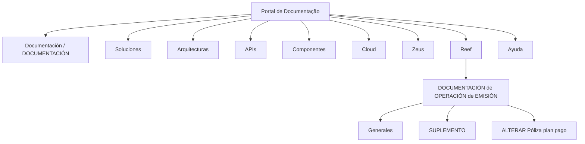

# Documentação de Operação de Emissão — Gerais, Suplemento e Alteração de Plano de Pagamento de Apólice

## 1. Metadados do Documento
- **Arquivo de Origem:** Não identificado no conteúdo fornecido
- **Tipo de Documento:** Manual Operacional
- **Domínio / Sistema:** Reef / Mapfre
- **Público-Alvo:** Operação, Negócio e equipes técnicas que consultam a documentação Reef
- **Data/Versão Identificada:** Não identificada
- **Owner Identificado:** `user:agonzalez_mapfre.com`
- **Lifecycle Identificado:** `Approved Source`

---

## 2. Resumo Executivo & Contexto de Negócio

O conteúdo fornecido identifica uma documentação de operação relacionada à **emissão**, com referências a operações gerais, suplemento e alteração de plano de pagamento de apólice. O contexto documental está associado ao sistema ou domínio denominado **Reef** e à organização ou ambiente documental **Mapfre**.

A documentação aparece em uma interface de consulta corporativa que contém categorias de navegação como Soluções, Arquiteturas, APIs, Componentes, Cloud, Documentação, Zeus, Reef e Ajuda. Essa estrutura indica que o conteúdo está inserido em um repositório de conhecimento técnico e operacional.

O estado de ciclo de vida identificado como **Approved Source** sugere que o material é uma fonte aprovada. Entretanto, o trecho não apresenta instruções operacionais detalhadas, regras de cálculo, contratos de integração, telas, campos, métodos HTTP, endpoints, ambientes ou procedimentos passo a passo.

> **Nota de Análise:** O documento menciona “ALTERAR Póliza plan pago”, mas não detalha como a alteração deve ser executada, quais validações se aplicam ou quais sistemas processam a solicitação.

---

## 3. Arquitetura, Componentes & Tecnologias Envolvidas

Os elementos explicitamente citados no conteúdo são:

- **Reef:** Sistema, domínio ou área documental citada repetidamente.
- **Mapfre:** Identificador presente em `Mapfredocument`.
- **Zeus:** Categoria disponível na navegação da interface documental.
- **Cloud:** Categoria disponível na navegação da interface documental.
- **APIs:** Categoria disponível na navegação da interface documental.
- **Arquiteturas:** Categoria disponível na navegação da interface documental.
- **Componentes:** Categoria disponível na navegação da interface documental.
- **Documentación de Operación de Emisión:** Documento operacional relacionado à emissão.
- **Suplemento:** Assunto ou operação citada no título.
- **Alterar Póliza plan pago:** Operação ou tema citado no conteúdo.



> **Nota de Análise:** O diagrama representa exclusivamente a hierarquia de navegação e os assuntos documentais identificados no trecho. O conteúdo não descreve integrações, comunicação entre sistemas, tecnologias de implementação, bancos de dados ou fluxos de dados.

---

## 4. Regras de Negócio, Especificações Funcionais & Processos

O conteúdo original não apresenta regras de negócio detalhadas, critérios de elegibilidade, etapas operacionais, condições de validação ou cálculos relacionados à emissão, suplemento ou alteração de plano de pagamento de apólice.

Os tópicos funcionais identificados são:

1. **Operação de emissão**
   - O documento é classificado como documentação de operação de emissão.
   - Não há descrição do processo de emissão, atores envolvidos, entradas, saídas ou critérios de conclusão.

2. **Suplemento**
   - O termo `SUPLEMENTO` é apresentado como tópico em destaque.
   - Não há definição funcional, fluxo de processamento, impacto em apólices ou requisitos para realização de suplemento.

3. **Alteração de plano de pagamento de apólice**
   - O conteúdo inclui o texto `ALTERAR Póliza plan pago`.
   - Não são informados os planos de pagamento permitidos, as validações obrigatórias, os efeitos financeiros, os responsáveis pela alteração ou os registros de auditoria.

4. **Aprovação da fonte documental**
   - O estado `Approved Source` indica que a fonte documental possui esse lifecycle.
   - O documento não explica o processo de aprovação, critérios de governança, responsáveis ou validade da aprovação.

---

## 5. Tabelas de Parâmetros, Ambientes e Estruturas de Dados

| Item / Parâmetro | Descrição / Função | Tipo / Valores / Formato | Ambiente / Observações |
| :--- | :--- | :--- | :--- |
| Título documental | Identifica documentação de operação relacionada à emissão. | `DOCUMENTACIÓN de OPERACIÓN de EMISIÓN` | Conteúdo apresentado como documentação corporativa. |
| Escopo geral | Referência a operações gerais. | `Generales` | Sem detalhamento adicional. |
| Suplemento | Tema ou operação citada na documentação. | `SUPLEMENTO` | Sem definição funcional adicional. |
| Alteração de plano de pagamento | Tema referente à alteração de plano de pagamento de apólice. | `ALTERAR Póliza plan pago` | Não há fluxo, regras ou campos descritos. |
| Sistema / domínio | Nome recorrente na documentação e na navegação. | `Reef` | Não há arquitetura técnica detalhada. |
| Referência organizacional | Identificador textual presente no conteúdo. | `Mapfredocument` | Não há explicação adicional. |
| Proprietário | Owner indicado na página documental. | `user:agonzalez_mapfre.com` | Identificador apresentado literalmente no conteúdo. |
| Ciclo de vida | Estado da fonte documental. | `Approved Source` | Não há descrição das etapas do lifecycle. |
| Idioma | Idioma selecionável na interface. | `ES` | O conteúdo inclui termos em espanhol e inglês. |
| Categorias de navegação | Áreas disponíveis no portal documental. | `Buscar`, `Inicio`, `Soluciones`, `Arquitecturas`, `APIs`, `Componentes`, `Cloud`, `Documentación`, `Zeus`, `Reef`, `Ayuda` | Não representam necessariamente componentes integrados. |

---

## 6. Bateria de Perguntas & Respostas para RAG (FAQ Sintético)

### P1: Qual é o objetivo identificado da documentação?
**R:** A documentação é identificada como `DOCUMENTACIÓN de OPERACIÓN de EMISIÓN` e aborda, de forma nominal, operações gerais, suplemento e alteração de plano de pagamento de apólice. O trecho fornecido não detalha procedimentos operacionais.

### P2: Qual sistema ou domínio é citado no documento?
**R:** O sistema ou domínio citado repetidamente é `Reef`. O conteúdo também apresenta a referência textual `Mapfredocument`, mas não explica a relação técnica ou organizacional entre Mapfre e Reef.

### P3: O documento descreve como alterar o plano de pagamento de uma apólice?
**R:** Não. O documento apresenta apenas o tópico `ALTERAR Póliza plan pago`. Não são fornecidos passos, permissões, validações, telas, campos, regras financeiras ou integrações para executar a alteração.

### P4: Quais assuntos operacionais são mencionados?
**R:** Os assuntos operacionais mencionados são emissão, gerais, suplemento e alteração de plano de pagamento de apólice. O conteúdo não fornece detalhamento funcional adicional para esses assuntos.

### P5: Quem é o owner identificado da documentação?
**R:** O owner indicado no conteúdo é `user:agonzalez_mapfre.com`.

### P6: Qual é o lifecycle ou status da fonte documental?
**R:** O lifecycle exibido é `Approved Source`. O trecho não especifica quais controles, aprovações ou versões levaram a esse estado.

### P7: Existem APIs, endpoints ou contratos JSON documentados?
**R:** Não. A palavra `APIs` aparece como uma categoria de navegação do portal, mas o conteúdo não apresenta endpoints, métodos HTTP, autenticação, payloads, contratos JSON ou códigos de resposta.

### P8: Existem ambientes, URLs ou servidores especificados?
**R:** Não. O conteúdo não informa URLs, nomes de ambientes, servidores, portas, variáveis de configuração ou caminhos de log.

### P9: O documento define o conceito de suplemento?
**R:** Não. `SUPLEMENTO` é exibido como um tópico, porém não há definição de negócio, critérios de aplicação ou processo operacional associado.

### P10: Quais áreas estão disponíveis na navegação da interface documental?
**R:** A interface apresenta as categorias `Buscar`, `Inicio`, `Soluciones`, `Arquitecturas`, `APIs`, `Componentes`, `Cloud`, `Documentación`, `Zeus`, `Reef` e `Ayuda`.

---

## 7. Glossário de Termos, Siglas & Conceitos-Chave

- **Reef:** Nome de sistema, domínio ou área de documentação citado no conteúdo. O trecho não apresenta expansão da sigla ou definição técnica.
- **Mapfredocument:** Identificador textual presente na documentação. Não há detalhamento sobre seu significado.
- **Approved Source:** Estado de lifecycle apresentado para a fonte documental.
- **Owner:** Campo que identifica o responsável ou proprietário associado à documentação.
- **Emisión:** Termo em espanhol associado ao contexto operacional de emissão.
- **Suplemento:** Tópico apresentado no documento sem definição funcional adicional.
- **Póliza:** Termo em espanhol citado no contexto de alteração de plano de pagamento.
- **Plan pago:** Termo em espanhol relacionado ao plano de pagamento de uma apólice.
- **APIs:** Categoria de navegação exibida no portal; o conteúdo não documenta interfaces específicas.
- **Cloud:** Categoria de navegação exibida no portal; o conteúdo não descreve serviços ou arquitetura de nuvem.
- **Zeus:** Categoria de navegação exibida no portal; o conteúdo não define o sistema ou conceito.

---

## 8. Notas Críticas, Riscos & Limitações

- O conteúdo é um trecho de índice ou página documental e não contém o corpo detalhado do procedimento de emissão.
- Não há instruções para execução de suplemento ou alteração de plano de pagamento de apólice.
- Não foram identificados contratos de API, endpoints, mensagens, eventos, integrações ou fluxos técnicos.
- Não foram identificados parâmetros de negócio, regras de validação, matrizes de permissão, logs, URLs, ambientes, servidores ou versões.
- A classificação `Approved Source` está presente, mas o trecho não apresenta versionamento, data de aprovação ou período de vigência.
- Os termos `Reef`, `Zeus` e `Mapfredocument` são citados sem definições suficientes para estabelecer relações arquiteturais além da navegação documental.

---

## 9. Conteúdo Bruto Estruturado (Referência Fiel)

```text
--- [PÁGINA 1 DE 1] ---

DOCUMENTACIÓN de OPERACIÓN de EMISIÓN (Generales) -
SUPLEMENTO
OPERACIONES
ALTERAR Póliza plan pago
Documentation / DOCUMENTACIÓN Reef
DOCUMENTACIÓN Reef
Mapfredocument
DOCUMENTACIÓN Reef
Owner
user:agonzalez_mapfre.com
Lifecycle
Approved Source
 /
 VL
Buscar Inicio Soluciones Arquitecturas APIs Componentes Cloud Documentación Zeus Reef Ayuda
ES
```
