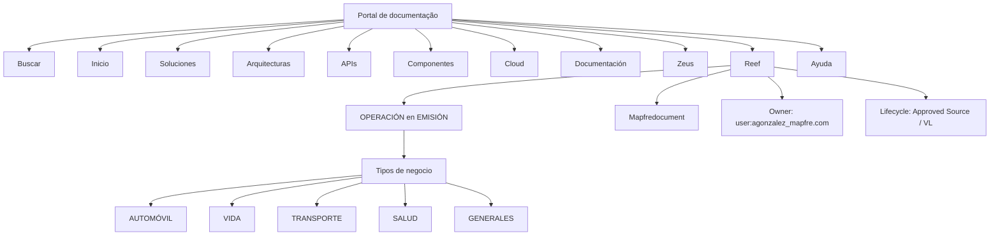

# Operación en Emisión — Documentación Reef

## 1. Metadados do Documento
- **Arquivo de Origem:** Não identificado
- **Tipo de Documento:** Procedimento / Documentação operacional
- **Domínio / Sistema:** Reef; Mapfredocument; emissão
- **Público-Alvo:** Operação e usuários de documentação corporativa
- **Data/Versão Identificada:** Não identificada

---

## 2. Resumo Executivo & Contexto de Negócio

O documento apresenta uma referência de documentação voltada à **operação em emissão** e ao respectivo **tipo de negócio**. O conteúdo posiciona o sistema ou domínio **Reef** como uma área documental acessível por meio de uma navegação corporativa.

Os tipos de negócio explicitamente listados são **Automóvel**, **Vida**, **Transporte**, **Saúde** e **Gerais**. O trecho não descreve processos operacionais específicos, regras de emissão, cálculos, integrações nem critérios de elegibilidade para esses tipos de negócio.

A referência inclui os nomes **Documentation / DOCUMENTACIÓN Reef**, **Mapfredocument** e **DOCUMENTACIÓN Reef**, indicando a presença de um repositório ou portal documental associado a Reef. A navegação disponível inclui as áreas Buscar, Início, Soluções, Arquiteturas, APIs, Componentes, Cloud, Documentação, Zeus, Reef e Ajuda.

O artefato identifica um proprietário, `user:agonzalez_mapfre.com`, e registra o ciclo de vida como **Approved Source / VL**. Não há detalhamento adicional sobre o significado de `VL`, a estrutura de aprovação, responsabilidades operacionais ou políticas de gestão documental.

---

## 3. Arquitetura, Componentes & Tecnologias Envolvidas

Os elementos identificados no conteúdo são:

- **Reef:** domínio ou área de documentação mencionada no título e na navegação.
- **Mapfredocument:** nome exibido no contexto de documentação.
- **Documentation / DOCUMENTACIÓN Reef:** identificação textual do repositório ou seção documental.
- **Zeus:** área disponível na navegação corporativa, sem relação funcional detalhada com Reef.
- **Owner:** `user:agonzalez_mapfre.com`.
- **Lifecycle:** `Approved Source / VL`.
- **Idioma exibido:** `ES`.

> **Nota de Análise:** O conteúdo não descreve arquitetura de software, microsserviços, APIs, bancos de dados, protocolos, tecnologias, ambientes, URLs ou fluxos de integração. O diagrama abaixo representa somente as relações de navegação e classificação explicitamente visíveis.



---

## 4. Regras de Negócio, Especificações Funcionais & Processos

O conteúdo estabelece os seguintes elementos de classificação para a documentação orientada à operação em emissão:

1. A documentação é orientada à **operação** e ao **tipo de negócio**.
2. Os tipos de negócio listados são:
   - Automóvel.
   - Vida.
   - Transporte.
   - Saúde.
   - Gerais.
3. A documentação está associada à referência **Reef**.
4. O ciclo de vida apresentado é **Approved Source / VL**.
5. O proprietário identificado é `user:agonzalez_mapfre.com`.
6. A interface ou contexto de navegação está configurado para o idioma **ES**.

> **Nota de Análise:** O documento não especifica regras de emissão, etapas operacionais, responsabilidades por tipo de negócio, validações, critérios de aprovação, exceções, contratos de API ou formatos de dados.

---

## 5. Tabelas de Parâmetros, Ambientes e Estruturas de Dados

| Item / Parâmetro | Descrição / Função | Tipo / Valores / Formato | Ambiente / Observações |
| :--- | :--- | :--- | :--- |
| Operación en Emisión | Tema principal da documentação apresentada | Texto | Descrito como documentação orientada à operação e ao tipo de negócio |
| Tipos de Negocio | Classificação de negócio exibida | Automóvil; Vida; Transporte; Salud; Generales | Não há detalhamento funcional para cada categoria |
| Reef | Área, domínio ou referência documental | Texto | Citado em “Documentation / DOCUMENTACIÓN Reef” e na navegação |
| Mapfredocument | Nome exibido no contexto documental | Texto | Relação funcional com Reef não detalhada |
| Owner | Proprietário do conteúdo | `user:agonzalez_mapfre.com` | Não são descritas responsabilidades do proprietário |
| Lifecycle | Estado ou classificação do ciclo de vida | `Approved Source / VL` | O significado de `VL` não é informado |
| Idioma | Idioma exibido na interface | `ES` | Sem especificação adicional |
| Navegação | Opções de navegação disponíveis | Buscar, Inicio, Soluciones, Arquitecturas, APIs, Componentes, Cloud, Documentación, Zeus, Reef, Ayuda | Não há URLs ou permissões associadas |

---

## 6. Bateria de Perguntas & Respostas para RAG (FAQ Sintético)

### P1: Qual é o tema principal da documentação Reef apresentada?
**R:** O tema principal é **OPERACIÓN en EMISIÓN**. O texto informa que a documentação é orientada à operação e ao tipo de negócio.

### P2: Quais tipos de negócio são listados na documentação de operação em emissão?
**R:** A documentação lista cinco tipos de negócio: **AUTOMÓVIL**, **VIDA**, **TRANSPORTE**, **SALUD** e **GENERALES**.

### P3: O documento detalha o processo operacional de emissão para Automóvel?
**R:** Não. O documento apenas lista **AUTOMÓVIL** como um tipo de negócio. Não há etapas, regras, validações ou procedimentos específicos de emissão para Automóvel.

### P4: O documento descreve integrações, APIs ou microsserviços do domínio Reef?
**R:** Não. Embora a navegação contenha a opção **APIs**, o conteúdo não apresenta APIs, contratos, métodos HTTP, integrações, microsserviços ou tecnologias associadas ao Reef.

### P5: Quem é o proprietário identificado na documentação?
**R:** O campo **Owner** identifica `user:agonzalez_mapfre.com`. O documento não descreve atribuições, equipe responsável ou fluxo de contato desse proprietário.

### P6: Qual é o ciclo de vida indicado para o conteúdo?
**R:** O campo **Lifecycle** apresenta o valor **Approved Source / VL**. O texto não explica o significado de `VL` nem os critérios que definem esse estado.

### P7: Quais opções de navegação estão disponíveis no portal exibido?
**R:** As opções exibidas são: **Buscar**, **Inicio**, **Soluciones**, **Arquitecturas**, **APIs**, **Componentes**, **Cloud**, **Documentación**, **Zeus**, **Reef** e **Ayuda**.

### P8: Em qual idioma a interface documental é apresentada?
**R:** A interface apresenta o indicador **ES**, que é o único código de idioma explicitamente exibido no conteúdo.

### P9: Existe uma URL, servidor ou ambiente de execução associado ao Reef?
**R:** Não. O conteúdo não fornece URLs, nomes de servidores, portas, ambientes de desenvolvimento, homologação ou produção.

### P10: Qual é a relação entre Mapfredocument e Reef?
**R:** O documento exibe os termos **Mapfredocument** e **DOCUMENTACIÓN Reef**, mas não explica tecnicamente ou funcionalmente a relação entre eles.

---

## 7. Glossário de Termos, Siglas & Conceitos-Chave

- **APIs:** Item de navegação exibido no portal; o documento não expande a sigla nem descreve interfaces de programação.
- **Approved Source:** Valor parcial exibido no campo Lifecycle; o documento não define o termo.
- **Cloud:** Item de navegação exibido no portal; sem detalhamento no conteúdo.
- **DOCUMENTACIÓN Reef:** Referência textual à documentação associada a Reef.
- **ES:** Código de idioma exibido na interface; o documento não fornece definição textual adicional.
- **Lifecycle:** Campo que apresenta o estado `Approved Source / VL`.
- **Mapfredocument:** Nome exibido no contexto de documentação; sem definição adicional.
- **Reef:** Domínio, área ou referência documental associada à operação em emissão.
- **VL:** Sigla exibida junto de `Approved Source`; significado não identificado no texto.
- **Zeus:** Item de navegação exibido no portal; sem definição adicional.

---

## 8. Notas Críticas, Riscos & Limitações

- O conteúdo fornecido é extremamente resumido e não contém detalhamento técnico, operacional ou funcional suficiente para definir procedimentos de emissão.
- Não foram identificados URLs, credenciais, ambientes, servidores, componentes de infraestrutura, tecnologias, APIs, contratos de dados ou mecanismos de integração.
- Não há regras de negócio específicas para Automóvel, Vida, Transporte, Saúde ou Gerais.
- O significado de **VL**, a finalidade de **Mapfredocument** e a relação funcional entre **Zeus** e **Reef** não são descritos.
- A classificação **Approved Source / VL** é apresentada sem critérios de aprovação, histórico de versões ou evidência de governança documental.
- O proprietário `user:agonzalez_mapfre.com` é identificado, mas o documento não informa responsabilidades, equipe, canal de suporte ou matriz de escalonamento.

---

## 9. Conteúdo Bruto Estruturado (Referência Fiel)

```text
--- [PÁGINA 1 DE 1] ---

OPERACIÓN en EMISIÓN
 Documentación orientada a la operación y tipo de negocio.
TIPOS DE NEGOCIO
 AUTOMÓVIL
  VIDA
  TRANSPORTE
 SALUD
  GENERALES
Documentation / DOCUMENTACIÓN Reef
DOCUMENTACIÓN Reef
Mapfredocument
DOCUMENTACIÓN Reef
Owner
user:agonzalez_mapfre.com
Lifecycle
Approved Source
 / 
 VL
Buscar Inicio Soluciones Arquitecturas APIs Componentes Cloud Documentación Zeus Reef Ayuda
ES
```
