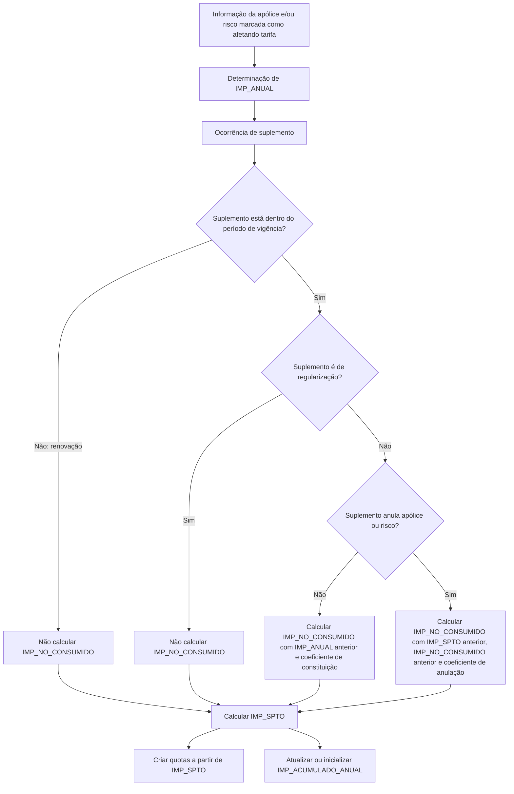

# Conceitos de Desglose — Informação Econômica de Apólice/Risco no Reef.core

## 1. Metadados do Documento
- **Arquivo de Origem:** `Não identificado no conteúdo fornecido`
- **Tipo de Documento:** `Especificação Técnica`
- **Domínio / Sistema:** `Reef.core / MAPFRE — conceitos de desglose econômico de apólice e risco`
- **Público-Alvo:** `Desenvolvedores, Arquitetos, Analistas Funcionais e Operação`
- **Data/Versão Identificada:** `Não identificada`

---

## 2. Resumo Executivo & Contexto de Negócio

O documento descreve o conteúdo e o comportamento das colunas que armazenam informações econômicas associadas a uma apólice ou risco no contexto do Reef.core. A referência principal de dados é a tabela `A2100170 — CONCEPTOS DE DESGLOSE ECONÓMICO DE LA PÓLIZA`.

As colunas econômicas analisadas são `IMP_ANUAL`, `IMP_NO_CONSUMIDO`, `IMP_SPTO` e `IMP_ACUMULADO_ANUAL`. Essas colunas representam, respectivamente, o importe anual de cobertura, o importe não consumido, o importe de suplemento e o importe anual acumulado dos suplementos gerados durante a vigência.

O cálculo econômico é condicionado por informações da apólice e/ou do risco que tenham sido declaradas como relevantes para cálculo tarifário. O exemplo apresentado utiliza a idade do segurado e uma tabela de recargo por idade. Para que o Reef.core identifique mudanças em suplementos e aplique a parametrização correspondente, a informação deve estar registrada e marcada como afetando a tarifa.

O documento estabelece regras distintas para suplementos que mantêm a apólice ou risco vigente e suplementos que anulam a apólice ou risco. Também apresenta exceções: suplementos de renovação não calculam `IMP_NO_CONSUMIDO`, pois criam um novo período de vigência, e suplementos de regularização também não calculam essa coluna.

O `IMP_SPTO` é o valor utilizado posteriormente para criação de quotas. Já o `IMP_ACUMULADO_ANUAL` representa a soma dos importes de suplemento no período de vigência, com regras específicas de reinicialização para determinados movimentos, incluindo renovação.

---

## 3. Arquitetura, Componentes & Tecnologias Envolvidas

### Sistemas e componentes identificados

| Componente / Entidade | Descrição sustentada pelo documento |
| :--- | :--- |
| `Reef.core` | Sistema que calcula e interpreta os importes econômicos, reconhece mudanças em suplementos conforme parametrização e considera suplementos anulados como inexistentes. |
| `MAPFRE` | Entidade que recebe ou devolve valores econômicos, conforme o sinal dos importes. |
| `A2100170` | Tabela denominada `CONCEPTOS DE DESGLOSE ECONÓMICO DE LA PÓLIZA`. |
| Apólice | Entidade contratual que contém informações econômicas, suplementos, aplicações, riscos e períodos. |
| Risco | Entidade afetada por suplementos e usada no cálculo de importes econômicos. |
| Suplemento | Movimento que pode alterar, manter ou anular apólice ou risco. |
| Quotas | Criadas posteriormente a partir de `IMP_SPTO`. |

### Fluxo econômico extraído



> **Nota de Análise:** O documento não detalha contratos HTTP, APIs, bancos de dados além da tabela `A2100170`, tecnologias de implementação, URLs, servidores, portas ou mecanismos de persistência.

---

## 4. Regras de Negócio, Especificações Funcionais & Processos

### 4.1. Base tarifária ilustrativa: recargo por idade

O exemplo usa um conceito de desglose que aplica um recargo conforme a idade do segurado. A idade é a informação que condiciona o cálculo apresentado.

| Idade | Recargo |
| :--- | ---: |
| 15 | 150,00 |
| 16 | 160,00 |
| 17 | 170,00 |
| 18 | 180,00 |
| 19 | 365,00 |
| >= 20 | 0,00 |

### 4.2. Regra de determinação de `IMP_ANUAL`

`IMP_ANUAL` é o importe correspondente a um ano de cobertura. É o importe-base utilizado para determinar as demais colunas tratadas no documento.

- O valor é expresso com sinal:
  - Valor positivo: importe que a MAPFRE receberá.
  - Valor negativo: importe que a MAPFRE devolverá.
- `IMP_ANUAL` não participa da geração de quotas.
- O cálculo pode depender de informação do risco e/ou da apólice declarada como relevante para o cálculo.
- Qualquer informação existente na apólice e/ou risco pode participar do cálculo.
- A informação deve estar registrada e marcada como afetando a tarifa para que o Reef.core identifique se houve mudança em um suplemento e atue conforme a parametrização definida.

No exemplo apresentado, para idade de segurado igual a `15`, o `IMP_ANUAL` é `150,00` independentemente dos dias restantes de vigência nos cenários exibidos.

### 4.3. Regra de determinação de `IMP_NO_CONSUMIDO`

`IMP_NO_CONSUMIDO` é conceitualmente o importe que deve ser devolvido ou cobrado, dependendo do sinal, quando o conceito de desglose deixa de ser aplicado. O Reef.core simula a anulação do conceito de desglose.

O cálculo ocorre quando as datas do novo suplemento do risco afetado são conhecidas e antes de qualquer modificação no risco.

#### Condições de cálculo

- O cálculo ocorre quando é realizado um suplemento dentro do período de vigência.
- Uma renovação não ocorre dentro do período de vigência da apólice; a renovação cria um novo período de vigência.
- Em suplemento de renovação, `IMP_NO_CONSUMIDO` não é calculado, pois não existe importe consumido ou não consumido no novo período.
- Existe uma exceção adicional: suplementos de tipo regularização não calculam `IMP_NO_CONSUMIDO`.
- Existem duas modalidades de cálculo:
  1. Suplemento que não anula a apólice ou risco.
  2. Suplemento que anula a apólice ou risco.
- As fórmulas devem usar o último suplemento não anulado.
- Para o Reef.core, um suplemento anulado não existe.

#### Suplementos que não anulam apólice ou risco

Para suplementos que deixam a apólice ou risco vigente, o cálculo depende de:

- `IMP_ANUAL` do movimento anterior não anulado.
- Coeficiente de constituição.

```text
IMP_NO_CONSUMIDO := IMP_ANUAL × coeficiente_de_constitución
```

#### Suplementos que anulam apólice ou risco

Para suplementos que anulam a apólice ou risco, o cálculo depende de:

- `IMP_NO_CONSUMIDO` do suplemento anterior não anulado.
- `IMP_SPTO` do suplemento anterior não anulado.
- Coeficiente de anulação.

```text
IMP_NO_CONSUMIDO := (IMP_SPTO + IMP_NO_CONSUMIDO) × coeficiente_de_anulación
```

### 4.4. Regra de determinação de `IMP_SPTO`

`IMP_SPTO` representa o montante que a MAPFRE receberá ou devolverá. O valor é expresso com sinal e é o importe usado para criação posterior das quotas.

O cálculo é condicionado por:

- `IMP_ANUAL`, como valor-base de recebimento ou devolução.
- Coeficiente de constituição.
- `IMP_NO_CONSUMIDO` da situação anterior quando o movimento ocorre dentro do período de vigência.

Quando um suplemento é realizado e o conceito de desglose já existia, deve ser considerado o importe que ainda não foi consumido entre a data do suplemento atual e o vencimento. Esse importe deve ser devolvido considerando que a situação pode mudar.

```text
IMP_SPTO := IMP_ANUAL × coeficiente_de_constitución - IMP_NO_CONSUMIDO
```

### 4.5. Regra de determinação de `IMP_ACUMULADO_ANUAL`

`IMP_ACUMULADO_ANUAL` contém o importe que será obtido se todos os recibos gerados no período de vigência forem cobrados. A coluna corresponde à soma de `IMP_SPTO` de todos os suplementos gerados naquele período.

A coluna é inicializada na renovação da apólice com o importe do suplemento, isto é, com `IMP_SPTO`.

| Movimento | Fórmula |
| :--- | :--- |
| Presupuesto | `IMP_ACUMULADO_ANUAL = IMP_SPTO` |
| Declaración | `IMP_ACUMULADO_ANUAL = IMP_SPTO` |
| Nueva póliza | `IMP_ACUMULADO_ANUAL = IMP_SPTO` |
| Nueva aplicación | `IMP_ACUMULADO_ANUAL = IMP_SPTO` |
| Renovación | `IMP_ACUMULADO_ANUAL = IMP_SPTO` |
| Resto | `IMP_ACUMULADO_ANUAL = IMP_SPTO (suplemento atual) + IMP_ACUMULADO_ANUAL (suplemento anterior)` |

---

## 5. Tabelas de Parâmetros, Ambientes e Estruturas de Dados

### 5.1. Tabela `A2100170 — CONCEPTOS DE DESGLOSE ECONÓMICO DE LA PÓLIZA`

| Item / Parâmetro | Descrição / Função | Tipo / Valores / Formato | Ambiente / Observações |
| :--- | :--- | :--- | :--- |
| `COD_CIA` | Compañía | Não detalhado | Tabela `A2100170` |
| `NUM_POLIZA` | Póliza | Não detalhado | Tabela `A2100170` |
| `NUM_SPTO` | Número de suplemento | Não detalhado | Tabela `A2100170` |
| `NUM_APLI` | Número de aplicación | Não detalhado | Tabela `A2100170` |
| `NUM_SPTO_APLI` | Suplemento de la aplicación | Não detalhado | Tabela `A2100170` |
| `NUM_RIESGO` | Riesgo | Não detalhado | Tabela `A2100170` |
| `NUM_PERIODO` | Período para pólizas multianuales | Não detalhado | Tabela `A2100170` |
| `COD_COB` | Cobertura | Não detalhado | Tabela `A2100170` |
| `COD_DESGLOSE` | Concepto de desglose económico | Não detalhado | Tabela `A2100170` |
| `COD_ECO` | Concepto económico de recibo | Não detalhado | Tabela `A2100170` |
| `NUM_BLOQUE_ESTUDIO` | No se usa | Não aplicável | Tabela `A2100170` |
| `IMP_ACUMULADO_ANUAL` | Importe acumulado anual | Valor monetário com sinal conforme contexto econômico | Tabela `A2100170` |
| `IMP_SPTO` | Importe del suplemento | Valor monetário com sinal | Usado para criação de quotas |
| `IMP_NO_CONSUMIDO` | Importe no consumido | Valor monetário com sinal | Calculado em suplementos sujeitos às regras descritas |
| `IMP_ANUAL` | Importe anual | Valor monetário com sinal | Base para outros cálculos |
| `COD_RAMO` | Ramo | Não detalhado | Tabela `A2100170` |

### 5.2. Exemplos de `IMP_ANUAL` para segurado com idade 15

| Cenário | Efeito | Vencimento | Dias de vigência | `IMP_ANUAL` |
| :--- | :--- | :--- | ---: | ---: |
| 1 | 01 Enero 2023 | 01 Enero 2024 | 365 | 150,00 |
| 2 | 01 Enero 2023 | 01 Octubre 2023 | 273 | 150,00 |
| 3 | 01 Enero 2023 | 01 Julio 2023 | 181 | 150,00 |
| 4 | 01 Enero 2023 | 01 Abril 2023 | 90 | 150,00 |

### 5.3. Exemplo de `IMP_NO_CONSUMIDO` para suplementos sem anulação

**Parâmetro: Dias ano = 365**

| Suplemento | Efeito | Vencimento | Dias vigência | Coeficiente de constituição | Importe anual suplemento anterior | `IMP_NO_CONSUMIDO` |
| :--- | :--- | :--- | ---: | ---: | ---: | ---: |
| 0 | 01 Enero 2023 | 01 Enero 2024 | 365 | 1,000000000 | 0,00 | 0,00 |
| 1 | 01 Febrero 2023 | 01 Enero 2024 | 334 | 0,915068493 | 1.000,00 | 915,07 |
| 2 | 01 Marzo 2023 | 01 Enero 2024 | 306 | 0,838356164 | 1.100,00 | 922,19 |
| 4 | 01 Mayo 2023 | 01 Enero 2024 | 245 | 0,671232877 | 700,00 | 469,86 |

### 5.4. Exemplo de anulação

**Parâmetro: Dias ano = 365**

| Suplemento | Efeito | Vencimento | Dias vigência | Coeficiente de constituição | Coeficiente de anulação | `IMP_NO_CONSUMIDO` | `IMP_SPTO` |
| :--- | :--- | :--- | ---: | :--- | :--- | ---: | :--- |
| 0 | 01 Enero 2023 | 01 Enero 2024 | 365 | 1,000000000 | N.A. | 0,00 | Valor extraído como `100` no conteúdo bruto |
| 1 | 01 Febrero 2023 | 01 Enero 2024 | 334 | 0,915068493 | N.A. | 915,07 | Valor extraído como `9` no conteúdo bruto |
| 2 | 01 Marzo 2023 | 01 Enero 2024 | 306 | 0,838356164 | N.A. | 922,19 | Valor extraído como `-33` no conteúdo bruto |
| 4 | 01 Mayo 2023 | 01 Enero 2024 | 245 | 0,671232877 | N.A. | 469,86 | Valor extraído como `53` no conteúdo bruto |
| 5 | 01 Julio 2023 | 01 Enero 2024 | 184 | N.A. | 0,751020408 | 756,16 | Valor extraído como `-75` no conteúdo bruto |

> **Nota de Análise:** Alguns valores da coluna de importe de suplemento no exemplo de anulação foram truncados na extração original. O documento bruto apresenta `100`, `9`, `-33`, `53` e `-75`; não há base suficiente para reconstruir os valores completos.

### 5.5. Exemplo de `IMP_SPTO`

**Parâmetro: Dias ano = 365**

| Suplemento | Efeito | Vencimento | Dias vigência | Coeficiente de constituição | `IMP_NO_CONSUMIDO` | `IMP_SPTO` | `IMP_ANUAL` |
| :--- | :--- | :--- | ---: | ---: | ---: | ---: | ---: |
| 0 | 01 Enero 2023 | 01 Enero 2024 | 365 | 1,000000000 | 0,00 | 1000,00 | 1.000,00 |
| 1 | 01 Febrero 2023 | 01 Enero 2024 | 334 | 0,915068493 | 915,07 | 91,51 | 1.100,00 |
| 2 | 01 Marzo 2023 | 01 Enero 2024 | 306 | 0,838356164 | 922,19 | -335,34 | 700,00 |
| 4 | 01 Mayo 2023 | 01 Enero 2024 | 245 | 0,671232877 | 469,86 | 536,99 | 1.500,00 |

### 5.6. Exemplo de `IMP_ACUMULADO_ANUAL`

| Suplemento | Tipo | `IMP_SPTO` | `IMP_ACUMULADO_ANUAL` |
| :--- | :--- | ---: | ---: |
| 0 | XX | 170,00 | 170,00 |
| 1 | AD | 127,50 | 297,50 |
| 2 | AP | -85,00 | 212,50 |
| 3 | AD | 42,52 | 250,02 |
| 4 | RF | 170,00 | 170,00 |
| 5 | AP | -10,00 | 160,00 |

> **Nota de Análise:** O documento apresenta códigos de tipo de suplemento `XX`, `AD`, `AP` e `RF`, mas não fornece a expansão ou definição desses códigos.

---

## 6. Bateria de Perguntas & Respostas para RAG (FAQ Sintético)

### P1: Qual é a finalidade da tabela `A2100170` no contexto do Reef.core?
**R:** A tabela `A2100170`, denominada `CONCEPTOS DE DESGLOSE ECONÓMICO DE LA PÓLIZA`, armazena informações econômicas relacionadas à apólice e ao risco. Entre os campos apresentados estão identificadores de companhia, apólice, suplemento, aplicação, risco, período, cobertura, conceito de desglose e os importes `IMP_ANUAL`, `IMP_NO_CONSUMIDO`, `IMP_SPTO` e `IMP_ACUMULADO_ANUAL`.

### P2: O que representa a coluna `IMP_ANUAL`?
**R:** `IMP_ANUAL` representa o importe correspondente a um ano de cobertura. É o valor-base usado para calcular outras colunas econômicas. O valor é expresso com sinal: positivo quando a MAPFRE deve receber e negativo quando a MAPFRE deve devolver. A coluna não participa da geração de quotas.

### P3: Quais informações podem influenciar o cálculo de `IMP_ANUAL`?
**R:** O cálculo de `IMP_ANUAL` pode ser condicionado por informações do risco e/ou da apólice que tenham sido declaradas como relevantes para o cálculo. O documento usa a idade do segurado como exemplo. A informação deve estar registrada e marcada como afetando a tarifa para que o Reef.core identifique mudanças em suplementos e atue conforme a parametrização.

### P4: Quando o Reef.core calcula `IMP_NO_CONSUMIDO`?
**R:** O Reef.core calcula `IMP_NO_CONSUMIDO` quando ocorre um suplemento dentro do período de vigência. O cálculo é realizado quando as datas do novo suplemento do risco afetado são conhecidas e antes de qualquer modificação no risco. Renovação e suplementos de regularização são exceções que não calculam essa coluna.

### P5: Como é calculado `IMP_NO_CONSUMIDO` quando o suplemento não anula a apólice ou risco?
**R:** Para suplementos que não anulam a apólice ou risco, a fórmula usa o `IMP_ANUAL` do último movimento não anulado e o coeficiente de constituição: `IMP_NO_CONSUMIDO := IMP_ANUAL × coeficiente_de_constitución`.

### P6: Como é calculado `IMP_NO_CONSUMIDO` quando há anulação?
**R:** Para suplementos que anulam a apólice ou risco, o cálculo utiliza os valores do último suplemento não anulado: `IMP_NO_CONSUMIDO := (IMP_SPTO + IMP_NO_CONSUMIDO) × coeficiente_de_anulación`.

### P7: Por que uma renovação não gera `IMP_NO_CONSUMIDO`?
**R:** Uma renovação não é tratada como movimento dentro do período de vigência existente; ela cria um novo período de vigência da apólice. Por isso, no suplemento de renovação não existe importe consumido ou importe ainda não consumido a calcular.

### P8: Qual é a fórmula de `IMP_SPTO`?
**R:** A fórmula indicada para `IMP_SPTO` é `IMP_SPTO := IMP_ANUAL × coeficiente_de_constitución - IMP_NO_CONSUMIDO`. O resultado representa o montante que a MAPFRE receberá ou devolverá e é usado posteriormente para criar quotas.

### P9: O que acontece se um suplemento anterior foi anulado?
**R:** Um suplemento anulado não deve ser usado como referência. O documento afirma que, para o Reef.core, um suplemento anulado não existe. Portanto, as fórmulas utilizam o último suplemento não anulado.

### P10: Como `IMP_ACUMULADO_ANUAL` é atualizado em movimentos comuns?
**R:** Para movimentos classificados como “Resto”, `IMP_ACUMULADO_ANUAL` é calculado pela soma do `IMP_SPTO` do suplemento atual com o `IMP_ACUMULADO_ANUAL` do suplemento anterior.

### P11: Em quais movimentos `IMP_ACUMULADO_ANUAL` é reinicializado com `IMP_SPTO`?
**R:** O documento determina que `IMP_ACUMULADO_ANUAL = IMP_SPTO` nos movimentos de presupuesto, declaración, nueva póliza, nueva aplicación e renovación.

### P12: Qual é o significado econômico de um valor negativo em `IMP_SPTO` ou `IMP_ANUAL`?
**R:** O documento estabelece que os importes são expressos com sinal. Um valor positivo corresponde a valor que a MAPFRE receberá; um valor negativo corresponde a valor que a MAPFRE devolverá.

---

## 7. Glossário de Termos, Siglas & Conceitos-Chave

- **`A2100170`:** Tabela `CONCEPTOS DE DESGLOSE ECONÓMICO DE LA PÓLIZA`.
- **Apólice / Póliza:** Entidade contratual identificada por `NUM_POLIZA`.
- **Aplicação / Aplicación:** Entidade identificada por `NUM_APLI`.
- **Cobertura:** Entidade identificada por `COD_COB`.
- **Coeficiente de anulação / coeficiente_de_anulación:** Coeficiente usado no cálculo de `IMP_NO_CONSUMIDO` quando o suplemento anula a apólice ou risco.
- **Coeficiente de constituição / coeficiente_de_constitución:** Coeficiente usado nos cálculos de `IMP_NO_CONSUMIDO` e `IMP_SPTO`.
- **Concepto de desglose económico:** Conceito econômico identificado por `COD_DESGLOSE`.
- **Concepto económico de recibo:** Conceito identificado por `COD_ECO`.
- **MAPFRE:** Entidade que recebe ou devolve os importes, de acordo com o sinal.
- **`IMP_ACUMULADO_ANUAL`:** Soma dos importes `IMP_SPTO` dos suplementos gerados durante o período de vigência, observadas as regras de inicialização.
- **`IMP_ANUAL`:** Importe anual de cobertura e base de cálculo das demais colunas econômicas.
- **`IMP_NO_CONSUMIDO`:** Importe que deve ser devolvido ou cobrado quando um conceito de desglose deixa de ser aplicado.
- **`IMP_SPTO`:** Importe de suplemento, posteriormente utilizado para criação de quotas.
- **Reef.core:** Sistema mencionado como responsável por reconhecer mudanças, aplicar parametrizações e tratar suplementos anulados como inexistentes.
- **Riesgo / Risco:** Entidade identificada por `NUM_RIESGO` e passível de modificação por suplemento.
- **Suplemento:** Movimento identificado por `NUM_SPTO`, capaz de alterar, manter ou anular apólice ou risco.
- **Vigência:** Período entre efeito e vencimento considerado nos cálculos.

---

## 8. Notas Críticas, Riscos & Limitações

- O documento não informa tipos técnicos de dados, precisão decimal, regras de arredondamento, persistência, APIs, contratos JSON, URLs, ambientes, servidores ou integrações externas.
- O cálculo depende de informações de apólice e/ou risco estarem registradas e marcadas como relevantes para a tarifa. A ausência dessa marcação pode impedir que o Reef.core reconheça mudanças para aplicação da parametrização.
- Suplementos anulados não são considerados existentes pelo Reef.core; consultas ou cálculos devem usar o último suplemento não anulado.
- O cálculo de `IMP_NO_CONSUMIDO` possui exceções explícitas para renovação e suplementos de regularização.
- A extração de dados do exemplo de anulação contém valores truncados para a coluna apresentada como `IMPO SUPLEME`; não é possível reconstruir os valores completos sem a fonte original legível.
- Os códigos de tipo de suplemento `XX`, `AD`, `AP` e `RF` não são definidos no conteúdo fornecido.
- `NUM_BLOQUE_ESTUDIO` está explicitamente marcado como “NO SE USA”.

---

## 9. Conteúdo Bruto Estruturado (Referência Fiel)

```text
--- [PÁGINA 1 DE 7] ---

Conceptos de desglose - Información económica
Objetivo
Conocer cual es el contenido y el comportamiento de las columnas que contienen la información económica de una póliza/riesgo (marcadas
en negrita).
Modelo de datos involucrado
TABLA DESCRIPCIÓN
A2100170 CONCEPTOS DE DESGLOSE ECONÓMICO DE LA PÓLIZA
COLUMNA COMENTARIOS
COD_CIA COMPAÑÍA
NUM_POLIZA PÓLIZA
NUM_SPTO NUMERO DE SUPLEMENTO
NUM_APLI NUMERO DE APLICACIÓN
NUM_SPTO_APLI SUPLEMENTO DE LA APLICACIÓN
NUM_RIESGO RIESGO
NUM_PERIODO PERIODO (PARA PÓLIZAS MULTIANUALES)
COD_COB COBERTURA
COD_DESGLOSE CONCEPTO DE DESGLOSE ECONÓMICO
COD_ECO CONCEPTO ECONÓMICO DE RECIBO
NUM_BLOQUE_ESTUDIO NO SE USA
Documentation / DOCUMENTACIÓN Reef
DOCUMENTACIÓN Reef
Mapfredocument
DOCUMENTACIÓN Reef
Owner
user:agonzalez_mapfre.com
Lifecycle
Approved Source
 /
 VL
Buscar Inicio Soluciones Arquitecturas APIs Componentes Cloud Documentación Zeus Reef Ayuda
ES

--- [PÁGINA 2 DE 7] ---

COLUMNA COMENTARIOS
IMP_ACUMULADO_ANUAL IMPORTE ACUMULADO ANUAL
IMP_SPTO IMPORTE DEL SUPLEMENTO
IMP_NO_CONSUMIDO IMPORTE NO CONSUMIDO
IMP_ANUAL IMPORTE ANUAL
COD_RAMO RAMO
A continuación y con el n de entender mejor el sentido de las columnas que ocupan este documento, se establece unas bases para
posteriormente realizar ejemplos:
Se supone que existe un concepto de desglose que, dependiendo de la edad del asegurado aplicará un recargo. Para ello se cuenta con la
siguiente tabla que determina para cada edad el monto a aplicar:
Recargo por edad
EDAD RECARGO
15 150,00
16 160,00
17 170,00
18 180,00
19 365,00
>= 20 0,00
Columnas
Las columnas tratadas en este documento son:
IMP_ANUAL
IMP_NO_CONSUMIDO
IMP_SPTO
IMP_ACUMULADO_ANUAL
IMP_ANUAL
Importe que corresponde a un año de cobertura. Es el importe base con el que se halla el resto de columnas que intervienen en este
documento. Viene expresado con signo (positivo importe que MAPFRE recibirá, negativo importe que MAPFRE devolverá). Este importe no
interviene en la generación de cuotas.
Este importe viene condicionado por:
La información del riesgo y/o la información de la póliza que ha debido ser declarada como que afecta al cálculo (en el ejemplo es la
edad del asegurado).
Es decir, cualquier información que disponga la póliza y/o riesgo puede intervenir en el modo en el que se halla esta columna. Es
importante que la información esté registrada y marcada como que afecta a la tarifa para que Reef.core, en caso de suplemento pueda
conocer que hubo o no cambio y así actuar según la parametrización marcada.

--- [PÁGINA 3 DE 7] ---

Ejemplo
La información por la que viene condicionado el cálculo es:
EDAD DEL ASEGURADO
15
Con esta información, se muestran varios escenarios:
ESCENARIO EFECTO VENCIMIENTO DÍAS DE VIGENCIA IMP_ANUAL
1 01 Enero 2023 01 Enero 2024 365 150,00
2 01 Enero 2023 01 Octubre 2023 273 150,00
3 01 Enero 2023 01 Julio 2023 181 150,00
4 01 Enero 2023 01 Abril 2023 90 150,00
IMP_NO_CONSUMIDO
Conceptualmente es el importe que habría que devolver o cobrar (depende del signo), en caso que el concepto de desglose deje de aplicarse.
Es decir, Reef.core simula la anulación del concepto de desglose.
Este cálculo se realiza en el momento que se conocen las fechas del nuevo suplemento del riesgo afectado y previo a realizar cualquier
modicación sobre este.
Riesgo
seleccionado
Efecto
del
riesgo
establecido
Importe
no
consumido
hallado
Modificación
de
riesgo
Fin
Este importe se calcula siempre que se realiza un suplemento, y el suplemento se encuentra dentro del periodo de vigencia. Por ejemplo, una
renovación no se realiza dentro del periodo de vigencia de la póliza, sino que está creando un nuevo periodo de vigencia. Es por lo que en un
suplemento de renovación no se halla esta columna, ya que no hay ni consumido, ni sin consumir.
Existe una excepción a la regla anterior y aplica a los suplementos de tipo de regularización, que no calcula esta columna.
Hay dos formas de hallar este importe:
1. El suplemento implica la anulación de la póliza/riesgo
2. El suplemento dejará la póliza o el riesgo vigente
Dependiendo del modo en el que la póliza/riesgo quedará, esta columna viene condicionada por:
Para suplementos que NO anulan la póliza/riesgo:
- El importe anual (columna IMP_ANUAL) del movimiento anterior (no anulado 1)
- El llamado coeciente de constitución
Se aplica la fórmula siguiente sobre el último suplemento no anulado:
Ejemplo
Para este ejemplo se va a tomar una supuesta póliza que ha sufrido una serie de modicaciones a lo largo del tiempo y el objetivo es
hallar el importe no consumido. Hay que recordar que como se ha comentado previamente, este importe se halla nada más conocer las
fechas del movimiento:
1
imp_no_consumido := IMP_ANUAL * coeficiente_de_constitución

--- [PÁGINA 4 DE 7] ---

PARÁMETRO DÍAS AÑO
365
SUPLEMENTO EFECTO VENCIMIENTO DÍAS
VIGENCIA
COEFICIENTE
DE
CONSTITUCIÓN
IMPORTE
ANUAL
SUPLEMENTO
ANTERIOR
IMPORTE
NO
CONSUMIDO
0 01 Enero 2023 01 Enero 2024 365 1,000000000 0,00 0,00
1 01 Febrero 2023 01 Enero 2024 334 0,915068493 1.000,00 915,07
2 01 Marzo 2023 01 Enero 2024 306 0,838356164 1.100,00 922,19
4 01 Mayo 2023 01 Enero 2024 245 0,671232877 700,00 469,86
Para suplementos que SI anulan la póliza/riesgo:
- El importe no consumido (columna IMP_NO_CONSUMIDO) del suplemento anterior (no anulado 1)
- El importe del suplemento (columna IMP_SPTO) del suplemento anterior (no anulado 1)
- El llamado coeciente de anulación
Se aplica la fórmula siguiente sobre el último suplemento no anulado:
Ejemplo
Para este ejemplo se va a tomar la misma póliza que en el ejemplo anterior y se va a simular un suplemento que anula la póliza. En este caso
el suplemento de anulación es el último mostrado en la tabla
PARÁMETRO DÍAS AÑO
365
SUPLEMENTO EFECTO VENCIMIENTO DÍAS
DE
VIGENCIA
COEFICIENTE
DE
CONSTITUCIÓN
COEFICIENTE
DE
ANULACIÓN
IMPORTE
NO
CONSUMIDO
IMPO
SUPLEME
0 01
Enero
2023
01 Enero 2024 365 1,000000000 N.A. 0,00 100
1 01
Febrero
2023
01 Enero 2024 334 0,915068493 N.A. 915,07 9
2 01
Marzo
2023
01 Enero 2024 306 0,838356164 N.A. 922,19 -33
1
imp_no_consumido := (IMP_SPTO + IMP_NO_CONSUMIDO) * coeficiente_de_anulación

--- [PÁGINA 5 DE 7] ---

SUPLEMENTO EFECTO VENCIMIENTO DÍAS
DE
VIGENCIA
COEFICIENTE
DE
CONSTITUCIÓN
COEFICIENTE
DE
ANULACIÓN
IMPORTE
NO
CONSUMIDO
IMPO
SUPLEME
4 01
Mayo
2023
01 Enero 2024 245 0,671232877 N.A. 469,86 53
5 01 Julio
2023
01 Enero 2024 184 N.A. 0,751020408 756,16 -75
IMP_SPTO
Monto a recibir o a devolver (el importe se expresa con signo) por parte de MAPFRE. Con este importe es con el que se crean posteriormente
las cuotas.
Este importe viene condicionado por:
El importe anual (columna IMP_ANUAL), que como se comentó es la base para determinar el valor a recibir o devolver
El llamado coeciente de constitución
En caso de movimiento dentro del periodo de vigencia, el importe no consumido (columna IMP_NO_CONSUMIDO) de la situación anterior
Es decir, si se realiza un suplemento y el concepto de desglose existía, hay que considerar cuanto importe no se ha consumido desde la
fecha del suplemento que se está realizando hasta el vencimiento, ya que este importe ha de ser devuelto teniendo en cuenta que la
situación puede cambiar
La fórmula que aplica para esta columna es:
Ejemplo
Este ejemplo simula una póliza que tiene varios suplementos a lo largo del tiempo
PARÁMETRO DÍAS AÑO
365
SUPLEMENTO EFECTO VENCIMIENTO DÍAS
DE
VIGENCIA
COEFICIENTE
DE
CONSTITUCIÓN
IMPORTE
NO
CONSUMIDO
IMPORTE
SUPLEMENTO
IMPORTE
ANUAL
0 01
Enero
2023
01 Enero 2024 365 1,000000000 0,00 1000,00 1.000,00
1 01
Febrero
2023
01 Enero 2024 334 0,915068493 915,07 91,51 1.100,00
2 01
Marzo
2023
01 Enero 2024 306 0,838356164 922,19 -335,34 700,00
1
imp_spto := IMP_ANUAL * coeficiente_de_constitución - IMP_NO_CONSUMIDO

--- [PÁGINA 6 DE 7] ---

SUPLEMENTO EFECTO VENCIMIENTO DÍAS
DE
VIGENCIA
COEFICIENTE
DE
CONSTITUCIÓN
IMPORTE
NO
CONSUMIDO
IMPORTE
SUPLEMENTO
IMPORTE
ANUAL
4 01
Mayo
2023
01 Enero 2024 245 0,671232877 469,86 536,99 1.500,00
IMP_ACUMULADO_ANUAL
Contiene el importe que se obtendrá si se cobran todos los recibos generados en el periodo de vigencia. Es decir, contiene la suma de la
columna IMP_SPTO de todos los suplementos generados en el periodo de vigencia. Esta columna se inicializa en la renovación de la póliza
con el importe del suplemento (columna IMP_SPTO)
Para cada suplemento que se realiza, esta columna se halla de la forma:
MOVIMIENTO FÓRMULA
Presupuesto IMP_ACUMULADO_ANUAL = IMP_SPTO
Declaración IMP_ACUMULADO_ANUAL = IMP_SPTO
Nueva póliza IMP_ACUMULADO_ANUAL = IMP_SPTO
Nueva aplicación IMP_ACUMULADO_ANUAL = IMP_SPTO
Renovación IMP_ACUMULADO_ANUAL = IMP_SPTO
Resto IMP_ACUMULADO_ANUAL = IMP_SPTO (suplemento actual) + IMP_ACUMULADO_ANUAL (suplemento anterior)
Ejemplo
A continuación se muestra los importes de suplemento que se han generado en un periodo de vigencia para una póliza:
SUPLEMENTO TIPO IMP_SPTO
0 XX 170,00
1 AD 127,50
2 AP -85,00
3 AD 42,52
4 RF 170,00
5 AP -10,00
Ahora se muestra el contenido de la columna IMP_ACUMULADO_ANUAL
SUPLEMENTO IMP_SPTO IMP_ACUMULADO_ANUAL
0 170,00 170,00
1 127,50 297,50

--- [PÁGINA 7 DE 7] ---

SUPLEMENTO IMP_SPTO IMP_ACUMULADO_ANUAL
2 -85,00 212,50
3 42,52 250,02
4 170,00 170,00
5 -10,00 160,00
1. Se reere a un suplemento que no haya sido anulado, ya que un suplemento anulado, para Reef.core no existe
Checking links...
```
