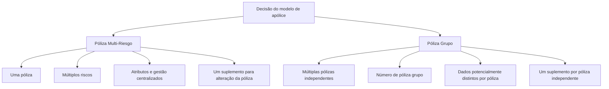

# Comparativo Funcional: Póliza Multi-Riesgo versus Póliza Grupo

## 1. Metadados do Documento
- **Arquivo de Origem:** Não identificado no conteúdo fornecido
- **Tipo de Documento:** Especificação Funcional
- **Domínio / Sistema:** Seguros — comparação entre póliza multi-riesgo e póliza grupo; documentação Reef / Mapfredocument
- **Público-Alvo:** Negócio, analistas funcionais, desenvolvedores, arquitetos e operação
- **Data/Versão Identificada:** Não identificada

---

## 2. Resumo Executivo & Contexto de Negócio

O documento compara as características operacionais de uma **póliza multi-riesgo** e de uma **póliza grupo**, com o objetivo declarado de apoiar a decisão quando não está claro qual modelo deve ser adotado. A comparação aborda a estrutura de apólices, riscos, vencimentos, moeda, câmbio, cobrança, resseguro, cosseguro, tomador, terceiros, cláusulas, comissões e suplementos.

A póliza multi-riesgo é apresentada como uma única póliza que pode conter múltiplos riscos. Essa estrutura centraliza atributos e informações de gestão, como número de apólice, moeda, tipo de câmbio, plano de pagamento, gestor de cobrança, textos anexos, cláusulas, tomador e valores de atributos.

A póliza grupo é apresentada como um agrupamento de múltiplas apólices independentes, com um número de póliza grupo. Por serem independentes, as apólices do grupo podem possuir dados próprios, como vencimentos, moedas, tipos de câmbio, planos de pagamento, resseguro, cosseguro, tomadores, terceiros, atributos, gestores, textos, cláusulas e comissões, caso não existam controles adequados para uniformizá-los.

O documento destaca uma complexidade relevante da póliza grupo para cálculos que afetem a apólice como um todo, mas não os riscos. Nessa modalidade, um valor precisa ser atribuído a uma das apólices independentes do grupo; caso essa apólice deixe o grupo, o valor deve ser reassociado a outra apólice integrante.

Também existe uma diferença operacional na realização de suplementos. Alterações em informações de uma póliza multi-riesgo podem ser realizadas com um único suplemento, enquanto uma póliza grupo requer um suplemento para cada apólice independente que compõe o grupo.

---

## 3. Arquitetura, Componentes & Tecnologias Envolvidas

O conteúdo não descreve arquitetura técnica de software, APIs, bancos de dados, ambientes, microsserviços, protocolos ou tecnologias de implementação. A estrutura funcional documentada relaciona dois modelos de apólice:

- **Póliza multi-riesgo:** uma apólice com múltiplos riscos.
- **Póliza grupo:** múltiplas apólices independentes agrupadas sob um número de póliza grupo.
- **Risco:** elemento segurado que pode compor uma apólice.
- **Suplemento / endosso:** mecanismo utilizado para modificar informações de apólice.
- **Documentação Reef / Mapfredocument:** referências visíveis no conteúdo de origem.



> **Nota de Análise:** O documento não detalha componentes técnicos, contratos de integração, métodos HTTP, esquemas de dados, URLs, servidores ou mecanismos de persistência.

---

## 4. Regras de Negócio, Especificações Funcionais & Processos

### Estrutura de identificação

- A póliza multi-riesgo possui **um número de póliza**.
- A póliza grupo possui **múltiplos números de póliza** e **um número de póliza grupo**.

### Vencimento da póliza

- Na póliza multi-riesgo, existe vencimento unificado para cada risco; o vencimento considerado é o da própria póliza.
- Na póliza grupo, como as apólices são independentes, cada apólice pode ter vencimento distinto.
- O documento indica que os vencimentos da póliza grupo podem ser unificados por definição.

### Moeda e tipo de câmbio

- A póliza multi-riesgo opera com uma póliza, uma moeda e um tipo de câmbio.
- A póliza grupo pode permitir múltiplas moedas e múltiplos tipos de câmbio, pois é formada por múltiplas apólices.
- A coexistência de múltiplas moedas e câmbios é apresentada como consequência possível quando não houver controle adequado.

### Plano de pagamento e recibos

- A póliza multi-riesgo possui um plano de pagamento.
- A póliza grupo pode permitir múltiplos planos de pagamento se não houver controle adequado.
- A póliza multi-riesgo gera um recibo por apólice.
- Na póliza grupo, existe um recibo por apólice independente; consequentemente, a quantidade de recibos corresponde à quantidade de apólices que formam o grupo.

### Resseguro, cosseguro e participantes

- A póliza multi-riesgo possui um tipo de resseguro e um tipo de cosseguro.
- A póliza grupo pode conter múltiplos tipos de resseguro e cosseguro.
- A póliza multi-riesgo possui um tomador.
- A póliza grupo pode conter múltiplos tomadores se não houver controle adequado.
- Para intervenções de cliente:
  - A póliza multi-riesgo possui os mesmos terceiros para cada intervenção.
  - A póliza grupo pode ter múltiplos terceiros em cada intervenção, caso não haja controle adequado.

### Atributos, cobrança e conteúdo documental

- A póliza multi-riesgo possui valores únicos para atributos de apólice.
- A póliza grupo pode possuir múltiplos valores de atributos se não houver controle adequado.
- A póliza multi-riesgo possui um gestor de cobrança.
- A póliza grupo pode ter múltiplos gestores de cobrança se não houver controle adequado.
- A póliza multi-riesgo possui um texto anexo e cláusulas de apólice.
- A póliza grupo pode possuir múltiplos textos anexos e múltiplas cláusulas.

### Comissões

- Na póliza multi-riesgo, as comissões afetam a apólice conforme a definição aplicável.
- Na póliza grupo, cada apólice independente pode ter uma comissão diferente se não houver controle adequado.

### Importes que afetam a póliza

- Na póliza multi-riesgo, cálculos que afetam a apólice, mas não os riscos, podem ser realizados sem problema.
- Na póliza grupo, cálculos que afetam a apólice, mas não os riscos das apólices independentes, são descritos como muito complexos.
- A complexidade ocorre porque o importe deve ser atribuído a uma das apólices integrantes.
- Se a apólice à qual o importe foi atribuído sair do grupo, o importe deverá ser atribuído a outra apólice do grupo.

### Riscos da póliza

- A póliza multi-riesgo possui múltiplos riscos em uma única apólice.
- A póliza grupo pode conter:
  - Uma apólice independente com um risco.
  - Outras apólices independentes com múltiplos riscos, caso a definição permita.

### Ordem na comunicação de modificações

- Na póliza multi-riesgo, uma comunicação recebida fora da ordem adequada pode complicar a operação.
- O documento informa que essa situação pode exigir a anulação de suplementos em alguns casos.
- O impacto pode ser minimizado com o modelo de um risco por apólice, no qual é realizado um suplemento por risco.
- Na póliza grupo, a comunicação de modificações em ordens distintas pode não afetar o mesmo risco, pois existem múltiplas apólices.

### Suplementos ou endossos

- Na póliza multi-riesgo, um suplemento permite modificar a informação da apólice ou a apólice completa.
- Os exemplos de alterações citados são:
  - Mudança de plano de pagamento.
  - Mudança de agente.
  - Mudança de tomador.
  - Mudança em atributos de apólice.
  - Anulação.
  - Reabilitação.
  - Renovação.
- Na póliza grupo, esses casos exigem um suplemento para cada apólice independente que integra o grupo.

---

## 5. Tabelas de Parâmetros, Ambientes e Estruturas de Dados

| Item / Parâmetro | Descrição / Função | Tipo / Valores / Formato | Ambiente / Observações |
| :--- | :--- | :--- | :--- |
| Número de póliza | Identifica uma apólice | Multi-riesgo: um número; grupo: múltiplos números | A póliza grupo também possui um número de póliza grupo |
| Número de póliza grupo | Identifica o agrupamento de apólices independentes | Um número de grupo | Aplicável à póliza grupo |
| Vencimento | Define o vencimento da apólice ou dos riscos | Multi-riesgo: unificado; grupo: pode ser distinto por apólice | No grupo, pode ser unificado por definição |
| Moeda | Moeda aplicável à apólice | Multi-riesgo: uma moeda; grupo: múltiplas moedas possíveis | Na póliza grupo, múltiplas moedas podem existir sem controle adequado |
| Tipo de câmbio | Tipo de câmbio associado à apólice | Multi-riesgo: um tipo; grupo: múltiplos tipos possíveis | Decorre da existência de múltiplas apólices independentes |
| Plano de pagamento | Plano aplicável à cobrança da apólice | Multi-riesgo: um plano; grupo: múltiplos planos possíveis | Na póliza grupo, depende de controle adequado |
| Recibo | Documento de cobrança associado à apólice | Um recibo por apólice | Em póliza grupo, há tantos recibos quanto apólices independentes |
| Tipo de resseguro | Tipo de resseguro associado à apólice | Multi-riesgo: um tipo; grupo: múltiplos tipos | A póliza grupo pode ter tipos distintos por apólice |
| Cosseguro | Tipo de cosseguro associado à apólice | Multi-riesgo: um tipo; grupo: múltiplos tipos possíveis | Na póliza grupo, depende de controle adequado |
| Tomador | Parte tomadora da apólice | Multi-riesgo: um tomador; grupo: múltiplos tomadores possíveis | Na póliza grupo, depende de controle adequado |
| Terceiros em intervenções de cliente | Participantes associados às intervenções | Multi-riesgo: mesmos terceiros; grupo: múltiplos terceiros possíveis | Na póliza grupo, pode variar por intervenção |
| Atributos de póliza | Valores de atributos associados à apólice | Multi-riesgo: valores únicos; grupo: múltiplos valores possíveis | Na póliza grupo, depende de controle adequado |
| Gestor de cobrança | Responsável pela gestão de cobrança | Multi-riesgo: um gestor; grupo: múltiplos gestores possíveis | Na póliza grupo, depende de controle adequado |
| Textos anexos | Textos associados à apólice | Multi-riesgo: um texto; grupo: múltiplos textos | O documento não detalha formato ou gestão dos textos |
| Cláusulas de apólice | Cláusulas aplicáveis à apólice | Multi-riesgo: cláusulas únicas; grupo: múltiplas cláusulas possíveis | Na póliza grupo, depende de controle adequado |
| Comissões | Comissões aplicáveis às apólices | Multi-riesgo: afetam a apólice conforme definição; grupo: podem variar por apólice | O documento alerta para comissões distintas em apólices independentes |
| Importes que afetam a póliza | Cálculos que atingem a apólice e não os riscos | Multi-riesgo: realizado sem problema; grupo: operação muito complexa | Na póliza grupo, o importe deve ser atribuído e eventualmente reassociado |
| Riscos | Elementos segurados contidos nas apólices | Multi-riesgo: múltiplos riscos em uma apólice | Grupo: uma ou múltiplas ocorrências por apólice independente, conforme definição |
| Suplemento / endosso | Alteração de informação da apólice | Multi-riesgo: um suplemento; grupo: um suplemento por apólice independente | Aplicável a mudança de plano, agente, tomador, atributos, anulação, reabilitação e renovação |
| Ordem de comunicação de modificações | Sequência em que alterações são comunicadas | Multi-riesgo: ordem inadequada pode exigir anulação de suplementos | Grupo: ordens distintas podem não afetar o mesmo risco |

---

## 6. Bateria de Perguntas & Respostas para RAG (FAQ Sintético)

### P1: Qual é a principal diferença estrutural entre uma póliza multi-riesgo e uma póliza grupo?
**R:** A póliza multi-riesgo é uma única apólice que pode conter múltiplos riscos. A póliza grupo é formada por múltiplas apólices independentes e possui um número de póliza grupo, além dos números individuais das apólices integrantes.

### P2: Como funciona o vencimento em uma póliza multi-riesgo?
**R:** Na póliza multi-riesgo, o vencimento de cada risco é unificado, sendo considerado o vencimento da própria apólice.

### P3: As apólices de uma póliza grupo podem ter vencimentos diferentes?
**R:** Sim. Como as apólices que compõem a póliza grupo são independentes, cada uma pode ter vencimento diferente. O documento também informa que os vencimentos podem ser unificados por definição.

### P4: Por que uma póliza grupo pode ter múltiplas moedas e tipos de câmbio?
**R:** A póliza grupo é composta por múltiplas apólices independentes. Sem controle adequado, cada apólice pode possuir uma moeda e um tipo de câmbio diferentes.

### P5: Quantos recibos existem em uma póliza grupo?
**R:** Existe um recibo por apólice independente. Portanto, a quantidade de recibos é equivalente à quantidade de apólices que compõem a póliza grupo.

### P6: Como as comissões diferem entre os modelos de póliza?
**R:** Na póliza multi-riesgo, as comissões afetam a única apólice de acordo com a definição. Na póliza grupo, como as apólices são independentes, cada uma pode ter uma comissão distinta se não houver controle adequado.

### P7: Qual é a dificuldade de calcular um importe que afeta a póliza grupo, mas não os riscos?
**R:** O cálculo é considerado muito complexo porque o importe deve ser atribuído a uma das apólices independentes que compõem o grupo. Se a apólice selecionada sair do grupo, o importe precisa ser transferido para outra apólice integrante.

### P8: Como os riscos são organizados em uma póliza multi-riesgo?
**R:** A póliza multi-riesgo concentra múltiplos riscos em uma única apólice.

### P9: Como os riscos podem ser organizados em uma póliza grupo?
**R:** A póliza grupo pode incluir uma apólice independente com um risco e outras apólices independentes com múltiplos riscos, desde que a definição permita.

### P10: O que acontece se comunicações de modificação chegarem fora de ordem em uma póliza multi-riesgo?
**R:** A operação pode se tornar mais complexa e, em alguns casos, pode ser necessário recorrer à anulação de suplementos. O documento indica que o impacto pode ser minimizado usando o modelo de um risco por apólice, com um suplemento por risco.

### P11: Como a ordem de comunicação de modificações afeta uma póliza grupo?
**R:** Como uma póliza grupo é formada por múltiplas apólices, comunicações recebidas em ordens distintas podem não afetar o mesmo risco.

### P12: Quantos suplementos são necessários para alterar plano de pagamento, agente ou tomador em uma póliza grupo?
**R:** É necessário realizar um suplemento para cada apólice independente que forma a póliza grupo.

### P13: Quais alterações podem ser realizadas por suplemento em uma póliza multi-riesgo?
**R:** Um suplemento pode alterar a informação da apólice ou a apólice completa, incluindo mudança de plano de pagamento, agente, tomador, atributos de apólice, anulação, reabilitação e renovação.

---

## 7. Glossário de Termos, Siglas & Conceitos-Chave

- **Póliza multi-riesgo:** Modelo composto por uma única apólice que contém múltiplos riscos.
- **Póliza grupo:** Modelo composto por múltiplas apólices independentes, agrupadas sob um número de póliza grupo.
- **Número de póliza grupo:** Número que identifica o agrupamento de múltiplas apólices independentes.
- **Risco:** Elemento que pode compor uma apólice; a póliza multi-riesgo pode conter múltiplos riscos.
- **Tomador:** Parte tomadora da apólice, conforme a terminologia utilizada no documento.
- **Terceiros:** Participantes envolvidos nas intervenções de cliente em apólice.
- **Resseguro:** Tipo de resseguro associado à apólice, mencionado como atributo que pode variar entre apólices de um grupo.
- **Cosseguro:** Tipo de cosseguro associado à apólice, mencionado como atributo que pode variar entre apólices de um grupo.
- **Gestor de cobrança:** Gestor associado à cobrança da apólice.
- **Suplemento / endosso:** Mecanismo usado para realizar modificações em informações da apólice.
- **Reabilitação:** Alteração de apólice citada como passível de realização por suplemento.
- **Reef:** Referência presente no cabeçalho de documentação.
- **Mapfredocument:** Referência presente no cabeçalho de documentação.

---

## 8. Notas Críticas, Riscos & Limitações

- A póliza grupo pode gerar divergências entre as apólices integrantes em moeda, câmbio, plano de pagamento, resseguro, cosseguro, tomador, terceiros, atributos, gestor de cobrança, cláusulas e comissões caso não exista controle adequado.
- O documento caracteriza como muito complexos os cálculos que afetam uma póliza grupo, mas não seus riscos, devido à necessidade de atribuir e eventualmente reassociar importes entre apólices independentes.
- Na póliza multi-riesgo, a comunicação de modificações fora da ordem adequada pode exigir anulação de suplementos em alguns casos.
- Alterações comuns de informações de uma póliza grupo exigem processamento repetido: um suplemento para cada apólice independente integrante.
- O conteúdo não apresenta critérios de decisão, regras de priorização, mecanismos de controle, modelo de dados, responsabilidades operacionais ou fluxos sistêmicos para mitigar as complexidades descritas.
- O conteúdo não detalha APIs, integrações, tecnologias, ambientes, URLs, logs, contratos JSON ou especificações técnicas de implementação.

---

## 9. Conteúdo Bruto Estruturado (Referência Fiel)

```text
--- [PÁGINA 1 DE 4] ---

PÓLIZA MULTI-RIESGO vs PÓLIZA GRUPO
En este documento se van a enfrentar las distintas características que tiene una póliza multi-riesgo y una póliza grupo con el n de, cuando
no se tiene claro por cual decidirse, poder tomar la mejor decisión
NÚMERO DE PÓLIZA
PÓLIZA MULTI-RIESGO
Un número de póliza
PÓLIZA GRUPO
Múltiples números de póliza, un número de póliza grupo
VENCIMIENTO DE LA PÓLIZA
PÓLIZA MULTI-RIESGO
Vencimiento unicado de cada uno de los riesgos (el vencimiento es el de la póliza)
PÓLIZA GRUPO
Al ser pólizas independientes, el vencimiento de cada una de las pólizas puede ser distinto (aunque se puede unicar por denición)
MONEDA
PÓLIZA MULTI-RIESGO
Una póliza, una moneda
PÓLIZA GRUPO
Múltiples pólizas, permitirían múltiples monedas si no se controla adecuadamente
TIPO DE CAMBIO
PÓLIZA MULTI-RIESGO
Una póliza, un tipo de cambio
PÓLIZA GRUPO
Múltiples pólizas, múltiples tipos de cambio
Documentation / DOCUMENTACIÓN Reef
DOCUMENTACIÓN Reef
Mapfredocument
DOCUMENTACIÓN Reef
Owner
user:agonzalez_mapfre.com
Lifecycle
Approved Source
 / 
 VL
Buscar Inicio Soluciones Arquitecturas APIs Componentes Cloud Documentación Zeus Reef Ayuda
ES


--- [PÁGINA 2 DE 4] ---

PLAN DE PAGO
PÓLIZA MULTI-RIESGO
Una póliza, un plan de pago
PÓLIZA GRUPO
Múltiples pólizas, permitirían múltiples planes de pago si no se controla adecuadamente
RECIBOS
PÓLIZA MULTI-RIESGO
Un recibo por póliza
PÓLIZA GRUPO
Un recibo por póliza (Es decir, tantos recibos como pólizas independientes forman la póliza grupo)
TIPO DE REASEGURO
PÓLIZA MULTI-RIESGO
Una póliza, un tipo de reaseguro
PÓLIZA GRUPO
Múltiples pólizas, múltiples tipos de reaseguro
COASEGURO
PÓLIZA MULTI-RIESGO
Una póliza, un tipo de coaseguro
PÓLIZA GRUPO
Múltiples pólizas, múltiples tipos de coaseguro si no se controla adecuadamente
TOMADOR
PÓLIZA MULTI-RIESGO
Una póliza, un tomador
PÓLIZA GRUPO
Múltiples pólizas, múltiples tomadores si no se controla adecuadamente
INTERVENCIONES DE CLIENTE EN PÓLIZA
PÓLIZA MULTI-RIESGO
Una póliza, mismos terceros para cada intervención
PÓLIZA GRUPO
Múltiples pólizas, múltiples terceros en cada intervención si no se controla adecuadamente
ATRIBUTOS DE PÓLIZA
PÓLIZA MULTI-RIESGO
Una póliza, valores únicos
PÓLIZA GRUPO


--- [PÁGINA 3 DE 4] ---

Múltiples pólizas, múltiples valores si no se controla adecuadamente
GESTOR DE COBRO
PÓLIZA MULTI-RIESGO
Una póliza, un gestor
PÓLIZA GRUPO
Múltiples pólizas, múltiples gestores si no se controla adecuadamente
TEXTOS ANEXOS
PÓLIZA MULTI-RIESGO
Una póliza, un texto
PÓLIZA GRUPO
Múltiples pólizas, múltiples textos
CLÁUSULAS DE PÓLIZA
PÓLIZA MULTI-RIESGO
Una póliza, unas cláusulas
PÓLIZA GRUPO
Múltiples pólizas, múltiples cláusulas si no se controla adecuadamente
COMISIONES
PÓLIZA MULTI-RIESGO
Al ser una única póliza, las comisiones afectan a la póliza según denición
PÓLIZA GRUPO
Hay que tener en cuenta que al ser pólizas independientes, cada una podría disponer de una comisión distinta si no se controla
adecuadamente
IMPORTES QUE AFECTAN A LA PÓLIZA
PÓLIZA MULTI-RIESGO
Este tipo de cálculo que no puede afectar a los riesgos y sí a la póliza se realiza sin problema
PÓLIZA GRUPO
Para este tipo de póliza, realizar un cálculo que afecte a la póliza y no a sus riesgos (pólizas independientes), es una labor muy compleja
ya que hay que asignar el importe a una de las pólizas que forman el grupo, teniendo en cuenta que esa póliza puede salir del grupo, por
lo que sería necesario asignar ese importe a otra de las pólizas del grupo
RIESGOS DE LA PÓLIZA
PÓLIZA MULTI-RIESGO
Múltiples riesgos en una póliza
PÓLIZA GRUPO
Un riesgo en alguna de las pólizas independientes, múltiples riesgos en otras pólizas independientes (si la denición lo permite)
ORDEN EN LA COMUNICACIÓN DE MODIFICACIONES


--- [PÁGINA 4 DE 4] ---

PÓLIZA MULTI-RIESGO
Si la comunicación no llega en el orden adecuado, la operación se puede complicar al tener que recurrir a la anulación de suplementos en
algunos casos, algo que se puede minimizar si se utiliza el modelo de un riesgo, una póliza. Es decir, se hace un suplemento por riesgo
PÓLIZA GRUPO
Al ser Múltiples pólizas, la comunicación de modicaciones en órdenes distintos, puede que no afecte al mismo riesgo
SUPLEMENTOS (ENDOSOS) QUE AFECTAN A INFORMACIÓN DE PÓLIZA
PÓLIZA MULTI-RIESGO
Si es necesario realizar cualquier modicación a la información de la póliza o a la póliza completa (cambio de plan de pago, cambio de
agente, cambio de tomador, cambio en atributos de póliza, anulación, rehabilitación, renovación, etc.), con un suplemento se realiza en
cambio
PÓLIZA GRUPO
En los casos anteriores es necesario realizar un suplemento por cada una de las pólizas independientes que forman la póliza grupo
```
