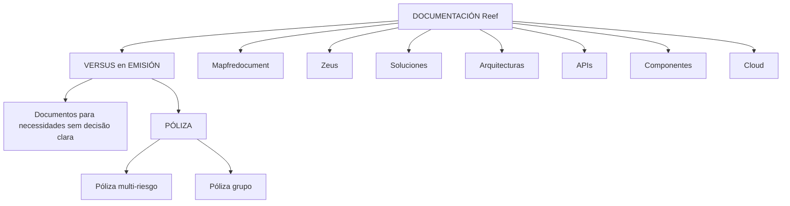

# VERSUS en EMISIÓN — Documentación Reef sobre Pólizas

## 1. Metadados do Documento
- **Arquivo de Origem:** `Não identificado no conteúdo extraído`
- **Tipo de Documento:** `Apresentação Executiva`
- **Domínio / Sistema:** `Emisión, PÓLIZA, Reef, Mapfredocument, Zeus`
- **Público-Alvo:** `Não identificado explicitamente; conteúdo direcionado a usuários de documentação e soluções`
- **Data/Versão Identificada:** `Não identificada`

---

## 2. Resumo Executivo & Contexto de Negócio

O documento apresenta o conceito de **VERSUS en EMISIÓN**, descrito como documentos voltados a enfrentar diferentes elementos quando não existe uma decisão clara para atender uma necessidade. O conteúdo associa esse conceito ao domínio de emissão de apólices.

O documento cita uma comparação entre **Póliza multi-riesgo** e **Póliza grupo**, sem apresentar critérios, regras de comparação, fluxo de decisão ou detalhamento funcional das modalidades de apólice.

A documentação está associada ao ambiente ou repositório **Reef**, com referências adicionais a **Mapfredocument** e **Zeus**. A interface textual apresentada contém opções de navegação para soluções, arquiteturas, APIs, componentes, cloud, documentação e ajuda.

O registro de documentação indica o proprietário `user:agonzalez_mapfre.com` e o ciclo de vida **Approved Source / VL**. Não há detalhes adicionais sobre o significado de `VL`, a abrangência da aprovação ou os controles de governança aplicáveis.

---

## 3. Arquitetura, Componentes & Tecnologias Envolvidas

Os elementos identificados no conteúdo são:

| Componente / Termo | Papel identificado no documento |
| :--- | :--- |
| VERSUS en EMISIÓN | Conjunto de documentos orientados a apoiar necessidades sem decisão clara. |
| PÓLIZA | Domínio relacionado a apólices. |
| Póliza multi-riesgo | Modalidade de apólice citada em comparação. |
| Póliza grupo | Modalidade de apólice citada em comparação. |
| Reef | Ambiente, sistema ou espaço de documentação citado repetidamente. |
| Mapfredocument | Referência documental citada no conteúdo. |
| Zeus | Item disponível na navegação da documentação. |
| Soluciones | Área de navegação disponível. |
| Arquitecturas | Área de navegação disponível. |
| APIs | Área de navegação disponível. |
| Componentes | Área de navegação disponível. |
| Cloud | Área de navegação disponível. |



**Nota de Análise:** o conteúdo não descreve integrações técnicas, protocolos, métodos HTTP, contratos de API, infraestrutura, ambientes de implantação ou fluxos operacionais entre Reef, Mapfredocument e Zeus.

---

## 4. Regras de Negócio, Especificações Funcionais & Processos

1. O documento define **VERSUS en EMISIÓN** como documentação orientada a enfrentar elementos distintos quando não há uma decisão clara diante de uma necessidade.
2. O domínio de apólices inclui a referência comparativa entre **Póliza multi-riesgo** e **Póliza grupo**.
3. A documentação está registrada no contexto de **DOCUMENTACIÓN Reef**.
4. O conteúdo apresenta o estado de ciclo de vida como **Approved Source / VL**.
5. O proprietário identificado para o registro documental é `user:agonzalez_mapfre.com`.
6. A navegação da documentação inclui: `Buscar`, `Inicio`, `Soluciones`, `Arquitecturas`, `APIs`, `Componentes`, `Cloud`, `Documentación`, `Zeus`, `Reef` e `Ayuda`.
7. O idioma exibido na interface é `ES`.

**Nota de Análise:** o documento não especifica regras para escolher entre Póliza multi-riesgo e Póliza grupo. Também não apresenta critérios de elegibilidade, cálculos, validações, campos obrigatórios ou etapas de emissão.

---

## 5. Tabelas de Parâmetros, Ambientes e Estruturas de Dados

| Item / Parâmetro | Descrição / Função | Tipo / Valores / Formato | Ambiente / Observações |
| :--- | :--- | :--- | :--- |
| VERSUS en EMISIÓN | Documentos para enfrentar distintos elementos diante de necessidade sem decisão clara. | Texto conceitual | Associado ao domínio de emissão. |
| PÓLIZA | Domínio de apólices mencionado no conteúdo. | Termo de domínio | Sem detalhamento adicional. |
| Póliza multi-riesgo | Tipo de apólice citado. | Modalidade de apólice | Apresentada em comparação com Póliza grupo. |
| Póliza grupo | Tipo de apólice citado. | Modalidade de apólice | Apresentada em comparação com Póliza multi-riesgo. |
| Documentation / DOCUMENTACIÓN Reef | Referência ao espaço de documentação Reef. | Nome de documentação | Citado repetidamente. |
| Mapfredocument | Referência documental. | Nome próprio | Sem função técnica detalhada. |
| Owner | Proprietário do registro documental. | `user:agonzalez_mapfre.com` | Valor literal extraído. |
| Lifecycle | Estado do ciclo de vida documental. | `Approved Source / VL` | O significado de `VL` não é detalhado. |
| Idioma | Idioma exibido na interface. | `ES` | Interface em espanhol. |
| Navegação | Opções disponíveis na página. | Buscar, Inicio, Soluciones, Arquitecturas, APIs, Componentes, Cloud, Documentación, Zeus, Reef, Ayuda | Não há URLs ou rotas fornecidas. |

---

## 6. Bateria de Perguntas & Respostas para RAG (FAQ Sintético)

### P1: O que significa “VERSUS en EMISIÓN” no documento?
**R:** “VERSUS en EMISIÓN” é descrito como documentos orientados a enfrentar distintos elementos quando não há uma decisão clara sobre como atender uma necessidade.

### P2: Qual domínio funcional é citado no conteúdo?
**R:** O conteúdo cita o domínio de **PÓLIZA**, relacionado a apólices, incluindo as referências a Póliza multi-riesgo e Póliza grupo.

### P3: Quais modalidades de apólice são mencionadas?
**R:** O documento menciona **Póliza multi-riesgo** e **Póliza grupo**. Não são fornecidos critérios funcionais, comerciais ou técnicos para diferenciar ou selecionar essas modalidades.

### P4: O documento informa quando utilizar Póliza multi-riesgo em vez de Póliza grupo?
**R:** Não. O conteúdo apenas apresenta “Póliza multi-riesgo vs Póliza grupo”, sem detalhar regras de decisão, condições de contratação, cobertura ou fluxo de emissão.

### P5: Qual é o ambiente ou repositório de documentação citado?
**R:** O conteúdo cita repetidamente **DOCUMENTACIÓN Reef** e também apresenta a referência `Documentation / DOCUMENTACIÓN Reef`.

### P6: Quem é o proprietário identificado da documentação?
**R:** O proprietário registrado no conteúdo é `user:agonzalez_mapfre.com`.

### P7: Qual é o ciclo de vida identificado para o documento?
**R:** O ciclo de vida aparece como `Approved Source / VL`. O documento não explica o significado de `VL` nem os critérios associados a esse estado.

### P8: Quais áreas estão disponíveis na navegação da documentação?
**R:** A navegação apresenta: Buscar, Inicio, Soluciones, Arquitecturas, APIs, Componentes, Cloud, Documentación, Zeus, Reef e Ayuda.

### P9: Há especificações de APIs, URLs ou contratos de integração?
**R:** Não. Embora a opção “APIs” apareça na navegação, o conteúdo extraído não apresenta endpoints, URLs, métodos HTTP, autenticação, payloads ou contratos de integração.

### P10: Qual idioma é indicado na interface apresentada?
**R:** A interface indica `ES`, correspondente à configuração em espanhol.

---

## 7. Glossário de Termos, Siglas & Conceitos-Chave

- **VERSUS en EMISIÓN:** Documentos orientados a enfrentar elementos distintos quando não há decisão clara para tratar uma necessidade.
- **EMISIÓN:** Termo presente no título do conteúdo; o documento não fornece definição adicional.
- **PÓLIZA:** Termo associado ao domínio de apólices.
- **Póliza multi-riesgo:** Modalidade de apólice mencionada sem detalhamento adicional.
- **Póliza grupo:** Modalidade de apólice mencionada sem detalhamento adicional.
- **Reef:** Nome do contexto, ambiente ou espaço de documentação citado.
- **Mapfredocument:** Referência documental presente no conteúdo.
- **Zeus:** Item disponível na navegação da documentação.
- **Owner:** Campo que identifica o proprietário do registro documental.
- **Lifecycle:** Campo que indica o ciclo de vida do documento.
- **Approved Source:** Valor de ciclo de vida exibido no conteúdo.
- **VL:** Sigla ou valor associado a `Approved Source`; não definido no texto.
- **ES:** Indicador de idioma exibido na interface.

---

## 8. Notas Críticas, Riscos & Limitações

- O conteúdo extraído é curto e predominantemente composto por título, descrição conceitual, referências de navegação e metadados documentais.
- Não há critérios de comparação entre **Póliza multi-riesgo** e **Póliza grupo**.
- Não há processos de emissão, regras de negócio detalhadas, cálculos, validações, fluxos de exceção ou definição de responsabilidades.
- Não há URLs, nomes de servidores, ambientes, credenciais, portas, logs, APIs, contratos ou tecnologias de implementação.
- O termo `VL`, associado ao ciclo de vida `Approved Source / VL`, não possui definição no conteúdo.
- **Nota de Análise:** Reef, Mapfredocument e Zeus são citados, mas o documento não descreve a função técnica, a relação operacional ou integrações entre esses elementos.

---

## 9. Conteúdo Bruto Estruturado (Referência Fiel)

```text
--- [PÁGINA 1 DE 1] ---

VERSUS en EMISIÓN
 Documentos orientados a enfrentar distintos elementos cuando no se tiene una decisión clara a la hora de afrontar
una necesidad
PÓLIZA
 Póliza multi-riesgo vs Póliza grupo
Documentation / DOCUMENTACIÓN Reef
DOCUMENTACIÓN Reef
Mapfredocument
DOCUMENTACIÓN Reef
Owner
user:agonzalez_mapfre.com
Lifecycle
Approved Source
 / 
 VL
Buscar Inicio Soluciones Arquitecturas APIs Componentes Cloud Documentación Zeus Reef Ayuda
ES
```
