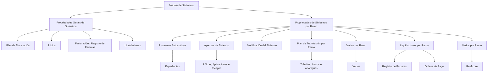

# Definição das Características do Módulo de Siniestros (Documentação Reef)

## 1. Metadados do Documento
- **Arquivo de Origem:** Não identificado no conteúdo fornecido
- **Tipo de Documento:** Especificação Técnica
- **Domínio / Sistema:** Documentação Reef — Módulo de Siniestros
- **Público-Alvo:** Desenvolvedores, Arquitetos, Operação e Negócio
- **Data/Versão Identificada:** Não identificada
- **Owner identificado:** `user:agonzalez_mapfre.com`
- **Lifecycle identificado:** `Approved Source / VL`

---

## 2. Resumo Executivo & Contexto de Negócio

O documento define o comportamento configurável do módulo de **Siniestros**, distinguindo propriedades gerais, aplicáveis a todos os ramos, de propriedades específicas por ramo. A finalidade declarada é definir como o sistema deve operar nos diferentes módulos de siniestros, incluindo abertura, modificação, plano de tramitação, juízos, liquidações e processos automáticos.

As propriedades gerais regulam controles transversais, como solicitação de causas na abertura de expedientes e na alteração de valoração, uso de datas de controle, calendários, papéis no plano de tramitação, confirmação do envio de e-mails e regras relacionadas a faturamento múltiplo e registro de faturas.

As propriedades por ramo permitem adaptar o comportamento do sistema a características específicas de cada ramo. Entre os comportamentos configuráveis estão a abertura automática de expedientes, abertura de recobros, tratamento de apólices não fixas, possibilidade de sinistrar apólices marco ou aplicações não vigentes, validações entre causa, consequência, tipo de expediente, cobertura e conceito de reserva.

O documento também especifica parâmetros para módulos operacionais complementares. O Plano de Tramitação controla anotações livres e avisos vindos de módulos externos; o módulo de Juicios controla a obrigatoriedade de tipo e código de documento para pessoas relacionadas; e o módulo de Liquidaciones regula integração com Registro de Facturas, geração de liquidações, conta corrente e apresentação formatada da conta.

O texto não descreve contratos de API, esquemas de banco de dados, métodos HTTP, tecnologias de implementação, integrações técnicas detalhadas, URLs de ambiente ou rotas de log. As regras apresentadas são predominantemente regras funcionais e parâmetros de configuração.

---

## 3. Arquitetura, Componentes & Tecnologias Envolvidas

### Componentes e módulos identificados

| Componente / Módulo | Papel descrito no documento |
| :--- | :--- |
| Módulo de Siniestros | Módulo central cujas características e comportamentos são definidos por propriedades gerais e por ramo. |
| Expediente | Entidade aberta, modificada, valorada, liquidada ou associada a processos de siniestros. |
| Ramo | Chave de segmentação para propriedades que variam conforme o ramo. |
| Plan de Tramitación | Controla trâmites, avisos, datas de controle, calendários, papéis, anotações e comunicações. |
| Registro de Facturas | Registro no qual documentos de pagamento podem ser validados e do qual dados de fatura podem ser recuperados durante liquidações. |
| Módulo de Juicios | Permite associar um ou vários siniestros a um juízo e controla dados obrigatórios de pessoas vinculadas ao juízo. |
| Módulo de Tesorería | Pode gerar avisos para o Plan de Tramitación quando ordens de pagamento são pagas, anuladas ou alteradas. |
| Liquidaciones | Trata ordens de pagamento, dados de faturas, validação de documentos oficiais, conta corrente e retenções. |
| Reef.core | Sistema citado na propriedade de compatibilidade de dados variáveis. O texto menciona convivência entre “Reef.core y Reef.core”, sem diferenciar versões ou instâncias. |
| Políticas / Pólizas | Usadas na abertura de siniestros, incluindo tratamento de pólizas marco, aplicações, riscos e vigência. |
| Control Técnico | Contexto no qual uma indenização pode permanecer retida e no qual pode ser permitida a liquidação de honorários e gastos. |



> **Nota de Análise:** O diagrama representa exclusivamente as relações funcionais explicitadas no documento. O material não informa arquitetura física, protocolos, bancos de dados, APIs, mensageria ou topologia de implantação.

---

## 4. Regras de Negócio, Especificações Funcionais & Processos

### 4.1 Propriedades gerais de Siniestros

#### Solicitação de causas

- **Pedir Causas Apertura de Expedientes:** determina se, ao abrir um expediente, serão solicitadas as causas de abertura.
  - Aplica-se a todos os expedientes, independentemente do ramo.
  - Caso a solicitação de causas esteja habilitada, as causas de abertura de expediente devem estar definidas.

- **Pedir Causas Cambio de Valoración:** determina se, quando houver alteração da valoração de um expediente, serão solicitadas as causas da mudança.
  - Aplica-se a todos os expedientes, independentemente do ramo.
  - Caso a solicitação esteja habilitada, as causas de alteração de valoração devem estar definidas.

- **Pedir Causas Cambio de Valoración en Anulación de liquidación:** determina se, quando uma alteração de valoração for provocada pela anulação de uma liquidação do expediente, serão solicitadas as causas dessa alteração.
  - Aplica-se a todos os expedientes, independentemente do ramo.
  - Caso a solicitação esteja habilitada, as causas de alteração de valoração devem estar definidas.

#### Plano de Tramitação: data de controle, calendários e papéis

- **Uso de Fecha de Control en el Plan de Tramitación:** permite ou não que o plano trabalhe com datas de controle.
  - A data de controle informa ao tramitador quando a gestão ativada deve ser finalizada.
  - Quando datas de controle são usadas, deve ser definido, para cada trâmite, o número de dias para conclusão.
  - A data é calculada desde o momento em que o tramitador ativa o trâmite.

- **Uso de Calendarios en el Plan de Tramitación:** define se o cálculo de datas considera dias festivos e férias do tramitador.
  - Quando calendários são usados, dias festivos e férias são considerados dias não úteis.
  - Quando calendários não são usados, todos os dias são considerados úteis.
  - A propriedade afeta, entre outras, as operações:
    1. Ativar trâmite com aviso definido.
    2. Ativar trâmite com data de controle definida.
    3. Incluir aviso de agenda no plano.
    4. Modificar aviso.
    5. Calcular data de controle.

- **Uso de Roles en el Plan de Tramitación:** determina se determinados trâmites podem ser realizados apenas por determinados papéis.
  - Quando papéis não são utilizados, todos os tramitadores têm acesso a todos os trâmites.
  - A configuração permite especializar tramitadores.
  - Colaboradores podem ter acesso somente a determinados trâmites.
  - Trâmites muito específicos podem ser reservados a determinados papéis.
  - Os papéis afetam:
    1. Ativação de trâmite.
    2. Execução de programas associados ao trâmite.
    3. Geração de comunicações associadas ao trâmite.
    4. Finalização de trâmite.
    5. Atraso de trâmite.
    6. Modificação de data de controle.
    7. Inclusão de trâmite no plano.
    8. Inclusão de nível no plano.

- **Plan de Tramitación Solicitud de envío de Email:** determina se o plano deve ser informado de que o envio de e-mail foi bem-sucedido ou falhou.

#### Juízos, faturamento e faturas

- **Un Juicio puede afectar a Varios Siniestros:** define se um juízo pode ser associado a um ou vários siniestros.
  - O módulo de Juicios permite associar um siniestro ou vários a um juízo, conforme o valor do atributo.

- **Facturación Múltiple permite distribución Proporcional:** determina se, para uma fatura que afeta múltiplos expedientes, o sistema pode distribuir automaticamente um importe total igual entre os expedientes.
  - A alternativa é inserir manualmente o importe de cada expediente.

- **Facturación Múltiple Genera Liquidación con Expediente Retenido:** permite liquidar conceitos de reserva dos tipos **Honorarios** e **Gastos** quando o conceito retido é do tipo **Indemnización**.
  - A finalidade descrita é permitir o pagamento do profissional interveniente no expediente mesmo que a indenização esteja retida por Control Técnico.

- **Valida Concepto de Pago en el Registro de Facturas:** define se, durante o registro de documento de pagamento de siniestros no Registro de Facturas, o conceito de cobrança e pagamento variado deve ser validado contra a atividade da fatura.
  - Alternativamente, faturas podem ser registradas com conceitos genéricos.

### 4.2 Propriedades de Siniestros por Ramo

A propriedade **Ramo** indica a chave do ramo para o qual as características do módulo de Siniestros serão definidas.

#### Processos automáticos por ramo

- **Permite Apertura Automática de Expedientes:** define se o ramo permite abertura automática de expedientes.
  - Os tipos de expediente passíveis de abertura automática são detalhados na definição de tipos de expedientes por ramo.

- **Permite Apertura Automática de Expedientes desde Apertura de Siniestros on-line:** define se, ao abrir manualmente um siniestro, o sistema pode tentar abrir automaticamente tipos de expediente identificados como automaticamente abertos e que cumpram as condições necessárias.

- **Permite Apertura Automática de Expedientes desde Modificación de Siniestro:** define se, após modificar informações de um siniestro, o sistema pode tentar abrir automaticamente expedientes definidos para abertura automática e que cumpram as condições necessárias.

- **Permite Aperturar Recobros desde la Apertura de Expedientes on-line:** aplica-se quando um expediente cujo tipo não é Recobro possui configuração para abertura automática de seus recobros.
  - Define se o sistema deve tentar abrir automaticamente os recobros associados ao expediente em abertura.

#### Abertura de siniestro por ramo

As regras desta seção são destinadas a apólices não fixas, usualmente relacionadas a transportes.

- **Permite Siniestrar Póliza Marco:** define se, durante a abertura de siniestros, uma apólice que possui póliza marco pode ser sinistrada diretamente ou se somente as aplicações podem ser sinistradas.
  - O comportamento é utilizado para produtos com comportamento de transportes, mas que não são transportes.

- **Permite Siniestrar Aplicación/Riesgo No Vigente TRANSPORTES:** determina se é permitido sinistrar aplicação não vigente nos ramos tratados como Transportes.
  - Valores permitidos:
    - `1`: Sim.
    - `2`: Não.
    - `3` e `4`: Lógica de Negócio.

- **Lógica de Negocio que determina si se permite Siniestrar Aplicación / Riesgo No Vigente Transportes:** contém a lógica de negócio usada quando o atributo anterior possuir valor `3` ou `4`.
  - A lógica é obrigatória quando a decisão não for simplesmente Sim ou Não e depender da avaliação de outros fatores.

- **Aperturar Siniestro sin Tipos de Expedientes Obligatorios:** define se um siniestro pode ser aberto mesmo quando tipos de expedientes definidos como obrigatórios para ramo, causa e consequência não foram abertos.
  - O documento indica que isso normalmente é permitido quando se pretende criar um controle técnico e manter o siniestro retido, em vez de impedir sua gravação.

- **Lógica que determina si se permite Aperturar Siniestro sin Tipos de Expedientes Obligatorios:** contém a lógica que determina a abertura do siniestro sem todos os expedientes obrigatórios.
  - Deve ser definida quando a decisão depender de outros fatores, e não apenas de Sim ou Não.

- **Lógica para obtener la persona de Contacto:** contém lógica destinada a recuperar todos os dados de contato quando estiverem registrados no sistema.
  - A recuperação ocorre porque existe, na abertura do siniestro, um atributo que solicita a relação da pessoa de contato com o segurado.

- **Valida Causa-Consecuencia-Tipo de Expediente–Cobertura-Concepto de Reserva:** define o nível de granularidade da validação de consequências incompatíveis dentro de um siniestro.
  - Quando a propriedade for **No**, não podem ser escolhidas duas consequências que afetem o mesmo Tipo de Expediente e Cobertura.
  - Quando a propriedade for **Sí**, o controle também considera o Conceito de Reserva.
  - Nesse caso, não podem ser selecionadas duas consequências que afetem o mesmo Tipo de Expediente, Cobertura e Conceito de Reserva.
  - A validação é aplicada à abertura, modificação e reabertura do siniestro.

#### Modificação de siniestro por ramo

- **Permite Modificar Hora del Siniestro:** define se a hora do siniestro pode ser modificada.
  - Quando o atributo do ramo para solicitar hora de vigência for afirmativo, o programa de modificação verifica se a apólice estava vigente na hora modificada.
  - Quando a data do siniestro for a data corrente, o programa verifica se a hora não ultrapassa a hora do dia.

#### Plano de Tramitação por ramo

- **Se Tipifican las Anotaciones Libres:** define se anotações livres devem ser tipificadas, isto é, previamente definidas.
  - Anotações livres registram no plano fatos como chamadas e outras circunstâncias que o tramitador deseja registrar.
  - A tipificação permite homogeneizar as anotações.
  - Quando não houver parametrização, o tramitador pode escrever qualquer conteúdo.

- **Aviso al Plan Tramitación Desde módulos externos:** define se o Plan de Tramitación deve receber avisos do módulo de Tesorería.
  - Quando uma ordem for paga, anulada ou sofrer alteração e o atributo for afirmativo, o sistema registra um aviso no plano.
  - O aviso notifica mudanças nas ordens de pagamento do Siniestro-Expediente.

#### Juicios por ramo

- **Tipo y Código de Documento Obligatorio en Juicios:** define se tipo e código são obrigatórios ao solicitar pessoas relacionadas a um juízo no módulo de Juicios.

#### Liquidaciones por ramo

- **Traer datos Registro Factura:** define se, para uma liquidação ou ordem de pagamento de documento que deve estar no Registro de Facturas, o sistema recupera os dados registrados ao informar fornecedor, número e tipo de documento da fatura.

- **Liquidar Documentos Oficial sin Registrar:** define se é permitido gerar liquidação de documento de pagamento que deveria estar registrado no Registro de Facturas, mas não está.
  - Alternativamente, o sistema pode impedir a geração da liquidação e emitir erro.

- **Pedir cuenta Corriente en Liquidaciones:** define se, quando não existir conta registrada para o beneficiário da liquidação, o sistema solicita a conta corrente ou gera erro.

- **Cuenta Formateada:** define se a conta corrente do beneficiário da liquidação é exibida formatada.

#### Vários por ramo

- **Datos Variables Compatibles:** determina se a solicitação de dados variáveis é compatível entre os dois sistemas mencionados como Reef.core e Reef.core.
  - A propriedade é destinada somente a instalações nas quais os dois sistemas precisam coexistir.

- **Consulta de siniestros Datos Adicionales:** o conteúdo fornecido somente apresenta o título da propriedade, sem descrição adicional.

> **Nota de Análise:** O documento menciona exemplos em diversos pontos, mas não fornece o conteúdo desses exemplos na extração disponibilizada.

---

## 5. Tabelas de Parâmetros, Ambientes e Estruturas de Dados

| Item / Parâmetro | Descrição / Função | Tipo / Valores / Formato | Ambiente / Observações |
| :--- | :--- | :--- | :--- |
| Pedir Causas Apertura de Expedientes | Solicita causas ao abrir expediente. | Habilitado ou não habilitado; causas devem estar definidas quando aplicável. | Global; todos os expedientes e ramos. |
| Pedir Causas Cambio de Valoración | Solicita causas ao alterar valoração de expediente. | Habilitado ou não habilitado; causas devem estar definidas quando aplicável. | Global; todos os expedientes e ramos. |
| Pedir Causas Cambio de Valoración en Anulación de liquidación | Solicita causas quando alteração de valoração decorre de anulação de liquidação. | Habilitado ou não habilitado; causas devem estar definidas quando aplicável. | Global; todos os expedientes e ramos. |
| Uso de Fecha de Control | Controla uso de datas de controle no plano. | Uso permitido ou não permitido; número de dias por trâmite. | A data é calculada quando o tramitador ativa o trâmite. |
| Uso de Calendarios | Inclui ou não feriados e férias no cálculo de datas. | Com calendários: dias festivos e férias são não úteis. Sem calendários: todos os dias são úteis. | Afeta avisos, datas de controle e outras operações do plano. |
| Uso de Roles | Restringe operações do plano por papel. | Uso de roles ou acesso geral a todos os tramitadores. | Afeta ativação, execução, comunicações, finalização, atraso, alteração de data e inclusões no plano. |
| Solicitud de envío de Email | Informa ao plano o resultado do envio de e-mail. | Envio exitoso ou fallido. | Plan de Tramitación. |
| Un Juicio puede afectar a Varios Siniestros | Permite associar um ou vários siniestros a um juízo. | Um siniestro ou vários siniestros. | Módulo de Juicios. |
| Facturación Múltiple permite distribución Proporcional | Permite distribuição automática de importe de fatura múltipla. | Automática ou manual por expediente. | Fatura de profissional que intervém em vários expedientes. |
| Facturación Múltiple Genera Liquidación con Expediente Retenido | Permite liquidar Honorarios e Gastos quando Indemnización está retida. | Permitido ou não permitido. | A retenção da indenização ocorre por Control Técnico. |
| Valida Concepto de Pago en el Registro de Facturas | Valida conceito de cobrança e pagamento variado pela atividade da fatura. | Validado contra atividade ou uso de conceitos genéricos. | Registro de Facturas. |
| Ramo | Chave do ramo cujas características serão definidas. | Chave de ramo. | Propriedades específicas por ramo. |
| Permite Apertura Automática de Expedientes | Permite abrir expedientes automaticamente. | Permitido ou não permitido. | Tipos elegíveis são definidos por ramo. |
| Apertura Automática desde Apertura on-line | Abre expedientes automaticamente após abertura manual de siniestro. | Permitido ou não permitido. | Depende de tipos identificados e condições cumpridas. |
| Apertura Automática desde Modificación | Abre expedientes automaticamente após modificação de siniestro. | Permitido ou não permitido. | Depende de definição e condições de abertura. |
| Aperturar Recobros desde Apertura on-line | Tenta abrir recobros associados automaticamente. | Permitido ou não permitido. | Aplicável a expediente não Recobro configurado para isso. |
| Permite Siniestrar Póliza Marco | Define se póliza marco pode ser sinistrada diretamente. | Póliza marco ou somente aplicações. | Pólizas não fixas; produtos com comportamento de transportes. |
| Permite Siniestrar Aplicación/Riesgo No Vigente TRANSPORTES | Permite sinistrar aplicação ou risco não vigente. | `1`: Sí; `2`: No; `3,4`: Lógica de Negócio. | Ramos de tratamento de Transportes. |
| Lógica de Negocio para Aplicación/Riesgo No Vigente | Determina permissão para valores `3` ou `4`. | Lógica de negócio. | Obrigatória quando a decisão depende de outros fatores. |
| Aperturar Siniestro sin Tipos de Expedientes Obligatorios | Permite abrir siniestro sem todos os expedientes obrigatórios. | Permitido, não permitido ou decisão por lógica. | Pode ser usado para criar controle técnico e reter siniestro. |
| Lógica para Aperturar Siniestro sin Tipos Obligatorios | Determina se pode abrir siniestro sem expedientes obrigatórios. | Lógica de negócio. | Usada quando não é decisão binária. |
| Lógica para obtener la persona de Contacto | Recupera dados de contato registrados no sistema. | Lógica de negócio. | Considera atributo de relação da pessoa de contato com o segurado. |
| Valida Causa-Consecuencia-Tipo-Cobertura-Concepto | Define nível de validação de consequências incompatíveis. | No: Tipo + Cobertura. Sí: Tipo + Cobertura + Conceito de Reserva. | Abertura, modificação e reabertura de siniestro. |
| Permite Modificar Hora del Siniestro | Autoriza alteração da hora do siniestro. | Permitido ou não permitido. | Pode validar vigência da apólice e limite da hora atual. |
| Se Tipifican las Anotaciones Libres | Exige ou não tipificação prévia de anotações livres. | Tipificadas ou texto livre. | Plan de Tramitación. |
| Aviso al Plan Tramitación Desde módulos externos | Registra avisos de Tesorería no plano. | Afirmativo ou não afirmativo. | Pagamento, anulação e mudanças em ordens de pagamento. |
| Tipo y Código de Documento Obligatorio en Juicios | Exige tipo e código de documento de pessoas associadas ao juízo. | Obrigatório ou não obrigatório. | Módulo de Juicios. |
| Traer datos Registro Factura | Recupera dados registrados para liquidação. | Recuperar ou não recuperar dados. | Fornecedor, número e tipo de documento. |
| Liquidar Documentos Oficial sin Registrar | Permite liquidar documento obrigatório não registrado. | Permitir liquidação ou gerar erro. | Registro de Facturas. |
| Pedir cuenta Corriente en Liquidaciones | Solicita conta quando não houver conta registrada para beneficiário. | Solicitar conta ou gerar erro. | Liquidaciones. |
| Cuenta Formateada | Exibe conta corrente formatada. | Formatar ou não formatar. | Beneficiário da liquidação. |
| Datos Variables Compatibles | Controla compatibilidade de dados variáveis entre sistemas citados. | Compatível ou não compatível. | Somente instalações com coexistência dos sistemas mencionados. |
| Consulta de siniestros Datos Adicionales | Propriedade somente nomeada. | Não informado. | Sem descrição adicional na extração. |

---

## 6. Bateria de Perguntas & Respostas para RAG (FAQ Sintético)

### P1: Quando o sistema solicita causas durante a abertura de um expediente?
**R:** O sistema solicita causas durante a abertura de expediente quando a propriedade **Pedir Causas Apertura de Expedientes** estiver habilitada. A regra aplica-se a todos os expedientes, independentemente do ramo, e exige que as causas de abertura estejam previamente definidas.

### P2: Como é calculada a data de controle de um trâmite?
**R:** Quando a propriedade **Uso de Fecha de Control en el Plan de Tramitación** estiver habilitada, deve ser definido para cada trâmite o número de dias previsto para sua conclusão. A data de controle é calculada a partir do momento em que o tramitador ativa o trâmite.

### P3: Qual é o efeito do uso de calendários no Plan de Tramitación?
**R:** Quando o uso de calendários está habilitado, dias festivos e férias do tramitador são considerados dias não úteis no cálculo de datas. Quando não está habilitado, todos os dias são considerados úteis. A regra afeta, entre outras operações, ativação de trâmite com aviso ou data de controle definida, inclusão e modificação de aviso e cálculo de data de controle.

### P4: Quais operações do Plan de Tramitación podem ser restringidas por roles?
**R:** A configuração de roles pode restringir ativação, execução de programas associados, geração de comunicações, finalização, atraso, modificação da data de controle, inclusão de trâmite e inclusão de nível no plano. Sem uso de roles, todos os tramitadores têm acesso a todos os trâmites.

### P5: Um mesmo juicio pode ser associado a mais de um siniestro?
**R:** Sim, desde que a propriedade **Un Juicio puede afectar a Varios Siniestros** esteja configurada para permitir esse comportamento. O módulo de Juicios associa um ou vários siniestros a um juízo de acordo com o valor desse atributo.

### P6: Como funciona a distribuição proporcional em faturamento múltiplo?
**R:** Quando uma fatura afeta múltiplos expedientes e possui importe igual para todos, a propriedade **Facturación Múltiple permite distribución Proporcional** determina se o sistema pode distribuir automaticamente o importe total entre os expedientes ou se o importe de cada expediente deve ser informado manualmente.

### P7: É possível pagar honorários e gastos quando a indenização está retida?
**R:** Sim, quando a propriedade **Facturación Múltiple Genera Liquidación con Expediente Retenido** permitir a liquidação dos conceitos de reserva de tipo Honorarios e Gastos mesmo que o conceito de tipo Indemnización esteja retido por Control Técnico. A regra permite pagar o profissional interveniente no expediente.

### P8: Quais valores são permitidos para sinistrar uma aplicação ou risco não vigente em Transportes?
**R:** A propriedade **Permite Siniestrar Aplicación/Riesgo No Vigente TRANSPORTES** aceita `1` para Sí, `2` para No e `3` ou `4` para Lógica de Negócio. Para os valores `3` e `4`, deve existir uma lógica de negócio que avalie os fatores necessários para decidir a permissão.

### P9: Em quais condições um siniestro pode ser aberto sem todos os tipos de expedientes obrigatórios?
**R:** A propriedade **Aperturar Siniestro sin Tipos de Expedientes Obligatorios** determina se isso é permitido. O documento informa que esse comportamento normalmente é usado para criar um controle técnico e manter o siniestro retido, em vez de impedir sua gravação. Se a decisão depender de fatores adicionais, deve ser definida a lógica correspondente.

### P10: Como a validação de causa, consequência, tipo de expediente, cobertura e conceito de reserva funciona?
**R:** Quando a propriedade **Valida Causa-Consecuencia-Tipo de Expediente–Cobertura-Concepto de Reserva** for No, não é permitido escolher duas consequências que afetem o mesmo Tipo de Expediente e Cobertura. Quando for Sí, a validação passa a considerar também o Conceito de Reserva, impedindo duas consequências para a mesma combinação de Tipo de Expediente, Cobertura e Conceito de Reserva.

### P11: O que acontece ao modificar a hora de um siniestro?
**R:** A modificação somente é possível se a propriedade **Permite Modificar Hora del Siniestro** permitir. Se o ramo exigir hora de vigência, o programa verifica se a apólice estava vigente na hora alterada. Se a data do siniestro for a data atual, também verifica se a hora não supera a hora do dia.

### P12: Como o módulo de Tesorería comunica mudanças de ordens de pagamento ao Plan de Tramitación?
**R:** Quando a propriedade **Aviso al Plan Tramitación Desde módulos externos** for afirmativa, o sistema registra no Plan de Tramitación um aviso proveniente do módulo de Tesorería quando uma ordem de pagamento é paga, anulada ou sofre outra alteração relacionada ao Siniestro-Expediente.

### P13: O que ocorre se uma liquidação exigir documento registrado no Registro de Facturas, mas o documento não estiver registrado?
**R:** A propriedade **Liquidar Documentos Oficial sin Registrar** determina o comportamento. Ela pode permitir que a liquidação seja gerada mesmo sem o registro exigido ou impedir a geração da liquidação e emitir erro.

### P14: Como o sistema trata a ausência de conta corrente do beneficiário de uma liquidação?
**R:** A propriedade **Pedir cuenta Corriente en Liquidaciones** define se o sistema solicita a conta corrente quando não houver conta registrada para o beneficiário ou se gera erro.

---

## 7. Glossário de Termos, Siglas & Conceitos-Chave

- **Siniestro:** Evento ou caso tratado pelo módulo de sinistros; o documento descreve suas regras de abertura, modificação, reabertura e liquidação.
- **Expediente:** Registro ou processo associado a um siniestro, sujeito a abertura, valoração, recobro e liquidação.
- **Ramo:** Chave que identifica o ramo para o qual propriedades específicas de Siniestros são configuradas.
- **Plan de Tramitación:** Componente que organiza trâmites, datas de controle, avisos, anotações, comunicações e restrições por roles.
- **Tramitador:** Usuário que ativa, executa, finaliza, atrasa ou modifica trâmites no Plan de Tramitación.
- **Fecha de Control:** Data que informa ao tramitador quando a gestão ativada deve ser finalizada.
- **Roles:** Papéis que podem restringir o acesso de tramitadores a operações específicas do plano.
- **Juicio:** Entidade do módulo de Juicios que pode afetar um ou vários siniestros.
- **Facturación Múltiple:** Faturamento de uma fatura que afeta múltiplos expedientes.
- **Registro de Facturas:** Registro usado para validar documentos e recuperar dados de faturas durante liquidações.
- **Liquidación:** Ordem de pagamento ou processo de liquidação associado a documento de pagamento.
- **Honorarios:** Conceito de reserva citado como passível de liquidação mesmo quando uma indenização está retida.
- **Gastos:** Conceito de reserva citado como passível de liquidação mesmo quando uma indenização está retida.
- **Indemnización:** Conceito de reserva que pode estar retido por Control Técnico.
- **Control Técnico:** Contexto de retenção de indenização mencionado no documento.
- **Recobro:** Tipo de expediente que pode ser aberto automaticamente como associado a outro expediente.
- **Póliza Marco:** Apólice marco que pode ou não ser sinistrada diretamente, conforme parametrização.
- **Aplicación / Riesgo:** Elementos relacionados a pólizas que podem ser sinistrados, inclusive em condição não vigente para Transportes, conforme regra.
- **Tesorería:** Módulo externo que pode enviar avisos ao Plan de Tramitación sobre ordens de pagamento.
- **Reef.core:** Sistema citado na regra de compatibilidade de dados variáveis.

---

## 8. Notas Críticas, Riscos & Limitações

- O documento não identifica nome de arquivo, data, versão, autor formal, tecnologia de implementação, arquitetura física, APIs, endpoints, esquemas de dados, URLs, servidores ou ambientes.
- Diversos atributos são descritos como propriedades, mas o texto não informa seus tipos técnicos, valores padrão, tela de configuração, persistência ou mecanismo de parametrização.
- Há referências a exemplos sem que os exemplos estejam presentes na extração fornecida.
- A propriedade **Consulta de siniestros Datos Adicionales** é apresentada sem descrição funcional.
- O texto menciona compatibilidade entre “Reef.core y Reef.core”, mas não identifica se são versões, instâncias ou sistemas distintos.
- A utilização de valores `3` e `4` para aplicação ou risco não vigente em Transportes exige lógica de negócio, porém a lógica concreta não é fornecida.
- A decisão para abrir siniestro sem tipos obrigatórios também pode exigir lógica de negócio não detalhada.
- A configuração inadequada de roles pode restringir ou ampliar o acesso a operações críticas do Plan de Tramitación.
- A desativação de calendários faz com que todos os dias sejam úteis no cálculo de datas, o que pode afetar prazos operacionais.
- A possibilidade de liquidar documentos oficiais não registrados depende de parâmetro e pode afetar o controle operacional associado ao Registro de Facturas.

---

## 9. Conteúdo Bruto Estruturado (Referência Fiel)

```text
--- [PÁGINA 1 DE 5] ---

DEFINICIÓN Características del Módulo de Siniestros
Objetivo
La finalidad es definir el comportamiento del sistema en los diferentes módulos de siniestros.
Se van a definir características comunes a todos los Ramos y Características específicas para cada Ramo.
Propiedades Generales
Propiedades Ramo Procesos Automáticos
Propiedades Ramo Apertura de Siniestros
Propiedades Ramo Modificación de Siniestros
Propiedades Ramo Plan Tramitación
Propiedades Ramo Juicios
Propiedades Ramo Liquidaciones
Propiedades Generales de Siniestros
Pedir Causas Apertura de Expedientes
Esta propiedad indicará si cuando se Apertura un expediente, se van a pedir las causas de por qué se abre el expediente. Este valor aplicará a
todos los expedientes independientemente del Ramo. Si se van a pedir causas de Apertura de Expedientes estas causas deberán estar
definidas.
Pedir Causas Cambio de Valoración
Esta propiedad indicará si cuando se haga un cambio de valoración de un expediente, se van a pedir las causas de por qué se cambia la
valoración. Este valor aplicará a todos los expedientes independientemente del Ramo. Si se van a pedir causas del Cambio de Valoración de
Expedientes estas deberán estar definidas.
Pedir Causas Cambio de Valoración en Anulación de liquidación
Esta propiedad indicará si cuando se haga un cambio de valoración de un expediente, provocado por la anulación de una liquidación de ese
expediente, se van a las causas de por qué se cambia la valoración. Este valor aplicará a todos los expedientes independientemente del
Ramo. Si se van a pedir causas del Cambio de Valoración de Expedientes estas deberán estar definidas.
Uso de Fecha de Control en el Plan de Tramitación
Esta propiedad permitirá o no que el Plan de tramitación trabaje con Fechas de control. Esta fecha indicará al tramitador cuando debe
finalizar la gestión que ha activado. Si se trabaja con Fechas de Control, se tendrá que definir para cada trámite el número de días en los que
se debería completar. La fecha se calculará desde el momento en el que el tramitador activa el trámite
Documentation / DOCUMENTACIÓN Reef
DOCUMENTACIÓN Reef
Mapfredocument
DOCUMENTACIÓN Reef
Owner
user:agonzalez_mapfre.com
Lifecycle
Approved Source
 / 
 VL
Buscar Inicio Soluciones Arquitecturas APIs Componentes Cloud Documentación Zeus Reef Ayuda
ES

--- [PÁGINA 2 DE 5] ---

Uso de Calendarios en el Plan de Tramitación
Esta propiedad indica si en el Plan de Tramitación, al calcular fechas se va a tener en cuenta los días festivos y vacaciones del tramitador o
no. Si se usa los calendarios, cuando se calculen las fechas, tendrá en cuenta los días festivos y las vacaciones, como días No hábiles. Si no
se usa, todos los días serán hábiles.
Esto afectará a las siguientes operaciones:
Activar tramite con Aviso Definido
Activar trámite con Fecha de control Definida
Incluir aviso agenda en el Plan
Modificar aviso
Cálculo de fecha de control
Etc.
Uso de Roles en el Plan de Tramitación
Esta propiedad indicará si se va a trabajar con Roles, es decir, que ciertos trámites, sólo los puedan realizar determinados roles. En caso de
que no se desee trabajar con roles, todos los tramitadores tendrán acceso a todo.
La configuración de roles permite especializar más a los tramitadores y permitir que haya colaboradores que sólo tengan acceso a
determinados trámites y trámites muy específicos que sólo los pueda ejecutar ciertos roles
Estos roles afectan a estar operaciones del plan de tramitación:
Activar Trámite
Ejecutar programas asociados al trámite
Generar comunicaciones asociadas al trámite
Finalizar Trámite
Retrasar Trámite
Modificar Fecha control
Incluir Trámite en el Plan
Incluir Nivel en el Plan
Plan de Tramitación Solicitud de envío de Email
Esta propiedad indicará, si cuando se envíe un email desde el Plan de Tramitación, se va a Informar al Plan, si el envío del correo ha sido
exitoso o fallido.
Un Juicio puede afectar a Varios Siniestros
Esta propiedad indica si un juicio puede afectar a varios siniestros o no. El módulo de juicios permitirá asociar un siniestro o varios a un juicio,
dependiendo del valor de este atributo.
Facturación Múltiple permite distribución Proporcional
Esta propiedad indica si cuando se está distribuyendo el importe total de una Factura que afecta a múltiples expedientes (Factura de un
profesional que interviene en varios expedientes) y el importe es igual para todos los expedientes si se va a permitir que eso lo haga
automáticamente el sistema o si, por el contrario, se va tener que introducir manualmente este importe, para cada expediente.
Facturación Múltiple Genera Liquidación con Expediente Retenido
Ejemplo:
Ejemplo:
Ejemplo:

--- [PÁGINA 3 DE 5] ---

Esta propiedad indica si se va a permitir liquidar los conceptos de reserva del tipo Honorarios y Gastos, cuando el concepto que esté retenido
es de tipo Indemnización. Es decir, permitir que se pague al profesional que ha intervenido en el Expediente, aunque la Indemnización esté
retenida por Control Técnico.
Valida Concepto de Pago en el Registro de Facturas
Esta propiedad indica si cuando se está registrando un documento de pago de siniestros, en el Registro de Facturas, se valide que el
concepto de cobro y pago vario que se introduce, esté definido para la actividad de la factura, o por el contrario, se va a registrar las facturas
con conceptos genéricos.
Propiedades de Siniestros por Ramo
Como se ha indicado anteriormente hay propiedades que afectan a todos los ramos y propiedades que pueden variar su comportamiento por
ramo. En este apartado se detallará todos las propiedades necesarias para el funcionamiento de Siniestros para cada Ramo.
Ramo
Esta propiedad indica la clave del Ramo para el que se va a definir las características del módulo de Siniestros.
Propiedades Ramo Procesos Automáticos
Estas propiedades se definen por Ramo y son utilizadas en los procesos automáticos
Permite Apertura Automática de Expedientes
Esta propiedad indica si el Ramo va a permitir que se abran expedientes automáticamente.
Los Tipos de Expedientes que se pueden aperturar automáticamente en el Ramo que se está definiendo, están detallados en la definición de
tipos de Expedientes por Ramo.
Permite Apertura Automática de Expedientes desde Apertura de Siniestros on-line
Esta propiedad indica si el Ramo va a permitir que se abran expedientes automáticamente cuando estamos abriendo un Siniestro
manualmente. Es decir cuando terminamos de introducir toda la información del siniestro, si se permite que el sistema intente abrir
automáticamente todos los Tipos de Expedientes que se estén identificados como que se puedan abrir automáticamente y cumplan las
condiciones para ser abiertos.
Permite Apertura Automática de Expedientes desde Modificación de Siniestro
Esta propiedad indica si el Ramo va a permitir que se abran expedientes automáticamente cuando estamos modificando un siniestro. Es
decir cuando terminamos de modificar la información del siniestro, si se permite que el sistema intente abrir automáticamente todos los
Expedientes que se así estén definidos y que cumplan con las condiciones para que se puedan abrir.
Permite Aperturar Recobros desde la Apertura de Expedientes on-line
Esta propiedad indica que, si estamos abriendo un Expediente cuyo Tipo de Expediente no es un Recobro y este, tiene definido que sus
recobros se puedan abrir automáticamente si se quiere que el sistema intente abrir automáticamente los Recobros asociado al Expediente
que estamos abriendo.
Propiedades Ramo Apertura Siniestro
Sólo para póliza que no son Fijas (#transportes)
Las pólizas que no son fijas suelen ser de transportes. Aquí se definen comportamientos para este tipo de pólizas en las operaciones de
siniestros.
Permite Siniestrar Póliza Marco
Ejemplo:
Info

--- [PÁGINA 4 DE 5] ---

Esta propiedad indica si en la apertura de siniestros, cuando una póliza tiene póliza Marco, si se permite que siniestrar dicha póliza Marco o
sólo se pueden siniestrar las aplicaciones. Esto se utiliza para aquellos productos que tienen el comportamiento de transportes, pero no son
transportes.
Permite Siniestrar Aplicación/Riesgo No Vigente TRANSPORTES
Esta propiedad le indica a la apertura de siniestros si se permite siniestrar una aplicación que no está vigente, en los Ramos de tratamiento
de Transportes.
Los valores permitidos serán:
1: Si
2: No
3,4: Lógica de Negocio
Lógica de Negocio que determina si se permite Siniestrar Aplicación / Riesgo No Vigente Transportes
Esta propiedad contendrá una lógica de negocio, si el anterior atributo tiene un 3 ó 4. Se tendrá que definir una lógica de Negocio, si no
siempre es Si o No, sino que dependa de la evaluación de otros factores.
Aperturar Siniestro sin Tipos de Expedientes Obligatorios
Esta propiedad le indica a la apertura de siniestros, si se permite abrir un siniestro, si los tipos de expedientes que se han definido como
obligatorios (para el Ramo, causa, consecuencia), no están abiertos.
Normalmente esto se permite, cuando se quiere crear un control técnico y dejar retenido el siniestro, en vez de no dejar grabarlo.
Lógica que determina si se permite Aperturar Siniestro sin Tipos de Expedientes Obligatorios
Esta propiedad contendrá una lógica que determinará si se permite abrir el siniestro, si no se han abierto todos los Expedientes de los tipos
que se han definido como obligatorios.
Esta lógica se tendrá que definir, cuando no sea si o no, si que dependa de otros factores.
Lógica para obtener la persona de Contacto
Esta propiedad contiene una lógica que trata de traer todos los datos del contacto si estos están registrados en el Sistema.
Esto se puede hacer ya que hay un atributo en la apertura del siniestro que te pide relación de la persona de Contacto con el Asegurado.
Valida Causa-Consecuencia-Tipo de Expediente–Cobertura-Concepto de Reserva
Esta propiedad indica a la apertura de siniestros, a la modificación y a la reapertura, si para la validación de consecuencias incompatibles
dentro de un siniestro, se toma en cuenta Causa-Consecuencia- Tipo de Expediente y Cobertura o se baja esta validación a Causa-
Consecuencia-Tipo de Expediente-Cobertura y Concepto de Reserva.
Es decir, si esta propiedad es No, significa que no se podrá elegir dos consecuencias que afecten al mismo Tipo de Expediente, Cobertura. Si
esta propiedad es SI, significa que el control bajará a concepto de Reserva, es decir no podrá seleccionarse dos consecuencias que afecten
al mismo Tipo de Expediente, Cobertura, Concepto de Reserva.
Propiedades Ramo Modificación del Siniestro
Permite Modificar Hora del Siniestro
Esta propiedad indica si se permite modificar la hora del siniestro.
Si en el ramo, el atributo de si se pide hora de vigencia es afirmativo, el programa de Modificación del siniestro, una vez modificada la hora,
verificará que la póliza esté vigente a esa hora.
Si la fecha del siniestro es la del día, verificará que no supere la hora del día.
Ejemplo:
Ejemplo:
Ejemplo:

--- [PÁGINA 5 DE 5] ---

Propiedades Ramo Plan de Tramitación
Se Tipifican las Anotaciones Libres
Las Anotaciones Libres, son Anotaciones que puede realizar el tramitador para dejar en el plan constancia de haber realizado una llamada, de
cualquier circunstancia que quiera que quede reflejado en el Plan de Tramitación.
Esta propiedad indicará al Plan de tramitación si las Anotaciones Libres se van a Tipificar, es decir que se van a definir previamente. Esto
permite homogeneizar las anotaciones Libres. Si no se parametrizan el Tramitador podrá escribir lo que desee.
Aviso al Plan Tramitación Desde módulos externos
Esta propiedad indica si se quier recibir desde el módulo de tesorería, avisos en el plan de tramitación. Es decir cuando se pague una orden,
se anule, etc, si este atributo es afirmativo,el sistema registrará un aviso en el Plan de tramitación, notificando de cualquier cambio en las
órdenes de Pago del Siniestro- Expediente.
Propiedades Ramo Juicios
Tipo y Código de Documento Obligatorio en Juicios
Esta propiedad indica si en el módulo de Juicios, cuando se piden las personas relacionadas con el Juicio, el tipo y el código van a ser
obligatorios.
Propiedades Ramo Liquidaciones
Traer datos Registro Factura
Esta propiedad indica que si la liquidación (orden de pago) es de un documento que tiene que estar registrado en el Registro de Facturas, si al
introducir los datos de la factura (proveedor, número y tipo de documento), se quiere que se traigan todos los datos registrados, a la
liquidación.
Liquidar Documentos Oficial sin Registrar
Este parámetro indica, si se deja generar la liquidación de un documento de pago tiene que estar en el registro de facturas y no está, o por el
contrario, que no se deje generar la liquidación y de error.
Pedir cuenta Corriente en Liquidaciones
Esta propiedad indica al sistema, si en el caso de no existir una cuenta registrada para el beneficiario de la liquidación, si se va a pedir la
cuenta corriente o se da un error.
Cuenta Formateada
Esta propiedad, indica si se muestra la cuenta corriente del beneficiario de la liquidación, formateada.
Propiedades Ramo Varios
Datos Variables Compatibles
Esta propiedad es para indica al sistema si la petición de datos variables, va a ser compatibles entre los dos sistemas Reef.core y Reef.core.
Esto es sólo para instalaciones que tengan que convivir con los dos sistemas.
Consulta de siniestros Datos Adicionales
```
