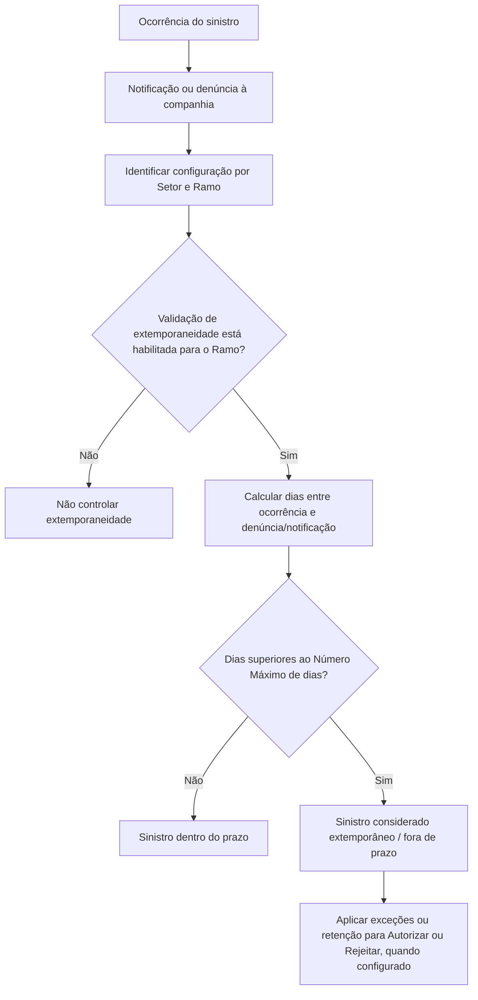

# Definição de Extemporaneidade de Sinistros por Ramo e Setor

## 1. Metadados do Documento
- **Arquivo de Origem:** Não identificado no conteúdo fornecido
- **Tipo de Documento:** Especificação Técnica / Documentação Funcional
- **Domínio / Sistema:** Reef / Mapfre — gestão de sinistros
- **Público-Alvo:** Negócio, analistas funcionais, operação e equipes responsáveis por configuração de ramos
- **Data/Versão Identificada:** Não identificada
- **Owner identificado:** `user:agonzalez_mapfre.com`
- **Lifecycle identificado:** Approved Source / VL

---

## 2. Resumo Executivo & Contexto de Negócio

O documento define a regra de **extemporaneidade** para sinistros. A finalidade é estabelecer, para todos os ramos, o prazo máximo entre a data de ocorrência do sinistro e a data de notificação ou denúncia à companhia.

O controle não é obrigatório de forma universal. Existe uma lógica configurável no nível de **Ramo** que determina se a validação de extemporaneidade deve ser aplicada durante a abertura e a modificação de sinistros. Portanto, a companhia pode controlar ou não a extemporaneidade conforme a configuração definida.

A manutenção da definição utiliza propriedades por ramo, incluindo **Setor**, **Ramo** e **Número Máximo de dias**. As propriedades admitem chaves genéricas, permitindo aplicar uma regra a todos os setores ou a todos os ramos de um setor.

Quando a diferença entre a data de ocorrência e a data de denúncia ou notificação superar o número máximo de dias configurado, o sinistro é considerado extemporâneo, isto é, fora do prazo. O documento também estabelece que podem existir exceções, como clientes VIP ou ramos cujo sinistro não considera extemporaneidade, mas permanece retido para autorização ou rejeição.

---

## 3. Arquitetura, Componentes & Tecnologias Envolvidas

O conteúdo não descreve uma arquitetura de software, APIs, microsserviços, tecnologias, URLs de ambiente, contratos HTTP ou estruturas de integração. A documentação apresenta uma configuração funcional de extemporaneidade no contexto de sinistros, organizada por setor e ramo.

Componentes e elementos identificados:

| Componente / Elemento | Papel identificado no documento |
| :--- | :--- |
| Reef | Contexto de documentação identificado como “DOCUMENTACIÓN Reef”. |
| Mapfre | Contexto corporativo identificado por “Mapfredocument” e pelo usuário proprietário. |
| Manutenção “Definição de Extemporaneidade” | Área funcional na qual são configuradas as propriedades por ramo. |
| Setor | Critério de configuração que identifica o setor ao qual o prazo máximo será aplicado. |
| Ramo | Critério de configuração que identifica o ramo ao qual o prazo máximo será aplicado. |
| Número Máximo de dias | Limite de dias entre ocorrência e denúncia/notificação do sinistro. |
| Parâmetro de sinistros por ramo | Indica se a extemporaneidade é validada na abertura e modificação de sinistros. |



> **Nota de Análise:** O documento não detalha o algoritmo de cálculo de dias, prioridades entre configurações genéricas e específicas, interfaces de manutenção, métodos HTTP, contratos JSON ou mecanismos técnicos de retenção.

---

## 4. Regras de Negócio, Especificações Funcionais & Processos

1. A extemporaneidade corresponde ao controle do tempo transcorrido entre:
   - a **data de ocorrência do sinistro**; e
   - a **data de notificação ou denúncia** à companhia.

2. A regra tem como objetivo definir o tempo máximo permitido para todos os ramos.

3. Existe um parâmetro de sinistros no nível de ramo que informa se a extemporaneidade deve ser validada:
   - na abertura de sinistros; e
   - na modificação de sinistros.

4. O controle de extemporaneidade não é obrigatório. A lógica no nível de ramo permite determinar se o controle será realizado.

5. A configuração utiliza propriedades específicas por ramo:
   - **Setor**;
   - **Ramo**;
   - **Número Máximo de dias**.

6. A propriedade **Setor** recebe a chave do setor para o qual será definido o número máximo de dias entre ocorrência e denúncia do sinistro.
   - Pode ser usada uma chave genérica para indicar aplicação a todos os setores.

7. A propriedade **Ramo** recebe a chave do ramo para o qual será definido o número máximo de dias entre ocorrência e denúncia do sinistro.
   - Pode ser usada uma chave genérica para indicar aplicação a todos os ramos do setor.

8. A propriedade **Número Máximo de dias** define o limite máximo de dias entre:
   - a data de ocorrência; e
   - a data de denúncia ou notificação à companhia.

9. Se o número de dias entre as duas datas for superior ao valor configurado em **Número Máximo de dias**, o sinistro será considerado:
   - extemporâneo;
   - fora de prazo.

10. A aplicação da extemporaneidade pode prever exceções, inclusive:
    - não considerar extemporaneidade para um cliente VIP;
    - não considerar extemporaneidade para determinado ramo, mantendo o sinistro retido para ser autorizado ou rejeitado.

> **Nota de Análise:** O documento afirma que há um parâmetro no nível de companhia e que, mesmo quando sua aplicação é prevista, podem ser realizadas exceções. Não são detalhados o nome do parâmetro, seus valores possíveis, sua precedência em relação ao parâmetro de ramo ou o procedimento de configuração das exceções.

---

## 5. Tabelas de Parâmetros, Ambientes e Estruturas de Dados

| Item / Parâmetro | Descrição / Função | Tipo / Valores / Formato | Ambiente / Observações |
| :--- | :--- | :--- | :--- |
| Setor | Indica a chave do setor para o qual será definido o número máximo de dias entre a ocorrência e a denúncia do sinistro. | Chave de setor; admite valor genérico. | O genérico indica aplicação para todos os setores. |
| Ramo | Indica a chave do ramo para o qual será definido o número máximo de dias entre a ocorrência e a denúncia do sinistro. | Chave de ramo; admite valor genérico. | O genérico indica aplicação para todos os ramos do setor. |
| Número Máximo de dias | Define o limite de dias entre a ocorrência e a denúncia ou notificação à companhia. | Número de dias. | Se a diferença for superior ao valor, o sinistro é extemporâneo. |
| Parâmetro de sinistros por ramo | Indica se a extemporaneidade deve ser validada. | Controle habilitado ou não habilitado; valores literais não detalhados. | Aplicável na abertura e modificação de sinistros. |
| Parâmetro no nível de companhia | Referenciado como elemento que permite controlar ou não a extemporaneidade. | Não detalhado. | Pode admitir exceções mesmo quando a aplicação está prevista. |
| Exceção para cliente VIP | Possibilita não considerar a extemporaneidade para um cliente VIP. | Regra de exceção; mecanismo não detalhado. | Exemplo fornecido pelo documento. |
| Exceção por ramo com retenção | Não considera extemporaneidade para determinado ramo, mas retém o sinistro para decisão. | Regra de exceção; mecanismo não detalhado. | Sinistro fica retido para Autorizar ou Rejeitar. |

---

## 6. Bateria de Perguntas & Respostas para RAG (FAQ Sintético)

### P1: O que é extemporaneidade no contexto de sinistros?
**R:** Extemporaneidade é a condição verificada a partir do tempo transcorrido entre a data de ocorrência do sinistro e a data de notificação ou denúncia à companhia. Se esse período superar o número máximo de dias configurado, o sinistro é considerado extemporâneo, ou seja, fora de prazo.

### P2: Em quais momentos a validação de extemporaneidade pode ocorrer?
**R:** O documento informa que existe um parâmetro de sinistros no nível de ramo que determina se a extemporaneidade será validada na abertura e na modificação de sinistros.

### P3: O controle de extemporaneidade é obrigatório para todos os sinistros?
**R:** Não. O controle não é obrigatório. Há uma lógica no nível de ramo que permite determinar se a extemporaneidade será controlada ou não.

### P4: Quais propriedades são usadas para manter a definição de extemporaneidade?
**R:** A manutenção de definição de extemporaneidade utiliza as propriedades Setor, Ramo e Número Máximo de dias.

### P5: Como funciona a chave genérica na propriedade Setor?
**R:** A propriedade Setor identifica o setor ao qual o prazo máximo será aplicado. Quando utilizada uma chave genérica, a definição passa a indicar aplicação para todos os setores.

### P6: Como funciona a chave genérica na propriedade Ramo?
**R:** A propriedade Ramo identifica o ramo ao qual o prazo máximo será aplicado. Quando utilizada uma chave genérica, a definição passa a indicar aplicação para todos os ramos pertencentes ao setor.

### P7: Qual é a regra para que um sinistro seja considerado fora de prazo?
**R:** Um sinistro é considerado extemporâneo ou fora de prazo quando o número de dias entre a data de ocorrência e a data de denúncia ou notificação à companhia é superior ao valor configurado na propriedade Número Máximo de dias.

### P8: É possível criar exceção de extemporaneidade para clientes VIP?
**R:** Sim. O documento apresenta como exemplo a possibilidade de não considerar a extemporaneidade para um cliente VIP.

### P9: Um ramo pode não aplicar extemporaneidade e ainda exigir decisão operacional?
**R:** Sim. O documento informa que pode ser definido que determinado ramo não considera a extemporaneidade, mas que o sinistro permaneça retido para ser autorizado ou rejeitado.

### P10: O documento especifica o algoritmo usado para calcular os dias entre ocorrência e denúncia?
**R:** Não. O documento informa apenas que deve ser comparado o número de dias entre a data de ocorrência e a data de denúncia ou notificação com o Número Máximo de dias configurado. Não há detalhamento sobre calendário, dias úteis, arredondamento ou regras de inclusão das datas inicial e final.

---

## 7. Glossário de Termos, Siglas & Conceitos-Chave

- **Extemporaneidade:** Condição de um sinistro cuja denúncia ou notificação ocorre após o prazo máximo configurado em relação à data de ocorrência.
- **Sinistro:** Evento cuja ocorrência, denúncia ou notificação é tratada pela companhia no processo descrito.
- **Setor:** Chave usada para definir o escopo setorial da configuração de prazo máximo.
- **Ramo:** Chave usada para definir o escopo da configuração de prazo máximo dentro de um setor.
- **Número Máximo de dias:** Limite entre a ocorrência e a denúncia ou notificação do sinistro à companhia.
- **Chave genérica:** Valor que permite aplicar a configuração a todos os setores ou a todos os ramos de um setor, conforme a propriedade utilizada.
- **Retido:** Estado mencionado para o sinistro que deve permanecer aguardando autorização ou rejeição.
- **Reef:** Nome identificado no contexto de documentação corporativa.
- **VL:** Identificador apresentado no campo de lifecycle como “Approved Source / VL”; o documento não define seu significado.

---

## 8. Notas Críticas, Riscos & Limitações

- O documento não identifica o arquivo de origem, data, versão ou responsável funcional pela regra além do owner técnico exibido.
- Não há detalhamento sobre a precedência entre configurações específicas e configurações genéricas de setor e ramo.
- Não são descritos os valores concretos, nome técnico ou comportamento operacional do parâmetro de companhia mencionado.
- O mecanismo para registrar e aplicar exceções para clientes VIP ou ramos não é especificado.
- Não há definição de como calcular a diferença de dias, incluindo tratamento de dias úteis, feriados, fuso horário ou inclusão das datas.
- Não são descritos os critérios, responsáveis, estados intermediários ou fluxos de decisão para “Autorizar” ou “Rejeitar” um sinistro retido.
- Não há informações sobre APIs, integrações, persistência, logs, segurança, ambientes, URLs, tecnologias ou contratos técnicos.

---

## 9. Conteúdo Bruto Estruturado (Referência Fiel)

```text
--- [PÁGINA 1 DE 2] ---

DEFINICIÓN de Extemporaneidad
Objetivo
La nalidad es denir para todos los ramos, el tiempo máximo que puede transcurrir entre la fecha de ocurrencia del siniestro y la fecha de
noticación o denuncia de este, a la compañía.
Hay un parámetro de siniestros a nivel de ramo, que indica si se valida la extemporaneidad o no en la apertura y modicación de siniestros.
Imagen del Mantenimiento Denición de Extemporaneidad:
Propiedades por Ramo
En este apartado se detallarán todas las propiedades especícas del ramo.
Sector
Documentation / DOCUMENTACIÓN Reef
DOCUMENTACIÓN Reef
Mapfredocument
DOCUMENTACIÓN Reef
Owner
user:agonzalez_mapfre.com
Lifecycle
Approved Source
 /
 VL
Buscar Inicio Soluciones Arquitecturas APIs Componentes Cloud Documentación Zeus Reef Ayuda
ES


--- [PÁGINA 2 DE 2] ---

Esta propiedad indica la clave del Sector para el que se va a denir el número máximo de días que puede transcurrir entre la fecha de
ocurrencia y la fecha de denuncia del siniestro. Puede utilizarse el genérico, que indica para todos los sectores.
Ramo
Esta propiedad indica la clave del Ramo para el que se va a denir el número máximo de días que puede transcurrir entre la fecha de
ocurrencia y la fecha de denuncia del siniestro.
Esta propiedad permite introducir la clave genérica, que en este caso signicaría para todos los ramos del sector.
Número Máximo de días
Esta propiedad indica el número máximo de días que puede transcurrir entre la fecha de ocurrencia y la fecha de denuncia o noticación a la
compañía. Si el número de días entre ambas fechas es superior al indicado en este atributo, el siniestro se considerará extemporáneo, es
decir fuera de plazo.
Preguntas frecuentes
¿Es obligatorio controlar la extemporaneidad?
No es obligatorio.Hay una lógica a nivel de Ramo dónde se puede determinar si se controla o no. Es decir se puede o no controlar la
extemporaneidad, con el parámetro a nivel de compañía y aunque se contemple que sí se aplique, se pueden realizar excepciones.
Ejemplos:
- Se puede evaluar que para un cliente VIP, no se tenga en cuenta la extemporaneidad.
- Se puede indicar que para determinado Ramo no se tenga en cuenta la extemporaneidad, pero se quede retenido el siniestro para ser
Autorizado o Rechazado.
```
